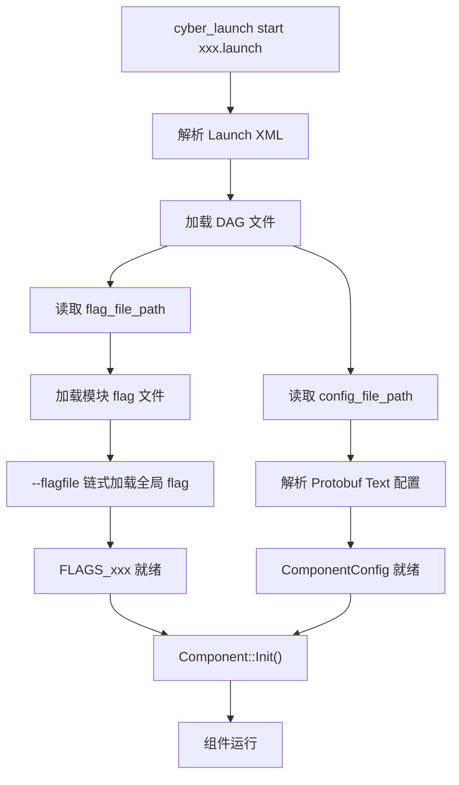
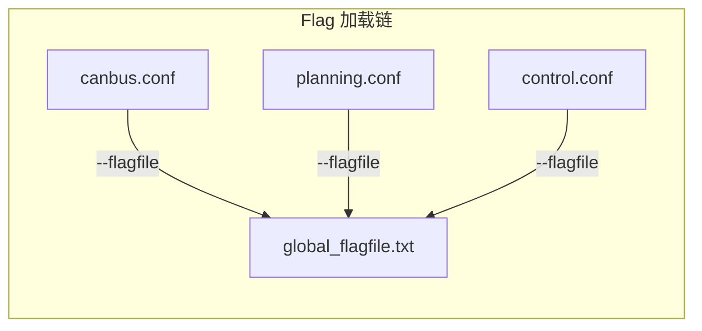

# 配置系统

## 概述

Apollo 采用多层次的配置体系，将系统配置按职责分离到不同格式的文件中。这套体系的核心思路是：**启动拓扑与运行参数解耦，全局配置与模块配置分层**。

整体来看，Apollo 的配置分为以下几个层次：

- **Launch 层**：XML 格式，定义要启动哪些模块
- **DAG 层**：Protobuf Text 格式，定义组件拓扑、通道连接关系
- **Config 层**：Protobuf Text 格式（`.pb.txt`），定义算法参数、功能配置
- **Flag 层**：gflags 配置文件（`.conf` / `.flag`），定义运行时开关、路径、阈值等
- **Calibration 层**：YAML 格式，定义传感器标定外参等

每个模块通常在 `conf/` 目录下同时拥有 `.pb.txt` 和 `.conf` 两类配置文件，分别承担结构化参数和运行时标志的职责。

## 配置文件格式

### Protobuf Text Format（`.pb.txt`）

这是 Apollo 中最常见的配置格式，用于组件配置和算法参数。每个 `.pb.txt` 文件都有对应的 `.proto` 定义，提供了强类型校验。

典型路径：

```
/apollo/modules/perception/lidar_tracking/conf/lidar_tracking_config.pb.txt
/apollo/modules/localization/conf/rtk_localization.pb.txt
/apollo/modules/canbus/conf/canbus_conf.pb.txt
/apollo/modules/planning/planning_component/conf/planning_config.pb.txt
/apollo/modules/control/control_component/conf/pipeline.pb.txt
/apollo/modules/prediction/conf/prediction_conf.pb.txt
```

示例内容（Canbus 配置）：

```protobuf
vehicle_parameter {
  max_enable_fail_attempt: 5
  driving_mode: COMPLETE_AUTO_DRIVE
}

can_card_parameter {
  brand: HERMES_CAN
  type: PCI_CARD
  channel_id: CHANNEL_ID_ZERO
  num_ports: 8
  interface: NATIVE
}

enable_debug_mode: false
enable_receiver_log: false
enable_sender_log: false
```

### Flag 文件（`.conf` / `.flag`）

基于 Google gflags 的配置文件，每行一个 flag，以 `--` 开头。模块级 flag 文件通常会通过 `--flagfile` 引用全局 flag 文件，形成链式加载。

典型路径：

```
/apollo/modules/canbus/conf/canbus.conf
/apollo/modules/perception/data/flag/perception_common.flag
/apollo/modules/common/data/global_flagfile.txt    # 全局 flags
```

示例内容：

```bash
--flagfile=/apollo/modules/common/data/global_flagfile.txt
--enable_chassis_detail_pub=true
```

::: tip 链式加载
模块 flag 文件中的 `--flagfile=` 指令会递归加载目标文件中的所有 flag。全局 flag 文件 `global_flagfile.txt` 通常定义地图路径、车辆型号等跨模块共享参数。
:::

### YAML 文件（`.yaml`）

主要用于传感器标定外参和部分专用配置。

典型路径：

```
/apollo/modules/audio/conf/respeaker_extrinsics.yaml
```

示例内容：

```yaml
header:
  stamp:
    secs: 0
    nsecs: 0
  seq: 0
  frame_id: novatel
child_frame_id: microphone
transform:
  rotation:
    x: 0.0
    y: 0.0
    z: 0.0
    w: 1.0
  translation:
    x: 0.0
    y: 0.68
    z: 0.72
```

### DAG 文件（`.dag`）

Protobuf Text 格式，定义 Cyber RT 组件的运行拓扑，包括动态库路径、组件类名、配置文件路径和通道订阅关系。

```protobuf
module_config {
    module_library : "modules/audio/libaudio_component.so"
    components {
        class_name : "AudioComponent"
        config {
            name: "audio"
            config_file_path: "/apollo/modules/audio/conf/audio_conf.pb.txt"
            flag_file_path: "/apollo/modules/audio/conf/audio.conf"
            readers: [
                {
                    channel: "/apollo/sensor/microphone"
                    qos_profile: {
                        depth : 1
                    }
                }
            ]
        }
    }
}
```

关键字段说明：

| 字段 | 说明 |
|------|------|
| `module_library` | 组件动态库路径 |
| `class_name` | 组件类名，需与代码中注册的名称一致 |
| `config_file_path` | Protobuf Text 配置文件路径 |
| `flag_file_path` | gflags 配置文件路径 |
| `readers` | 订阅的通道列表及 QoS 参数 |

### Launch 文件（`.launch`）

XML 格式，是模块启动的入口。定义要加载的 DAG 文件和进程分配。

```xml
<cyber>
    <module>
        <name>canbus</name>
        <dag_conf>/apollo/modules/canbus/dag/canbus.dag</dag_conf>
        <process_name>canbus</process_name>
    </module>
</cyber>
```

一个 launch 文件可以包含多个 `<module>` 节点。相同 `<process_name>` 的组件会被调度到同一进程中运行，便于减少进程间通信开销。

## gflags 体系

Apollo 大量使用 Google gflags 来管理运行时参数。gflags 的优势在于：可以通过命令行、配置文件或代码默认值三种方式设置，且支持运行时动态查询。

### 定义方式

在 C++ 代码中通过宏定义 flag：

```cpp
// 字符串类型 - 文件路径、通道名等
DEFINE_string(flagfile,
    "/apollo/modules/common/data/global_flagfile.txt",
    "global flagfile path");

// 浮点类型 - 阈值、频率等
DEFINE_double(timeout, 10000.0, "module timeout in milliseconds");

// 布尔类型 - 功能开关
DEFINE_bool(enable_routing_aid, true,
    "enable routing result to aid localization");

// 整数类型 - 计数、端口等
DEFINE_int32(max_retry_count, 3, "maximum retry attempts");
```

### 使用方式

在代码中通过 `FLAGS_` 前缀访问：

```cpp
if (FLAGS_enable_routing_aid) {
  // 使用路由辅助定位
}

auto deadline = absl::Now() + absl::Milliseconds(FLAGS_timeout);
```

### 跨模块声明

当需要在其他文件中访问已定义的 flag 时，使用 `DECLARE_` 宏：

```cpp
DECLARE_double(timeout);  // 声明在其他文件中定义的 flag
```

### 常见 flag 类型

| 宏 | 类型 | 典型用途 |
|----|------|----------|
| `DEFINE_string` | `std::string` | 文件路径、通道名、车辆型号 |
| `DEFINE_double` | `double` | 超时时间、频率、阈值 |
| `DEFINE_bool` | `bool` | 功能开关、调试标志 |
| `DEFINE_int32` | `int32_t` | 端口号、重试次数、队列深度 |

## 配置加载流程

Apollo 的配置加载遵循从 Launch 文件到具体参数的逐层解析流程：



详细步骤：

1. `cyber_launch` 工具解析 `.launch` 文件，获取 DAG 文件路径
2. Cyber RT 框架解析 DAG 文件，提取 `config_file_path` 和 `flag_file_path`
3. gflags 从 `flag_file_path` 加载模块级 flag，遇到 `--flagfile=` 指令时递归加载引用的文件（通常最终指向 `global_flagfile.txt`）
4. Protobuf Text 配置从 `config_file_path` 解析为对应的 protobuf message 对象
5. 组件的 `Init()` 方法被调用，此时所有配置均已就绪



## 各模块配置示例

### Perception（感知）

感知模块包含多个子模块，每个子模块有独立的配置：

```
modules/perception/
├── lidar_tracking/conf/
│   └── lidar_tracking_config.pb.txt
├── camera_detection_single_stage/conf/
│   └── camera_detection_single_stage_config.pb.txt
├── radar_detection/conf/
│   └── front_radar_detection_config.pb.txt  # 另有 rear_radar_detection_config.pb.txt
├── multi_sensor_fusion/conf/
│   └── multi_sensor_fusion_config.pb.txt
└── data/flag/
    └── perception_common.flag
```

感知模块的 flag 文件通常包含模型路径、传感器配置等：

```bash
--flagfile=/apollo/modules/common/data/global_flagfile.txt
--obs_sensor_intrinsic_path=/apollo/modules/perception/data/params
--enable_hdmap=true
--lidar_model_version=cnnseg128
```

### Planning（规划）

规划模块的配置较为复杂，包含场景配置和交通规则配置：

```
modules/planning/
├── planning_component/
│   └── conf/
│       ├── planning_config.pb.txt        # 主配置
│       ├── traffic_rule_config.pb.txt    # 交通规则
│       ├── planning_semantic_map_config.pb.txt
│       └── planning.conf                 # flagfile
└── scenarios/
    └── */conf/*.pb.txt               # 各场景配置
```

### Control（控制）

控制模块的配置包含 PID 参数和控制器选择：

```
modules/control/
└── control_component/
    └── conf/
        ├── pipeline.pb.txt        # 控制器参数（PID、LQR 等）
        └── control.conf           # flagfile
```

`pipeline.pb.txt` 中典型的控制器参数：

```protobuf
lat_controller_conf {
  ts: 0.01
  preview_window: 0
  cf: 155494.663
  cr: 155494.663
  mass_fl: 520
  mass_fr: 520
  mass_rl: 520
  mass_rr: 520
  eps: 0.01
  matrix_q: 0.05
  matrix_q: 0.0
  matrix_q: 1.0
  matrix_q: 0.0
}
```

### Localization（定位）

```
modules/localization/
└── conf/
    ├── rtk_localization.pb.txt    # RTK 定位配置
    ├── msf_localization.pb.txt    # 多传感器融合定位配置
    └── localization.conf          # flagfile
```

### Audio（音频）

```
modules/audio/
└── conf/
    ├── audio_conf.pb.txt              # 音频主配置（含 topic_conf）
    ├── audio.conf                     # flagfile
    └── respeaker_extrinsics.yaml      # 麦克风阵列外参
```

## 配置最佳实践

### 分层管理

- 将**不常变动的结构化参数**放在 `.pb.txt` 中（如算法参数、控制器增益）
- 将**运行时开关和路径**放在 `.conf` flag 文件中（如功能开关、模型路径）
- 将**传感器标定数据**放在 `.yaml` 中

### flag 文件组织

- 模块 flag 文件的第一行应引用全局 flagfile：

  ```bash
  --flagfile=/apollo/modules/common/data/global_flagfile.txt
  ```

- 全局共享参数（地图路径、车辆型号）统一放在 `global_flagfile.txt`
- 避免在多个 flag 文件中重复定义同一个 flag

### Protobuf 配置

- 每个 `.pb.txt` 文件必须有对应的 `.proto` 定义
- 利用 protobuf 的默认值机制，配置文件中只需写入与默认值不同的字段
- 修改配置前先检查 `.proto` 中的字段类型和约束

### DAG 文件

- 需要低延迟通信的组件应配置相同的 `process_name`，使其运行在同一进程中
- `qos_profile.depth` 和 `pending_queue_size` 根据通道数据频率合理设置
- 避免单个 DAG 文件中组件过多，按功能模块拆分

### 调试技巧

- 日志目录硬编码为 `data/log`，可通过设置 `--v=4` 提高日志级别，查看 flag 的解析过程，便于排查配置加载问题
- 修改 `.pb.txt` 后无需重新编译，重启模块即可生效
- 修改 `.proto` 定义后需要重新编译

# Protobuf 消息定义

## 概述

Apollo 自动驾驶平台采用 Protocol Buffers（protobuf）作为模块间通信的数据序列化格式。所有公共消息定义集中在 `modules/common_msgs/` 目录下，按功能领域划分为多个子目录，每个子目录包含一组 `.proto` 文件。

`common_msgs` 的核心作用：

- **统一接口契约**：为各模块（感知、规划、控制等）定义标准化的数据结构，确保模块间通信的一致性
- **解耦模块依赖**：各模块只需依赖 `common_msgs` 中的消息定义，而不需要直接依赖其他模块的内部实现
- **支持 Cyber RT 通信**：所有通过 Cyber RT 框架发布/订阅的 channel 消息均基于这些 proto 定义

目录结构概览：

```
modules/common_msgs/
├── audio_msgs/              # 音频相关消息
├── basic_msgs/              # 基础通用消息（Header、几何类型、错误码等）
├── chassis_msgs/            # 底盘状态消息
├── config_msgs/             # 车辆配置消息
├── control_msgs/            # 控制指令消息
├── dreamview_msgs/          # 可视化与 HMI 消息
├── drivers_msgs/            # 驱动参数消息
├── external_command_msgs/   # 外部命令消息
├── guardian_msgs/           # 安全守护消息
├── localization_msgs/       # 定位消息
├── map_msgs/                # 高精地图消息
├── monitor_msgs/            # 系统监控消息
├── perception_msgs/         # 感知消息
├── planning_msgs/           # 规划消息
├── prediction_msgs/         # 预测消息
├── routing_msgs/            # 路由消息
├── sensor_msgs/             # 传感器数据消息
├── storytelling_msgs/       # 场景叙事消息
├── task_manager_msgs/       # 任务管理消息
├── transform_msgs/          # 坐标变换消息
└── v2x_msgs/                # V2X 通信消息
```

## 按领域分类

### 基础消息（basic_msgs）

基础消息定义了整个系统中最通用的数据结构，几乎所有其他消息都会引用这些定义。

**包名**：`apollo.common`

**Proto 文件**：

| 文件 | 说明 |
|------|------|
| `header.proto` | 消息头，包含时间戳、模块名、序列号等 |
| `geometry.proto` | 几何基础类型（点、四元数、多边形等） |
| `error_code.proto` | 全局错误码枚举 |
| `pnc_point.proto` | PnC（规划与控制）路径点 |
| `vehicle_id.proto` | 车辆标识 |
| `vehicle_signal.proto` | 车辆信号（转向灯、喇叭等） |
| `direction.proto` | 方向枚举 |
| `drive_event.proto` | 驾驶事件 |
| `drive_state.proto` | 驾驶状态 |

#### Header

`Header` 是最核心的基础消息，几乎所有模块发布的消息都包含该字段：

```protobuf
message Header {
  optional double timestamp_sec = 1;    // 消息时间戳（秒）
  optional string module_name = 2;      // 发布模块名称
  optional uint32 sequence_num = 3;     // 消息序列号
  optional uint64 lidar_timestamp = 4;  // 激光雷达时间戳
  optional uint64 camera_timestamp = 5; // 相机时间戳
  optional uint64 radar_timestamp = 6;  // 毫米波雷达时间戳
  optional uint32 version = 7;          // 消息版本号
  optional StatusPb status = 8;         // 状态信息
  optional string frame_id = 9;        // 帧标识
}
```

#### 几何类型

```protobuf
// 东北天坐标系下的三维点
message PointENU {
  optional double x = 1;  // 东向坐标（米）
  optional double y = 2;  // 北向坐标（米）
  optional double z = 3;  // 天向坐标（米）
}

// 经纬高坐标
message PointLLH {
  optional double lon = 1;    // 经度
  optional double lat = 2;    // 纬度
  optional double height = 3; // 高度
}

message Point2D { ... }
message Point3D { ... }
message Quaternion { ... }  // 四元数，用于表示旋转
message Polygon { ... }     // 多边形
```

#### 错误码

```protobuf
enum ErrorCode {
  OK = 0;
  CONTROL_ERROR = 1000;
  CANBUS_ERROR = 2000;
  LOCALIZATION_ERROR = 3000;
  PERCEPTION_ERROR = 4000;
  // ... 各模块错误码按千位段划分
}
```

### 控制消息（control_msgs）

控制消息定义了自动驾驶系统向底盘发送的控制指令。

**包名**：`apollo.control`

**Proto 文件**：`control_cmd.proto`、`control_interactive_msg.proto`、`input_debug.proto`、`pad_msg.proto`

#### ControlCommand

```protobuf
message ControlCommand {
  optional Header header = 1;
  optional double throttle = 3;         // 油门指令
  optional double brake = 4;            // 刹车指令
  optional double steering_rate = 6;    // 方向盘转速
  optional double steering_target = 7;  // 方向盘目标角度
  optional bool parking_brake = 8;      // 驻车制动
  optional double speed = 9;            // 目标速度
  optional double acceleration = 10;    // 目标加速度
  optional GearPosition gear_location = 20;
  optional Debug debug = 22;
  optional Signal signal = 23;
  optional LatencyStats latency_stats = 24;
  optional PadMessage pad_msg = 25;
  optional EngageAdvice engage_advice = 26;
  optional bool is_in_safe_mode = 27;
  optional TurnSignal turnsignal = 21;
}
```

### 感知消息（perception_msgs）

感知消息描述环境感知的结果，包括障碍物检测和交通信号灯识别。

**包名**：`apollo.perception`

**Proto 文件**：`perception_obstacle.proto`、`traffic_light_detection.proto`

#### PerceptionObstacles

```protobuf
message PerceptionObstacles {
  repeated PerceptionObstacle perception_obstacle = 1;
  optional Header header = 2;
  optional ErrorCode error_code = 3;
}

message PerceptionObstacle {
  optional int32 id = 1;                    // 障碍物唯一 ID
  optional Point3D position = 2;            // 位置
  optional double theta = 3;               // 朝向角
  optional Point3D velocity = 4;           // 速度
  optional double length = 5;              // 长度
  optional double width = 6;               // 宽度
  optional double height = 7;              // 高度
  repeated Point3D polygon_point = 8;      // 多边形轮廓点
  optional double tracking_time = 9;       // 跟踪时长
  optional Type type = 10;                 // 障碍物类型
  optional double timestamp = 11;
  repeated double point_cloud = 12 [packed = true];
  optional double confidence = 13;         // 置信度
  // ... acceleration, anchor_point, bbox2d, sub_type 等
}

enum Type {
  UNKNOWN = 0;
  UNKNOWN_MOVABLE = 1;
  UNKNOWN_UNMOVABLE = 2;
  PEDESTRIAN = 3;       // 行人
  BICYCLE = 4;          // 自行车
  VEHICLE = 5;          // 车辆
}
```

#### TrafficLightDetection

```protobuf
message TrafficLightDetection {
  optional Header header = 2;
  repeated TrafficLight traffic_light = 1;
  optional bool contain_lights = 4;
}

message TrafficLight {
  optional Color color = 1;       // RED, YELLOW, GREEN, BLACK, UNKNOWN
  optional string id = 2;         // 交通灯 ID
  optional double confidence = 3;
  optional double tracking_time = 4;
  optional bool blink = 5;        // 是否闪烁
  optional double remaining_time = 6; // 剩余时间
}
```

### 规划消息（planning_msgs）

规划消息定义了自动驾驶的轨迹规划结果和规划指令。

**包名**：`apollo.planning`

**Proto 文件**：`planning.proto`、`planning_command.proto`、`planning_internal.proto`、`pad_msg.proto`、`decision.proto`、`sl_boundary.proto`

#### ADCTrajectory

`ADCTrajectory` 是规划模块的核心输出，包含车辆应遵循的轨迹：

```protobuf
message ADCTrajectory {
  optional Header header = 1;
  optional double total_path_length = 2;    // 总路径长度
  optional double total_path_time = 3;      // 总路径时间
  repeated TrajectoryPoint trajectory_point = 12; // 轨迹点序列
  optional EStop estop = 6;                 // 紧急停车
  repeated PathPoint path_point = 13;
  optional bool is_replan = 9;              // 是否重新规划
  optional apollo.planning_internal.Debug debug = 8; // 调试信息
  optional LatencyStats latency_stats = 15;
  optional RightOfWayStatus right_of_way_status = 17;
  optional DecisionResult decision = 14;   // 决策信息
  optional EngageAdvice engage_advice = 19;
  optional apollo.common.Header routing_header = 16;
  // ... critical_region, trajectory_type 等
}

message EStop {
  optional bool is_estop = 1;   // 是否紧急停车
  optional string reason = 2;   // 紧急停车原因
}
```

#### PlanningCommand

```protobuf
message PlanningCommand {
  optional Header header = 1;
  optional int64 command_id = 2;
  optional RoutingResponse lane_follow_command = 3;
  optional double target_speed = 4;
  optional bool is_motion_command = 5;
  optional ParkingCommand parking_command = 6;
  optional CustomCommand custom_command = 7;
}
```

### 地图消息（map_msgs）

地图消息定义了高精地图（HD Map）的完整数据结构。

**包名**：`apollo.hdmap`

**Proto 文件**：

| 文件 | 说明 |
|------|------|
| `map.proto` | 地图顶层结构 |
| `map_lane.proto` | 车道 |
| `map_road.proto` | 道路 |
| `map_junction.proto` | 路口 |
| `map_signal.proto` | 交通信号灯 |
| `map_stop_sign.proto` | 停车标志 |
| `map_crosswalk.proto` | 人行横道 |
| `map_yield_sign.proto` | 让行标志 |
| `map_overlap.proto` | 重叠区域 |
| `map_clear_area.proto` | 禁停区域 |
| `map_speed_bump.proto` | 减速带 |
| `map_speed_control.proto` | 限速区域 |
| `map_parking_space.proto` | 停车位 |
| `map_pnc_junction.proto` | PnC 路口 |
| `map_barrier_gate.proto` | 道闸 |
| `map_area.proto` | 区域 |
| `map_geometry.proto` | 地图几何类型 |
| `map_id.proto` | 地图元素 ID |
| `map_rsu.proto` | 路侧单元 |

#### Map

```protobuf
message Map {
  optional Header header = 1;
  repeated Crosswalk crosswalk = 2;
  repeated Junction junction = 3;
  repeated Lane lane = 4;
  repeated StopSign stop_sign = 5;
  repeated Signal signal = 6;
  repeated YieldSign yield = 7;
  repeated Overlap overlap = 8;
  repeated ClearArea clear_area = 9;
  repeated SpeedBump speed_bump = 10;
  repeated Road road = 11;
  repeated ParkingSpace parking_space = 12;
  repeated PNCJunction pnc_junction = 13;
  repeated RSU rsu = 14;
}
```

### 可视化消息（dreamview_msgs）

Dreamview 是 Apollo 的可视化与人机交互界面，相关消息定义了 HMI 状态和仿真世界数据。

**包名**：`apollo.dreamview`

**Proto 文件**：`chart.proto`、`hmi_config.proto`、`hmi_mode.proto`、`hmi_status.proto`、`simulation_world.proto`

#### HMIStatus

```protobuf
message HMIStatus {
  optional Header header = 1;
  repeated string modes = 2;
  optional string current_mode = 3;
  repeated string maps = 4;
  optional string current_map = 5;
  repeated string vehicles = 6;
  optional string current_vehicle = 7;
  map<string, bool> modules = 8;
  map<string, ComponentStatus> monitored_components = 9;
}

enum HMIModeOperation {
  None = 0;
  SIM_DEBUG = 1;
  Sim_Control = 2;
  Auto_Drive = 3;
  TRACE = 4;
  Scenario_Sim = 5;
  Record = 6;
  Waypoint_Follow = 7;
}
```

### 安全守护消息（guardian_msgs）

Guardian 模块是 Apollo 的安全守护层，在系统异常时接管控制。

**包名**：`apollo.guardian`

**Proto 文件**：`guardian.proto`

```protobuf
message GuardianCommand {
  optional Header header = 1;
  optional ControlCommand control_command = 2;
}
```

### 车辆配置消息（config_msgs）

车辆配置消息定义了车辆的物理参数和配置信息。

**包名**：`apollo.common`

**Proto 文件**：`vehicle_config.proto`

### V2X 消息（v2x_msgs）

V2X（Vehicle-to-Everything）消息定义了车路协同通信的数据结构。

**包名**：`apollo.v2x`

**Proto 文件**：`v2x_traffic_light.proto`

V2X 交通灯消息提供来自路侧设备的交通信号灯信息，可与感知模块的视觉检测结果进行融合，提高交通灯识别的准确性和提前量。

## 消息间关系

Apollo 各模块通过 Cyber RT 的 channel 机制进行通信，消息之间存在清晰的数据流向关系：

```
传感器原始数据                    高精地图
(PointCloud, Image,              (Map)
 ContiRadar, Gnss)                 │
       │                          │
       ▼                          ▼
    感知模块 ──────────────► 预测模块
(PerceptionObstacles,        (PredictionObstacles)
 TrafficLightDetection)            │
       │                          │
       ▼                          ▼
    定位模块                   规划模块 ◄── 路由模块
(LocalizationEstimate)      (ADCTrajectory)  (RoutingResponse)
       │                          │
       ▼                          ▼
    底盘状态 ──────────────► 控制模块
    (Chassis)               (ControlCommand)
                                  │
                                  ▼
                              底盘执行
```

核心数据流说明：

1. **传感器 → 感知**：`PointCloud`、`Image`、`ContiRadar` 等原始数据经感知模块处理后输出 `PerceptionObstacles` 和 `TrafficLightDetection`
2. **感知 → 预测**：`PerceptionObstacle` 被嵌入到 `PredictionObstacle` 中，预测模块在此基础上生成未来轨迹
3. **预测 + 路由 → 规划**：规划模块综合 `PredictionObstacles`、`RoutingResponse` 和 `LocalizationEstimate` 生成 `ADCTrajectory`
4. **规划 → 控制**：控制模块根据 `ADCTrajectory` 和 `Chassis` 状态计算 `ControlCommand`
5. **Header 贯穿全局**：几乎所有消息都包含 `Header`，用于时间同步和消息溯源
6. **ErrorCode 统一错误处理**：各模块使用统一的 `ErrorCode` 枚举上报错误状态
7. **Guardian 安全兜底**：`GuardianCommand` 可在任何环节异常时介入，发送紧急停车指令

## 示例

以下示例展示如何在 Apollo 模块中使用这些 protobuf 消息。

### 读取定位信息并填充 Header

```cpp
#include "modules/common_msgs/localization_msgs/localization.pb.h"
#include "modules/common_msgs/basic_msgs/header.pb.h"

using apollo::common::Header;
using apollo::localization::LocalizationEstimate;

void ProcessLocalization(const LocalizationEstimate& localization) {
  // 获取消息头信息
  const Header& header = localization.header();
  double timestamp = header.timestamp_sec();
  std::string module = header.module_name();

  // 获取车辆位姿
  const auto& pose = localization.pose();
  double x = pose.position().x();
  double y = pose.position().y();
  double z = pose.position().z();
  double heading = pose.heading();

  // 获取速度信息
  double vx = pose.linear_velocity().x();
  double vy = pose.linear_velocity().y();

  AINFO << "Vehicle at (" << x << ", " << y << ") heading: " << heading;
}
```

### 构造控制指令

```cpp
#include "modules/common_msgs/control_msgs/control_cmd.pb.h"

using apollo::control::ControlCommand;
using apollo::canbus::Chassis;

ControlCommand GenerateControlCommand(
    double throttle, double brake, double steering) {
  ControlCommand cmd;

  // 填充 Header
  auto* header = cmd.mutable_header();
  header->set_timestamp_sec(apollo::cyber::Clock::NowInSeconds());
  header->set_module_name("control");

  // 设置控制量
  cmd.set_throttle(throttle);
  cmd.set_brake(brake);
  cmd.set_steering_target(steering);
  cmd.set_gear_location(Chassis::GEAR_DRIVE);

  return cmd;
}
```

### 遍历感知障碍物

```cpp
#include "modules/common_msgs/perception_msgs/perception_obstacle.pb.h"

using apollo::perception::PerceptionObstacles;
using apollo::perception::PerceptionObstacle;

void ProcessObstacles(const PerceptionObstacles& obstacles) {
  for (const auto& obstacle : obstacles.perception_obstacle()) {
    int id = obstacle.id();
    double x = obstacle.position().x();
    double y = obstacle.position().y();

    // 根据类型分类处理
    switch (obstacle.type()) {
      case PerceptionObstacle::VEHICLE:
        HandleVehicle(obstacle);
        break;
      case PerceptionObstacle::PEDESTRIAN:
        HandlePedestrian(obstacle);
        break;
      case PerceptionObstacle::BICYCLE:
        HandleBicycle(obstacle);
        break;
      default:
        HandleUnknown(obstacle);
        break;
    }
  }
}
```

::: tip
所有 proto 文件编译后会生成对应的 `.pb.h` 和 `.pb.cc` 文件。在 Bazel 构建系统中，通过依赖 `//modules/common_msgs/xxx_msgs:xxx_proto` 即可使用对应的消息类型。
:::
