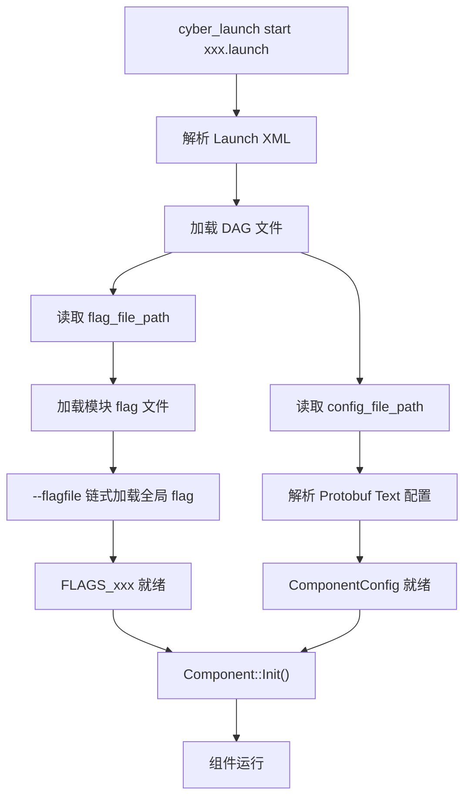
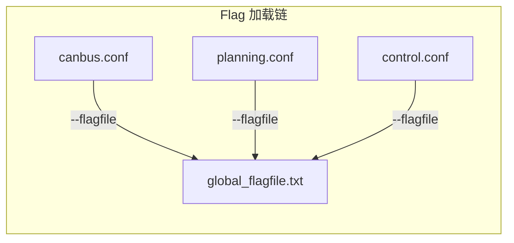

# 配置系统

## 概述

Apollo 采用多层次的配置体系，将系统配置按职责分离到不同格式的文件中。这套体系的核心思路是：**启动拓扑与运行参数解耦，全局配置与模块配置分层**。

整体来看，Apollo 的配置分为以下几个层次：

- **Launch 层**：XML 格式，定义要启动哪些模块
- **DAG 层**：Protobuf Text 格式，定义组件拓扑、通道连接关系
- **Config 层**：Protobuf Text 格式（`.pb.txt`），定义算法参数、功能配置
- **Flag 层**：gflags 配置文件（`.conf` / `.flag`），定义运行时开关、路径、阈值等
- **Calibration 层**：YAML 格式，定义传感器标定外参等

每个模块通常在 `conf/` 目录下同时拥有 `.pb.txt` 和 `.conf` 两类配置文件，分别承担结构化参数和运行时标志的职责。

## 配置文件格式

### Protobuf Text Format（`.pb.txt`）

这是 Apollo 中最常见的配置格式，用于组件配置和算法参数。每个 `.pb.txt` 文件都有对应的 `.proto` 定义，提供了强类型校验。

典型路径：

```
/apollo/modules/perception/lidar_tracking/conf/lidar_tracking_config.pb.txt
/apollo/modules/localization/conf/rtk_localization.pb.txt
/apollo/modules/canbus/conf/canbus_conf.pb.txt
/apollo/modules/planning/planning_component/conf/planning_config.pb.txt
/apollo/modules/control/control_component/conf/pipeline.pb.txt
/apollo/modules/prediction/conf/prediction_conf.pb.txt
```

示例内容（Canbus 配置）：

```protobuf
vehicle_parameter {
  max_enable_fail_attempt: 5
  driving_mode: COMPLETE_AUTO_DRIVE
}

can_card_parameter {
  brand: HERMES_CAN
  type: PCI_CARD
  channel_id: CHANNEL_ID_ZERO
  num_ports: 8
  interface: NATIVE
}

enable_debug_mode: false
enable_receiver_log: false
enable_sender_log: false
```

### Flag 文件（`.conf` / `.flag`）

基于 Google gflags 的配置文件，每行一个 flag，以 `--` 开头。模块级 flag 文件通常会通过 `--flagfile` 引用全局 flag 文件，形成链式加载。

典型路径：

```
/apollo/modules/canbus/conf/canbus.conf
/apollo/modules/perception/data/flag/perception_common.flag
/apollo/modules/common/data/global_flagfile.txt    # 全局 flags
```

示例内容：

```bash
--flagfile=/apollo/modules/common/data/global_flagfile.txt
--canbus_driver_timeout=10000.0
--enable_chassis_detail_pub=true
--noreceiver_log
```

::: tip 链式加载
模块 flag 文件中的 `--flagfile=` 指令会递归加载目标文件中的所有 flag。全局 flag 文件 `global_flagfile.txt` 通常定义地图路径、车辆型号等跨模块共享参数。
:::

### YAML 文件（`.yaml`）

主要用于传感器标定外参和部分专用配置。

典型路径：

```
/apollo/modules/audio/conf/respeaker_extrinsics.yaml
```

示例内容：

```yaml
header:
  stamp:
    secs: 0
    nsecs: 0
  seq: 0
  frame_id: novatel
child_frame_id: microphone
transform:
  translation:
    x: 0.0
    y: 0.0
    z: 0.0
  rotation:
    x: 0.0
    y: 0.0
    z: 0.0
    w: 1.0
```

### DAG 文件（`.dag`）

Protobuf Text 格式，定义 Cyber RT 组件的运行拓扑，包括动态库路径、组件类名、配置文件路径和通道订阅关系。

```protobuf
module_config {
    module_library : "modules/audio/libaudio_component.so"
    components {
        class_name : "AudioComponent"
        config {
            name: "audio"
            config_file_path: "/apollo/modules/audio/conf/audio_conf.pb.txt"
            flag_file_path: "/apollo/modules/audio/conf/audio.conf"
            readers: [
                {
                    channel: "/apollo/sensor/microphone"
                    qos_profile: {
                        depth : 1
                    }
                }
            ]
        }
    }
}
```

关键字段说明：

| 字段 | 说明 |
|------|------|
| `module_library` | 组件动态库路径 |
| `class_name` | 组件类名，需与代码中注册的名称一致 |
| `config_file_path` | Protobuf Text 配置文件路径 |
| `flag_file_path` | gflags 配置文件路径 |
| `readers` | 订阅的通道列表及 QoS 参数 |

### Launch 文件（`.launch`）

XML 格式，是模块启动的入口。定义要加载的 DAG 文件和进程分配。

```xml
<cyber>
    <module>
        <name>canbus</name>
        <dag_conf>/apollo/modules/canbus/dag/canbus.dag</dag_conf>
        <process_name>canbus</process_name>
    </module>
</cyber>
```

一个 launch 文件可以包含多个 `<module>` 节点。相同 `<process_name>` 的组件会被调度到同一进程中运行，便于减少进程间通信开销。

## gflags 体系

Apollo 大量使用 Google gflags 来管理运行时参数。gflags 的优势在于：可以通过命令行、配置文件或代码默认值三种方式设置，且支持运行时动态查询。

### 定义方式

在 C++ 代码中通过宏定义 flag：

```cpp
// 字符串类型 - 文件路径、通道名等
DEFINE_string(flagfile,
    "/apollo/modules/common/data/global_flagfile.txt",
    "global flagfile path");

// 浮点类型 - 阈值、频率等
DEFINE_double(timeout, 10000.0, "module timeout in milliseconds");

// 布尔类型 - 功能开关
DEFINE_bool(enable_routing_aid, true,
    "enable routing result to aid localization");

// 整数类型 - 计数、端口等
DEFINE_int32(max_retry_count, 3, "maximum retry attempts");
```

### 使用方式

在代码中通过 `FLAGS_` 前缀访问：

```cpp
if (FLAGS_enable_routing_aid) {
  // 使用路由辅助定位
}

auto deadline = absl::Now() + absl::Milliseconds(FLAGS_timeout);
```

### 跨模块声明

当需要在其他文件中访问已定义的 flag 时，使用 `DECLARE_` 宏：

```cpp
DECLARE_double(timeout);  // 声明在其他文件中定义的 flag
```

### 常见 flag 类型

| 宏 | 类型 | 典型用途 |
|----|------|----------|
| `DEFINE_string` | `std::string` | 文件路径、通道名、车辆型号 |
| `DEFINE_double` | `double` | 超时时间、频率、阈值 |
| `DEFINE_bool` | `bool` | 功能开关、调试标志 |
| `DEFINE_int32` | `int32_t` | 端口号、重试次数、队列深度 |

## 配置加载流程

Apollo 的配置加载遵循从 Launch 文件到具体参数的逐层解析流程：



详细步骤：

1. `cyber_launch` 工具解析 `.launch` 文件，获取 DAG 文件路径
2. Cyber RT 框架解析 DAG 文件，提取 `config_file_path` 和 `flag_file_path`
3. gflags 从 `flag_file_path` 加载模块级 flag，遇到 `--flagfile=` 指令时递归加载引用的文件（通常最终指向 `global_flagfile.txt`）
4. Protobuf Text 配置从 `config_file_path` 解析为对应的 protobuf message 对象
5. 组件的 `Init()` 方法被调用，此时所有配置均已就绪



## 各模块配置示例

### Perception（感知）

感知模块包含多个子模块，每个子模块有独立的配置：

```
modules/perception/
├── lidar_tracking/conf/
│   └── lidar_tracking_config.pb.txt
├── camera_detection_single_stage/conf/
│   └── camera_detection_single_stage_config.pb.txt
├── radar_detection/conf/
│   └── radar_detection_config.pb.txt
├── multi_sensor_fusion/conf/
│   └── multi_sensor_fusion_conf.pb.txt
└── data/flag/
    └── perception_common.flag
```

感知模块的 flag 文件通常包含模型路径、传感器配置等：

```bash
--flagfile=/apollo/modules/common/data/global_flagfile.txt
--obs_sensor_intrinsic_path=/apollo/modules/perception/data/params
--enable_hdmap=true
--lidar_model_version=cnnseg128
```

### Planning（规划）

规划模块的配置较为复杂，包含场景配置和交通规则配置：

```
modules/planning/
├── planning_component/
│   └── conf/
│       ├── planning_config.pb.txt        # 主配置
│       ├── traffic_rule_config.pb.txt    # 交通规则
│       ├── planning_semantic_map_config.pb.txt
│       └── planning.conf                 # flagfile
└── scenarios/
    └── */conf/*.pb.txt               # 各场景配置
```

### Control（控制）

控制模块的配置包含 PID 参数和控制器选择：

```
modules/control/
└── conf/
    ├── control_conf.pb.txt    # 控制器参数（PID、LQR 等）
    └── control.conf           # flagfile
```

`control_conf.pb.txt` 中典型的控制器参数：

```protobuf
lat_controller_conf {
  ts: 0.01
  preview_window: 0
  cf: 155494.663
  cr: 155494.663
  mass_fl: 520
  mass_fr: 520
  mass_rl: 520
  mass_rr: 520
  eps: 0.01
  matrix_q: 0.05
  matrix_q: 0.0
  matrix_q: 1.0
  matrix_q: 0.0
}
```

### Localization（定位）

```
modules/localization/
└── conf/
    ├── rtk_localization.pb.txt    # RTK 定位配置
    ├── msf_localization.pb.txt    # 多传感器融合定位配置
    └── localization.conf          # flagfile
```

### Audio（音频）

```
modules/audio/
└── conf/
    ├── audio_conf.pb.txt              # 音频主配置（含 topic_conf）
    └── respeaker_extrinsics.yaml      # 麦克风阵列外参
```

## 配置最佳实践

### 分层管理

- 将**不常变动的结构化参数**放在 `.pb.txt` 中（如算法参数、控制器增益）
- 将**运行时开关和路径**放在 `.conf` flag 文件中（如功能开关、模型路径）
- 将**传感器标定数据**放在 `.yaml` 中

### flag 文件组织

- 模块 flag 文件的第一行应引用全局 flagfile：
  ```bash
  --flagfile=/apollo/modules/common/data/global_flagfile.txt
  ```
- 全局共享参数（地图路径、车辆型号）统一放在 `global_flagfile.txt`
- 避免在多个 flag 文件中重复定义同一个 flag

### Protobuf 配置

- 每个 `.pb.txt` 文件必须有对应的 `.proto` 定义
- 利用 protobuf 的默认值机制，配置文件中只需写入与默认值不同的字段
- 修改配置前先检查 `.proto` 中的字段类型和约束

### DAG 文件

- 需要低延迟通信的组件应配置相同的 `process_name`，使其运行在同一进程中
- `qos_profile.depth` 和 `pending_queue_size` 根据通道数据频率合理设置
- 避免单个 DAG 文件中组件过多，按功能模块拆分

### 调试技巧

- 使用 `cyber_launch` 的 `--log_dir` 参数指定日志目录，便于排查配置加载问题
- 通过设置 `--v=4` 提高日志级别，可以看到 flag 的解析过程
- 修改 `.pb.txt` 后无需重新编译，重启模块即可生效
- 修改 `.proto` 定义后需要重新编译
