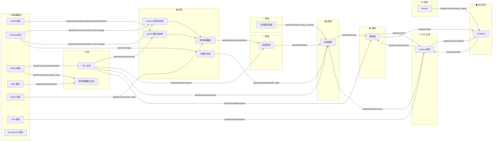
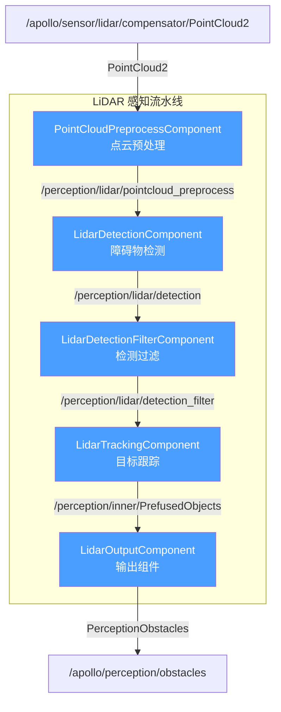
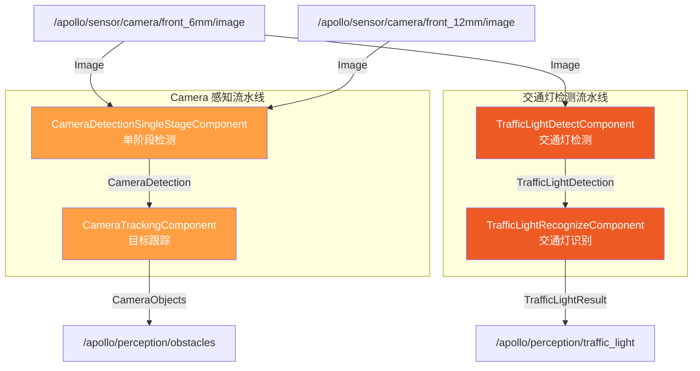
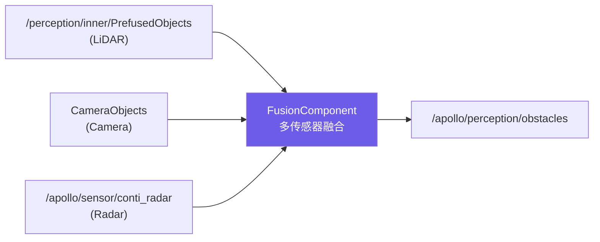
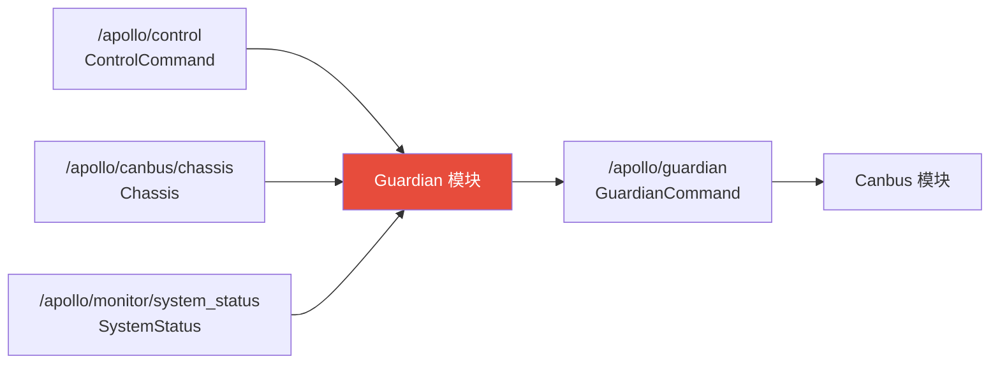
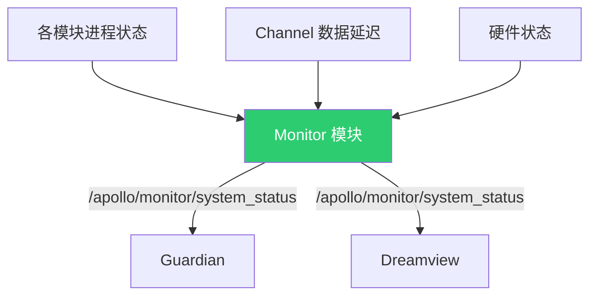
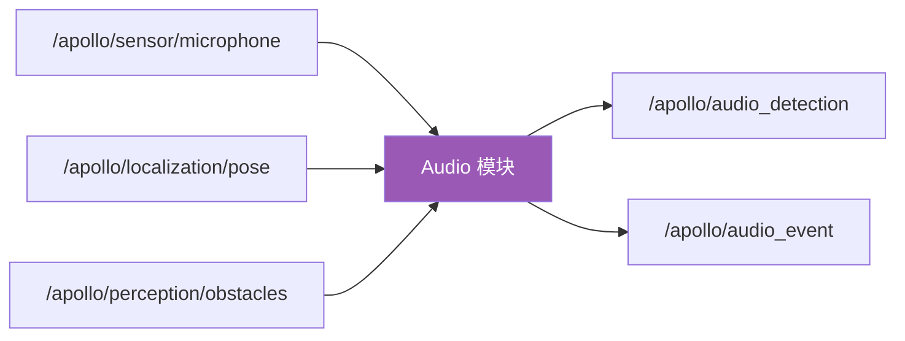
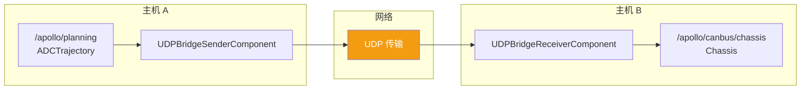

# Apollo 跨模块数据流

## 概述

Apollo 自动驾驶平台基于 Cyber RT 中间件构建，采用数据驱动的架构设计。各功能模块之间通过 **发布/订阅（Pub/Sub）** 机制进行通信，数据以 **Channel** 为载体在模块间流转。每个模块作为独立的 Component 运行，通过 DAG（有向无环图）文件定义其输入输出关系和调度策略。

这种架构带来了几个核心优势：

- 模块间松耦合，可独立开发、测试和部署
- 基于 DAG 的任务调度，支持并行计算
- Channel 机制提供透明的进程间/进程内通信
- 数据流可观测，便于调试和监控

## 主数据流

Apollo 的核心数据流形成了一条从传感器输入到车辆控制输出的完整链路：

> **传感器驱动 → 感知 → 预测 → 规划 → 控制 → CAN 总线**

定位模块作为基础服务，为感知、预测、规划、控制等多个模块提供位姿信息。



## 感知子流水线

感知模块内部包含多条并行的处理流水线，最终通过融合输出统一的障碍物列表。

### LiDAR 感知流水线

LiDAR 流水线定义在 `lidar_detection_pipeline.dag` 中，由五个串行 Component 组成：



### Camera 感知流水线



### 多传感器融合

LiDAR、Camera、Radar 的检测结果最终汇入融合模块，输出统一的 `/apollo/perception/obstacles`：



## Channel 列表

以下是 Apollo 系统中主要的 Channel 及其消息类型、发布者和订阅者：

### 传感器 Channel

| Channel | 消息类型 | 发布者 | 订阅者 |
|---------|---------|--------|--------|
| `/apollo/sensor/lidar/compensator/PointCloud2` | PointCloud | LiDAR 驱动 | 感知（LiDAR 流水线） |
| `/apollo/sensor/camera/front_6mm/image` | Image | Camera 驱动 | 感知（Camera 流水线、交通灯检测） |
| `/apollo/sensor/camera/front_12mm/image` | Image | Camera 驱动 | 感知（Camera 流水线） |
| `/apollo/sensor/gnss/odometry` | Gps | GNSS 驱动 | 定位（RTK） |
| `/apollo/sensor/gnss/best_pose` | GnssBestPose | GNSS 驱动 | 定位（MSF） |
| `/apollo/sensor/gnss/imu` | Imu | IMU 驱动 | 定位（MSF） |
| `/apollo/sensor/gnss/ins_stat` | InsStat | GNSS 驱动 | 定位 |
| `/apollo/sensor/conti_radar` | ContiRadar | Radar 驱动 | 感知（融合） |
| `/apollo/sensor/microphone` | AudioData | Microphone 驱动 | 音频模块 |

### 核心模块 Channel

| Channel | 消息类型 | 发布者 | 订阅者 |
|---------|---------|--------|--------|
| `/apollo/localization/pose` | LocalizationEstimate | 定位 | 感知、预测、规划、控制、音频 |
| `/apollo/perception/obstacles` | PerceptionObstacles | 感知 | 预测、音频 |
| `/apollo/perception/traffic_light` | TrafficLightDetection | 感知 | 规划 |
| `/apollo/prediction` | PredictionObstacles | 预测 | 规划 |
| `/apollo/planning` | ADCTrajectory | 规划 | 控制、Bridge |
| `/apollo/control` | ControlCommand | 控制 | CAN 总线、Guardian |
| `/apollo/canbus/chassis` | Chassis | CAN 总线 | 规划、控制、Guardian |
| `/apollo/canbus/chassis_detail` | ChassisDetail | CAN 总线 | 监控 |
| `/apollo/routing/routing_response` | RoutingResponse | 路由 | 规划 |

### 辅助模块 Channel

| Channel | 消息类型 | 发布者 | 订阅者 |
|---------|---------|--------|--------|
| `/apollo/guardian` | GuardianCommand | Guardian | CAN 总线 |
| `/apollo/monitor/system_status` | SystemStatus | Monitor | Guardian、Dreamview |
| `/apollo/audio_detection` | AudioDetection | 音频 | 规划 |
| `/apollo/audio_event` | AudioEvent | 音频 | 规划 |

### 感知内部 Channel

| Channel | 消息类型 | 发布者 | 订阅者 |
|---------|---------|--------|--------|
| `/perception/lidar/pointcloud_preprocess` | PointCloud | PointCloudPreprocessComponent | LidarDetectionComponent |
| `/perception/lidar/detection` | LidarDetection | LidarDetectionComponent | LidarDetectionFilterComponent |
| `/perception/lidar/detection_filter` | LidarDetection | LidarDetectionFilterComponent | LidarTrackingComponent |
| `/perception/inner/PrefusedObjects` | SensorObjects | LidarTrackingComponent | LidarOutputComponent |

## 辅助数据流

### Guardian（安全守护）

Guardian 模块是 Apollo 的安全兜底机制。它监听控制指令、底盘状态和系统监控状态，在检测到异常时接管车辆控制：



当 Guardian 发出指令时，Canbus 模块会优先执行 Guardian 的命令而非 Control 模块的命令。

### Monitor（系统监控）

Monitor 模块持续监测各模块的运行状态，包括进程健康度、数据延迟、硬件状态等，并将汇总的系统状态发布到 `/apollo/monitor/system_status`。



### Audio（音频感知）

音频模块处理来自麦克风的声音数据，结合定位和感知信息，检测紧急车辆警笛等声音事件：



### Bridge（网络桥接）

Bridge 模块通过 UDP 协议实现跨主机的数据传输，用于多车协同或远程监控场景：



### Dreamview（可视化平台）

Dreamview 作为 Apollo 的人机交互界面，订阅系统中大部分 Channel 用于可视化展示，同时提供 HMI 操作接口：

- 订阅定位、感知、预测、规划、控制等核心 Channel 进行实时可视化
- 提供路由请求（RoutingRequest）的发送界面
- 展示系统监控状态
- 支持模块启停控制和场景仿真

## 数据流特点

### 异步发布/订阅

Apollo 基于 Cyber RT 的 Pub/Sub 机制，模块间通信完全异步。发布者无需知道订阅者的存在，订阅者也无需等待发布者就绪。这种解耦设计使得：

- 各模块可以按照自身频率独立运行
- 新增模块只需订阅已有 Channel，无需修改现有代码
- 模块故障不会直接导致其他模块崩溃

### DAG 调度

每个模块的 Component 通过 DAG 文件定义，Cyber RT 调度器根据 DAG 中声明的依赖关系自动编排执行顺序。例如 `canbus.dag` 定义了 CanbusComponent 的配置文件（`canbus_conf.pb.txt`）、flag 文件（`canbus.conf`）和调度间隔（10ms）。

```
# canbus.dag 示例结构
module_config {
    module_library: "modules/canbus/libcanbus_component.so"
    components {
        class_name: "CanbusComponent"
        config {
            config_file_path: "modules/canbus/conf/canbus_conf.pb.txt"
            flag_file_path: "modules/canbus/conf/canbus.conf"
            interval: 10
        }
    }
}
```

### 多频率协同

不同传感器和模块以不同频率运行：

| 模块 | 典型频率 |
|------|---------|
| LiDAR | 10 Hz |
| Camera | 15-30 Hz |
| Radar | 13 Hz |
| 定位 | 100 Hz |
| 感知 | 10 Hz |
| 预测 | 10 Hz |
| 规划 | 10 Hz |
| 控制 | 100 Hz |
| Canbus | 100 Hz |

Cyber RT 的调度器负责协调这些不同频率的数据流，确保各模块在收到新数据时及时触发处理。

### 数据序列化

Channel 中传输的消息使用 Protocol Buffers（Protobuf）进行序列化，兼顾了传输效率和跨语言兼容性。所有消息类型定义在 `modules/common_msgs/` 目录下的 `.proto` 文件中。

### 容错与降级

通过 Guardian 和 Monitor 模块的配合，Apollo 实现了多层容错机制：

1. Monitor 检测到模块异常 → 发布 SystemStatus
2. Guardian 收到异常状态 → 接管控制权
3. Guardian 发出安全停车指令 → Canbus 执行
4. 正常控制链路（Control → Canbus）被 Guardian 链路覆盖
