# Apollo 系统启动流程

## 概述

Apollo 自动驾驶系统的启动是一个多层级的过程，从宿主机的 Docker 容器创建，到容器内的 CyberRT 框架初始化，再到各功能模块的加载与运行。整个链路可以概括为：

1. 宿主机执行 `dev_start.sh` 创建并启动 Docker 开发容器
2. 用户通过 `dev_into.sh` 进入容器
3. 在容器内通过 `cyber_launch` 工具解析 `.launch` 文件
4. `cyber_launch` 为每个模块启动 `mainboard` 进程
5. `mainboard` 解析 `.dag` 配置文件，通过 ClassLoader 动态加载组件库并初始化组件

## 启动流程总览

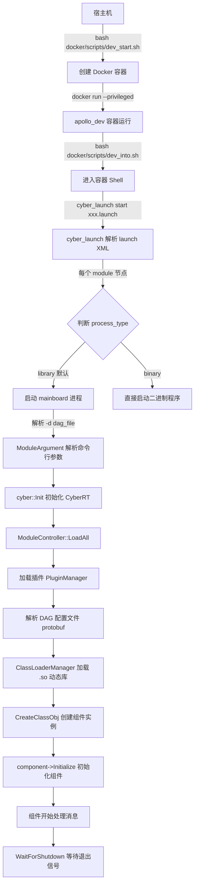

## Docker 容器启动

### 启动脚本

Apollo 的 Docker 环境管理脚本位于 `docker/scripts/` 目录下：

| 脚本 | 用途 |
|------|------|
| `dev_start.sh` | 创建并启动开发容器 |
| `dev_into.sh` | 进入已运行的开发容器 |
| `docker_base.sh` | Docker 公共函数库（GPU 检测、容器管理等） |
| `runtime_start.sh` | 启动运行时容器（生产环境） |
| `cyber_start.sh` | 启动 Cyber 专用容器 |

### dev_start.sh 执行流程

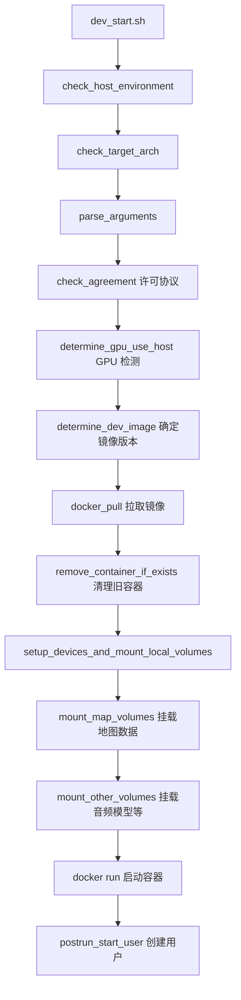

`dev_start.sh` 的核心操作是执行 `docker run`，关键参数包括：

```bash
docker run -itd \
    --privileged \                              # 特权模式，访问硬件设备
    --name "apollo_dev_${USER}" \               # 容器名称
    -e NVIDIA_VISIBLE_DEVICES=all \             # GPU 透传
    -v $APOLLO_ROOT_DIR:/apollo \               # 挂载源码目录
    -v /dev:/dev \                              # 挂载设备目录
    --net host \                                # 使用宿主机网络
    -w /apollo \                                # 工作目录
    --shm-size "2G" \                           # 共享内存大小
    --pid=host \                                # 共享宿主机 PID 命名空间
    "${DEV_IMAGE}" \
    /bin/bash
```

### 容器内用户初始化

容器启动后，`docker_start_user.sh` 会被自动执行，完成以下操作：

- 创建与宿主机同名的用户账户（UID/GID 映射）
- 配置用户 bashrc 环境
- 设置 `/opt/apollo` 目录权限
- 授予设备访问权限（GPS、摄像头、IMU 等）
- 配置 core dump 路径

### 进入容器

```bash
bash docker/scripts/dev_into.sh
```

该脚本执行 `docker exec -it apollo_dev_${USER} /bin/bash`，进入已运行的容器。

## cyber_launch 启动工具

`cyber_launch` 是 Apollo 的模块启动入口，位于 `cyber/tools/cyber_launch/cyber_launch.py`。它负责解析 `.launch` XML 文件，并为每个模块创建对应的进程。

### 使用方式

```bash
# 启动模块
cyber_launch start /apollo/modules/planning/planning_component/launch/planning.launch

# 停止模块
cyber_launch stop /apollo/modules/planning/planning_component/launch/planning.launch

# 通过便捷脚本启动（内部调用 cyber_launch）
bash scripts/planning.sh start
```

### launch 文件格式

launch 文件是 XML 格式，根元素为 `<cyber>`，包含一个或多个 `<module>` 子元素。

#### 基本结构

```xml
<cyber>
    <module>
        <name>模块名称</name>
        <dag_conf>DAG 配置文件路径</dag_conf>
        <process_name>进程名称</process_name>
    </module>
</cyber>
```

#### 完整字段说明

| 字段 | 必填 | 说明 |
|------|------|------|
| `name` | 是 | 模块名称，用于日志标识 |
| `dag_conf` | 是* | DAG 配置文件路径，可指定多个。`type=binary` 时可为空 |
| `process_name` | 否 | 进程名称/进程组。`type=binary` 时为可执行命令 |
| `type` | 否 | 进程类型：`library`（默认）或 `binary` |
| `sched_name` | 否 | 调度策略名称，默认 `CYBER_DEFAULT` |
| `exception_handler` | 否 | 异常处理策略：`respawn`（自动重启）或 `exit`（退出所有） |
| `respawn_limit` | 否 | 自动重启次数上限，默认 3 |
| `plugin` | 否 | 插件描述文件路径 |
| `cpuprofile` | 否 | CPU 性能分析输出文件 |
| `memprofile` | 否 | 内存性能分析输出文件 |
| `nice` | 否 | 进程优先级调整值 |

#### 示例：标准模块（library 类型）

```xml
<!-- canbus.launch -->
<cyber>
    <module>
        <name>canbus</name>
        <dag_conf>/apollo/modules/canbus/dag/canbus.dag</dag_conf>
        <process_name>canbus</process_name>
    </module>
</cyber>
```

#### 示例：多 DAG 模块

一个 launch 文件中的同一个 module 可以加载多个 DAG 文件，它们共享同一个进程：

```xml
<!-- planning.launch -->
<cyber>
    <module>
        <name>planning</name>
        <dag_conf>/apollo/modules/external_command/process_component/dag/external_command_process.dag</dag_conf>
        <dag_conf>/apollo/modules/planning/planning_component/dag/planning.dag</dag_conf>
        <process_name>planning</process_name>
    </module>
</cyber>
```

#### 示例：二进制类型模块

```xml
<!-- dreamview_plus.launch -->
<cyber>
    <module>
        <name>dreamview_plus</name>
        <dag_conf></dag_conf>
        <type>binary</type>
        <process_name>
            dreamview_plus --flagfile=/apollo/modules/dreamview_plus/conf/dreamview.conf
        </process_name>
        <exception_handler>respawn</exception_handler>
    </module>
</cyber>
```

#### 示例：感知模块（多 DAG 复杂配置）

```xml
<!-- perception_all.launch -->
<cyber>
    <module>
        <name>perception</name>
        <process_name>perception</process_name>
        <!-- camera front -->
        <dag_conf>/apollo/modules/perception/camera_detection_multi_stage/dag/camera_detection_multi_stage_front.dag</dag_conf>
        <dag_conf>/apollo/modules/perception/camera_tracking/dag/camera_tracking_front.dag</dag_conf>
        <!-- lidar -->
        <dag_conf>/apollo/modules/perception/pointcloud_preprocess/dag/pointcloud_preprocess.dag</dag_conf>
        <dag_conf>/apollo/modules/perception/lidar_detection/dag/lidar_detection.dag</dag_conf>
        <dag_conf>/apollo/modules/perception/lidar_tracking/dag/lidar_tracking.dag</dag_conf>
        <!-- radar -->
        <dag_conf>/apollo/modules/perception/radar_detection/dag/radar_detection_front.dag</dag_conf>
        <!-- fusion -->
        <dag_conf>/apollo/modules/perception/multi_sensor_fusion/dag/multi_sensor_fusion.dag</dag_conf>
    </module>
</cyber>
```

### cyber_launch 处理逻辑

`cyber_launch` 解析 launch XML 后，对每个 `<module>` 节点：

1. 读取 `type` 字段判断进程类型
2. 若为 `library`（默认），构造 mainboard 命令：

   ```bash
   mainboard -d dag1.dag -d dag2.dag -p process_name -s sched_name
   ```

3. 若为 `binary`，直接执行 `process_name` 中指定的命令
4. 通过 `ProcessMonitor` 监控所有子进程的生命周期
5. 支持 `respawn` 异常处理：进程异常退出时自动重启（上限可配置）

## mainboard 核心流程

`mainboard` 是 CyberRT 框架的组件宿主进程，位于 `cyber/mainboard/`。它是所有 library 类型模块的统一入口。

### 源码结构

```
cyber/mainboard/
├── mainboard.cc           # main 函数入口
├── module_argument.h/cc   # 命令行参数解析
├── module_controller.h/cc # 模块加载控制器
└── BUILD                  # Bazel 构建文件
```

### mainboard 启动序列

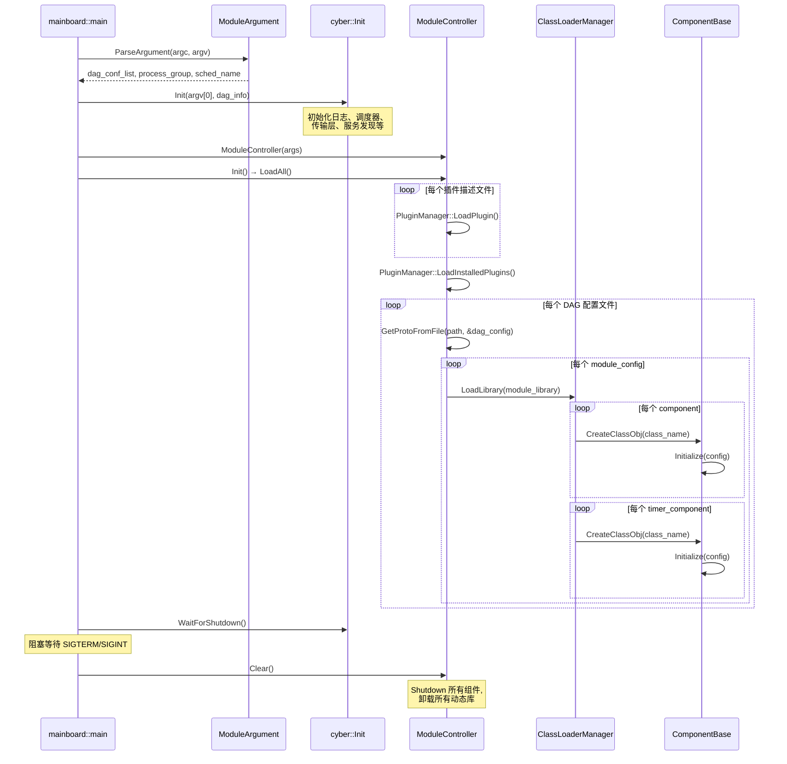

### 命令行参数

```
mainboard [OPTION]...

选项：
  -h, --help                    帮助信息
  -d, --dag_conf=CONFIG_FILE    DAG 配置文件路径（可多次指定）
  -p, --process_name=NAME       进程组名称
  -s, --sched_name=NAME         调度策略名称
  --plugin=FILE                 插件描述文件路径
  --disable_plugin_autoload     禁用插件自动加载
  -c, --cpuprofile              启用 CPU 性能分析
  -o, --profile_filename=FILE   CPU 分析输出文件
  -H, --heapprofile             启用堆内存分析
  -O, --heapprofile_filename=FILE 堆分析输出文件

示例：
  mainboard -d /apollo/modules/planning/planning_component/dag/planning.dag -p planning
  mainboard -d dag1.dag -d dag2.dag -p perception -s CYBER_DEFAULT
```

## DAG 配置文件

DAG（Directed Acyclic Graph）配置文件定义了模块的组件拓扑结构，使用 protobuf 文本格式。

### Proto 定义

DAG 配置的 protobuf schema 定义在 `cyber/proto/dag_conf.proto`：

```protobuf
// dag_conf.proto
message DagConfig {
  repeated ModuleConfig module_config = 1;
}

message ModuleConfig {
  optional string module_library = 1;           // 动态库路径
  repeated ComponentInfo components = 2;         // 普通组件列表
  repeated TimerComponentInfo timer_components = 3; // 定时器组件列表
}

message ComponentInfo {
  optional string class_name = 1;               // 组件类名
  optional ComponentConfig config = 2;           // 组件配置
}

message TimerComponentInfo {
  optional string class_name = 1;               // 组件类名
  optional TimerComponentConfig config = 2;      // 定时器组件配置
}
```

组件配置定义在 `cyber/proto/component_conf.proto`：

```protobuf
// component_conf.proto
message ComponentConfig {
  optional string name = 1;                     // 组件名称
  optional string config_file_path = 2;         // protobuf 配置文件路径
  optional string flag_file_path = 3;           // gflags 配置文件路径
  repeated ReaderOption readers = 4;            // 输入 channel 配置
}

message TimerComponentConfig {
  optional string name = 1;
  optional string config_file_path = 2;
  optional string flag_file_path = 3;
  optional uint32 interval = 4;                 // 定时触发间隔（毫秒）
}

message ReaderOption {
  optional string channel = 1;                  // channel 名称
  optional QosProfile qos_profile = 2;          // QoS 配置
  optional uint32 pending_queue_size = 3;       // 待处理队列大小，默认 1
}
```

### 两种组件类型

Apollo 中有两种组件类型，对应不同的触发机制：

#### Component（消息驱动型）

当订阅的 channel 收到消息时触发 `Proc()` 回调。适用于需要响应外部输入的模块。

```protobuf
# routing.dag - 消息驱动组件示例
module_config {
    module_library : "modules/routing/librouting_component.so"
    components {
        class_name : "RoutingComponent"
        config {
            name : "routing"
            config_file_path: "/apollo/modules/routing/conf/routing_config.pb.txt"
            flag_file_path: "/apollo/modules/routing/conf/routing.conf"
            readers: [
                {
                    channel: "/apollo/raw_routing_request"
                    qos_profile: {
                        depth : 10
                    }
                }
            ]
        }
    }
}
```

#### TimerComponent（定时驱动型）

按固定时间间隔触发 `Proc()` 回调。适用于需要周期性执行的模块。

```protobuf
# canbus.dag - 定时器组件示例
module_config {
    module_library : "modules/canbus/libcanbus_component.so"
    timer_components {
        class_name : "CanbusComponent"
        config {
            name: "canbus"
            config_file_path: "/apollo/modules/canbus/conf/canbus_conf.pb.txt"
            flag_file_path: "/apollo/modules/canbus/conf/canbus.conf"
            interval: 10    # 每 10ms 触发一次
        }
    }
}
```

### DAG 加载机制详解

`ModuleController::LoadAll()` 的加载过程：

1. 加载插件：遍历命令行指定的插件描述文件，调用 `PluginManager::LoadPlugin()`；若未禁用自动加载，还会调用 `LoadInstalledPlugins()`
2. 解析 DAG 路径：通过 `APOLLO_DAG_PATH` 环境变量搜索 DAG 文件的实际路径
3. 统计组件数量：预先遍历所有 DAG 文件，统计 component 和 timer_component 总数，用于调度器资源分配
4. 逐个加载 DAG：对每个 DAG 文件调用 `LoadModule(path)`

`ModuleController::LoadModule()` 的处理过程：

1. 使用 `GetProtoFromFile()` 将 DAG 文件反序列化为 `DagConfig` protobuf 对象
2. 遍历 `module_config` 列表：
   - 通过 `APOLLO_LIB_PATH` 环境变量定位 `module_library` 指定的 `.so` 动态库
   - 调用 `ClassLoaderManager::LoadLibrary()` 加载动态库
   - 遍历 `components`，使用 `CreateClassObj<ComponentBase>(class_name)` 创建组件实例
   - 调用 `component->Initialize(config)` 初始化组件（注册 Reader、Writer、定时器等）
   - 将组件实例存入 `component_list_` 保持生命周期

## 完整启动链路

以启动 Planning 模块为例，展示从 Docker 到���件运行的完整链路：

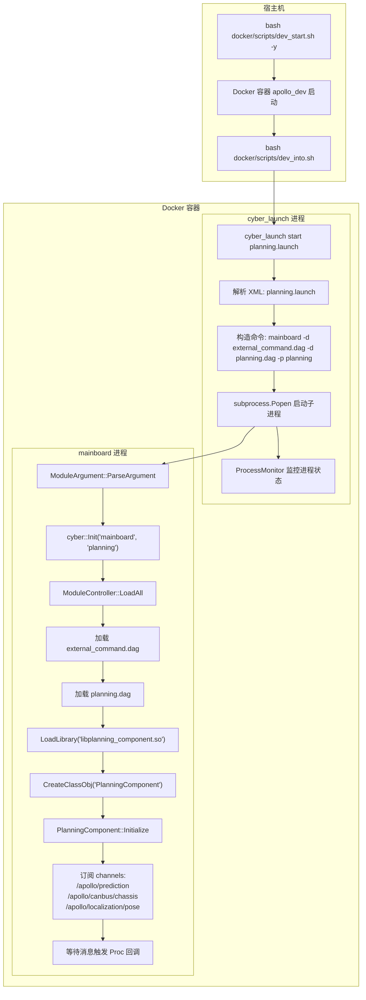

### 典型操作步骤

```bash
# 1. 启动 Docker 开发容器（宿主机执行）
cd /apollo
bash docker/scripts/dev_start.sh

# 2. 进入容器
bash docker/scripts/dev_into.sh

# 3. 启动 DreamView Plus（可视化界面）
cyber_launch start /apollo/modules/dreamview_plus/launch/dreamview_plus.launch

# 4. 启动各功能模块（可通过 DreamView 界面操作，或手动执行）
cyber_launch start /apollo/modules/localization/launch/rtk_localization.launch
cyber_launch start /apollo/modules/canbus/launch/canbus.launch
cyber_launch start /apollo/modules/control/control_component/launch/control.launch
cyber_launch start /apollo/modules/planning/planning_component/launch/planning.launch
cyber_launch start /apollo/modules/prediction/launch/prediction.launch
cyber_launch start /apollo/modules/routing/launch/routing.launch
cyber_launch start /apollo/modules/perception/launch/perception_all.launch

# 5. 使用便捷脚本（等效方式）
bash scripts/dreamview_plus.sh start
bash scripts/planning.sh start

# 6. 停止模块
cyber_launch stop /apollo/modules/planning/planning_component/launch/planning.launch
```

## 模块目录结构约定

每个 Apollo 功能模块遵循统一的目录结构：

```
modules/<module_name>/
├── conf/                    # 配置文件
│   ├── <module>.conf        # gflags 配置
│   └── <module>_conf.pb.txt # protobuf 配置
├── dag/                     # DAG 配置文件
│   └── <module>.dag
├── launch/                  # Launch 启动文件
│   └── <module>.launch
├── proto/                   # protobuf 消息定义
├── lib<module>_component.so # 编译产物（动态库）
└── ...                      # 源码文件
```

## 环境变量

mainboard 在加载过程中依赖以下环境变量：

| 环境变量 | 说明 |
|----------|------|
| `APOLLO_DAG_PATH` | DAG 文件搜索路径 |
| `APOLLO_LIB_PATH` | 动态库搜索路径 |
| `APOLLO_LAUNCH_PATH` | launch 文件默认搜索路径，默认 `/apollo` |
| `APOLLO_ENV_WORKROOT` | 工作根目录，默认 `/apollo` |

## 进程与组件的关系

理解 Apollo 中进程和组件的关系对调试和性能优化很重要：

- 一个 `launch` 文件可以定义多个 `module`，每个 module 对应一个独立进程
- 一个 `module`（进程）可以加载多个 `dag` 文件
- 一个 `dag` 文件可以包含多个 `module_config`
- 一个 `module_config` 对应一个动态库（`.so`），可包含多个组件
- 同一进程内的组件共享地址空间，通过共享内存或进程内通信高效交换数据

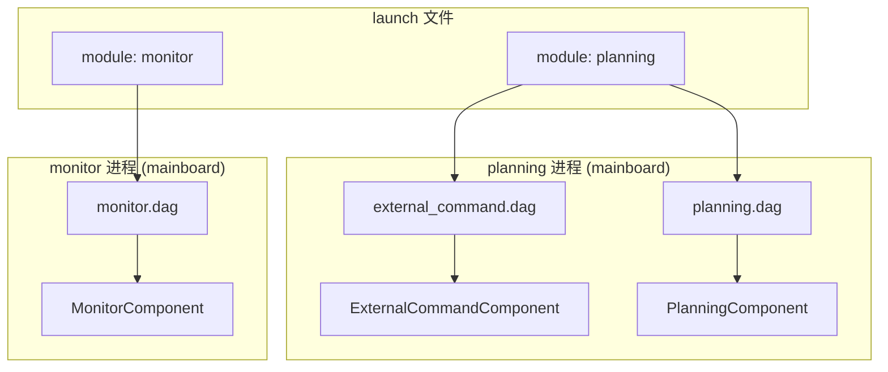

# 仿真与回放

## 概述

Apollo 自动驾驶系统提供了完整的仿真与数据回放能力，开发者无需实车即可完成算法验证、场景测试和问题复现。仿真体系由三个核心子系统构成：

- **Dreamview 仿真模式**：通过 SimControlManager 在浏览器可视化界面中模拟车辆运动，支持多种动力学模型
- **cyber_recorder 录制回放**：基于 Cyber RT 通信框架的数据录制与回放工具，以 `.record` 格式存储所有 channel 消息
- **SimulationWorld 服务**：将各模块实时数据聚合为统一的仿真世界状态，通过 WebSocket 推送给前端渲染

Apollo 的仿真支持两种主要模式：

| 模式 | 说明 | 适用场景 |
|------|------|----------|
| **WorldSim** | 纯虚拟仿真，车辆按规划轨迹在地图上运动 | 算法开发、场景构建 |
| **LogSim** | 回放实车采集数据，重新运行部分模块 | 问题复现、回归测试 |

## 仿真架构

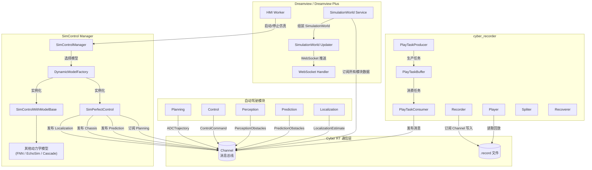

## SimControlManager 仿真控制

### 核心组件

SimControlManager 是 Dreamview 仿真模式的核心管理器，位于：

```
modules/dreamview/backend/common/sim_control_manager/
├── common/
│   ├── sim_control_gflags.cc/h    # 仿真控制参数定义
│   ├── sim_control_util.cc/h      # 工具函数
│   └── interpolation_2d.cc/h      # 二维插值
├── core/
│   ├── sim_control_base.cc/h       # 抽象基类
│   ├── sim_control_with_model_base.cc/h  # 带动力学模型的基类
│   └── dynamic_model_factory.cc/h  # 动力学模型工厂
├── dynamic_model/
│   └── perfect_control/
│       ├── sim_perfect_control.cc/h  # 完美控制模型
│       └── sim_control_test.cc       # 单元测试
├── proto/
│   ├── dynamic_model_conf.proto   # 动力学模型配置定义
│   ├── fnn_model.proto            # FNN 模型定义
│   └── sim_control_internal.proto # 仿真控制内部消息定义
├── sim_control_manager.cc/h       # 管理器入口
```

### 动力学模型体系

SimControlManager 采用工厂模式管理多种车辆动力学模型：

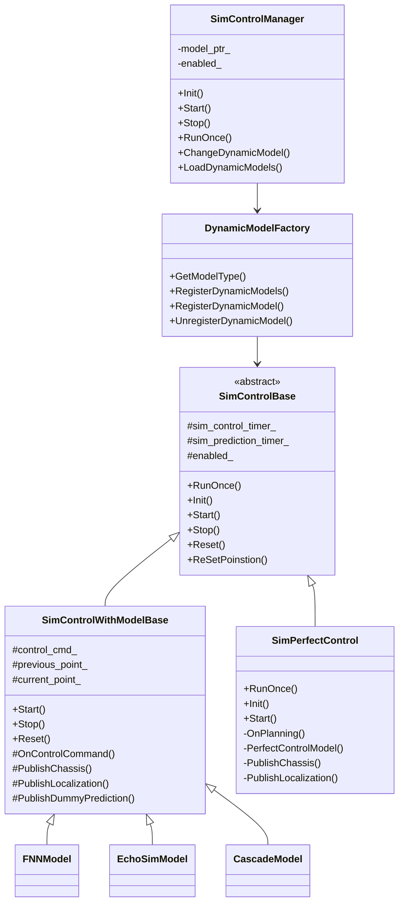

### 完美控制模型（Perfect Control）

`SimPerfectControl` 是默认的仿真模型，假设车辆能完美执行规划轨迹。工作流程为：

1. 订阅 Planning 模块发布的 `ADCTrajectory`
2. 以 10ms 间隔执行 `RunOnce()`，在轨迹上用时间戳插值出当前位置
3. 发布模拟的 `LocalizationEstimate` 和 `Chassis` 消息
4. 以 100ms 间隔发布空的 `PredictionObstacles`（dummy prediction）

### 带动力学模型的仿真

`SimControlWithModelBase` 为基于物理动力学模型的仿真提供框架：

- 订阅 `ControlCommand` 作为输入（而非直接跟随 Planning 轨迹）
- 根据控制指令（油门、刹车、转向）通过动力学方程计算车辆状态
- 支持的模型包括 FNN（前馈神经网络）、EchoSim、Cascade 等

### 仿真控制参数

关键的 gflags 参数定义在 `sim_control_gflags.cc` 中：

```cpp
// 仿真模块名称
--sim_control_module_name=sim_control

// 默认动力学模型
--dynamic_model_name=perfect_control

// 动力学模型相关文件路径
--fnn_model_path=sim_control/conf/fnn_model.bin
--backward_fnn_model_path=sim_control/conf/fnn_model_backward.bin

// Cyber Reader 缓冲队列大小
--reader_pending_queue_size=10

// 是否在非自动驾驶模式下也启用仿真
--enable_sim_at_nonauto_mode=true

// EchoSim 模型仿真步长
--echosim_simulation_step=0.001
```

## cyber_recorder 录制与回放

`cyber_recorder` 是 Cyber RT 框架提供的命令行工具，支持对 channel 消息的录制、回放、查看、切分和修复。

### 源码结构

```
cyber/tools/cyber_recorder/
├── main.cc          # 命令行入口与参数解析
├── recorder.cc/h    # 录制功能：订阅 channel 并写入 .record 文件
├── player/
│   ├── player.cc/h          # 回放控制器
│   ├── play_param.h         # 回放参数结构体
│   ├── play_task.cc/h       # 回放任务定义
│   ├── play_task_producer.cc/h # 从 .record 文件读取消息生产任务
│   ├── play_task_consumer.cc/h # 消费任务并按时间戳发布消息
│   └── play_task_buffer.cc/h   # 生产者-消费者之间的任务缓冲
├── spliter.cc/h     # 按时间范围或 channel 切分 record 文件
├── recoverer.cc/h   # 修复损坏的 record 文件
└── info.cc/h        # 查看 record 文件的元信息
```

### 回放架构

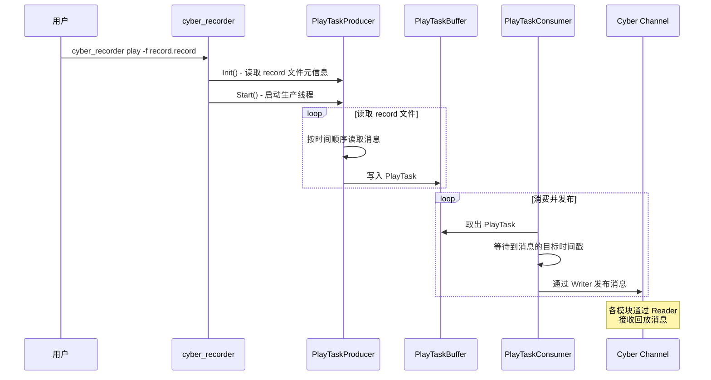

### 命令详解

#### 录制数据

```bash
# 录制所有 channel
cyber_recorder record -a -o /data/bag/test.record

# 录制指定 channel
cyber_recorder record -c /apollo/localization/pose \
                      -c /apollo/perception/obstacles \
                      -c /apollo/planning \
                      -o /data/bag/test.record

# 排除指定 channel
cyber_recorder record -a -k /apollo/sensor/camera/front \
                      -o /data/bag/test.record

# 按时间分段录制（每 600 秒一个文件）
cyber_recorder record -a -i 600 -o /data/bag/test.record

# 按大小分段录制（每 2048 MB 一个文件）
cyber_recorder record -a -m 2048 -o /data/bag/test.record
```

录制参数说明：

| 参数 | 说明 |
|------|------|
| `-a` | 录制所有 channel |
| `-c <channel>` | 白名单：仅录制指定 channel（可多次指定） |
| `-k <channel>` | 黑名单：排除指定 channel（可多次指定） |
| `-o <file>` | 输出文件路径（默认使用时间戳命名） |
| `-i <seconds>` | 按时间间隔分段 |
| `-m <MB>` | 按文件大小分段 |

#### 回放数据

```bash
# 基本回放
cyber_recorder play -f /data/bag/test.record

# 多文件回放
cyber_recorder play -f test1.record test2.record test3.record

# 循环回放
cyber_recorder play -f test.record -l

# 调整回放速率（2 倍速）
cyber_recorder play -f test.record -r 2.0

# 从指定时间开始回放
cyber_recorder play -f test.record -b 2024-01-15-10:30:00

# 指定时间范围回放
cyber_recorder play -f test.record \
    -b 2024-01-15-10:30:00 \
    -e 2024-01-15-10:31:00

# 从第 30 秒开始回放
cyber_recorder play -f test.record -s 30

# 仅回放指定 channel
cyber_recorder play -f test.record \
    -c /apollo/localization/pose \
    -c /apollo/planning

# 延迟 5 秒开始回放
cyber_recorder play -f test.record -d 5

# 预加载 10 秒数据
cyber_recorder play -f test.record -p 10
```

回放参数说明：

| 参数 | 说明 | 默认值 |
|------|------|--------|
| `-f <file>` | 输入 record 文件（必需，支持多文件） | - |
| `-a` | 回放所有 channel | 是（当未指定 `-c` 时） |
| `-c <channel>` | 白名单：仅回放指定 channel | - |
| `-k <channel>` | 黑名单：排除指定 channel | - |
| `-l` | 循环回放 | 否 |
| `-r <rate>` | 回放速率倍数 | 1.0 |
| `-b <time>` | 开始时间（格式 `YYYY-MM-DD-HH:MM:SS`） | 文件起始 |
| `-e <time>` | 结束时间 | 文件结尾 |
| `-s <seconds>` | 跳过前 N 秒 | 0 |
| `-d <seconds>` | 延迟 N 秒开始 | 0 |
| `-p <seconds>` | 预加载时间 | 3 |

#### 查看 record 信息

```bash
cyber_recorder info /data/bag/test.record
```

输出示例：

```
record_file:    test.record
version:        1.0
duration:       120.5 s
begin_time:     2024-01-15 10:30:00
end_time:       2024-01-15 10:32:00
size:           1.2 GB
message_number: 156832
channel_number: 25

channel: /apollo/localization/pose         type: apollo.localization.LocalizationEstimate   count: 12050
channel: /apollo/planning                  type: apollo.planning.ADCTrajectory              count: 1205
channel: /apollo/perception/obstacles      type: apollo.perception.PerceptionObstacles      count: 1205
...
```

#### 切分 record 文件

```bash
# 按时间范围切分
cyber_recorder split -f test.record \
    -o test_clip.record \
    -b 2024-01-15-10:30:00 \
    -e 2024-01-15-10:31:00

# 按 channel 切分
cyber_recorder split -f test.record \
    -o planning_only.record \
    -c /apollo/planning
```

#### 修复损坏的 record 文件

```bash
cyber_recorder recover -f corrupted.record -o recovered.record
```

## Dreamview Plus 中的回放集成

Dreamview Plus（新版可视化平台）通过 `RecordPlayerFactory` 将 cyber_recorder 的回放功能集成到了 Web 界面中。

### RecordPlayerFactory

```
modules/dreamview_plus/backend/record_player/record_player_factory.h
```

`RecordPlayerFactory` 是一个单例工厂，管理多个 `Player` 实例：

- **注册回放**：`RegisterRecordPlayer(record_name, file_path)` 创建一个 Player 实例并注册
- **获取播放器**：`GetRecordPlayer(record_name)` 获取已注册的 Player
- **LRU 缓存**：预加载最多 3 个 record，最多保留 15 个已加载的 record，超出时移除最久未使用的
- **当前播放**：`SetCurrentRecord` / `GetCurrentRecord` 管理当前正在播放的 record

### 在 Dreamview Plus 中回放数据


## SimulationWorld 服务

`SimulationWorldService` 是 Dreamview 将所有模块数据汇聚为统一仿真世界视图的核心服务。

### 数据源订阅

SimulationWorldService 订阅以下 channel：

| Channel | 消息类型 | 数据来源 |
|---------|----------|----------|
| `/apollo/canbus/chassis` | `Chassis` | CAN 总线 / SimControl |
| `/apollo/localization/pose` | `LocalizationEstimate` | 定位模块 / SimControl |
| `/apollo/perception/obstacles` | `PerceptionObstacles` | 感知模块 |
| `/apollo/prediction` | `PredictionObstacles` | 预测模块 |
| `/apollo/planning` | `ADCTrajectory` | 规划模块 |
| `/apollo/control` | `ControlCommand` | 控制模块 |
| `/apollo/perception/traffic_light` | `TrafficLightDetection` | 交通灯检测 |
| `/apollo/monitor` | `MonitorMessage` | 系统监控 |

> **注意**：`/apollo/routing_response` 是 SimulationWorldService 的发布（Writer）channel，而非订阅。

### 数据更新与推送流程

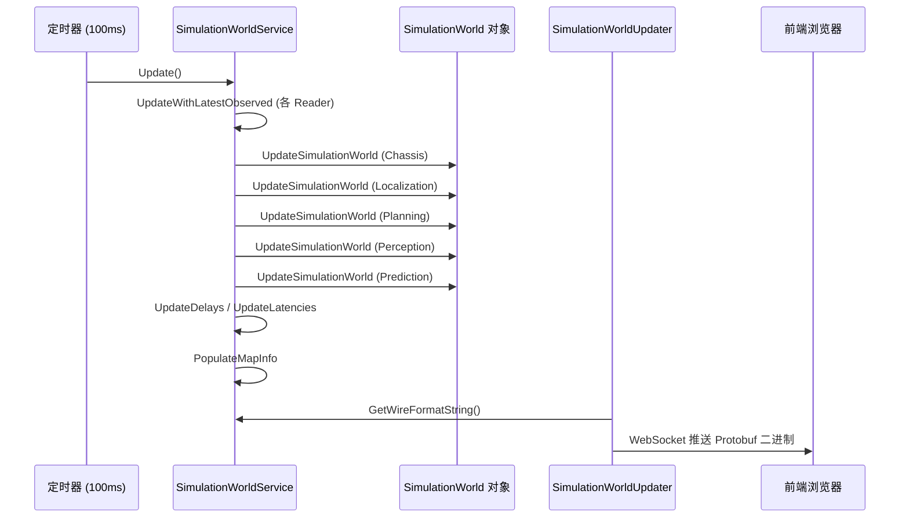

## 场景配置（Scenario）

Apollo 的仿真场景通过 Protobuf 配置定义，支持 WorldSim 和 LogSim 两种模式。

### 场景配置示例

```protobuf
// modules/common_msgs/simulation_msgs/scenario.proto
message Scenario {
  optional string name = 1;
  optional string description = 2;

  // WorldSim 起终点
  optional Point start = 3;
  optional Point end = 4;

  // LogSim 数据源
  repeated string origin_log_file_path = 6;
  optional double log_file_start_time = 7;
  optional double log_file_end_time = 8;

  // 路由请求
  optional RoutingRequest routing_request = 9;

  // 仿真模式
  enum Mode {
    WORLDSIM = 0;        // 纯虚拟仿真
    LOGSIM = 1;          // 完整日志回放
    LOGSIM_CONTROL = 2;  // 回放到控制模块
    LOGSIM_PERCEPTION = 3; // 回放到感知模块
  }
  optional Mode mode = 25 [default = WORLDSIM];

  // 交通灯配置
  enum DefaultLightBehavior {
    ALWAYS_GREEN = 0;  // 常绿
    CYCLICAL = 1;      // 红绿灯循环
  }
  optional DefaultLightBehavior default_light_behavior = 20 [default = ALWAYS_GREEN];
  optional double red_time = 21 [default = 15.0];
  optional double green_time = 22 [default = 13.0];
  optional double yellow_time = 23 [default = 3.0];

  // 初始车速和加速度
  optional double start_velocity = 16 [default = 0.0];
  optional double start_acceleration = 17 [default = 0.0];

  // 场景最大运行时间（仅 WorldSim）
  optional int32 simulator_time = 15;
}
```

### 场景模式说明

| 模式 | 工作方式 |
|------|----------|
| `WORLDSIM` | SimPerfectControl 生成虚拟 Localization 和 Chassis，Planning 正常运行 |
| `LOGSIM` | 完整回放 record 文件中的所有模块数据 |
| `LOGSIM_CONTROL` | 回放感知和规划数据，Control 模块实时运行 |
| `LOGSIM_PERCEPTION` | 回放传感器原始数据，Perception 和后续模块实时运行 |

## Dreamview 配置文件

### Dreamview 经典版

配置文件路径：`modules/dreamview/conf/dreamview.conf`

```bash
--flagfile=/apollo/modules/common/data/global_flagfile.txt
```

启动文件：`modules/dreamview/launch/dreamview.launch`

### Dreamview Plus

配置文件路径：`modules/dreamview_plus/conf/dreamview.conf`

```bash
--flagfile=/apollo/modules/common/data/global_flagfile.txt
--static_file_dir=/apollo/modules/dreamview_plus/frontend/dist
--default_data_collection_config_path=/apollo/modules/dreamview_plus/conf/data_collection_table.pb.txt
--default_preprocess_config_path=/apollo/modules/dreamview_plus/conf/preprocess_table.pb.txt
--data_handler_config_path=/apollo/modules/dreamview_plus/conf/data_handler.conf
--vehicle_data_config_filename=/apollo/modules/dreamview_plus/conf/vehicle_data.pb.txt
--default_hmi_mode=Default
--server_ports=8888
```

启动文件：`modules/dreamview_plus/launch/dreamview_plus.launch`

## 典型操作流程

### WorldSim 仿真

```bash
# 1. 启动 Dreamview Plus
bash scripts/bootstrap.sh start_plus
# 或使用 cyber_launch
cyber_launch start modules/dreamview_plus/launch/dreamview_plus.launch

# 2. 在浏览器中打开 http://localhost:8888
# 3. 在 HMI 面板中选择仿真模式 (Sim Control)
# 4. 选择地图和车辆
# 5. 设置路由起终点
# 6. 启动自动驾驶模块（Planning, Prediction 等）
# 7. 点击 "Start" 开始仿真
```

### LogSim 回放

```bash
# 1. 启动 Dreamview Plus
cyber_launch start modules/dreamview_plus/launch/dreamview_plus.launch

# 2. 通过命令行回放 record 文件
cyber_recorder play -f /data/bag/2024-01-15/test.record -l

# 或者在 Dreamview Plus 界面中选择 record 文件进行回放

# 3. 可以同时启动特定模块进行在线处理
# 例如仅回放感知数据，让 Planning 实时运行：
cyber_recorder play -f test.record \
    -c /apollo/perception/obstacles \
    -c /apollo/localization/pose \
    -c /apollo/canbus/chassis
```

### 数据录制

```bash
# 在实车测试或仿真过程中录制数据
# 录制所有核心 channel，每 300 秒分段
cyber_recorder record -a \
    -k /apollo/sensor/camera/front/image \
    -k /apollo/sensor/lidar/compensator/PointCloud2 \
    -i 300 \
    -o /data/bag/$(date +%Y%m%d%H%M%S).record

# 录制完成后查看信息
cyber_recorder info /data/bag/*.record
```

## 动力学模型配置

动力学模型通过 `DynamicModelConf` protobuf 配置：

```protobuf
message DynamicModelConf {
    optional string dynamic_model_name = 1;  // 模型名称
    optional string library_name = 2;        // 动态库名称
    repeated string dynamic_model_files = 3; // 模型文件列表
    optional string depend_model_package = 4; // 依赖包
}
```

通过 Dreamview 的 HMI 接口可以动态加载、切换和卸载动力学模型，无需重启仿真。

# Apollo 车辆适配层技术文档

## 概述

Apollo 自动驾驶系统通过 CAN 总线（Controller Area Network）与车辆底盘进行通信。车辆适配层是连接上层控制决策与底层车辆执行器之间的桥梁，负责将控制指令（油门、刹车、转向等）编码为 CAN 报文发送给车辆 ECU，同时接收车辆状态反馈并解析为系统可用的 Chassis 数据。

Apollo 目前已适配的车型包括：Lincoln MKZ、GEM、Lexus、Transit、GE3、WEY、中云（Zhongyun）、CH、DevKit、Neolix 等。系统提供了完整的代码生成工具链，支持基于 DBC 文件自动生成车辆协议代码，大幅降低新车型适配的工作量。

## 架构总览

车辆适配层由三个核心模块组成：

- `modules/canbus/` — CAN 总线主模块，包含组件入口、抽象工厂接口和车辆控制器基类
- `modules/canbus_vehicle/` — 各车型的具体实现（协议解析、控制器、消息管理器）
- `modules/drivers/canbus/` — CAN 总线驱动层，提供硬件抽象（CAN 卡客户端、收发器、协议数据基类）

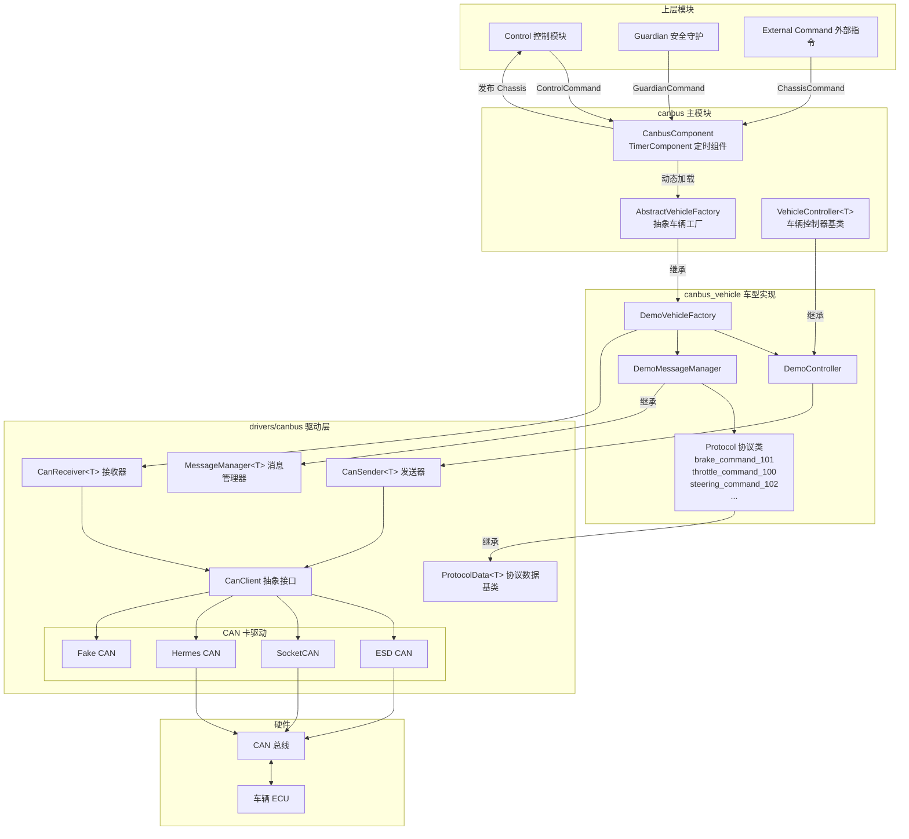

## 核心组件详解

### 1. CanbusComponent — 模块入口

`CanbusComponent` 继承自 `cyber::TimerComponent`，以固定频率（默认 100Hz）运行。它是整个 CAN 总线模块的入口点。

核心职责：

- 加载车辆工厂动态库（通过 `ClassLoader` 动态加载 `.so` 文件）
- 订阅 `ControlCommand`、`GuardianCommand`、`ChassisCommand` 话题
- 定时调用车辆工厂发布 `Chassis` 状态
- 处理控制指令超时和通信故障

关键配置参数（`canbus.conf`）：

```bash
--canbus_conf_file=/apollo/modules/canbus/conf/canbus_conf.pb.txt
--load_vehicle_library=/opt/apollo/neo/lib/modules/canbus_vehicle/lincoln/liblincoln_vehicle_factory_lib.so
--load_vehicle_class_name=LincolnVehicleFactory
--chassis_debug_mode=false
--estop_brake=30.0
```

其中 `load_vehicle_library` 和 `load_vehicle_class_name` 决定了加载哪个车型的实现。

### 2. AbstractVehicleFactory — 抽象车辆工厂

抽象工厂定义了所有车型实现必须遵循的接口：

```cpp
class AbstractVehicleFactory {
 public:
  virtual bool Init(const CanbusConf *canbus_conf) = 0;
  virtual bool Start() = 0;
  virtual void Stop() = 0;
  virtual void UpdateCommand(const ControlCommand *control_command) = 0;
  virtual void UpdateCommand(const ChassisCommand *chassis_command) = 0;
  virtual Chassis publish_chassis() = 0;
  virtual void PublishChassisDetail() = 0;

  // 以下为非纯虚方法，有默认实现
  virtual void PublishChassisDetailSender();
  virtual void UpdateHeartbeat();
  virtual void CheckChassisCommunicationFault();
  virtual void AddSendProtocol();
  virtual void ClearSendProtocol();
  virtual bool IsSendProtocolClear();
  virtual Chassis::DrivingMode Driving_Mode();
};
```

每个车型通过 `CYBER_REGISTER_VEHICLEFACTORY(ClassName)` 宏注册到 Cyber 的类加载器中，使得 `CanbusComponent` 可以在运行时动态实例化对应的工厂。

### 3. VehicleController — 车辆控制器模板基类

`VehicleController<SensorType>` 是一个模板类，`SensorType` 对应车型的 Protobuf 消息类型（如 `Demo`、`Ch`）。它定义了控制车辆的核心接口：

```cpp
template <typename SensorType>
class VehicleController {
 public:
  virtual common::ErrorCode Init(
      const VehicleParameter &params,
      CanSender<SensorType> *const can_sender,
      MessageManager<SensorType> *const message_manager) = 0;
  virtual Chassis chassis() = 0;

  // 统一控制入口，内部调用下列 private 方法
  ErrorCode Update(const ControlCommand &command);

 private:
  // 以下方法通过 Update() 间接调用
  // 驾驶模式切换
  virtual void EnableAutoMode() = 0;
  virtual void DisableAutoMode() = 0;

  // 执行器控制
  virtual void Brake(double acceleration) = 0;
  virtual void Throttle(double throttle) = 0;
  virtual void Steer(double angle) = 0;
  virtual void Gear(Chassis::GearPosition state) = 0;

  // 生命周期与模式
  virtual bool Start() = 0;
  virtual void Stop() = 0;
  virtual void Emergency() = 0;
  virtual void Acceleration(double acc) = 0;
  virtual void EnableSteeringOnlyMode() = 0;
  virtual void EnableSpeedOnlyMode() = 0;
  virtual void SetEpbBreak() = 0;
  virtual void HandleCustomOperation() = 0;
};
```

## CAN 总线驱动层

### CanClient — 硬件抽象

`CanClient` 是 CAN 卡的抽象接口，屏蔽了不同硬件的差异。Apollo 支持以下 CAN 卡类型：

| CAN 卡类型 | 类名 | 说明 |
|---|---|---|
| ESD CAN | `EsdCanClient` | ESD 公司的 PCI/PCIe CAN 卡 |
| SocketCAN | `SocketCanClientRaw` | Linux 内核原生 SocketCAN 接口 |
| Hermes CAN | `HermesCanClient` | Hermes CAN 卡 |
| Fake CAN | `FakeCanClient` | 仿真测试用虚拟 CAN |

`CanClientFactory` 使用工厂模式根据配置创建对应的 CAN 客户端：

```protobuf
// canbus_conf.pb.txt 中的 CAN 卡配置
can_card_parameter {
  brand: SOCKET_CAN_RAW   // 或 ESD_CAN, HERMES_CAN, FAKE_CAN
  type: PCI_CARD
  channel_id: CHANNEL_ID_ZERO
  num_ports: 8
  interface: NATIVE
}
```

### CanSender / CanReceiver — 收发器

- `CanSender<T>` 管理所有待发送的 CAN 报文，按各协议定义的周期（如 20ms）循环发送
- `CanReceiver<T>` 在独立线程中持续接收 CAN 报文，通过 `MessageManager` 分发给对应的协议解析类

### ProtocolData — 协议数据基类

每条 CAN 报文对应一个 `ProtocolData<T>` 子类，负责：

- `Parse()` — 从原始字节解析信号值到 Protobuf 结构
- `UpdateData()` — 将控制值编码为 CAN 报文字节
- `GetPeriod()` — 返回发送周期（微秒）
- `Reset()` — 重置所有信号为默认值

### MessageManager — 消息管理器

`MessageManager<T>` 维护所有协议的注册表，区分发送协议和接收协议：

```cpp
// 在 MessageManager 构造函数中注册协议
AddSendProtocolData<Brakecommand101, true>();    // 发送协议（控制指令）
AddRecvProtocolData<Brakereport501, true>();      // 接收协议（状态反馈）
```

## DBC 文件详解

### 什么是 DBC 文件

DBC（Database CAN）文件是 CAN 通信的标准数据库描述文件，由 Vector 公司定义。它完整描述了 CAN 网络中所有报文和信号的定义，是车辆适配的核心输入。

### DBC 文件结构

以 Apollo 提供的 `apollo_demo.dbc` 为例，DBC 文件包含以下关键部分：

**1. 网络节点定义（BU_）**

```dbc
BU_: ACU VCU
```

定义 CAN 网络中的 ECU 节点。`ACU` 通常代表自动驾驶控制单元，`VCU` 代表车辆控制单元。

**2. 报文定义（BO_）**

```dbc
BO_ 256 Throttle_Command: 8 ACU
 SG_ Throttle_Pedal_Target : 31|16@0+ (0.1,0) [0|100] "%" Vector__XXX
 SG_ Throttle_Acc : 15|10@0+ (0.01,0) [0|10] "m/s^2" Vector__XXX
 SG_ Speed_Target : 47|12@0+ (0.01,0) [0|40.95] "m/s" Vector__XXX
 SG_ Throttle_EN_CTRL : 0|1@0+ (1,0) [0|1] "" Vector__XXX
 SG_ Heartbeat_100 : 7|4@0+ (1,0) [0|15] "" Vector__XXX
 SG_ CheckSum_100 : 63|8@0+ (1,0) [0|255] "" Vector__XXX
```

各字段含义：

| 字段 | 说明 |
|---|---|
| `256` | 报文 ID（十进制），即 0x100 |
| `Throttle_Command` | 报文名称 |
| `8` | 数据长度（字节） |
| `ACU` | 发送节点 |

**3. 信号定义（SG_）**

```
SG_ Brake_Dec : 15|10@0+ (0.01,0) [0|10] "m/s^2" Vector__XXX
```

| 字段 | 含义 |
|---|---|
| `Brake_Dec` | 信号名称 |
| `15` | 起始位（bit） |
| `10` | 信号长度（bit） |
| `@0+` | 字节序（0=Motorola/大端, 1=Intel/小端）和符号（+=无符号） |
| `(0.01,0)` | (精度, 偏移量)，物理值 = 原始值 × 0.01 + 0 |
| `[0\|10]` | 物理值范围 |
| `"m/s^2"` | 单位 |

**4. 值描述（VAL_）**

```dbc
VAL_ 259 Gear_Target 4 "DRIVE" 3 "NEUTRAL" 2 "REVERSE" 1 "PARK" 0 "INVALID";
```

为枚举类型信号定义各值的含义。

### 报文分类

DBC 中的报文按功能分为两类：

```mermaid
graph LR
    subgraph 控制报文 ACU→VCU
        TC[Throttle_Command 0x100]
        BC[Brake_Command 0x101]
        SC[Steering_Command 0x102]
        GC[Gear_Command 0x103]
        PC[Park_Command 0x104]
        VMC[Vehicle_Mode_Command 0x105]
    end

    subgraph 反馈报文 VCU→ACU
        TR[Throttle_Report 0x500]
        BR[Brake_Report 0x501]
        SR[Steering_Report 0x502]
        GR[Gear_Report 0x503]
        VR[VCU_Report 0x505]
        WR[Wheelspeed_Report 0x506]
    end

    ACU[自动驾驶控制单元] --> TC & BC & SC & GC & PC & VMC
    TC & BC & SC & GC & PC & VMC --> VCU[车辆控制单元]
    VCU --> TR & BR & SR & GR & VR & WR
    TR & BR & SR & GR & VR & WR --> ACU
```

## 车型实现结构

每个车型在 `modules/canbus_vehicle/<车型名>/` 下包含以下文件：

```
modules/canbus_vehicle/demo/
├── BUILD                          # Bazel 构建文件
├── cyberfile.xml                  # Cyber 包描述
├── demo_vehicle_factory.h/.cc     # 车辆工厂实现
├── demo_controller.h/.cc          # 车辆控制器实现
├── demo_message_manager.h/.cc     # 消息管理器（注册所有协议）
├── proto/
│   ├── BUILD
│   └── demo.proto                 # 车型专属 Protobuf 定义
├── protocol/
│   ├── brake_command_101.h/.cc    # 控制协议：刹车指令
│   ├── throttle_command_100.h/.cc # 控制协议：油门指令
│   ├── steering_command_102.h/.cc # 控制协议：转向指令
│   ├── gear_command_103.h/.cc     # 控制协议：档位指令
│   ├── brake_report_501.h/.cc     # 反馈协议：刹车状态
│   ├── throttle_report_500.h/.cc  # 反馈协议：油门状态
│   ├── steering_report_502.h/.cc  # 反馈协议：转向状态
│   └── ...                        # 其他协议
```

### 各组件关系

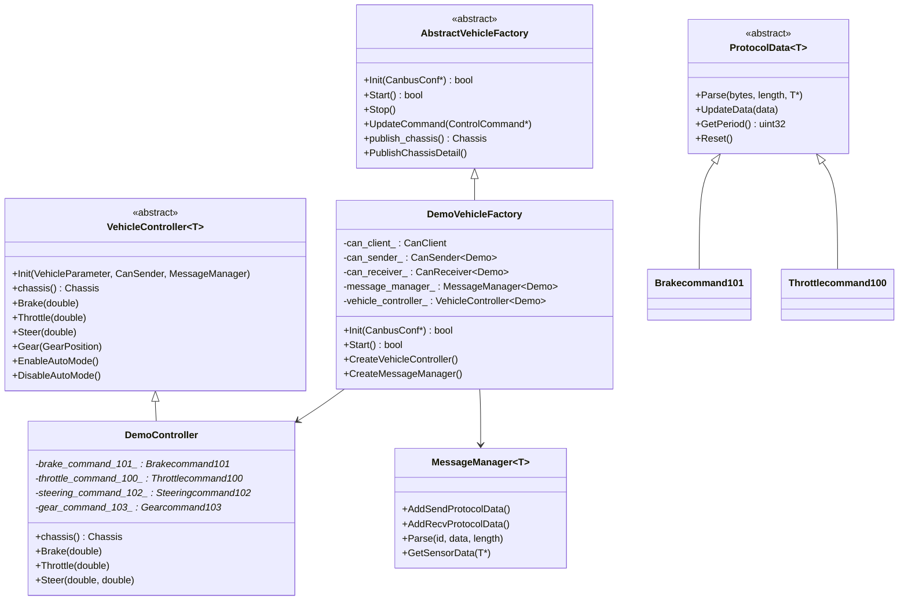

## 适配新车型完整步骤

### 前置条件

1. 获取目标车辆的 DBC 文件（由车辆线控供应商提供）
2. 确认车辆支持线控（drive-by-wire），至少包含油门、刹车、转向的电子控制
3. 确认 CAN 卡硬件已安装并可正常工作

### 步骤一：准备 DBC 文件

将车辆 DBC 文件放置到工作目录中。如果没有现成的 DBC 文件，可以参考 `modules/tools/gen_vehicle_protocol/apollo_demo.dbc` 的格式手动编写。

DBC 文件至少需要包含以下控制报文：

- 油门控制（Throttle Command）
- 刹车控制（Brake Command）
- 转向控制（Steering Command）
- 档位控制（Gear Command）

以及对应的反馈报文。

### 步骤二：编写代码生成配置文件

创建 YAML 配置文件（参考 `lincoln_conf.yml`）：

```yaml
# DBC 文件路径（容器内绝对路径）
dbc_file: /apollo_workspace/output/my_vehicle.dbc
# 中间 YAML 配置输出路径
protocol_conf: /apollo_workspace/output/my_vehicle.yml
# 车型名称（小写，用于目录和类名生成）
car_type: my_vehicle
# 控制报文协议列表，一般为空
sender_list: []
# 自动驾驶模块在 DBC 中的 ECU 节点名称
sender: ACU
# 不需要生成的信号 ID 列表
black_list: []
# 是否基于 apollo_demo.dbc 模板生成
use_demo_dbc: false

# 生成代码的输出目录
output_dir: /apollo_workspace/modules/canbus_vehicle
# canbus 配置文件输出目录
output_canbus_conf_dir: /apollo_workspace/output
```

### 步骤三：运行代码生成工具

```bash
cd /apollo
python modules/tools/gen_vehicle_protocol/gen.py my_vehicle_conf.yml
```

该工具会自动执行以下操作：

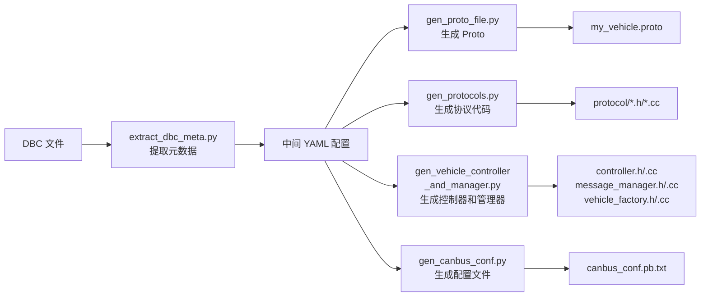

生成的文件结构：

```
modules/canbus_vehicle/my_vehicle/
├── BUILD
├── cyberfile.xml
├── my_vehicle_vehicle_factory.h/.cc
├── my_vehicle_controller.h/.cc
├── my_vehicle_message_manager.h/.cc
├── proto/
│   ├── BUILD
│   └── my_vehicle.proto
└── protocol/
    ├── throttle_command_xxx.h/.cc
    ├── brake_command_xxx.h/.cc
    ├── steering_command_xxx.h/.cc
    └── ...
```

### 步骤四：手动调整生成代码

自动生成的代码通常需要以下手动调整：

**1. 协议周期（GetPeriod）**

```cpp
// 根据车辆实际要求调整发送周期
uint32_t Brakecommand101::GetPeriod() const {
  static const uint32_t PERIOD = 20 * 1000;  // 20ms，单位微秒
  return PERIOD;
}
```

**2. 心跳和校验和（UpdateData_Heartbeat）**

```cpp
void Brakecommand101::UpdateData_Heartbeat(uint8_t* data) {
  ++heartbeat_101_;
  heartbeat_101_ = heartbeat_101_ % 16;  // 4bit 循环计数
  set_p_heartbeat_101(data, heartbeat_101_);
  // 校验和算法需要根据车辆协议文档实现
  checksum_101_ = data[0] ^ data[1] ^ data[2] ^ data[3]
                ^ data[4] ^ data[5] ^ data[6];
  set_p_checksum_101(data, checksum_101_);
}
```

**3. 控制器中的驾驶模式切换逻辑**

`EnableAutoMode()` 和 `DisableAutoMode()` 需要根据车辆的实际使能流程实现。

**4. chassis() 方法中的状态映射**

将车辆反馈的原始信号映射到 Apollo 标准的 `Chassis` 消息。

### 步骤五：注册车型品牌

在 `modules/common_msgs/config_msgs/vehicle_config.proto` 中添加新的品牌枚举：

```protobuf
enum VehicleBrand {
  LINCOLN_MKZ = 0;
  GEM = 1;
  LEXUS = 2;
  // ...
  MY_VEHICLE = 10;  // 新增
}
```

### 步骤六：编译车型动态库

```bash
# 编译车型适配模块
bazel build //modules/canbus_vehicle/my_vehicle:libmy_vehicle_vehicle_factory_lib.so
```

### 步骤七：配置 CAN 总线参数

修改 `modules/canbus/conf/canbus_conf.pb.txt`：

```protobuf
vehicle_parameter {
  brand: MY_VEHICLE
  max_enable_fail_attempt: 5
  driving_mode: COMPLETE_AUTO_DRIVE
}

can_card_parameter {
  brand: SOCKET_CAN_RAW
  type: PCI_CARD
  channel_id: CHANNEL_ID_ZERO
}

enable_debug_mode: false
enable_receiver_log: false
enable_sender_log: false
```

修改 `modules/canbus/conf/canbus.conf`，指向新车型的动态库：

```bash
--load_vehicle_library=/opt/apollo/neo/lib/modules/canbus_vehicle/my_vehicle/libmy_vehicle_vehicle_factory_lib.so
--load_vehicle_class_name=MyVehicleVehicleFactory
```

### 步骤八：配置车辆物理参数

在车辆配置文件中设置物理参数：

```protobuf
vehicle_param {
  brand: MY_VEHICLE
  front_edge_to_center: 3.89
  back_edge_to_center: 1.04
  left_edge_to_center: 1.055
  right_edge_to_center: 1.055
  length: 4.933
  width: 2.11
  height: 1.48
  min_turn_radius: 5.05
  max_acceleration: 2.0
  max_deceleration: -6.0
  max_steer_angle: 8.20
  max_steer_angle_rate: 8.55
  steer_ratio: 16.0
  wheel_base: 2.8448
  wheel_rolling_radius: 0.335
  max_abs_speed_when_stopped: 0.2
  brake_deadzone: 15.5
  throttle_deadzone: 18.0
}
```

### 步骤九：启动与测试

```bash
# 启动 canbus 模块
cyber_launch start modules/canbus/launch/canbus.launch

# 使用 canbus_tester 工具测试
# 可以发送测试控制指令验证车辆响应
```

## 数据流详解

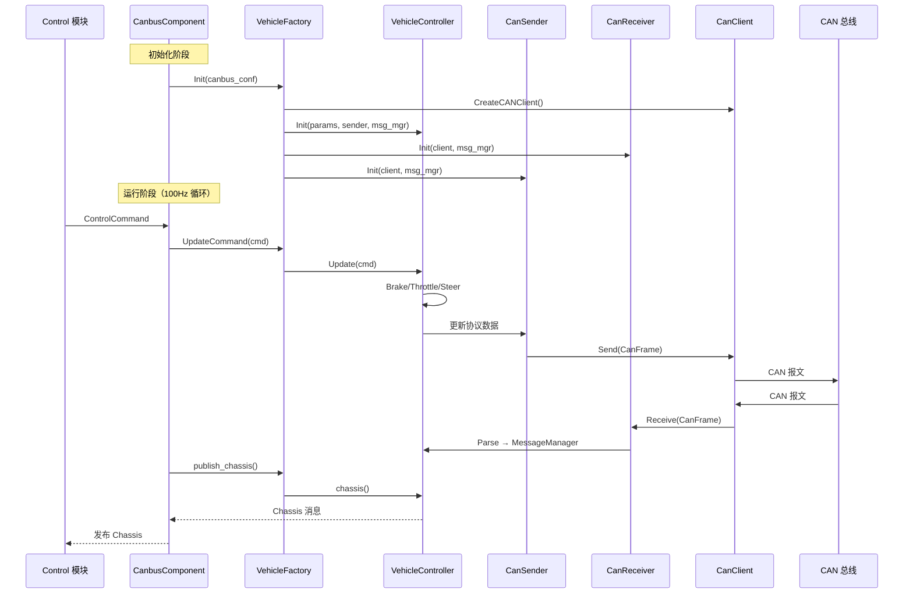

## 协议代码解析示例

以 `Brakecommand101`（刹车控制报文 0x101）为例，说明协议代码的工作原理。

### 信号编码（发送方向）

```cpp
// 设置刹车踏板目标值
// DBC 定义：bit=31, len=16, motorola, precision=0.1, range=[0|100], unit=%
void Brakecommand101::set_p_brake_pedal_target(uint8_t* data,
                                                double brake_pedal_target) {
  brake_pedal_target = ProtocolData::BoundedValue(0.0, 100.0, brake_pedal_target);
  int x = brake_pedal_target / 0.100000;  // 物理值 → 原始值
  uint8_t t = 0;

  // 按 Motorola 字节序写入 data[3] 和 data[4]
  t = x & 0xFF;
  Byte to_set0(data + 4);
  to_set0.set_value(t, 0, 8);
  x >>= 8;

  t = x & 0xFF;
  Byte to_set1(data + 3);
  to_set1.set_value(t, 0, 8);
}
```

### 信号解码（回读验证）

```cpp
// 解析刹车减速度
// DBC 定义：bit=15, len=10, motorola, precision=0.01, unit=m/s^2
double Brakecommand101::brake_dec(const std::uint8_t* bytes,
                                   int32_t length) const {
  Byte t0(bytes + 1);
  int32_t x = t0.get_byte(0, 8);

  Byte t1(bytes + 2);
  int32_t t = t1.get_byte(6, 2);
  x <<= 2;
  x |= t;

  double ret = x * 0.010000;  // 原始值 × 精度 = 物理值
  return ret;
}
```

## 配置参考

### canbus.dag — DAG 配置

```
module_config {
    module_library : "modules/canbus/libcanbus_component.so"
    timer_components {
        class_name : "CanbusComponent"
        config {
            name: "canbus"
            config_file_path: "/apollo/modules/canbus/conf/canbus_conf.pb.txt"
            flag_file_path: "/apollo/modules/canbus/conf/canbus.conf"
            interval: 10  // 10ms = 100Hz
        }
    }
}
```

### canbus.launch — 启动配置

```xml
<cyber>
    <module>
        <name>canbus</name>
        <dag_conf>/apollo/modules/canbus/dag/canbus.dag</dag_conf>
        <process_name>canbus</process_name>
    </module>
</cyber>
```

### 关键 GFlags 参数

| 参数 | 默认值 | 说明 |
|---|---|---|
| `chassis_freq` | 100 | Chassis 反馈频率（Hz） |
| `min_cmd_interval` | 5 | 最小控制指令间隔（ms） |
| `max_control_miss_num` | 5 | 最大控制指令丢失次数 |
| `estop_brake` | 30.0 | 紧急停车刹车力度（%） |
| `enable_chassis_detail_pub` | true | 是否发布底盘详细信息 |
| `chassis_debug_mode` | false | 底盘调试模式 |
| `enable_aeb` | false | 是否启用自动紧急制动 |
| `load_vehicle_library` | lincoln .so | 车型动态库路径 |
| `load_vehicle_class_name` | LincolnVehicleFactory | 车型工厂类名 |

## 常见问题

**Q: 如何确认 CAN 通信是否正常？**

启用 `enable_receiver_log` 和 `enable_sender_log` 后查看日志，或使用 `candump` 等 Linux CAN 工具监听总线数据。

**Q: 车辆无法进入自动驾驶模式？**

检查 `EnableAutoMode()` 的实现逻辑，确认使能信号的发送顺序和时序是否符合车辆协议要求。部分车辆需要先发送使能请求，等待 ECU 确认后才能切换模式。

**Q: 控制指令超时后会怎样？**

`CanbusComponent` 会检测控制指令的时间延迟，超时后会清除发送协议（`ClearSendProtocol`），停止向车辆发送控制指令。如果启用了 Guardian，会触发紧急制动（`estop_brake`）。

**Q: 如何在没有实车的情况下测试？**

将 CAN 卡配置为 `FAKE_CAN`，使用 `FakeCanClient` 进行仿真测试。也可以使用 Linux 虚拟 CAN 接口（`vcan`）配合 `SOCKET_CAN_RAW` 进行测试。
