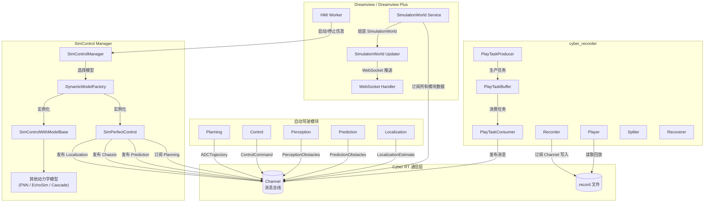
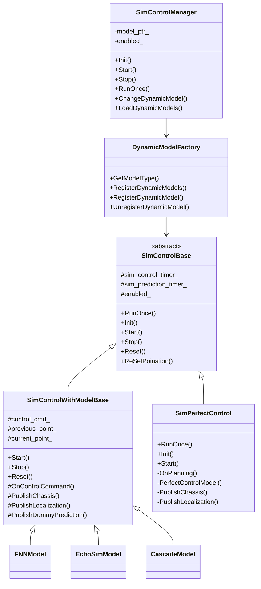
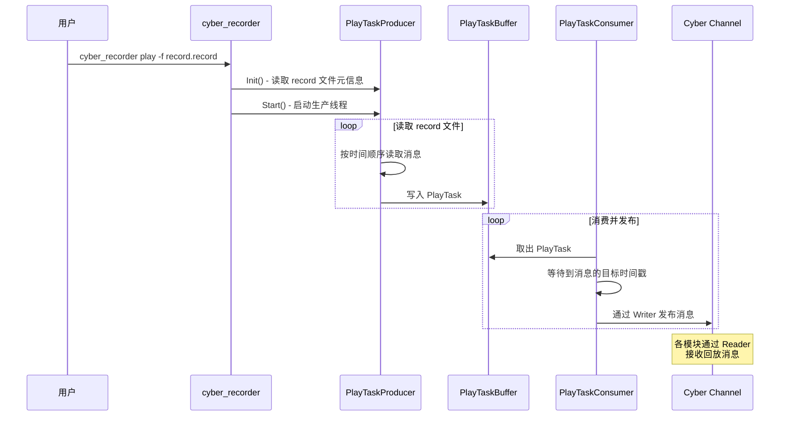
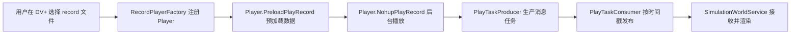
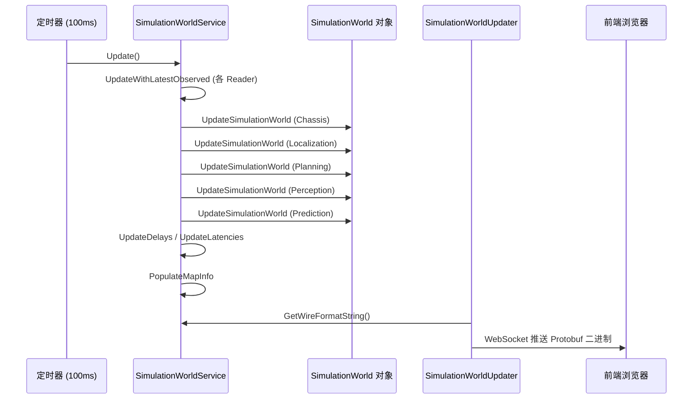

# 仿真与回放

## 概述

Apollo 自动驾驶系统提供了完整的仿真与数据回放能力，开发者无需实车即可完成算法验证、场景测试和问题复现。仿真体系由三个核心子系统构成：

- **Dreamview 仿真模式**：通过 SimControlManager 在浏览器可视化界面中模拟车辆运动，支持多种动力学模型
- **cyber_recorder 录制回放**：基于 Cyber RT 通信框架的数据录制与回放工具，以 `.record` 格式存储所有 channel 消息
- **SimulationWorld 服务**：将各模块实时数据聚合为统一的仿真世界状态，通过 WebSocket 推送给前端渲染

Apollo 的仿真支持两种主要模式：

| 模式 | 说明 | 适用场景 |
|------|------|----------|
| **WorldSim** | 纯虚拟仿真，车辆按规划轨迹在地图上运动 | 算法开发、场景构建 |
| **LogSim** | 回放实车采集数据，重新运行部分模块 | 问题复现、回归测试 |

## 仿真架构



## SimControlManager 仿真控制

### 核心组件

SimControlManager 是 Dreamview 仿真模式的核心管理器，位于：

```
modules/dreamview/backend/common/sim_control_manager/
├── common/
│   ├── sim_control_gflags.cc/h    # 仿真控制参数定义
│   ├── sim_control_util.cc/h      # 工具函数
│   └── interpolation_2d.cc/h      # 二维插值
├── core/
│   ├── sim_control_base.cc/h       # 抽象基类
│   ├── sim_control_with_model_base.cc/h  # 带动力学模型的基类
│   └── dynamic_model_factory.cc/h  # 动力学模型工厂
├── dynamic_model/
│   └── perfect_control/
│       ├── sim_perfect_control.cc/h  # 完美控制模型
│       └── sim_control_test.cc       # 单元测试
├── proto/
│   ├── dynamic_model_conf.proto   # 动力学模型配置定义
│   ├── fnn_model.proto            # FNN 模型定义
│   └── sim_control_internal.proto # 仿真控制内部消息定义
├── sim_control_manager.cc/h       # 管理器入口
```

### 动力学模型体系

SimControlManager 采用工厂模式管理多种车辆动力学模型：



### 完美控制模型（Perfect Control）

`SimPerfectControl` 是默认的仿真模型，假设车辆能完美执行规划轨迹。工作流程为：

1. 订阅 Planning 模块发布的 `ADCTrajectory`
2. 以 10ms 间隔执行 `RunOnce()`，在轨迹上用时间戳插值出当前位置
3. 发布模拟的 `LocalizationEstimate` 和 `Chassis` 消息
4. 以 100ms 间隔发布空的 `PredictionObstacles`（dummy prediction）

### 带动力学模型的仿真

`SimControlWithModelBase` 为基于物理动力学模型的仿真提供框架：

- 订阅 `ControlCommand` 作为输入（而非直接跟随 Planning 轨迹）
- 根据控制指令（油门、刹车、转向）通过动力学方程计算车辆状态
- 支持的模型包括 FNN（前馈神经网络）、EchoSim、Cascade 等

### 仿真控制参数

关键的 gflags 参数定义在 `sim_control_gflags.cc` 中：

```cpp
// 仿真模块名称
--sim_control_module_name=sim_control

// 默认动力学模型
--dynamic_model_name=perfect_control

// 动力学模型相关文件路径
--fnn_model_path=sim_control/conf/fnn_model.bin
--backward_fnn_model_path=sim_control/conf/fnn_model_backward.bin

// Cyber Reader 缓冲队列大小
--reader_pending_queue_size=10

// 是否在非自动驾驶模式下也启用仿真
--enable_sim_at_nonauto_mode=true

// EchoSim 模型仿真步长
--echosim_simulation_step=0.001
```

## cyber_recorder 录制与回放

`cyber_recorder` 是 Cyber RT 框架提供的命令行工具，支持对 channel 消息的录制、回放、查看、切分和修复。

### 源码结构

```
cyber/tools/cyber_recorder/
├── main.cc          # 命令行入口与参数解析
├── recorder.cc/h    # 录制功能：订阅 channel 并写入 .record 文件
├── player/
│   ├── player.cc/h          # 回放控制器
│   ├── play_param.h         # 回放参数结构体
│   ├── play_task.cc/h       # 回放任务定义
│   ├── play_task_producer.cc/h # 从 .record 文件读取消息生产任务
│   ├── play_task_consumer.cc/h # 消费任务并按时间戳发布消息
│   └── play_task_buffer.cc/h   # 生产者-消费者之间的任务缓冲
├── spliter.cc/h     # 按时间范围或 channel 切分 record 文件
├── recoverer.cc/h   # 修复损坏的 record 文件
└── info.cc/h        # 查看 record 文件的元信息
```

### 回放架构



### 命令详解

#### 录制数据

```bash
# 录制所有 channel
cyber_recorder record -a -o /data/bag/test.record

# 录制指定 channel
cyber_recorder record -c /apollo/localization/pose \
                      -c /apollo/perception/obstacles \
                      -c /apollo/planning \
                      -o /data/bag/test.record

# 排除指定 channel
cyber_recorder record -a -k /apollo/sensor/camera/front \
                      -o /data/bag/test.record

# 按时间分段录制（每 600 秒一个文件）
cyber_recorder record -a -i 600 -o /data/bag/test.record

# 按大小分段录制（每 2048 MB 一个文件）
cyber_recorder record -a -m 2048 -o /data/bag/test.record
```

录制参数说明：

| 参数 | 说明 |
|------|------|
| `-a` | 录制所有 channel |
| `-c <channel>` | 白名单：仅录制指定 channel（可多次指定） |
| `-k <channel>` | 黑名单：排除指定 channel（可多次指定） |
| `-o <file>` | 输出文件路径（默认使用时间戳命名） |
| `-i <seconds>` | 按时间间隔分段 |
| `-m <MB>` | 按文件大小分段 |

#### 回放数据

```bash
# 基本回放
cyber_recorder play -f /data/bag/test.record

# 多文件回放
cyber_recorder play -f test1.record test2.record test3.record

# 循环回放
cyber_recorder play -f test.record -l

# 调整回放速率（2 倍速）
cyber_recorder play -f test.record -r 2.0

# 从指定时间开始回放
cyber_recorder play -f test.record -b 2024-01-15-10:30:00

# 指定时间范围回放
cyber_recorder play -f test.record \
    -b 2024-01-15-10:30:00 \
    -e 2024-01-15-10:31:00

# 从第 30 秒开始回放
cyber_recorder play -f test.record -s 30

# 仅回放指定 channel
cyber_recorder play -f test.record \
    -c /apollo/localization/pose \
    -c /apollo/planning

# 延迟 5 秒开始回放
cyber_recorder play -f test.record -d 5

# 预加载 10 秒数据
cyber_recorder play -f test.record -p 10
```

回放参数说明：

| 参数 | 说明 | 默认值 |
|------|------|--------|
| `-f <file>` | 输入 record 文件（必需，支持多文件） | - |
| `-a` | 回放所有 channel | 是（当未指定 `-c` 时） |
| `-c <channel>` | 白名单：仅回放指定 channel | - |
| `-k <channel>` | 黑名单：排除指定 channel | - |
| `-l` | 循环回放 | 否 |
| `-r <rate>` | 回放速率倍数 | 1.0 |
| `-b <time>` | 开始时间（格式 `YYYY-MM-DD-HH:MM:SS`） | 文件起始 |
| `-e <time>` | 结束时间 | 文件结尾 |
| `-s <seconds>` | 跳过前 N 秒 | 0 |
| `-d <seconds>` | 延迟 N 秒开始 | 0 |
| `-p <seconds>` | 预加载时间 | 3 |

#### 查看 record 信息

```bash
cyber_recorder info /data/bag/test.record
```

输出示例：

```
record_file:    test.record
version:        1.0
duration:       120.5 s
begin_time:     2024-01-15 10:30:00
end_time:       2024-01-15 10:32:00
size:           1.2 GB
message_number: 156832
channel_number: 25

channel: /apollo/localization/pose         type: apollo.localization.LocalizationEstimate   count: 12050
channel: /apollo/planning                  type: apollo.planning.ADCTrajectory              count: 1205
channel: /apollo/perception/obstacles      type: apollo.perception.PerceptionObstacles      count: 1205
...
```

#### 切分 record 文件

```bash
# 按时间范围切分
cyber_recorder split -f test.record \
    -o test_clip.record \
    -b 2024-01-15-10:30:00 \
    -e 2024-01-15-10:31:00

# 按 channel 切分
cyber_recorder split -f test.record \
    -o planning_only.record \
    -c /apollo/planning
```

#### 修复损坏的 record 文件

```bash
cyber_recorder recover -f corrupted.record -o recovered.record
```

## Dreamview Plus 中的回放集成

Dreamview Plus（新版可视化平台）通过 `RecordPlayerFactory` 将 cyber_recorder 的回放功能集成到了 Web 界面中。

### RecordPlayerFactory

```
modules/dreamview_plus/backend/record_player/record_player_factory.h
```

`RecordPlayerFactory` 是一个单例工厂，管理多个 `Player` 实例：

- **注册回放**：`RegisterRecordPlayer(record_name, file_path)` 创建一个 Player 实例并注册
- **获取播放器**：`GetRecordPlayer(record_name)` 获取已注册的 Player
- **LRU 缓存**：预加载最多 3 个 record，最多保留 15 个已加载的 record，超出时移除最久未使用的
- **当前播放**：`SetCurrentRecord` / `GetCurrentRecord` 管理当前正在播放的 record

### 在 Dreamview Plus 中回放数据



## SimulationWorld 服务

`SimulationWorldService` 是 Dreamview 将所有模块数据汇聚为统一仿真世界视图的核心服务。

### 数据源订阅

SimulationWorldService 订阅以下 channel：

| Channel | 消息类型 | 数据来源 |
|---------|----------|----------|
| `/apollo/canbus/chassis` | `Chassis` | CAN 总线 / SimControl |
| `/apollo/localization/pose` | `LocalizationEstimate` | 定位模块 / SimControl |
| `/apollo/perception/obstacles` | `PerceptionObstacles` | 感知模块 |
| `/apollo/prediction` | `PredictionObstacles` | 预测模块 |
| `/apollo/planning` | `ADCTrajectory` | 规划模块 |
| `/apollo/control` | `ControlCommand` | 控制模块 |
| `/apollo/perception/traffic_light` | `TrafficLightDetection` | 交通灯检测 |
| `/apollo/monitor` | `MonitorMessage` | 系统监控 |

> **注意**：`/apollo/routing_response` 是 SimulationWorldService 的发布（Writer）channel，而非订阅。

### 数据更新与推送流程



## 场景配置（Scenario）

Apollo 的仿真场景通过 Protobuf 配置定义，支持 WorldSim 和 LogSim 两种模式。

### 场景配置示例

```protobuf
// modules/common_msgs/simulation_msgs/scenario.proto
message Scenario {
  optional string name = 1;
  optional string description = 2;

  // WorldSim 起终点
  optional Point start = 3;
  optional Point end = 4;

  // LogSim 数据源
  repeated string origin_log_file_path = 6;
  optional double log_file_start_time = 7;
  optional double log_file_end_time = 8;

  // 路由请求
  optional RoutingRequest routing_request = 9;

  // 仿真模式
  enum Mode {
    WORLDSIM = 0;        // 纯虚拟仿真
    LOGSIM = 1;          // 完整日志回放
    LOGSIM_CONTROL = 2;  // 回放到控制模块
    LOGSIM_PERCEPTION = 3; // 回放到感知模块
  }
  optional Mode mode = 25 [default = WORLDSIM];

  // 交通灯配置
  enum DefaultLightBehavior {
    ALWAYS_GREEN = 0;  // 常绿
    CYCLICAL = 1;      // 红绿灯循环
  }
  optional DefaultLightBehavior default_light_behavior = 20 [default = ALWAYS_GREEN];
  optional double red_time = 21 [default = 15.0];
  optional double green_time = 22 [default = 13.0];
  optional double yellow_time = 23 [default = 3.0];

  // 初始车速和加速度
  optional double start_velocity = 16 [default = 0.0];
  optional double start_acceleration = 17 [default = 0.0];

  // 场景最大运行时间（仅 WorldSim）
  optional int32 simulator_time = 15;
}
```

### 场景模式说明

| 模式 | 工作方式 |
|------|----------|
| `WORLDSIM` | SimPerfectControl 生成虚拟 Localization 和 Chassis，Planning 正常运行 |
| `LOGSIM` | 完整回放 record 文件中的所有模块数据 |
| `LOGSIM_CONTROL` | 回放感知和规划数据，Control 模块实时运行 |
| `LOGSIM_PERCEPTION` | 回放传感器原始数据，Perception 和后续模块实时运行 |

## Dreamview 配置文件

### Dreamview 经典版

配置文件路径：`modules/dreamview/conf/dreamview.conf`

```bash
--flagfile=/apollo/modules/common/data/global_flagfile.txt
```

启动文件：`modules/dreamview/launch/dreamview.launch`

### Dreamview Plus

配置文件路径：`modules/dreamview_plus/conf/dreamview.conf`

```bash
--flagfile=/apollo/modules/common/data/global_flagfile.txt
--static_file_dir=/apollo/modules/dreamview_plus/frontend/dist
--default_data_collection_config_path=/apollo/modules/dreamview_plus/conf/data_collection_table.pb.txt
--default_preprocess_config_path=/apollo/modules/dreamview_plus/conf/preprocess_table.pb.txt
--data_handler_config_path=/apollo/modules/dreamview_plus/conf/data_handler.conf
--vehicle_data_config_filename=/apollo/modules/dreamview_plus/conf/vehicle_data.pb.txt
--default_hmi_mode=Default
--server_ports=8888
```

启动文件：`modules/dreamview_plus/launch/dreamview_plus.launch`

## 典型操作流程

### WorldSim 仿真

```bash
# 1. 启动 Dreamview Plus
bash scripts/bootstrap.sh start_plus
# 或使用 cyber_launch
cyber_launch start modules/dreamview_plus/launch/dreamview_plus.launch

# 2. 在浏览器中打开 http://localhost:8888
# 3. 在 HMI 面板中选择仿真模式 (Sim Control)
# 4. 选择地图和车辆
# 5. 设置路由起终点
# 6. 启动自动驾驶模块（Planning, Prediction 等）
# 7. 点击 "Start" 开始仿真
```

### LogSim 回放

```bash
# 1. 启动 Dreamview Plus
cyber_launch start modules/dreamview_plus/launch/dreamview_plus.launch

# 2. 通过命令行回放 record 文件
cyber_recorder play -f /data/bag/2024-01-15/test.record -l

# 或者在 Dreamview Plus 界面中选择 record 文件进行回放

# 3. 可以同时启动特定模块进行在线处理
# 例如仅回放感知数据，让 Planning 实时运行：
cyber_recorder play -f test.record \
    -c /apollo/perception/obstacles \
    -c /apollo/localization/pose \
    -c /apollo/canbus/chassis
```

### 数据录制

```bash
# 在实车测试或仿真过程中录制数据
# 录制所有核心 channel，每 300 秒分段
cyber_recorder record -a \
    -k /apollo/sensor/camera/front/image \
    -k /apollo/sensor/lidar/compensator/PointCloud2 \
    -i 300 \
    -o /data/bag/$(date +%Y%m%d%H%M%S).record

# 录制完成后查看信息
cyber_recorder info /data/bag/*.record
```

## 动力学模型配置

动力学模型通过 `DynamicModelConf` protobuf 配置：

```protobuf
message DynamicModelConf {
    optional string dynamic_model_name = 1;  // 模型名称
    optional string library_name = 2;        // 动态库名称
    repeated string dynamic_model_files = 3; // 模型文件列表
    optional string depend_model_package = 4; // 依赖包
}
```

通过 Dreamview 的 HMI 接口可以动态加载、切换和卸载动力学模型，无需重启仿真。
