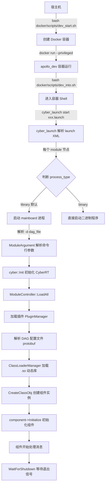
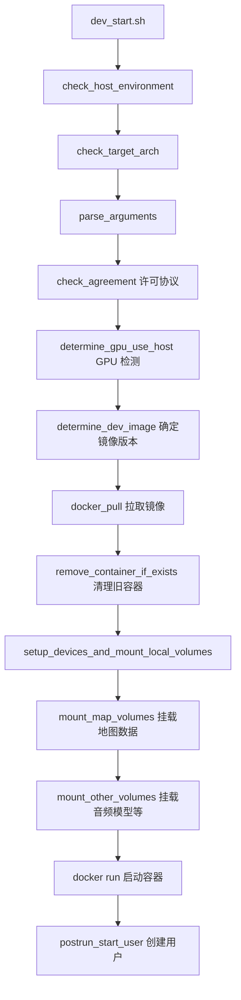
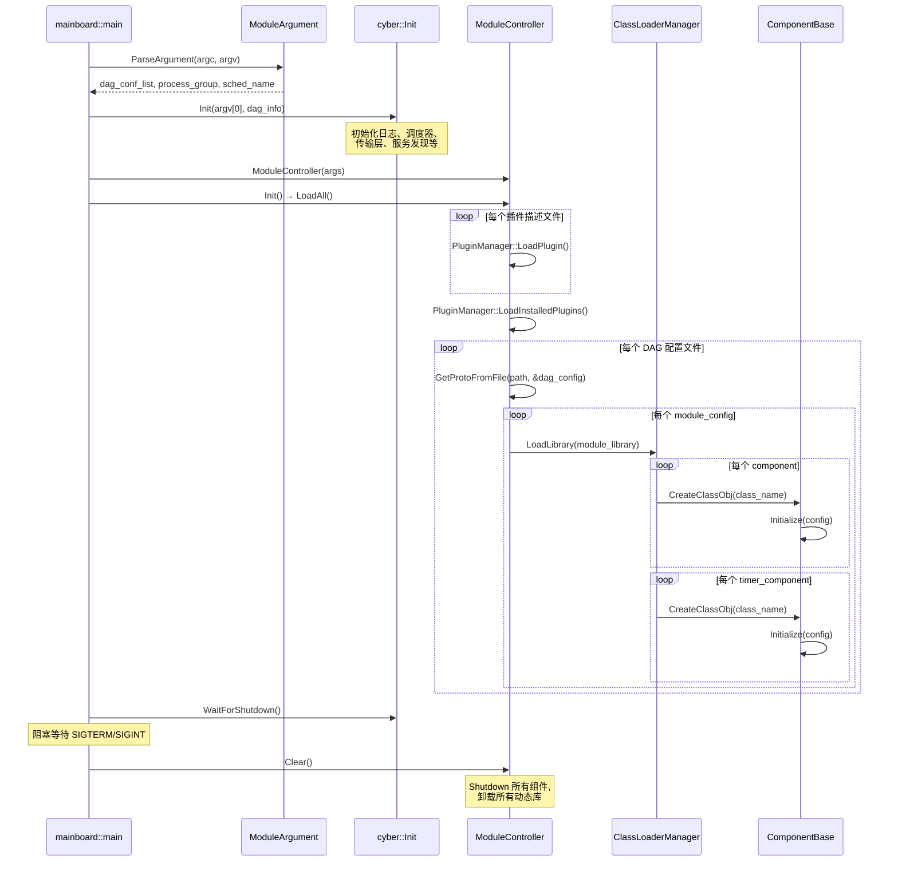
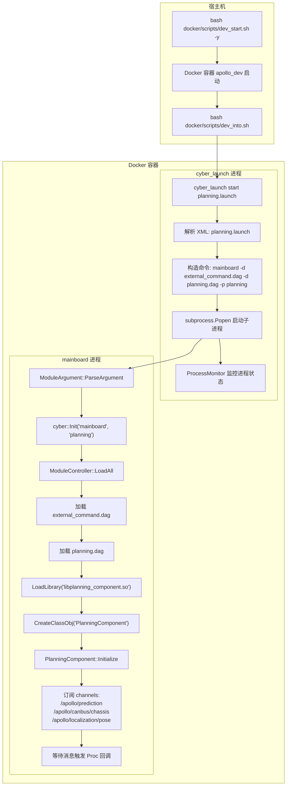
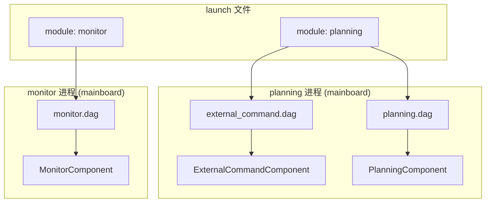

# Apollo 系统启动流程

## 概述

Apollo 自动驾驶系统的启动是一个多层级的过程，从宿主机的 Docker 容器创建，到容器内的 CyberRT 框架初始化，再到各功能模块的加载与运行。整个链路可以概括为：

1. 宿主机执行 `dev_start.sh` 创建并启动 Docker 开发容器
2. 用户通过 `dev_into.sh` 进入容器
3. 在容器内通过 `cyber_launch` 工具解析 `.launch` 文件
4. `cyber_launch` 为每个模块启动 `mainboard` 进程
5. `mainboard` 解析 `.dag` 配置文件，通过 ClassLoader 动态加载组件库并初始化组件

## 启动流程总览



## Docker 容器启动

### 启动脚本

Apollo 的 Docker 环境管理脚本位于 `docker/scripts/` 目录下：

| 脚本 | 用途 |
|------|------|
| `dev_start.sh` | 创建并启动开发容器 |
| `dev_into.sh` | 进入已运行的开发容器 |
| `docker_base.sh` | Docker 公共函数库（GPU 检测、容器管理等） |
| `runtime_start.sh` | 启动运行时容器（生产环境） |
| `cyber_start.sh` | 启动 Cyber 专用容器 |

### dev_start.sh 执行流程



`dev_start.sh` 的核心操作是执行 `docker run`，关键参数包括：

```bash
docker run -itd \
    --privileged \                              # 特权模式，访问硬件设备
    --name "apollo_dev_${USER}" \               # 容器名称
    -e NVIDIA_VISIBLE_DEVICES=all \             # GPU 透传
    -v $APOLLO_ROOT_DIR:/apollo \               # 挂载源码目录
    -v /dev:/dev \                              # 挂载设备目录
    --net host \                                # 使用宿主机网络
    -w /apollo \                                # 工作目录
    --shm-size "2G" \                           # 共享内存大小
    --pid=host \                                # 共享宿主机 PID 命名空间
    "${DEV_IMAGE}" \
    /bin/bash
```

### 容器内用户初始化

容器启动后，`docker_start_user.sh` 会被自动执行，完成以下操作：

- 创建与宿主机同名的用户账户（UID/GID 映射）
- 配置用户 bashrc 环境
- 设置 `/opt/apollo` 目录权限
- 授予设备访问权限（GPS、摄像头、IMU 等）
- 配置 core dump 路径

### 进入容器

```bash
bash docker/scripts/dev_into.sh
```

该脚本执行 `docker exec -it apollo_dev_${USER} /bin/bash`，进入已运行的容器。

## cyber_launch 启动工具

`cyber_launch` 是 Apollo 的模块启动入口，位于 `cyber/tools/cyber_launch/cyber_launch.py`。它负责解析 `.launch` XML 文件，并为每个模块创建对应的进程。

### 使用方式

```bash
# 启动模块
cyber_launch start /apollo/modules/planning/planning_component/launch/planning.launch

# 停止模块
cyber_launch stop /apollo/modules/planning/planning_component/launch/planning.launch

# 通过便捷脚本启动（内部调用 cyber_launch）
bash scripts/planning.sh start
```

### launch 文件格式

launch 文件是 XML 格式，根元素为 `<cyber>`，包含一个或多个 `<module>` 子元素。

#### 基本结构

```xml
<cyber>
    <module>
        <name>模块名称</name>
        <dag_conf>DAG 配置文件路径</dag_conf>
        <process_name>进程名称</process_name>
    </module>
</cyber>
```

#### 完整字段说明

| 字段 | 必填 | 说明 |
|------|------|------|
| `name` | 是 | 模块名称，用于日志标识 |
| `dag_conf` | 是* | DAG 配置文件路径，可指定多个。`type=binary` 时可为空 |
| `process_name` | 否 | 进程名称/进程组。`type=binary` 时为可执行命令 |
| `type` | 否 | 进程类型：`library`（默认）或 `binary` |
| `sched_name` | 否 | 调度策略名称，默认 `CYBER_DEFAULT` |
| `exception_handler` | 否 | 异常处理策略：`respawn`（自动重启）或 `exit`（退出所有） |
| `respawn_limit` | 否 | 自动重启次数上限，默认 3 |
| `plugin` | 否 | 插件描述文件路径 |
| `cpuprofile` | 否 | CPU 性能分析输出文件 |
| `memprofile` | 否 | 内存性能分析输出文件 |
| `nice` | 否 | 进程优先级调整值 |

#### 示例：标准模块（library 类型）

```xml
<!-- canbus.launch -->
<cyber>
    <module>
        <name>canbus</name>
        <dag_conf>/apollo/modules/canbus/dag/canbus.dag</dag_conf>
        <process_name>canbus</process_name>
    </module>
</cyber>
```

#### 示例：多 DAG 模块

一个 launch 文件中的同一个 module 可以加载多个 DAG 文件，它们共享同一个进程：

```xml
<!-- planning.launch -->
<cyber>
    <module>
        <name>planning</name>
        <dag_conf>/apollo/modules/external_command/process_component/dag/external_command_process.dag</dag_conf>
        <dag_conf>/apollo/modules/planning/planning_component/dag/planning.dag</dag_conf>
        <process_name>planning</process_name>
    </module>
</cyber>
```

#### 示例：二进制类型模块

```xml
<!-- dreamview_plus.launch -->
<cyber>
    <module>
        <name>dreamview_plus</name>
        <dag_conf></dag_conf>
        <type>binary</type>
        <process_name>
            dreamview_plus --flagfile=/apollo/modules/dreamview_plus/conf/dreamview.conf
        </process_name>
        <exception_handler>respawn</exception_handler>
    </module>
</cyber>
```

#### 示例：感知模块（多 DAG 复杂配置）

```xml
<!-- perception_all.launch -->
<cyber>
    <module>
        <name>perception</name>
        <process_name>perception</process_name>
        <!-- camera front -->
        <dag_conf>/apollo/modules/perception/camera_detection_multi_stage/dag/camera_detection_multi_stage_front.dag</dag_conf>
        <dag_conf>/apollo/modules/perception/camera_tracking/dag/camera_tracking_front.dag</dag_conf>
        <!-- lidar -->
        <dag_conf>/apollo/modules/perception/pointcloud_preprocess/dag/pointcloud_preprocess.dag</dag_conf>
        <dag_conf>/apollo/modules/perception/lidar_detection/dag/lidar_detection.dag</dag_conf>
        <dag_conf>/apollo/modules/perception/lidar_tracking/dag/lidar_tracking.dag</dag_conf>
        <!-- radar -->
        <dag_conf>/apollo/modules/perception/radar_detection/dag/radar_detection_front.dag</dag_conf>
        <!-- fusion -->
        <dag_conf>/apollo/modules/perception/multi_sensor_fusion/dag/multi_sensor_fusion.dag</dag_conf>
    </module>
</cyber>
```

### cyber_launch 处理逻辑

`cyber_launch` 解析 launch XML 后，对每个 `<module>` 节点：

1. 读取 `type` 字段判断进程类型
2. 若为 `library`（默认），构造 mainboard 命令：
   ```bash
   mainboard -d dag1.dag -d dag2.dag -p process_name -s sched_name
   ```
3. 若为 `binary`，直接执行 `process_name` 中指定的命令
4. 通过 `ProcessMonitor` 监控所有子进程的生命周期
5. 支持 `respawn` 异常处理：进程异常退出时自动重启（上限可配置）

## mainboard 核心流程

`mainboard` 是 CyberRT 框架的组件宿主进程，位于 `cyber/mainboard/`。它是所有 library 类型模块的统一入口。

### 源码结构

```
cyber/mainboard/
├── mainboard.cc           # main 函数入口
├── module_argument.h/cc   # 命令行参数解析
├── module_controller.h/cc # 模块加载控制器
└── BUILD                  # Bazel 构建文件
```

### mainboard 启动序列



### 命令行参数

```
mainboard [OPTION]...

选项：
  -h, --help                    帮助信息
  -d, --dag_conf=CONFIG_FILE    DAG 配置文件路径（可多次指定）
  -p, --process_group=NAME      进程组名称
  -s, --sched_name=NAME         调度策略名称
  --plugin=FILE                 插件描述文件路径
  --disable_plugin_autoload     禁用插件自动加载
  -c, --cpuprofile              启用 CPU 性能分析
  -o, --profile_filename=FILE   CPU 分析输出文件
  -H, --heapprofile             启用堆内存分析
  -O, --heapprofile_filename=FILE 堆分析输出文件

示例：
  mainboard -d /apollo/modules/planning/planning_component/dag/planning.dag -p planning
  mainboard -d dag1.dag -d dag2.dag -p perception -s CYBER_DEFAULT
```

## DAG 配置文件

DAG（Directed Acyclic Graph）配置文件定义了模块的组件拓扑结构，使用 protobuf 文本格式。

### Proto 定义

DAG 配置的 protobuf schema 定义在 `cyber/proto/dag_conf.proto`：

```protobuf
// dag_conf.proto
message DagConfig {
  repeated ModuleConfig module_config = 1;
}

message ModuleConfig {
  optional string module_library = 1;           // 动态库路径
  repeated ComponentInfo components = 2;         // 普通组件列表
  repeated TimerComponentInfo timer_components = 3; // 定时器组件列表
}

message ComponentInfo {
  optional string class_name = 1;               // 组件类名
  optional ComponentConfig config = 2;           // 组件配置
}

message TimerComponentInfo {
  optional string class_name = 1;               // 组件类名
  optional TimerComponentConfig config = 2;      // 定时器组件配置
}
```

组件配置定义在 `cyber/proto/component_conf.proto`：

```protobuf
// component_conf.proto
message ComponentConfig {
  optional string name = 1;                     // 组件名称
  optional string config_file_path = 2;         // protobuf 配置文件路径
  optional string flag_file_path = 3;           // gflags 配置文件路径
  repeated ReaderOption readers = 4;            // 输入 channel 配置
}

message TimerComponentConfig {
  optional string name = 1;
  optional string config_file_path = 2;
  optional string flag_file_path = 3;
  optional uint32 interval = 4;                 // 定时触发间隔（毫秒）
}

message ReaderOption {
  optional string channel = 1;                  // channel 名称
  optional QosProfile qos_profile = 2;          // QoS 配置
  optional uint32 pending_queue_size = 3;       // 待处理队列大小，默认 1
}
```

### 两种组件类型

Apollo 中有两种组件类型，对应不同的触发机制：

#### Component（消息驱动型）

当订阅的 channel 收到消息时触发 `Proc()` 回调。适用于需要响应外部输入的模块。

```protobuf
# routing.dag - 消息驱动组件示例
module_config {
    module_library : "modules/routing/librouting_component.so"
    components {
        class_name : "RoutingComponent"
        config {
            name : "routing"
            config_file_path: "/apollo/modules/routing/conf/routing_config.pb.txt"
            flag_file_path: "/apollo/modules/routing/conf/routing.conf"
            readers: [
                {
                    channel: "/apollo/raw_routing_request"
                    qos_profile: {
                        depth : 10
                    }
                }
            ]
        }
    }
}
```

#### TimerComponent（定时驱动型）

按固定时间间隔触发 `Proc()` 回调。适用于需要周期性执行的模块。

```protobuf
# canbus.dag - 定时器组件示例
module_config {
    module_library : "modules/canbus/libcanbus_component.so"
    timer_components {
        class_name : "CanbusComponent"
        config {
            name: "canbus"
            config_file_path: "/apollo/modules/canbus/conf/canbus_conf.pb.txt"
            flag_file_path: "/apollo/modules/canbus/conf/canbus.conf"
            interval: 10    # 每 10ms 触发一次
        }
    }
}
```

### DAG 加载机制详解

`ModuleController::LoadAll()` 的加载过程：

1. 加载插件：遍历命令行指定的插件描述文件，调用 `PluginManager::LoadPlugin()`；若未禁用自动加载，还会调用 `LoadInstalledPlugins()`
2. 解析 DAG 路径：通过 `APOLLO_DAG_PATH` 环境变量搜索 DAG 文件的实际路径
3. 统计组件数量：预先遍历所有 DAG 文件，统计 component 和 timer_component 总数，用于调度器资源分配
4. 逐个加载 DAG：对每个 DAG 文件调用 `LoadModule(path)`

`ModuleController::LoadModule()` 的处理过程：

1. 使用 `GetProtoFromFile()` 将 DAG 文件反序列化为 `DagConfig` protobuf 对象
2. 遍历 `module_config` 列表：
   - 通过 `APOLLO_LIB_PATH` 环境变量定位 `module_library` 指定的 `.so` 动态库
   - 调用 `ClassLoaderManager::LoadLibrary()` 加载动态库
   - 遍历 `components`，使用 `CreateClassObj<ComponentBase>(class_name)` 创建组件实例
   - 调用 `component->Initialize(config)` 初始化组件（注册 Reader、Writer、定时器等）
   - 将组件实例存入 `component_list_` 保持生命周期

## 完整启动链路

以启动 Planning 模块为例，展示从 Docker 到���件运行的完整链路：



### 典型操作步骤

```bash
# 1. 启动 Docker 开发容器（宿主机执行）
cd /apollo
bash docker/scripts/dev_start.sh

# 2. 进入容器
bash docker/scripts/dev_into.sh

# 3. 启动 DreamView Plus（可视化界面）
cyber_launch start /apollo/modules/dreamview_plus/launch/dreamview_plus.launch

# 4. 启动各功能模块（可通过 DreamView 界面操作，或手动执行）
cyber_launch start /apollo/modules/localization/launch/rtk_localization.launch
cyber_launch start /apollo/modules/canbus/launch/canbus.launch
cyber_launch start /apollo/modules/control/control_component/launch/control.launch
cyber_launch start /apollo/modules/planning/planning_component/launch/planning.launch
cyber_launch start /apollo/modules/prediction/launch/prediction.launch
cyber_launch start /apollo/modules/routing/launch/routing.launch
cyber_launch start /apollo/modules/perception/launch/perception_all.launch

# 5. 使用便捷脚本（等效方式）
bash scripts/dreamview_plus.sh start
bash scripts/planning.sh start

# 6. 停止模块
cyber_launch stop /apollo/modules/planning/planning_component/launch/planning.launch
```

## 模块目录结构约定

每个 Apollo 功能模块遵循统一的目录结构：

```
modules/<module_name>/
├── conf/                    # 配置文件
│   ├── <module>.conf        # gflags 配置
│   └── <module>_conf.pb.txt # protobuf 配置
├── dag/                     # DAG 配置文件
│   └── <module>.dag
├── launch/                  # Launch 启动文件
│   └── <module>.launch
├── proto/                   # protobuf 消息定义
├── lib<module>_component.so # 编译产物（动态库）
└── ...                      # 源码文件
```

## 环境变量

mainboard 在加载过程中依赖以下环境变量：

| 环境变量 | 说明 |
|----------|------|
| `APOLLO_DAG_PATH` | DAG 文件搜索路径 |
| `APOLLO_LIB_PATH` | 动态库搜索路径 |
| `APOLLO_LAUNCH_PATH` | launch 文件默认搜索路径，默认 `/apollo` |
| `APOLLO_ENV_WORKROOT` | 工作根目录，默认 `/apollo` |

## 进程与组件的关系

理解 Apollo 中进程和组件的关系对调试和性能优化很重要：

- 一个 `launch` 文件可以定义多个 `module`，每个 module 对应一个独立进程
- 一个 `module`（进程）可以加载多个 `dag` 文件
- 一个 `dag` 文件可以包含多个 `module_config`
- 一个 `module_config` 对应一个动态库（`.so`），可包含多个组件
- 同一进程内的组件共享地址空间，通过共享内存或进程内通信高效交换数据


