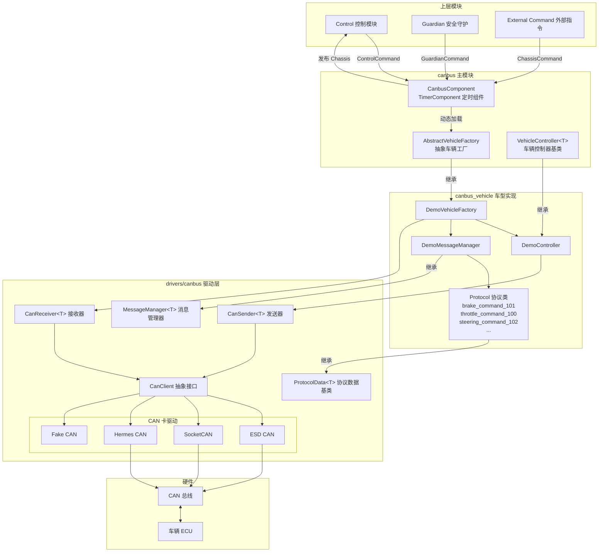
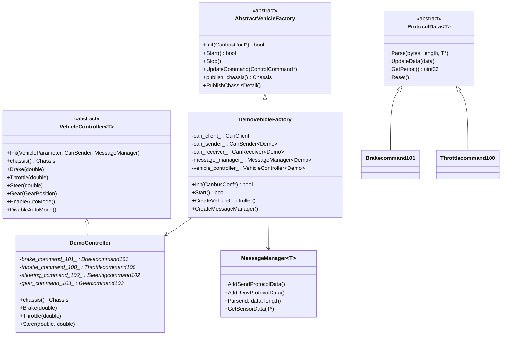
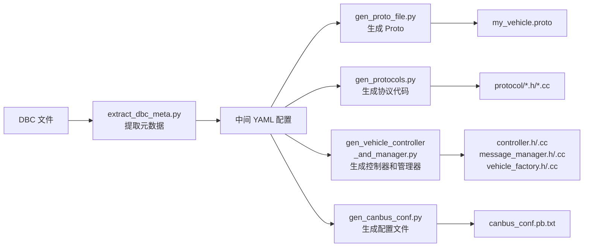
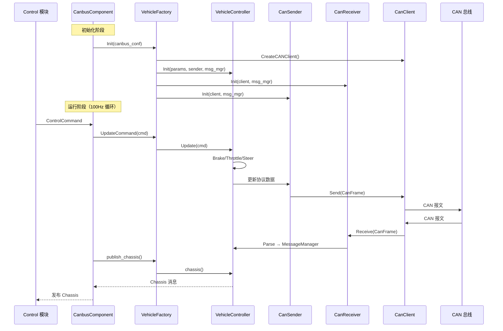

# Apollo 车辆适配层技术文档

## 概述

Apollo 自动驾驶系统通过 CAN 总线（Controller Area Network）与车辆底盘进行通信。车辆适配层是连接上层控制决策与底层车辆执行器之间的桥梁，负责将控制指令（油门、刹车、转向等）编码为 CAN 报文发送给车辆 ECU，同时接收车辆状态反馈并解析为系统可用的 Chassis 数据。

Apollo 目前已适配的车型包括：Lincoln MKZ、GEM、Lexus、Transit、GE3、WEY、中云（Zhongyun）、CH、DevKit、Neolix 等。系统提供了完整的代码生成工具链，支持基于 DBC 文件自动生成车辆协议代码，大幅降低新车型适配的工作量。

## 架构总览

车辆适配层由三个核心模块组成：

- `modules/canbus/` — CAN 总线主模块，包含组件入口、抽象工厂接口和车辆控制器基类
- `modules/canbus_vehicle/` — 各车型的具体实现（协议解析、控制器、消息管理器）
- `modules/drivers/canbus/` — CAN 总线驱动层，提供硬件抽象（CAN 卡客户端、收发器、协议数据基类）



## 核心组件详解

### 1. CanbusComponent — 模块入口

`CanbusComponent` 继承自 `cyber::TimerComponent`，以固定频率（默认 100Hz）运行。它是整个 CAN 总线模块的入口点。

核心职责：

- 加载车辆工厂动态库（通过 `ClassLoader` 动态加载 `.so` 文件）
- 订阅 `ControlCommand`、`GuardianCommand`、`ChassisCommand` 话题
- 定时调用车辆工厂发布 `Chassis` 状态
- 处理控制指令超时和通信故障

关键配置参数（`canbus.conf`）：

```bash
--canbus_conf_file=/apollo/modules/canbus/conf/canbus_conf.pb.txt
--load_vehicle_library=/opt/apollo/neo/lib/modules/canbus_vehicle/lincoln/liblincoln_vehicle_factory_lib.so
--load_vehicle_class_name=LincolnVehicleFactory
--chassis_debug_mode=false
--estop_brake=30.0
```

其中 `load_vehicle_library` 和 `load_vehicle_class_name` 决定了加载哪个车型的实现。

### 2. AbstractVehicleFactory — 抽象车辆工厂

抽象工厂定义了所有车型实现必须遵循的接口：

```cpp
class AbstractVehicleFactory {
 public:
  virtual bool Init(const CanbusConf *canbus_conf) = 0;
  virtual bool Start() = 0;
  virtual void Stop() = 0;
  virtual void UpdateCommand(const ControlCommand *control_command) = 0;
  virtual void UpdateCommand(const ChassisCommand *chassis_command) = 0;
  virtual Chassis publish_chassis() = 0;
  virtual void PublishChassisDetail() = 0;
};
```

每个车型通过 `CYBER_REGISTER_VEHICLEFACTORY(ClassName)` 宏注册到 Cyber 的类加载器中，使得 `CanbusComponent` 可以在运行时动态实例化对应的工厂。

### 3. VehicleController — 车辆控制器模板基类

`VehicleController<SensorType>` 是一个模板类，`SensorType` 对应车型的 Protobuf 消息类型（如 `Demo`、`Ch`）。它定义了控制车辆的核心接口：

```cpp
template <typename SensorType>
class VehicleController {
 public:
  virtual ErrorCode Init(const VehicleParameter &params,
                         CanSender<SensorType> *can_sender,
                         MessageManager<SensorType> *message_manager) = 0;
  virtual Chassis chassis() = 0;

  // 驾驶模式切换
  virtual ErrorCode EnableAutoMode() = 0;
  virtual ErrorCode DisableAutoMode() = 0;

  // 执行器控制
  virtual void Brake(double acceleration) = 0;
  virtual void Throttle(double throttle) = 0;
  virtual void Steer(double angle) = 0;
  virtual void Gear(Chassis::GearPosition state) = 0;
};
```

## CAN 总线驱动层

### CanClient — 硬件抽象

`CanClient` 是 CAN 卡的抽象接口，屏蔽了不同硬件的差异。Apollo 支持以下 CAN 卡类型：

| CAN 卡类型 | 类名 | 说明 |
|---|---|---|
| ESD CAN | `EsdCanClient` | ESD 公司的 PCI/PCIe CAN 卡 |
| SocketCAN | `SocketCanClientRaw` | Linux 内核原生 SocketCAN 接口 |
| Hermes CAN | `HermesCanClient` | Hermes CAN 卡 |
| Fake CAN | `FakeCanClient` | 仿真测试用虚拟 CAN |

`CanClientFactory` 使用工厂模式根据配置创建对应的 CAN 客户端：

```protobuf
// canbus_conf.pb.txt 中的 CAN 卡配置
can_card_parameter {
  brand: SOCKET_CAN_RAW   // 或 ESD_CAN, HERMES_CAN, FAKE_CAN
  type: PCI_CARD
  channel_id: CHANNEL_ID_ZERO
  num_ports: 8
  interface: NATIVE
}
```

### CanSender / CanReceiver — 收发器

- `CanSender<T>` 管理所有待发送的 CAN 报文，按各协议定义的周期（如 20ms）循环发送
- `CanReceiver<T>` 在独立线程中持续接收 CAN 报文，通过 `MessageManager` 分发给对应的协议解析类

### ProtocolData — 协议数据基类

每条 CAN 报文对应一个 `ProtocolData<T>` 子类，负责：

- `Parse()` — 从原始字节解析信号值到 Protobuf 结构
- `UpdateData()` — 将控制值编码为 CAN 报文字节
- `GetPeriod()` — 返回发送周期（微秒）
- `Reset()` — 重置所有信号为默认值

### MessageManager — 消息管理器

`MessageManager<T>` 维护所有协议的注册表，区分发送协议和接收协议：

```cpp
// 在 MessageManager 构造函数中注册协议
AddSendProtocolData<Brakecommand101, true>();    // 发送协议（控制指令）
AddRecvProtocolData<Brakereport501, true>();      // 接收协议（状态反馈）
```

## DBC 文件详解

### 什么是 DBC 文件

DBC（Database CAN）文件是 CAN 通信的标准数据库描述文件，由 Vector 公司定义。它完整描述了 CAN 网络中所有报文和信号的定义，是车辆适配的核心输入。

### DBC 文件结构

以 Apollo 提供的 `apollo_demo.dbc` 为例，DBC 文件包含以下关键部分：

**1. 网络节点定义（BU_）**

```dbc
BU_: ACU VCU
```

定义 CAN 网络中的 ECU 节点。`ACU` 通常代表自动驾驶控制单元，`VCU` 代表车辆控制单元。

**2. 报文定义（BO_）**

```dbc
BO_ 256 Throttle_Command: 8 ACU
 SG_ Throttle_Pedal_Target : 31|16@0+ (0.1,0) [0|100] "%" Vector__XXX
 SG_ Throttle_Acc : 15|10@0+ (0.01,0) [0|10] "m/s^2" Vector__XXX
 SG_ Speed_Target : 23|16@0+ (0.01,0) [0|40.95] "m/s" Vector__XXX
 SG_ Throttle_EN_CTRL : 0|1@1+ (1,0) [0|1] "" Vector__XXX
 SG_ Heartbeat_100 : 7|4@0+ (1,0) [0|15] "" Vector__XXX
 SG_ CheckSum_100 : 63|8@0+ (1,0) [0|255] "" Vector__XXX
```

各字段含义：

| 字段 | 说明 |
|---|---|
| `256` | 报文 ID（十进制），即 0x100 |
| `Throttle_Command` | 报文名称 |
| `8` | 数据长度（字节） |
| `ACU` | 发送节点 |

**3. 信号定义（SG_）**

```
SG_ Brake_Dec : 15|10@0+ (0.01,0) [0|10] "m/s^2" Vector__XXX
```

| 字段 | 含义 |
|---|---|
| `Brake_Dec` | 信号名称 |
| `15` | 起始位（bit） |
| `10` | 信号长度（bit） |
| `@0+` | 字节序（0=Motorola/大端, 1=Intel/小端）和符号（+=无符号） |
| `(0.01,0)` | (精度, 偏移量)，物理值 = 原始值 × 0.01 + 0 |
| `[0\|10]` | 物理值范围 |
| `"m/s^2"` | 单位 |

**4. 值描述（VAL_）**

```dbc
VAL_ 259 Gear_Target 4 "DRIVE" 3 "NEUTRAL" 2 "REVERSE" 1 "PARK" 0 "INVALID";
```

为枚举类型信号定义各值的含义。

### 报文分类

DBC 中的报文按功能分为两类：

```mermaid
graph LR
    subgraph 控制报文 ACU→VCU
        TC[Throttle_Command 0x100]
        BC[Brake_Command 0x101]
        SC[Steering_Command 0x102]
        GC[Gear_Command 0x103]
        PC[Park_Command 0x104]
        VMC[Vehicle_Mode_Command 0x105]
    end

    subgraph 反馈报文 VCU→ACU
        TR[Throttle_Report 0x500]
        BR[Brake_Report 0x501]
        SR[Steering_Report 0x502]
        GR[Gear_Report 0x503]
        VR[VCU_Report 0x505]
        WR[Wheelspeed_Report 0x506]
    end

    ACU[自动驾驶控制单元] --> TC & BC & SC & GC & PC & VMC
    TC & BC & SC & GC & PC & VMC --> VCU[车辆控制单元]
    VCU --> TR & BR & SR & GR & VR & WR
    TR & BR & SR & GR & VR & WR --> ACU
```

## 车型实现结构

每个车型在 `modules/canbus_vehicle/<车型名>/` 下包含以下文件：

```
modules/canbus_vehicle/demo/
├── BUILD                          # Bazel 构建文件
├── cyberfile.xml                  # Cyber 包描述
├── demo_vehicle_factory.h/.cc     # 车辆工厂实现
├── demo_controller.h/.cc          # 车辆控制器实现
├── demo_message_manager.h/.cc     # 消息管理器（注册所有协议）
├── proto/
│   ├── BUILD
│   └── demo.proto                 # 车型专属 Protobuf 定义
├── protocol/
│   ├── brake_command_101.h/.cc    # 控制协议：刹车指令
│   ├── throttle_command_100.h/.cc # 控制协议：油门指令
│   ├── steering_command_102.h/.cc # 控制协议：转向指令
│   ├── gear_command_103.h/.cc     # 控制协议：档位指令
│   ├── brake_report_501.h/.cc     # 反馈协议：刹车状态
│   ├── throttle_report_500.h/.cc  # 反馈协议：油门状态
│   ├── steering_report_502.h/.cc  # 反馈协议：转向状态
│   └── ...                        # 其他协议
└── testdata/
    └── demo_canbus_conf_test.pb.txt
```

### 各组件关系



## 适配新车型完整步骤

### 前置条件

1. 获取目标车辆的 DBC 文件（由车辆线控供应商提供）
2. 确认车辆支持线控（drive-by-wire），至少包含油门、刹车、转向的电子控制
3. 确认 CAN 卡硬件已安装并可正常工作

### 步骤一：准备 DBC 文件

将车辆 DBC 文件放置到工作目录中。如果没有现成的 DBC 文件，可以参考 `modules/tools/gen_vehicle_protocol/apollo_demo.dbc` 的格式手动编写。

DBC 文件至少需要包含以下控制报文：

- 油门控制（Throttle Command）
- 刹车控制（Brake Command）
- 转向控制（Steering Command）
- 档位控制（Gear Command）

以及对应的反馈报文。

### 步骤二：编写代码生成配置文件

创建 YAML 配置文件（参考 `lincoln_conf.yml`）：

```yaml
# DBC 文件路径（容器内绝对路径）
dbc_file: /apollo_workspace/output/my_vehicle.dbc
# 中间 YAML 配置输出路径
protocol_conf: /apollo_workspace/output/my_vehicle.yml
# 车型名称（小写，用于目录和类名生成）
car_type: my_vehicle
# 控制报文协议列表，一般为空
sender_list: []
# 自动驾驶模块在 DBC 中的 ECU 节点名称
sender: ACU
# 不需要生成的信号 ID 列表
black_list: []
# 是否基于 apollo_demo.dbc 模板生成
use_demo_dbc: false

# 生成代码的输出目录
output_dir: /apollo_workspace/modules/canbus_vehicle
# canbus 配置文件输出目录
output_canbus_conf_dir: /apollo_workspace/output
```

### 步骤三：运行代码生成工具

```bash
cd /apollo
python modules/tools/gen_vehicle_protocol/gen.py my_vehicle_conf.yml
```

该工具会自动执行以下操作：



生成的文件结构：

```
modules/canbus_vehicle/my_vehicle/
├── BUILD
├── cyberfile.xml
├── my_vehicle_vehicle_factory.h/.cc
├── my_vehicle_controller.h/.cc
├── my_vehicle_message_manager.h/.cc
├── proto/
│   ├── BUILD
│   └── my_vehicle.proto
└── protocol/
    ├── throttle_command_xxx.h/.cc
    ├── brake_command_xxx.h/.cc
    ├── steering_command_xxx.h/.cc
    └── ...
```

### 步骤四：手动调整生成代码

自动生成的代码通常需要以下手动调整：

**1. 协议周期（GetPeriod）**

```cpp
// 根据车辆实际要求调整发送周期
uint32_t Brakecommand101::GetPeriod() const {
  static const uint32_t PERIOD = 20 * 1000;  // 20ms，单位微秒
  return PERIOD;
}
```

**2. 心跳和校验和（UpdateData_Heartbeat）**

```cpp
void Brakecommand101::UpdateData_Heartbeat(uint8_t* data) {
  ++heartbeat_101_;
  heartbeat_101_ = heartbeat_101_ % 16;  // 4bit 循环计数
  set_p_heartbeat_101(data, heartbeat_101_);
  // 校验和算法需要根据车辆协议文档实现
  checksum_101_ = data[0] ^ data[1] ^ data[2] ^ data[3]
                ^ data[4] ^ data[5] ^ data[6];
  set_p_checksum_101(data, checksum_101_);
}
```

**3. 控制器中的驾驶模式切换逻辑**

`EnableAutoMode()` 和 `DisableAutoMode()` 需要根据车辆的实际使能流程实现。

**4. chassis() 方法中的状态映射**

将车辆反馈的原始信号映射到 Apollo 标准的 `Chassis` 消息。

### 步骤五：注册车型品牌

在 `modules/common_msgs/config_msgs/vehicle_config.proto` 中添加新的品牌枚举：

```protobuf
enum VehicleBrand {
  LINCOLN_MKZ = 0;
  GEM = 1;
  LEXUS = 2;
  // ...
  MY_VEHICLE = 10;  // 新增
}
```

### 步骤六：编译车型动态库

```bash
# 编译车型适配模块
bazel build //modules/canbus_vehicle/my_vehicle:libmy_vehicle_vehicle_factory_lib.so
```

### 步骤七：配置 CAN 总线参数

修改 `modules/canbus/conf/canbus_conf.pb.txt`：

```protobuf
vehicle_parameter {
  brand: MY_VEHICLE
  max_enable_fail_attempt: 5
  driving_mode: COMPLETE_AUTO_DRIVE
}

can_card_parameter {
  brand: SOCKET_CAN_RAW
  type: PCI_CARD
  channel_id: CHANNEL_ID_ZERO
}

enable_debug_mode: false
enable_receiver_log: false
enable_sender_log: false
```

修改 `modules/canbus/conf/canbus.conf`，指向新车型的动态库：

```bash
--load_vehicle_library=/opt/apollo/neo/lib/modules/canbus_vehicle/my_vehicle/libmy_vehicle_vehicle_factory_lib.so
--load_vehicle_class_name=MyVehicleVehicleFactory
```

### 步骤八：配置车辆物理参数

在车辆配置文件中设置物理参数：

```protobuf
vehicle_param {
  brand: MY_VEHICLE
  front_edge_to_center: 3.89
  back_edge_to_center: 1.04
  left_edge_to_center: 1.055
  right_edge_to_center: 1.055
  length: 4.933
  width: 2.11
  height: 1.48
  min_turn_radius: 5.05
  max_acceleration: 2.0
  max_deceleration: -6.0
  max_steer_angle: 8.20
  max_steer_angle_rate: 8.55
  steer_ratio: 16.0
  wheel_base: 2.8448
  wheel_rolling_radius: 0.335
  max_abs_speed_when_stopped: 0.2
  brake_deadzone: 15.5
  throttle_deadzone: 18.0
}
```

### 步骤九：启动与测试

```bash
# 启动 canbus 模块
cyber_launch start modules/canbus/launch/canbus.launch

# 使用 canbus_tester 工具测试
# 可以发送测试控制指令验证车辆响应
```

## 数据流详解



## 协议代码解析示例

以 `Brakecommand101`（刹车控制报文 0x101）为例，说明协议代码的工作原理。

### 信号编码（发送方向）

```cpp
// 设置刹车踏板目标值
// DBC 定义：bit=31, len=16, motorola, precision=0.1, range=[0|100], unit=%
void Brakecommand101::set_p_brake_pedal_target(uint8_t* data,
                                                double brake_pedal_target) {
  brake_pedal_target = ProtocolData::BoundedValue(0.0, 100.0, brake_pedal_target);
  int x = static_cast<int>(brake_pedal_target / 0.100000);  // 物理值 → 原始值
  uint8_t t = 0;

  // 按 Motorola 字节序写入 data[3] 和 data[4]
  t = static_cast<uint8_t>(x & 0xFF);
  Byte to_set0(data + 4);
  to_set0.set_value(t, 0, 8);
  x >>= 8;

  t = static_cast<uint8_t>(x & 0xFF);
  Byte to_set1(data + 3);
  to_set1.set_value(t, 0, 8);
}
```

### 信号解码（接收方向）

```cpp
// 解析刹车减速度
// DBC 定义：bit=15, len=10, motorola, precision=0.01, unit=m/s^2
double Brakecommand101::brake_dec(const std::uint8_t* bytes,
                                   int32_t length) const {
  Byte t0(bytes + 1);
  int32_t x = t0.get_byte(0, 8);

  Byte t1(bytes + 2);
  int32_t t = t1.get_byte(6, 2);
  x <<= 2;
  x |= t;

  double ret = x * 0.010000;  // 原始值 × 精度 = 物理值
  return ret;
}
```

## 配置参考

### canbus.dag — DAG 配置

```
module_config {
    module_library : "modules/canbus/libcanbus_component.so"
    timer_components {
        class_name : "CanbusComponent"
        config {
            name: "canbus"
            config_file_path: "/apollo/modules/canbus/conf/canbus_conf.pb.txt"
            flag_file_path: "/apollo/modules/canbus/conf/canbus.conf"
            interval: 10  // 10ms = 100Hz
        }
    }
}
```

### canbus.launch — 启动配置

```xml
<cyber>
    <module>
        <name>canbus</name>
        <dag_conf>/apollo/modules/canbus/dag/canbus.dag</dag_conf>
        <process_name>canbus</process_name>
    </module>
</cyber>
```

### 关键 GFlags 参数

| 参数 | 默认值 | 说明 |
|---|---|---|
| `chassis_freq` | 100 | Chassis 反馈频率（Hz） |
| `min_cmd_interval` | 5 | 最小控制指令间隔（ms） |
| `max_control_miss_num` | 5 | 最大控制指令丢失次数 |
| `estop_brake` | 30.0 | 紧急停车刹车力度（%） |
| `enable_chassis_detail_pub` | true | 是否发布底盘详细信息 |
| `chassis_debug_mode` | false | 底盘调试模式 |
| `enable_aeb` | false | 是否启用自动紧急制动 |
| `load_vehicle_library` | lincoln .so | 车型动态库路径 |
| `load_vehicle_class_name` | LincolnVehicleFactory | 车型工厂类名 |

## 常见问题

**Q: 如何确认 CAN 通信是否正常？**

启用 `enable_receiver_log` 和 `enable_sender_log` 后查看日志，或使用 `candump` 等 Linux CAN 工具监听总线数据。

**Q: 车辆无法进入自动驾驶模式？**

检查 `EnableAutoMode()` 的实现逻辑，确认使能信号的发送顺序和时序是否符合车辆协议要求。部分车辆需要先发送使能请求，等待 ECU 确认后才能切换模式。

**Q: 控制指令超时后会怎样？**

`CanbusComponent` 会检测控制指令的时间延迟，超时后会清除发送协议（`ClearSendProtocol`），停止向车辆发送控制指令。如果启用了 Guardian，会触发紧急制动（`estop_brake`）。

**Q: 如何在没有实车的情况下测试？**

将 CAN 卡配置为 `FAKE_CAN`，使用 `FakeCanClient` 进行仿真测试。也可以使用 Linux 虚拟 CAN 接口（`vcan`）配合 `SOCKET_CAN_RAW` 进行测试。
