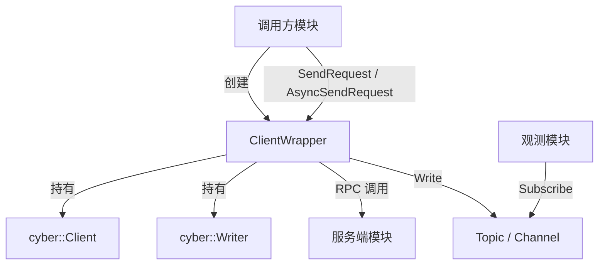

# Service Wrapper

> 源码路径: `modules/common/service_wrapper/`

## 概述

`ClientWrapper` 是一个模板类，对 Cyber RT 的 `cyber::Client` 进行二次包装。它在每次发起 RPC 请求的同时，还会通过 `cyber::Writer` 将请求消息发布到同名 Topic 上，使得其他模块能够通过订阅 Topic 来观测经过该服务的请求流。

该模块仅有一个头文件 `client_wrapper.h`，属于纯头文件库，无额外 `.cc` 实现。

## 核心类

### `ClientWrapper<Request, Response>`

模板类，命名空间 `apollo::common`。内部持有两个成员：

| 成员 | 类型 | 说明 |
|------|------|------|
| `client_` | `std::shared_ptr<cyber::Client<Request, Response>>` | 底层 RPC 客户端 |
| `request_writer_` | `std::shared_ptr<cyber::Writer<Request>>` | 用于将请求写入同名 Topic 的 Writer |

**构造函数：**

```cpp
ClientWrapper(const std::shared_ptr<cyber::Node>& node,
              const std::string& service_name);
```

在构造时同时创建 `Client` 和 `Writer`，二者共用相同的 `service_name` 作为标识。

## 核心函数

### `SendRequest` — 同步请求

```cpp
// shared_ptr 重载
std::shared_ptr<Response> SendRequest(
    std::shared_ptr<Request> request,
    const std::chrono::seconds& timeout_s = std::chrono::seconds(5));

// 值类型重载
std::shared_ptr<Response> SendRequest(
    const Request& request,
    const std::chrono::seconds& timeout_s = std::chrono::seconds(5));
```

内部执行两步操作：

1. 调用 `client_->SendRequest()` 进行同步 RPC 调用
2. 调用 `request_writer_->Write()` 将请求发布到 Topic

### `AsyncSendRequest` — 异步请求

```cpp
// shared_ptr 重载
std::shared_future<Response> AsyncSendRequest(std::shared_ptr<Request> request);

// 值类型重载
std::shared_future<Response> AsyncSendRequest(const Request& request);

// 带回调的重载
std::shared_future<Response> AsyncSendRequest(
    std::shared_ptr<Request> request,
    std::function<void(std::shared_future<std::shared_ptr<Response>>)> && cb);
```

与同步版本行为一致，区别在于底层使用 `client_->AsyncSendRequest()`，返回 `std::shared_future` 以非阻塞方式获取结果。带回调的重载在收到响应后自动执行回调函数。

## 配置

该模块不涉及配置文件，所有参数通过构造函数传入：

- `node` — Cyber RT 节点指针，用于创建 Client 和 Writer
- `service_name` — 服务名称，同时作为 RPC 服务名和 Topic 名称

## 调用关系



`ClientWrapper` 的核心设计意图是将 RPC 服务调用与消息发布耦合在一起，使得请求数据可以通过 Cyber RT 的 Channel 机制被其他模块旁路监听，便于日志记录、监控或调试。
