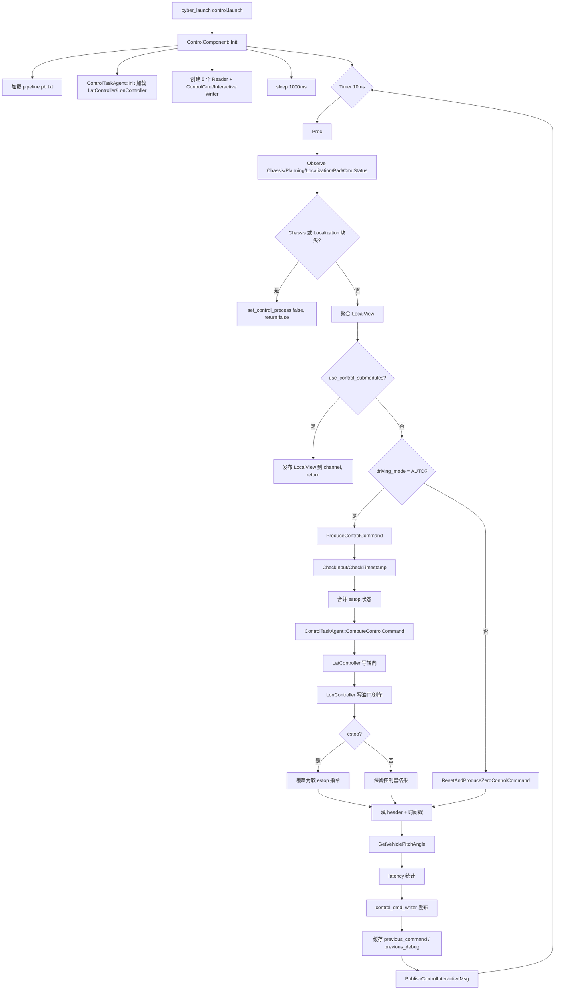
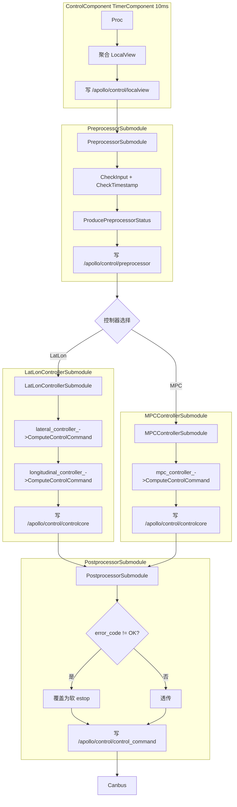

# Control Component 函数级源码解析

本文聚焦 `modules/control/control_component/` 目录，按函数级粒度拆解 `ControlComponent`、子模块与控制基类的实现。面向需要调试、二次开发或排查控制链路的工程师。

## 1. 模块定位

`control_component` 是 Apollo 控制栈的顶层组件，承担以下职责：

- 以 CyberRT `TimerComponent` 形式周期驱动控制流程（默认 10 ms）
- 订阅 `Planning` 下发的 `ADCTrajectory`、`Localization` 的 `LocalizationEstimate`、`Canbus` 的 `Chassis`，以及 `PadMessage`、`CommandStatus` 辅助消息
- 对输入做完整性与时效性校验，维护 E-Stop 与驾驶模式状态机
- 聚合 `LocalView` 并委托 `ControlTaskAgent` 串行调用各控制器插件，合成 `ControlCommand`
- 填充 `ControlInteractiveMsg` 与延迟统计，向下游发布

上下游拓扑：

```
Planning (ADCTrajectory) ─┐
Localization (LocalizationEstimate) ─┼─> ControlComponent ──> ControlCommand ──> Canbus
Chassis (Chassis)        ─┤                └──> ControlInteractiveMsg ──> HMI/监控
PadMessage / CommandStatus ─┘
```

模块同时提供两种运行形态：

- **单体模式**（`FLAGS_use_control_submodules=false`，默认）：`ControlComponent` 串行执行预处理、控制器计算、后处理
- **子模块模式**（`FLAGS_use_control_submodules=true`）：拆分为 `PreprocessorSubmodule`、`LatLonControllerSubmodule` 或 `MPCControllerSubmodule`、`PostprocessorSubmodule` 四个独立 Cyber 组件，通过 channel 级联

## 2. 目录结构

```
modules/control/control_component/
├── control_component.h / .cc          # 单体模式主组件
├── control_component_test.cc          # 组件级单元测试
├── control.json                       # 包元信息（neo 发布描述）
├── cyberfile.xml                      # CyberRT 模块描述
├── BUILD                              # Bazel 构建规则
├── README_cn.md                       # 模块中文说明
├── common/                            # 共享 gflags 定义
│   ├── control_gflags.h / .cc
│   └── BUILD
├── conf/                              # 默认运行配置
│   ├── control.conf                   # gflags flag 文件
│   ├── pipeline.pb.txt                # 控制器流水线（默认 LAT + LON）
│   └── calibration_table.pb.txt       # 标定表
├── controller_task_base/              # 控制器基类与公共算法
│   ├── control_task.h                 # ControlTask 抽象接口
│   ├── control_task_agent.h / .cc     # 控制器串行执行器
│   ├── common/                        # PID / LeadLag / MRAC / 插值 / 轨迹分析 ...
│   └── integration_tests/             # 积分测试
├── dag/                               # CyberRT DAG 描述
│   ├── control.dag                    # 单体模式
│   ├── lateral_longitudinal_module.dag
│   └── mpc_module.dag
├── launch/                            # CyberRT launch 配置
│   ├── control.launch
│   ├── control_lateral_longitudinal_control.launch
│   └── control_mpc_control.launch
├── proto/                             # 模块内 proto 定义
│   ├── preprocessor.proto             # 子模块间传递的中间消息
│   ├── local_view.proto               # Planning/Chassis/Localization 聚合视图
│   ├── pipeline.proto                 # 控制器流水线声明
│   ├── plugin_declare_info.proto      # 控制器插件声明
│   ├── calibration_table.proto        # 标定表
│   ├── check_status.proto             # 检查状态枚举
│   ├── control_debug.proto            # 调试信息
│   ├── pid_conf.proto / leadlag_conf.proto / mrac_conf.proto / gain_scheduler_conf.proto
├── submodules/                        # 子模块模式实现
│   ├── preprocessor_submodule.h / .cc
│   ├── lat_lon_controller_submodule.h / .cc
│   ├── mpc_controller_submodule.h / .cc
│   └── postprocessor_submodule.h / .cc
├── testdata/                          # 测试用例输入（chassis / localization / planning / pad）
├── tools/                             # 辅助工具
│   ├── control_tester.cc              # 回放 pb.txt 灌入消息给 control
│   └── pad_terminal.cc                # 命令行发送 PadMessage
└── docs/                              # 设计图与本地文档
```

## 3. ControlComponent 主组件

源码位置：`modules/control/control_component/control_component.h:53` 与 `control_component.cc:40`。

`ControlComponent` 继承 `cyber::TimerComponent`，由 DAG 中 `interval: 10` 驱动。它不是 `Component<T>`，因此不通过 channel 触发，而是纯粹的时间轮询组件；所有输入消息通过 `Reader::Observe() + GetLatestObserved()` 拉取，避免订阅侧阻塞。

### 3.1 成员一览

类成员（见 `control_component.h:92-143`）：

| 成员 | 类型 | 作用 |
|------|------|------|
| `init_time_` | `cyber::Time` | Init 完成时间，用于 `FLAGS_control_test_duration` 退出判断 |
| `latest_localization_` / `latest_chassis_` / `latest_trajectory_` | 缓存消息 | 被 `OnXxx` 回调更新，`Proc()` 消费 |
| `planning_command_status_` | `external_command::CommandStatus` | Planning 返回的命令执行状态，注入 `DependencyInjector` |
| `pad_msg_` | `PadMessage` | 上位机发送的驾驶动作（START/RESET/VIN_REQ） |
| `latest_replan_trajectory_header_` | `common::Header` | 最近一次 replan 轨迹 header，用于 debug 追溯 |
| `control_task_agent_` | `ControlTaskAgent` | 控制器流水线执行器 |
| `estop_` / `estop_reason_` | bool / string | E-Stop 状态机 |
| `pad_received_` | bool | 本周期是否收到 pad 消息，用于回显 |
| `control_pipeline_` | `ControlPipeline` | 从 `FLAGS_pipeline_file` 加载的流水线声明 |
| `mutex_` | `std::mutex` | 保护 `latest_*` 消息与 `pad_msg_` |
| `*_reader_` / `*_writer_` | Cyber Reader/Writer | 订阅/发布句柄 |
| `monitor_logger_buffer_` | `MonitorLogBuffer` | 写 HMI 监控日志 |
| `local_view_` | `LocalView` | 本周期聚合的输入视图 |
| `injector_` | `shared_ptr<DependencyInjector>` | 跨周期/跨控制器共享的上下文 |
| `previous_steering_command_` | double | 上一周期方向盘指令，E-Stop 时保持 |
| `is_auto_` / `from_else_to_auto_` | bool | 驾驶模式标记 |

### 3.2 `ControlComponent()` 构造函数

`control_component.cc:40`：

```cpp
ControlComponent::ControlComponent()
    : monitor_logger_buffer_(common::monitor::MonitorMessageItem::CONTROL) {}
```

构造函数仅初始化监控日志缓冲，真正的依赖注入与流水线加载延迟到 `Init()`。

### 3.3 `bool Init() override`

`control_component.cc:43-139`。

执行步骤：

1. **创建依赖注入容器**：`injector_ = std::make_shared<DependencyInjector>()`
2. **记录启动时间**：`init_time_ = Clock::Now()`
3. **加载流水线配置**：`GetProtoFromFile(FLAGS_pipeline_file, &control_pipeline_)`，失败则 `ACHECK` 终止
4. **初始化控制器流水线**（仅单体模式、非 UT 模式）：调用 `control_task_agent_.Init(injector_, control_pipeline_)`，任一控制器初始化失败则向 HMI 推送 ERROR 并返回 false
5. **创建 5 个 Reader**：
   - `chassis_reader_` ← `FLAGS_chassis_topic`
   - `trajectory_reader_` ← `FLAGS_planning_trajectory_topic`
   - `planning_command_status_reader_` ← `FLAGS_planning_command_status`
   - `localization_reader_` ← `FLAGS_localization_topic`
   - `pad_msg_reader_` ← `FLAGS_pad_topic`

   每个 Reader 均带 `pending_queue_size`，默认 10；Callback 统一传 `nullptr`（`Proc()` 主动 Observe）
6. **创建 Writer**（条件分支）：
   - 单体模式：`control_cmd_writer_` ← `FLAGS_control_command_topic`
   - 子模块模式：`local_view_writer_` ← `FLAGS_control_local_view_topic`
   - 始终创建 `control_interactive_writer_` ← `FLAGS_control_interative_topic`
7. **等待 1000 ms**：`std::this_thread::sleep_for(1s)`，避免下游尚未就绪导致首帧丢弃
8. **初始化 pad 动作**：依据 `FLAGS_action`（默认 `START=1`）设置 `pad_msg_.action`

### 3.4 `bool Proc() override`

`control_component.cc:317-514`，是模块的心跳函数，每 10 ms 被 CyberRT 调度一次。

执行序列按阶段拆分：

**阶段 A：输入采集**（`control_component.cc:318-377`）

- `injector_->control_debug_info_clear()` 清空 debug 缓存
- 对 5 个 Reader 依次 `Observe() + GetLatestObserved()`；`Chassis` 与 `Localization` 为必须输入，缺失则 `set_control_process(false)` 并返回 false，跳过本周期
- Planning 轨迹消息通过比较 `sequence_num` 判断是否为新帧，只有新帧才进入 `OnPlanning`；老帧使用上周期缓存
- `pad_msg` 为可选，缺失不报错
- 所有消息聚合到 `local_view_`（锁 `mutex_` 保护）

**阶段 B：子模块模式提前分支**（`control_component.cc:379-400`）

- 当 `FLAGS_use_control_submodules=true`：
  - 将 trajectory header 的 lidar/camera/radar 时间戳复制到 local_view header
  - 调用 `FillHeader` 填充自身 header
  - 记录延迟到 `LatencyRecorder`
  - 通过 `local_view_writer_->Write(local_view_)` 发布给下游子模块
  - 直接 return true，不执行后续控制计算

**阶段 C：Pad 与测试模式处理**（`control_component.cc:402-418`）

- 收到 `DrivingAction::RESET` 立即清空 `estop_` 与 `estop_reason_`
- `FLAGS_is_control_test_mode` 且测试时间到达则主动退出

**阶段 D：驾驶模式检测与控制计算**（`control_component.cc:420-445`）

- `injector_->set_control_process(true)`
- `CheckAutoMode(&local_view_.chassis())` 更新 `is_auto_` 与 `from_else_to_auto_`
- 分支：
  - `COMPLETE_AUTO_DRIVE`：调 `ProduceControlCommand`
  - 其他模式：调 `ResetAndProduceZeroControlCommand`，输出零指令并重置控制器
- 若本周期收到 pad 则把 `pad_msg_` 附加到 `control_command` 回显

**阶段 E：header 与延迟填充**（`control_component.cc:447-491`）

- E-Stop 时把 `estop_reason_` 写到 `header.status.msg`
- 复制 trajectory 的 lidar/camera/radar 时间戳到 control_command header
- `FLAGS_is_control_test_mode` 时跳过发布
- 若之前没有 pitch 信息，调 `vehicle_state()->Update()` 并 `GetVehiclePitchAngle` 回填
- 统计本周期总耗时，写入 `latency_stats`，超阈值（`FLAGS_control_period * 1e3`）打 INFO

**阶段 F：发布与状态缓存**（`control_component.cc:493-513`）

- `FillHeader(node_->Name(), &control_command)`
- `control_cmd_writer_->Write(control_command)`
- `injector_->Set_pervious_control_command` 缓存纵向 debug
- `injector_->previous_control_command_mutable()` 与 `previous_control_debug_mutable()` 拷贝本帧结果供下周期引用
- 调 `PublishControlInteractiveMsg` 发布交互信息

### 3.5 回调函数族

`OnPad`、`OnChassis`、`OnPlanning`、`OnPlanningCommandStatus`、`OnLocalization` 均为内部助手，并非真正的 Reader callback（因为 Reader 创建时 callback 传 `nullptr`）。它们在 `Proc()` 中手动调用，统一加 `std::lock_guard<std::mutex> lock(mutex_)` 保护对应缓存成员。

| 函数 | 行 | 动作 |
|------|------|------|
| `OnPad` | `control_component.cc:141-146` | `pad_msg_.CopyFrom(*pad)`，缺失 `action` 字段时打 AERROR |
| `OnChassis` | `control_component.cc:148-152` | 拷贝到 `latest_chassis_` |
| `OnPlanning` | `control_component.cc:154-159` | 拷贝到 `latest_trajectory_`（仅新 sequence 才触发） |
| `OnPlanningCommandStatus` | `control_component.cc:161-168` | 拷贝到 `planning_command_status_` |
| `OnLocalization` | `control_component.cc:170-175` | 拷贝到 `latest_localization_` |
| `OnMonitor` | `control_component.cc:177-185` | 扫描 `MonitorMessage.item`，出现 FATAL 项则置 `estop_ = true` |

### 3.6 `Status ProduceControlCommand(ControlCommand* control_command)`

`control_component.cc:187-315`。核心控制指令生产逻辑。

流程：

1. **输入校验**：调 `CheckInput(&local_view_)`
   - 失败：engage_advice 设 `DISALLOW_ENGAGE`，记录 `estop_reason_`，`estop_ = true`
   - 成功：重置 `estop_`，继续做 `CheckTimestamp(local_view_)`
2. **时间戳校验**：超时时只在非 `COMPLETE_AUTO_DRIVE` 下禁止 engage，仍允许计算（保留最后一条轨迹供惯性执行）
3. **E-Stop 合并**：
   - `FLAGS_enable_persistent_estop=true` 时 E-Stop 粘滞，一次失败持续
   - 否则以 Planning 发布的 `trajectory.estop().is_estop()` 为准
   - 空轨迹、`COMPLETE_MANUAL`、挡位为 D 但 v<0（开启 `enable_gear_drive_negative_speed_protection`）都会置 estop
4. **controller_agent 调用**：
   - 从 `COMPLETE_MANUAL` 切换到其他模式时 `control_task_agent_.Reset()`
   - 填充 `input_debug`（localization/canbus/trajectory header，以及 replan header）
   - `control_task_agent_.ComputeControlCommand(&local_view_.localization(), &local_view_.chassis(), &local_view_.trajectory(), control_command)` 依次跑完所有控制器
   - 失败时置 estop、记录原因
5. **E-Stop 命令覆盖**：
   - `speed=0` / `throttle=0` / `brake=FLAGS_soft_estop_brake`（默认 15.0，见 `conf/control.conf`）
   - `gear_location=GEAR_DRIVE`
   - `steering_target` 保持上一周期值，防止方向盘突变
6. **信号灯转向灯透传**：若 trajectory decision 携带 `vehicle_signal`，直接拷贝到 `control_command.signal`

### 3.7 `Status CheckInput(LocalView* local_view)`

`control_component.cc:516-543`。

- 若 trajectory 未设 estop 但 trajectory_point 为空 → `CONTROL_COMPUTE_ERROR`
- 遍历 trajectory_point，把速度 < `FLAGS_minimum_speed_resolution`（0.2 m/s）且加速度 < `FLAGS_max_acceleration_when_stopped`（0.01 m/s²）的点强制归零，避免数值噪声让控制器误判行驶意图
- `injector_->vehicle_state()->Update(localization, chassis)` 更新车辆状态提供器

### 3.8 `Status CheckTimestamp(const LocalView& local_view)`

`control_component.cc:545-580`。

- `FLAGS_enable_input_timestamp_check=false` 或 `FLAGS_is_control_test_mode=true` 时直接放行
- 三个上游消息分别设阈值：
  - `localization`：`FLAGS_max_localization_miss_num * FLAGS_localization_period`
  - `chassis`：`FLAGS_max_chassis_miss_num * FLAGS_chassis_period`
  - `trajectory`：`FLAGS_max_planning_miss_num * FLAGS_trajectory_period`
- 任一超时返回 `CONTROL_COMPUTE_ERROR`，同时通过 `monitor_logger_buffer_.ERROR(...)` 上报 HMI

### 3.9 `void ResetAndProduceZeroControlCommand(ControlCommand* control_command)`

`control_component.cc:582-594`。

进入非 AUTO 模式时调用：

- 油门、方向盘目标、方向盘速率、速度、刹车全部置零
- 挡位设为 `GEAR_DRIVE`
- 调 `control_task_agent_.Reset()` 清控制器内部状态（积分、滤波器等）
- 清空 `latest_trajectory_` 与 `trajectory_reader_->ClearData()`，防止下次 AUTO 继承过时轨迹

### 3.10 `void GetVehiclePitchAngle(ControlCommand* control_command)`

`control_component.cc:596-601`。

从 `VehicleStateProvider` 读出 pitch（弧度），转换为角度并叠加 `FLAGS_pitch_offset_deg`，写入 `control_command.debug.simple_lon_debug.vehicle_pitch`，供坡道补偿使用。

### 3.11 `void CheckAutoMode(const canbus::Chassis* chassis)`

`control_component.cc:603-626`。

维护两个布尔状态：

- `is_auto_`：当前是否处于 `COMPLETE_AUTO_DRIVE`
- `from_else_to_auto_`：本周期是否刚从非 AUTO 切入 AUTO（上一周期 debug 中 `is_auto=false` 且本周期为 AUTO）

结果写入本帧 debug (`control_debug_info.control_component_debug`)，供各控制器识别"刚接管"时刻（例如坡道起步补偿、PID 积分清零）。

### 3.12 `void PublishControlInteractiveMsg()`

`control_component.cc:628-634`。

从 `injector_->control_interactive_info()` 取 `ControlInteractiveMsg`，`FillHeader` 后通过 `control_interactive_writer_` 发布到 `FLAGS_control_interative_topic`。该消息由各控制器写入，常用于 HMI 展示当前控制状态（如方向盘目标、车速目标等）。

## 4. 子模块（submodules/）

子模块模式下 `ControlComponent` 仅做消息聚合，控制逻辑被拆分为三段独立的 Cyber `Component<T>`，由 DAG 描述触发关系。

```
ControlComponent (TimerComponent)
  └─ /apollo/control/localview ──> PreprocessorSubmodule
                                     └─ /apollo/control/preprocessor ──> LatLonControllerSubmodule / MPCControllerSubmodule
                                                                            └─ /apollo/control/controlcore ──> PostprocessorSubmodule
                                                                                                                  └─ /apollo/control/control_command ──> Canbus
```

### 4.1 PreprocessorSubmodule

源码：`submodules/preprocessor_submodule.h:40`、`preprocessor_submodule.cc`。继承 `cyber::Component<LocalView>`。

#### `std::string Name() const`

返回 `FLAGS_preprocessor_submodule_name`（默认 `"PreprocessorSubmodule"`）。

#### `bool Init() override`

`preprocessor_submodule.cc:51-60`：

- 创建 `DependencyInjector`（本子模块独立实例，不与 ControlComponent 共享）
- 创建 `preprocessor_writer_` 写入 `FLAGS_control_preprocessor_topic`

#### `bool Proc(const std::shared_ptr<LocalView>& local_view)`

`preprocessor_submodule.cc:62-115`：

1. 构造空的 `Preprocessor` 消息，`local_view` 拷贝进其 `local_view` 字段
2. 调 `ProducePreprocessorStatus(&control_preprocessor)` 执行校验链
3. 根据结果设置 header status 的 error_code：OK 或 estop
4. 处理 pad 的 RESET：清 estop、强制 error_code=OK
5. 复制 trajectory 的三个传感器时间戳
6. `FillHeader` 后通过 `preprocessor_writer_` 发布
7. 记录 latency

#### `Status ProducePreprocessorStatus(Preprocessor* control_preprocessor)`

`preprocessor_submodule.cc:117-204`。等价于主组件的 `ProduceControlCommand` 前半段：

- `CheckInput(local_view)` 失败 → `DISALLOW_ENGAGE`
- `CheckTimestamp(local_view)` 失败 → 非 AUTO 下 `DISALLOW_ENGAGE`
- trajectory estop 粘滞（受 `FLAGS_enable_persistent_estop` 控制）
- `gear_drive + v<0` 保护
- 填充 `input_debug.localization_header / canbus_header / trajectory_header / latest_replan_trajectory_header`

#### `Status CheckInput(LocalView* local_view)` / `Status CheckTimestamp(const LocalView& local_view)`

`preprocessor_submodule.cc:206-234` 与 `236-276`。语义与 `ControlComponent::CheckInput` / `CheckTimestamp` 完全对齐，只是带 `mutex_` 保护 trajectory_point 的就地修正。

### 4.2 LatLonControllerSubmodule

源码：`submodules/lat_lon_controller_submodule.h:38`、`lat_lon_controller_submodule.cc`。继承 `cyber::Component<Preprocessor>`。

实例化两个独立的 `ControlTask` 插件（`LatController` 与 `LonController`），分别负责横向、纵向。

#### `bool Init() override`

`lat_lon_controller_submodule.cc:45-71`：

```cpp
lateral_controller_ = PluginManager::Instance()->CreateInstance<ControlTask>(
    "apollo::control::LatController");
longitudinal_controller_ = PluginManager::Instance()->CreateInstance<ControlTask>(
    "apollo::control::LonController");
```

任一插件 `Init(injector_)` 失败则通过 `monitor_logger_buffer_.ERROR` 报错并返回 false。随后创建 `control_core_writer_` 写 `FLAGS_control_core_command_topic`。

#### `bool Proc(const std::shared_ptr<Preprocessor>& preprocessor_status)`

`lat_lon_controller_submodule.cc:73-121`：

1. 从 `preprocessor_status` 取 pad_msg 附加到 `control_core_command`
2. 若 `preprocessor_status->header().status().error_code() != OK`：直接透传状态码返回 false，**不执行控制器**
3. 否则调 `ProduceControlCoreCommand(local_view, &control_core_command)`
4. 复制传感器时间戳、填 header、记录 latency
5. 把 status 写回 control_core_command header 后发布

#### `Status ProduceControlCoreCommand(const LocalView& local_view, ControlCommand* control_core_command)`

`lat_lon_controller_submodule.cc:123-146`：

- `COMPLETE_MANUAL` 模式下 `Reset()` 两个控制器
- 先调 lateral_controller，失败直接返回
- 再调 longitudinal_controller；两者共用同一个 `control_core_command`，后者可读取前者写入的中间结果

### 4.3 MPCControllerSubmodule

源码：`submodules/mpc_controller_submodule.h:40`、`mpc_controller_submodule.cc`。结构与 `LatLonControllerSubmodule` 一致，差别：

- 只实例化 `mpc_controller_` 一个 `ControlTask`（类名 `apollo::control::MPCController`）
- `ProduceControlCoreCommand` 直接调 MPC 求解整帧横纵向耦合控制

与 Lat+Lon 分离式的差异在于：MPC 输出同时覆盖转向与油门/刹车，因此只需单次调用。选择哪个子模块由 DAG 决定，二者互斥。

### 4.4 PostprocessorSubmodule

源码：`submodules/postprocessor_submodule.h:40`、`postprocessor_submodule.cc`。继承 `cyber::Component<ControlCommand>`，订阅 `control_core` 通道。

#### `bool Init() override`

`postprocessor_submodule.cc:42-47`。仅创建 `postprocessor_writer_` 写 `FLAGS_control_command_topic`（最终指令）。

#### `bool Proc(const std::shared_ptr<ControlCommand>& control_core_command)`

`postprocessor_submodule.cc:49-85`：

1. 拷贝 control_core_command 作为基础
2. **E-Stop 覆盖**：若 header status.error_code ≠ OK，则 `speed=0 / throttle=0 / brake=FLAGS_soft_estop_brake / gear=GEAR_DRIVE`
3. 复制 lidar/camera/radar 三个时间戳
4. `FillHeader` + latency 记录
5. 通过 `postprocessor_writer_` 发布最终 `ControlCommand`

该子模块故意保持极薄设计，便于未来插入平滑、限幅等后处理而不影响控制器本身。

## 5. 控制器基类与编排

### 5.1 `ControlTask`

定义：`controller_task_base/control_task.h:52`。所有控制器必须继承此抽象类。

纯虚接口：

| 接口 | 签名 | 说明 |
|------|------|------|
| `Init` | `virtual Status Init(std::shared_ptr<DependencyInjector> injector)` | 初始化，通常在内部读 `conf/controller_conf.pb.txt` |
| `ComputeControlCommand` | `virtual Status ComputeControlCommand(const LocalizationEstimate*, const Chassis*, const ADCTrajectory*, ControlCommand*)` | 计算本控制器的贡献并写入 cmd |
| `Reset` | `virtual Status Reset()` | 清积分/滤波器等瞬态 |
| `Name` | `virtual std::string Name() const` | 返回控制器显示名 |
| `Stop` | `virtual void Stop()` | 停止时清理资源 |

保护成员：

#### `template <typename T> bool LoadConfig(T* config)`

`control_task.h:120-138`。

- 使用 `abi::__cxa_demangle` 从 typeid 解析当前类名
- 通过 `PluginManager::GetPluginConfPath<ControlTask>(class_name, "conf/controller_conf.pb.txt")` 推导路径
- `GetProtoFromFile` 反序列化到 T

这意味着控制器插件不需要手写配置路径，PluginManager 自动按类名去 `plugins/<class_name>/conf/` 寻找。

#### `bool LoadCalibrationTable(calibration_table* calibration_table_conf)`

`control_task.h:106-117`。从 `FLAGS_calibration_table_file`（默认 `conf/calibration_table.pb.txt`）加载标定表到 proto 消息。标定表定义速度–加速度–油门/刹车的三维映射，用于纵向控制器做前馈。

### 5.2 `ControlTaskAgent`

定义：`controller_task_base/control_task_agent.h:48`，实现：`control_task_agent.cc`。

#### `Status Init(std::shared_ptr<DependencyInjector> injector, const ControlPipeline& control_pipeline)`

`control_task_agent.cc:33-54`：

1. `control_pipeline.controller_size() == 0` 直接 `CONTROL_INIT_ERROR`
2. 循环调 `PluginManager::Instance()->CreateInstance<ControlTask>("apollo::control::" + type)`；`type` 来自 `PluginDeclareInfo.type`
3. 任一 `controller->Init(injector_)` 失败则返回 `CONTROL_INIT_ERROR`
4. 成功的实例 push 到 `controller_list_`

#### `Status ComputeControlCommand(const LocalizationEstimate*, const Chassis*, const ADCTrajectory*, ControlCommand*)`

`control_task_agent.cc:56-75`：

- 串行遍历 `controller_list_`
- 每个控制器前后打点 `Clock::NowInSeconds()`，计算 ms 后 `cmd->mutable_latency_stats()->add_controller_time_ms(time_diff_ms)`
- 任一控制器返回非 OK 立即中断并返回

因此控制器顺序有语义：后一个控制器 **会看到** 前一个控制器写过的字段。默认流水线（`conf/pipeline.pb.txt`）是 `LatController` → `LonController`，即横向先出转向，纵向后出油门/刹车。

#### `Status Reset()`

`control_task_agent.cc:77-83`。遍历所有控制器调 `Reset()`。由主组件在 `COMPLETE_MANUAL` 切换或 E-Stop 恢复时调用。

### 5.3 `DependencyInjector`

定义：`controller_task_base/common/dependency_injector.h:29`。纯数据容器（无锁），通过 `shared_ptr` 注入到所有控制器。

字段与 accessor：

| 数据 | 读接口 | 写接口 |
|------|--------|--------|
| `VehicleStateProvider vehicle_state_` | `vehicle_state()` | 直接通过返回指针修改 |
| `SimpleLongitudinalDebug lon_debug_` | `Get_previous_lon_debug_info()` | `Set_pervious_control_command(ControlCommand*)` 从 cmd 的 debug 拷出 |
| `external_command::CommandStatus planning_command_status_` | `get_planning_command_status()` | `set_planning_command_status(...)` |
| `ControlCommand control_command_` | `previous_control_command()` | `previous_control_command_mutable()` |
| `ControlDebugInfo control_debug_info_` | `control_debug_info()` | `mutable_control_debug_info()` / `control_debug_info_clear()` |
| `ControlDebugInfo control_debug_previous_` | `previous_control_debug()` | `previous_control_debug_mutable()` |
| `ControlInteractiveMsg control_interactive_msg_` | `control_interactive_info()` | `mutable_control_interactive_info()` |
| `bool control_process_` | `control_process()` | `set_control_process(bool)` |

注意这是 **非线程安全** 的容器；安全性依赖于 `ControlComponent::Proc()` 的单线程顺序调度。

### 5.4 公共算法组件

`controller_task_base/common/` 提供多个数值工具，被具体控制器（如 LatController、LonController、MPCController）引用：

| 文件 | 类 | 作用 |
|------|------|------|
| `pid_controller.h` | `PIDController` | 基础 PID，`Control(error, dt)` 输出控制量，支持积分保持与饱和状态查询 |
| `pid_BC_controller.h` | `PIDBCController` | 带 Back-Calculation 抗积分饱和的 PID |
| `pid_IC_controller.h` | `PIDICController` | 带 Integrator Clamping 的 PID |
| `leadlag_controller.h` | `LeadlagController` | 连续域 α/β/τ 设计，`TransformC2d(dt)` 通过双线性变换转离散域 |
| `mrac_controller.h` | `MracController` | 1 阶/2 阶模型参考自适应控制，用于油门/刹车/转向执行器动态补偿 |
| `interpolation_1d.h` | `Interpolation1D` | 基于 Eigen Spline 的一维插值，超界时返回端点值 |
| `interpolation_2d.h` | `Interpolation2D` | 二维插值（速度 × 加速度 → 指令），标定表查询主力 |
| `hysteresis_filter.h` | `HysteresisFilter` | 带滞回阈值的二值滤波，避免状态抖动 |
| `trajectory_analyzer.h` | `TrajectoryAnalyzer` | 轨迹点查询（按时间/位置）、Frenet 坐标系转换、质心变换 |

## 6. Proto 消息定义

### 6.1 `LocalView`（`proto/local_view.proto`）

```protobuf
message LocalView {
  optional apollo.common.Header header = 1;
  optional apollo.canbus.Chassis chassis = 2;
  optional apollo.planning.ADCTrajectory trajectory = 3;
  optional apollo.localization.LocalizationEstimate localization = 4;
  optional PadMessage pad_msg = 5;
}
```

控制模块对"一帧输入"的抽象。单体模式下作为内存对象，子模块模式下作为 channel 消息（`FLAGS_control_local_view_topic`）。

### 6.2 `Preprocessor`（`proto/preprocessor.proto`）

```protobuf
message Preprocessor {
  optional apollo.common.Header header = 1;
  optional LocalView local_view = 2;
  optional apollo.common.EngageAdvice engage_advice = 4;
  optional InputDebug input_debug = 5;
  optional bool received_pad_msg = 6 [default = false];
  optional bool estop = 7 [default = false];
  optional string estop_reason = 8;
}
```

`PreprocessorSubmodule` 的输出消息。下游控制器子模块根据 `header.status.error_code` 判定是否启用控制；`engage_advice` 供 HMI 决定是否允许用户切入 AUTO。

### 6.3 `ControlPipeline` + `PluginDeclareInfo`（`proto/pipeline.proto` / `plugin_declare_info.proto`）

```protobuf
message PluginDeclareInfo {
  required string name = 1;  // 展示名，如 "LAT_CONTROLLER"
  required string type = 2;  // 类名（不含 namespace），如 "LatController"
}

message ControlPipeline {
  repeated PluginDeclareInfo controller = 1;
}
```

`ControlTaskAgent::Init` 按 repeated 顺序加载控制器，顺序决定 `ComputeControlCommand` 的执行链。

### 6.4 `calibration_table`（`proto/calibration_table.proto`）

```protobuf
message ControlCalibrationInfo {
  optional double speed = 1;         // 当前车速 (m/s)
  optional double acceleration = 2;  // 期望加速度 (m/s²)
  optional double command = 3;       // 对应油门 (>0) 或刹车 (<0) 百分比
}

message calibration_table {
  repeated ControlCalibrationInfo calibration = 1;
}
```

纵向控制器通过 `Interpolation2D` 在 (speed, acceleration) → command 三维表中查表前馈。

### 6.5 `ControlDebugInfo`（`proto/control_debug.proto`）

汇聚多路调试信息，供下游 debug 话题与监控工具使用：

| 子消息 | 用途 |
|--------|------|
| `SimpleLongitudinalPlusDebug` | 纵向控制 PID 输入/输出/标定查表/是否全停等详细数据 |
| `SimpleLateralPlusDebug` | 横向 LQR 参考点、误差、矩阵增益等 |
| `SimpleMPCPlusDebug` | MPC 求解迭代、代价、矩阵等 |
| `SimpleAntiSlopeDebug` | 坡道防溜补偿链 |
| `CleaningSafetyCheckDebug` | 清扫车场景安全检查 |
| `ControlComponentDebug` | 组件层指标：pitch、is_auto、from_else_to_auto、process 耗时 |
| `ReplanDebug` | 重规划状态 |

## 7. 配置与启动

### 7.1 gflags 关键开关

`common/control_gflags.cc` 中定义，默认值与语义节选：

| flag | 默认 | 说明 |
|------|------|------|
| `pipeline_file` | `conf/pipeline.pb.txt` | 控制器流水线声明 |
| `calibration_table_file` | `conf/calibration_table.pb.txt` | 标定表 |
| `use_control_submodules` | false | 切换子模块模式 |
| `is_control_test_mode` | false | 跳过 timestamp check 与发布 |
| `is_control_ut_test_mode` | false | UT 下不加载控制器 |
| `enable_input_timestamp_check` | false | 是否启用时间戳校验 |
| `max_localization_miss_num` / `max_chassis_miss_num` / `max_planning_miss_num` | 20 / 20 / 20 | 超时阈值倍数 |
| `control_period` | 0.01 s | 控制周期 |
| `chassis_period` / `localization_period` | 0.01 | 输入期望周期 |
| `trajectory_period` | 0.1 | 轨迹期望周期 |
| `enable_persistent_estop` | true（代码默认）/ false（`conf/control.conf`） | estop 是否粘滞 |
| `soft_estop_brake` | 50.0（代码默认）/ 15.0（`conf/control.conf`） | 软 estop 下刹车百分比 |
| `minimum_speed_resolution` | 0.2 m/s | 归零阈值 |
| `max_acceleration_when_stopped` | 0.01 m/s² | 归零阈值（与速度联合） |
| `enable_gear_drive_negative_speed_protection` | false | D 档负速度 estop 保护 |
| `action` | 1（START） | Init 时默认 pad 动作 |
| `pitch_offset_deg` | 0.0 | pitch 读数修正项 |
| `reverse_heading_control` | false | 反向行驶时的航向处理 |

`conf/control.conf` 同时覆盖了若干默认值，部分与代码中的 `DEFINE_*` 默认不同（如 `soft_estop_brake` 实际生效 15.0）。

### 7.2 DAG 文件

**`dag/control.dag`**：单体模式。

```
timer_components {
  class_name : "ControlComponent"
  config {
    name: "control"
    flag_file_path: "/apollo/modules/control/control_component/conf/control.conf"
    interval: 10
  }
}
```

仅一个 `TimerComponent`，周期 10 ms。

**`dag/lateral_longitudinal_module.dag`**：Lat+Lon 子模块模式。

- `timer_components`：ControlComponent（继续以 10 ms 节拍发 LocalView）
- `components`：
  - `PreprocessorSubmodule` 订阅 `/apollo/control/localview`
  - `LatLonControllerSubmodule` 订阅 `/apollo/control/preprocessor`
  - `PostprocessorSubmodule` 订阅 `/apollo/control/controlcore`

**`dag/mpc_module.dag`**：除控制器改为 `MPCControllerSubmodule` 外结构与上者相同。

### 7.3 Launch 文件

3 个 launch 文件对应 3 个 DAG，由 `cyber_launch` 启动：

```
launch/control.launch                            → dag/control.dag
launch/control_lateral_longitudinal_control.launch → dag/lateral_longitudinal_module.dag
launch/control_mpc_control.launch                → dag/mpc_module.dag
```

注意：子模块模式的 launch/dag 引用路径是 `/apollo/modules/control/...`（不含 `control_component` 子目录），这是 release 产物的目录布局；源码仓库中实际路径是 `modules/control/control_component/...`。

### 7.4 Pipeline 配置

`conf/pipeline.pb.txt`：

```protobuf
controller {
  name: "LAT_CONTROLLER"
  type: "LatController"
}
controller {
  name: "LON_CONTROLLER"
  type: "LonController"
}
```

`ControlTaskAgent::Init` 会尝试加载 `apollo::control::LatController` 与 `apollo::control::LonController` 两个插件。插件实现不在 `control_component` 内，而是来自外部 plugin 目录（如 `lat_based_lqr_controller`、`lon_based_pid_controller`），其配置目录见 `testdata/conf/plugins/`。

## 8. 执行流程图

### 8.1 单体模式时序



### 8.2 子模块模式时序



## 9. 辅助工具（tools/）

### 9.1 `control_tester`

`tools/control_tester.cc`。离线调试工具：

- 通过 gflags 指定 4 个 pb.txt 文件（chassis、localization、pad_msg、planning），默认指向 `testdata/control_tester/*`
- 构造对应的 Cyber Writer，以 `FLAGS_feed_frequency`（默认 10 Hz）持续灌入 `FLAGS_num_seconds` 秒
- 主要用于隔离测试，当真实 planning/canbus/localization 不可用时，给 ControlComponent 一个稳定的数据流

### 9.2 `pad_terminal`

`tools/pad_terminal.cc`。命令行工具：

- 订阅 `Chassis`、发布 `PadMessage`
- 从 stdin 读取数字指令：`0` → RESET，`1` → START，其他打印 help
- 监听底盘 `EMERGENCY_MODE`，持续超过 4 秒后自动发送 RESET，辅助从紧急模式恢复

## 10. 关键路径与排障速查

| 症状 | 可能源头 | 查哪里 |
|------|----------|--------|
| 控制一直不执行，刹车常闭合 | Chassis 或 Localization 缺失 | `control_component.cc:324` / `355` 的 `AERROR` |
| `DISALLOW_ENGAGE` | CheckInput/CheckTimestamp 失败 | `CheckInput`、`CheckTimestamp` 错误返回 |
| 上位机 `RESET` 无响应 | pad_msg 没订阅到 | 检查 `FLAGS_pad_topic` 与 `pad_msg_reader_` |
| 控制指令抖动 | 低速点未归零 | `FLAGS_minimum_speed_resolution` / `max_acceleration_when_stopped` |
| 切入 AUTO 后方向盘跳变 | E-Stop 保留的是 `previous_steering_command_` | 检查 E-Stop 判定逻辑 |
| 子模块间消息阻塞 | `pending_queue_size` 过小 | DAG readers 与对应 gflags |
| 控制器加载失败 | 插件名不匹配 | `ControlTaskAgent::Init` 中的 `apollo::control::<type>` 拼接，对照 `testdata/conf/plugins/*/plugins.xml` |
