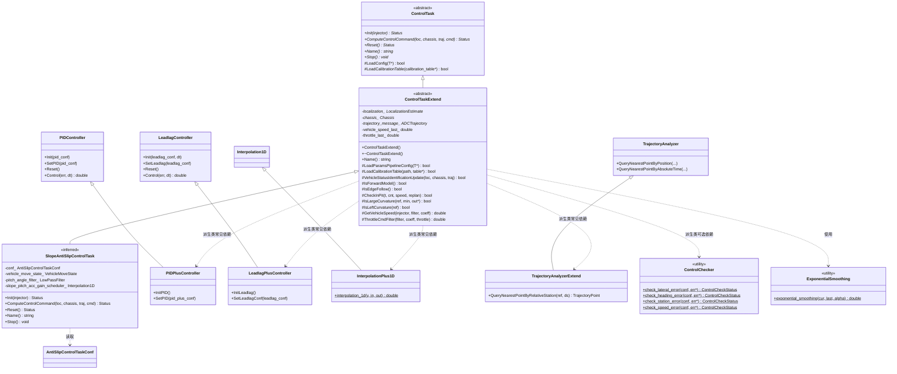

# Control Task Base Extend 与 Slope Anti-Slip Control Task 函数级源码解析

本文聚焦 `modules/control/control_task_base_extend/` 与 `modules/control/controllers/slope_anti_slip_control_task/` 两个子包，按函数级粒度拆解扩展控制器基类、通用算法扩展、相关 proto 以及坡道防溜车控制任务的配置语义。面向需要在 Apollo 控制栈上自研控制器、扩展共享工具或基于坡道防溜配置做二次开发的工程师。

## 1. 模块定位

`control_task_base_extend` 是对 `control_component/controller_task_base/` 的**扩展层**（extend overlay），不是并列模块，而是一个位于标准基类之上的增量补丁包。它的定位可以概括为三类职责：

- **扩展控制器基类**：提供 `ControlTaskExtend`（继承自 `control_component/controller_task_base/control_task.h` 的 `ControlTask`），在不修改原基类接口的前提下，向所有下游控制器插件追加一批共享能力——车辆状态识别、倒车/路肩跟随判断、进坑检测、大曲率/左曲率判断、速度滤波、油门命令滤波、基于类名自动加载 params pipeline 配置等。
- **扩展通用算法库**：`common/` 下的 `PIDPlusController`、`LeadlagPlusController`、`InterpolationPlus1D`、`TrajectoryAnalyzerExtend` 等类以「public 继承 + 重新实现 Init/Set 接口」的方式，给标准基类里已有的 PID、Lead/Lag、插值、轨迹分析等算法增加额外能力（例如 PID 支持速度相关的 kp/ki/kd 增益调度、插值支持 protobuf RepeatedField 直接输入、TrajectoryAnalyzer 支持按相对 station 最近点查询）。此外 `ControlChecker` 是全新引入的安全检查静态工具类，`ExponentialSmoothing` 提供指数平滑算法，`math_utils` 提供一组数学工具函数（部分与 `modules/common/math` 重名，仅在本 extend 包内可见）。
- **扩展 proto 配置描述**：`proto/` 下提供 `PidPlusConf`（带速度增益表的 PID 配置）、`SafetyCheckConf`（供 `ControlChecker` 使用的安全检查阈值配置）、`ParamsPipeline`（插件从自身目录拾取额外参数文件的声明）。

与标准基类的继承与包含关系（主线）：

```
ControlTask                              (control_component/controller_task_base/control_task.h:52)
    ▲
    │ public 继承
    │
ControlTaskExtend                        (control_task_base_extend/control_task_extend.h:51)
    ▲
    │ public 继承
    │
具体控制器（例如 SlopeAntiSlipControlTask、各车型的 LonController/LatController 插件）
```

算法类扩展（并列继承）：

```
PIDController         ── public 继承 ─▶  PIDPlusController
LeadlagController     ── public 继承 ─▶  LeadlagPlusController
Interpolation1D       ── public 继承 ─▶  InterpolationPlus1D
TrajectoryAnalyzer    ── public 继承 ─▶  TrajectoryAnalyzerExtend
```

`controllers/slope_anti_slip_control_task/` 则是基于该 extend 层的**坡道防溜车控制任务配置包**：当前仓库中仅提供 proto 配置（`antislip_control_task_conf.proto`），没有 C++ 源码或 BUILD 目标输出 cc_library。它的实际使用方需在自有代码库中继承 `ControlTaskExtend` 实现算法，并通过 `PluginManager` 把 `AntiSlipControlTaskConf` 加载进来。因此本文对该任务的讲解聚焦于**配置语义、字段作用与可推导出的算法意图**，不臆造未落地的函数实现。

## 2. 目录结构

```
modules/control/control_task_base_extend/
├── BUILD                              # 顶层 Bazel 规则，产出 control_task_extend
├── cyberfile.xml                      # CyberRT 模块描述（本包作为独立 cyber 模块发布）
├── control_task_extend.h / .cc        # 扩展控制器基类 ControlTaskExtend
├── common/                            # 通用算法 / 工具的扩展实现
│   ├── BUILD
│   ├── control_checker.h / .cc        # 横向、航向、纵向站距、速度误差安全检查
│   ├── exponential_smoothing.h / .cc  # 一阶指数平滑
│   ├── interpolation_plus_1d.h / .cc  # 基于 proto RepeatedField 的 1D 插值
│   ├── leadlag_plus_controller.h / .cc# Lead/Lag 控制器扩展
│   ├── math_utils.h / .cc             # 数学工具函数（extend 本地副本）
│   ├── pid_plus_controller.h / .cc    # PID 控制器扩展（SetPID 接受 PidPlusConf）
│   └── trajectory_analyzer_extend.h / .cc
│                                      # 轨迹分析器扩展，支持按相对 station 查询
└── proto/                             # 扩展 proto
    ├── BUILD
    ├── params_pipeline.proto          # 插件额外参数清单
    ├── pid_plus_conf.proto            # PID + 速度增益表
    └── safety_check_conf.proto        # 安全检查阈值与开关

modules/control/controllers/slope_anti_slip_control_task/
└── proto/
    ├── BUILD
    └── antislip_control_task_conf.proto
                                       # 坡道防溜车控制任务的全部可调参数
```

说明：

- **没有** `conf/` 目录——本 extend 包本身不落地运行时配置，配置文件由使用它的具体控制器插件各自准备（通过 `LoadParamsPipelineConfig` 模板方法按 `typeid(*this)` 的 demangled class name 去 `PluginManager` 拿路径）。
- **没有** `dag/` / `launch/`——本包不是 Cyber 组件，只是一个共享库，运行期由 `ControlTaskAgent` 串行驱动。
- `slope_anti_slip_control_task/` **没有** `.h/.cc` 文件，仅定义 proto；其 BUILD 只发布 `antislip_control_task_conf_proto` 这一个 `proto_library` 目标。

## 3. `ControlTaskExtend` 扩展基类

源码：`control_task_base_extend/control_task_extend.h:51` 与 `control_task_extend.cc:46`。

### 3.1 类定义与继承关系

```cpp
// control_task_extend.h:51
class ControlTaskExtend : public ControlTask {
public:
    ControlTaskExtend();
    virtual ~ControlTaskExtend() {}
    std::string Name() const;

protected:
    template <typename T>
    bool LoadParamsPipelineConfig(T *pipeline_config);

    bool LoadCalibrationTable(const std::string &calibration_table_path,
                              calibration_table *calibration_table_conf);

    bool VehicleStatusIdentificationUpdate(
            const localization::LocalizationEstimate *localization,
            const canbus::Chassis *chassis,
            const planning::ADCTrajectory *trajectory);
    bool IsForwardModel();
    bool IsEdgeFollow();
    bool CheckInPit(double pit_replan_check_time, double pit_replan_check_count,
                    double vehicle_speed, bool replan);
    bool IsLargeCurvature(const double ref_curvature,
                          const double min_large_ref_curvature,
                          bool *is_in_large_curvature);
    bool IsLeftCurvature(const double ref_curvature);
    double GetVehicleSpeed(std::shared_ptr<DependencyInjector> injector,
                           const bool &use_filter,
                           const double &filter_coeff);
    double ThrottleCmdFilter(const bool &use_filter,
                             const double &filter_coeff,
                             const double &throttle);

private:
    const localization::LocalizationEstimate *localization_ = nullptr;
    const canbus::Chassis *chassis_ = nullptr;
    const planning::ADCTrajectory *trajectory_message_ = nullptr;
    const std::string name_;

    double vehicle_speed_last_ = 0.0;
    double throttle_last_ = 0.0;
};
```

要点：

- `ControlTaskExtend` **保留**了 `ControlTask` 的四个抽象接口 `Init` / `ComputeControlCommand` / `Reset` / `Stop`（未重写），故其自身仍是抽象类，必须由具体控制器继续实现。
- `Name()` 被提供了默认实现（返回 `"Control Task Base Extend"`），具体控制器一般会在自己的类里覆盖该函数以返回真实名字。注意：`ControlTask::Name()` 是 `virtual`，但此处 `ControlTaskExtend::Name()` 声明中**未使用 `override` 关键字**，属于隐式覆盖。
- 私有成员 `localization_` / `chassis_` / `trajectory_message_` 是**裸指针**，在 `VehicleStatusIdentificationUpdate` 中被赋值为外部传入的对象指针，生命周期由调用方（`ControlComponent` 的 `local_view_`）保证。
- `vehicle_speed_last_` / `throttle_last_` 为指数平滑所需的上一拍状态。

### 3.2 构造函数 `ControlTaskExtend()`

`control_task_extend.cc:46-48`：

```cpp
ControlTaskExtend::ControlTaskExtend() : name_("Control Task Base Extend") {
    AINFO << "Using " << name_ << ".";
}
```

仅把成员 `name_` 初始化为固定字符串并打一条 INFO 日志。构造过程中**不做**任何配置加载、依赖注入，上下文依赖 `Init()`（由派生类实现）。

### 3.3 `std::string Name() const`

`control_task_extend.cc:139-141`。直接返回成员 `name_`，值恒为 `"Control Task Base Extend"`。派生类若想在监控日志里显示自己的名字，需要自己覆盖 `Name()`。

### 3.4 `template<T> bool LoadParamsPipelineConfig(T *pipeline_config)`

定义在头文件 `control_task_extend.h:105-122`（模板方法，内联于 .h）。

执行步骤：

1. 使用 `abi::__cxa_demangle(typeid(*this).name(), ...)` 反解出当前实例真实派生类的完整 class name（例如 `apollo::control::SomeController`），并打 INFO 日志。
2. 调用 `apollo::cyber::plugin_manager::PluginManager::Instance()->GetPluginConfPath<ControlTask>(class_name, "conf/params_pipeline.pb.txt")`，由 PluginManager 根据插件注册信息映射到该插件所在目录下的 `conf/params_pipeline.pb.txt`。
3. 调 `apollo::cyber::common::GetProtoFromFile(pipeline_config_path, pipeline_config)` 把 text-format proto 读到模板参数类型 `T` 的实例中。
4. 读取失败返回 false；成功返回 true 并打 INFO。

**关键设计**：模板参数 `T` 让派生类可以传自定义的 pipeline proto（只要能用 text-format 反序列化即可），但约定文件名固定为 `conf/params_pipeline.pb.txt`。典型用法是让派生控制器的 pipeline proto 持有一组 `ParamsDeclareInfo`（参见第 6.1 节），把标定表、其他子配置路径集中声明在同一个文件里。

### 3.5 `bool LoadCalibrationTable(...)`

`control_task_extend.cc:50-61`。

```cpp
bool ControlTaskExtend::LoadCalibrationTable(
        const std::string &calibration_table_path,
        calibration_table *calibration_table_conf) {
    std::string calibration_table_path_absolute
            = absl::StrCat("/apollo/modules/control/control_component/conf/",
                           calibration_table_path);
    if (!apollo::cyber::common::GetProtoFromFile(
            calibration_table_path_absolute, calibration_table_conf)) {
        AERROR << "Load calibration table failed!";
        return false;
    }
    ...
    return true;
}
```

把参数 `calibration_table_path` 当作**相对路径**拼接到硬编码前缀 `/apollo/modules/control/control_component/conf/` 后，再反序列化成 `calibration_table` 类型（来自 `modules/control/control_component/proto/calibration_table.proto`）。

注意：

- 与基类 `ControlTask::LoadCalibrationTable` 的语义不同——基类读的是 `FLAGS_calibration_table_file`（整条绝对路径）；本实现强制前缀为 `control_component/conf/`，更贴合 params_pipeline 里声明的文件名形式（例如 `calibration_table.pb.txt`）。
- 若业务方要把标定表放在别处（例如自己的插件目录），应避开此函数而直接 `GetProtoFromFile`。

### 3.6 `bool VehicleStatusIdentificationUpdate(localization, chassis, trajectory)`

`control_task_extend.cc:63-78`。

- 把三个入参指针保存到成员 `localization_` / `chassis_` / `trajectory_message_`。
- `ACHECK` 三者非空，任一为空立即进程终止（与基类 `ControlComponent` 保证的「CheckInput 已通过」语义一致）。
- 调用 `IsForwardModel()` 与 `IsEdgeFollow()` 作为一次预热——但注意返回值**并未**被缓存或作用到状态，实际派生类需要自己再次调用这两个查询方法获取结果。
- 固定返回 true。

该函数是**约定的上下文注入入口**：派生控制器在 `ComputeControlCommand` 开头调用它一次，后续再调用 `IsForwardModel` 等方法时就能访问到最新一帧输入。

### 3.7 `bool IsForwardModel()`

`control_task_extend.cc:80-96`。

判定当前车辆是否处于前进模式。核心逻辑：

- 若 `chassis_->gear_location()` 与 `trajectory_message_->gear()` **不一致**（换挡过程中）：以 `chassis` 为准，`chassis` 非倒车即为前进；
- 若两者**一致**：以 `trajectory->gear()` 为准，非倒车即为前进。

返回布尔值，`true` 表示前进模式。函数内部的 if-else 分支在逻辑上可以压缩为「`chassis.gear != REVERSE || trajectory.gear != REVERSE`」，但源码保留了这种分支明确的写法以便单独埋点调试。

### 3.8 `bool IsEdgeFollow()`

`control_task_extend.cc:98-104`。

仅判断 `trajectory_message_->trajectory_type() == ADCTrajectory::EDGE_FOLLOW`——路肩跟随（贴边行驶）场景。返回 bool。派生控制器可以据此关闭某些宽松的横向控制策略或收紧曲率限幅。

### 3.9 `bool CheckInPit(pit_replan_check_time, pit_replan_check_count, vehicle_speed, replan)`

`control_task_extend.cc:106-137`。用于**基于 replan 频率检测是否陷入坑/无法继续规划的状态**。

实现要点（使用函数内 `static std::pair<double, int> replan_count`）：

- `replan_count.first` 存储最近一次窗口起始的时间戳，`replan_count.second` 存储窗口内 replan 次数。
- 取当前时间 `now = cyber::Clock::NowInSeconds()`。
- 若 `now - replan_count.first > pit_replan_check_time`（窗口到期），把窗口归零。
- 若本周期发生了 replan（入参 `replan=true`）：
  - 上一次窗口已过期：重置窗口起点到 `now`，计数 1；
  - 否则：刷新窗口起点到 `now`、计数自增 1（**注意**：窗口起点会跟着滑动，所以实际窗口是「最近一次 replan 起算 `pit_replan_check_time` 秒」，不是严格的固定窗口）。
- 判定：`replan_count.second >= pit_replan_check_count` **且** `|vehicle_speed| < vehicle_param.max_abs_speed_when_stopped()`（来自 `VehicleConfigHelper`），才认为「陷入坑内」，返回 true。

用途：防溜车/脱困类控制器可以据此切换策略，例如放大制动、切换挡位或请求外部介入。

### 3.10 `bool IsLargeCurvature(ref_curvature, min_large_ref_curvature, *is_in_large_curvature)`

`control_task_extend.cc:143-160`。

- 比较 `ref_curvature > min_large_ref_curvature`。
- 通过出参指针 `is_in_large_curvature` 回写 bool。
- 返回值语义与出参一致（`true` 表示大曲率）。
- **注意有方向性**：判定只检查 `ref_curvature > 阈值`，并非 `|ref_curvature| > 阈值`；左右两侧的大曲率需要调用方自行取绝对值或配合 `IsLeftCurvature`。

### 3.11 `bool IsLeftCurvature(const double ref_curvature)`

`control_task_extend.cc:162-168`。

直接返回 `ref_curvature > 0`。Apollo 约定曲率正值对应**左转**，故此函数可单独判断转向侧。

### 3.12 `double GetVehicleSpeed(injector, use_filter, filter_coeff)`

`control_task_extend.cc:170-184`。

- 从 `injector->vehicle_state()->linear_velocity()` 取当前线速度。
- 若 `use_filter=true`：
  - 当 `vehicle_speed * vehicle_speed_last_ < 0`（换向）时，把 `vehicle_speed_last_` 重置为 0，避免平滑跨越零点造成大滞后；
  - 调 `ExponentialSmoothing::exponential_smoothing(vehicle_speed, vehicle_speed_last_, filter_coeff)`（见 5.2 节）做一阶指数平滑。
- 把结果写入 `vehicle_speed_last_` 并返回。

### 3.13 `double ThrottleCmdFilter(use_filter, filter_coeff, throttle)`

`control_task_extend.cc:186-197`。

- 入参 `throttle` 为待滤波的油门命令。
- 若 `use_filter=true`：调用 `ExponentialSmoothing::exponential_smoothing(throttle, throttle_last_, filter_coeff)`，并把结果缓存到 `throttle_last_`。
- 若 `use_filter=false`：直接返回原值，**不更新** `throttle_last_`——派生类需注意此不对称：关了滤波后再开，`throttle_last_` 将保持上一次滤波之前的旧值。

## 4. `common/` 算法扩展

`common/` 下的每个子库都独立 `apollo_cc_library`（见 `common/BUILD:23-101`），可以被任意下游控制器单独依赖。下面按文件逐一拆解。

### 4.1 `ExponentialSmoothing`

源码：`common/exponential_smoothing.h:21` 与 `common/exponential_smoothing.cc:23`。

```cpp
class ExponentialSmoothing {
public:
    static double exponential_smoothing(const double &current_value,
                                        const double &last_value,
                                        const double &alpha);
};
```

实现（`exponential_smoothing.cc:23-28`）：

```cpp
return alpha * current_value + (1.0 - alpha) * last_value;
```

一阶指数平滑：`y_k = α · x_k + (1 - α) · y_{k-1}`。纯静态函数，无状态；状态需由调用方（`ControlTaskExtend::GetVehicleSpeed` / `ThrottleCmdFilter`）自己保管。

### 4.2 `InterpolationPlus1D`

源码：`common/interpolation_plus_1d.h:33` 与 `common/interpolation_plus_1d.cc:25`。

继承自 `control_component/controller_task_base/common/interpolation_1d.h` 的 `Interpolation1D`，新增了一个**静态**的 1D 插值函数：

```cpp
class InterpolationPlus1D : public Interpolation1D {
public:
    static double interpolation_1d(
            const double& value,
            const google::protobuf::RepeatedField<double>& input_vector,
            const google::protobuf::RepeatedField<double>& output_vector);
};
```

实现（`interpolation_plus_1d.cc:25-61`）：

1. 先检查 `input_size` 与 `output_size`：为 0 或不相等时，打 AERROR 并返回硬编码的 **1.0**（不是 NaN，派生类需要注意此 fallback 不会抛异常但可能产生业务语义错误）。
2. 边界 clip：`value <= input_vector[0]` → 返回 `output_vector[0]`；`value >= input_vector[last]` → 返回 `output_vector[last]`。
3. 线性扫描找到 `input_vector[i-1] <= value < input_vector[i]`，用两点线性插值：

   ```
   y = y[i-1] + (y[i] - y[i-1]) * (value - x[i-1]) / (x[i] - x[i-1])
   ```

4. 逻辑上不可能走到结尾的 `AERROR << "1d interpolation: something is wrong"`，但作为兜底仍返回 1.0。

相比基类 `Interpolation1D` 需要 `Eigen::Spline` 初始化并调 `operator()`，本扩展直接吃 proto `RepeatedField<double>`，适用于从 `PidPlusConf.speed_input` / `kp_speed_gain_output` 这类 proto 字段做速度增益表查询的场景——无需中间容器。

### 4.3 `PIDPlusController`

源码：`common/pid_plus_controller.h:40` 与 `common/pid_plus_controller.cc:26`。

```cpp
class PIDPlusController : public PIDController {
public:
    void InitPID();
    void SetPID(const PidPlusConf &pid_plus_conf);
};
```

- **`InitPID()`**（`pid_plus_controller.cc:26-34`）：把基类 protected 成员复位——`previous_error_=0`、`previous_output_=0`、`integral_=0`、`first_hit_=true`、`integrator_saturation_status_=0`、`integrator_hold_=false`、`output_saturation_status_=0`。等价于基类 `PIDController::Reset` 的「全量初始化」版本，但**不**要求先调 `PIDController::Init(PidConf, dt)`，因为本扩展不使用 `dt` 字段。
- **`SetPID(const PidPlusConf &)`**（`pid_plus_controller.cc:36-48`）：从 `PidPlusConf.pid_conf` 取 `kp/ki/kd/kaw`，从 `integrator_enable`、`integrator_saturation_level`、`output_saturation_level` 读取积分/输出饱和参数，和基类 `SetPID(PidConf)` 的作用相同，只是入参换成了 `PidPlusConf`（见 6.2 节）。`speed_input` / `*_speed_gain_output` 三个 repeated 字段**不**在此函数里使用——派生类需要自己在每个控制周期用 `InterpolationPlus1D::interpolation_1d` 查表后再乘在 `kp_`/`ki_`/`kd_` 上，或在外围实现变增益 PID。

`Control(error, dt)` 直接复用基类 `PIDController::Control`，不重写。

### 4.4 `LeadlagPlusController`

源码：`common/leadlag_plus_controller.h:40` 与 `common/leadlag_plus_controller.cc:26`。

```cpp
class LeadlagPlusController : public LeadlagController {
public:
    void InitLeadlag();
    void SetLeadlagConf(const LeadlagConf &leadlag_conf);
};
```

- **`InitLeadlag()`**（`leadlag_plus_controller.cc:26-31`）：复位基类 protected 成员 `previous_output_=0`、`previous_innerstate_=0`、`innerstate_=0`、`innerstate_saturation_status_=0`。与基类 `Reset()` 一致，但不要求先调 `Init(LeadlagConf, dt)`。
- **`SetLeadlagConf(const LeadlagConf &)`**（`leadlag_plus_controller.cc:33-37`）：从 `leadlag_conf.innerstate_saturation_level()` 取饱和上下界（对称 ±|level|），再转发调用基类 `SetLeadlag(leadlag_conf)`（会设置 α、β、τ）。
- **没有**重写 `Control(error, dt)`、`TransformC2d(dt)`：派生类仍需调用基类版本来驱动离散化与逐拍计算。

### 4.5 `TrajectoryAnalyzerExtend`

源码：`common/trajectory_analyzer_extend.h:48` 与 `common/trajectory_analyzer_extend.cc:37`。

```cpp
class TrajectoryAnalyzerExtend : public TrajectoryAnalyzer {
public:
    TrajectoryAnalyzerExtend() = default;
    TrajectoryAnalyzerExtend(const planning::ADCTrajectory *planning_published_trajectory)
        : TrajectoryAnalyzer(planning_published_trajectory) {}
    ~TrajectoryAnalyzerExtend() = default;

    common::TrajectoryPoint QueryNearestPointByRelativeStation(
            const common::TrajectoryPoint &ref_point,
            const double &relative_station) const;
};
```

**`QueryNearestPointByRelativeStation(ref_point, relative_station)`**（`trajectory_analyzer_extend.cc:37-70`）：

- 在基类 `trajectory_points_`（受 protected 继承可访问）上做二分查找，目标 `s = ref_point.path_point().s() + relative_station`。
- 构造 lambda `func_comp`：判断 `point.s < target_s`，用于 `std::lower_bound`。
- 若命中 `begin()`：返回第一个点；命中 `end()`：返回最后一个点。
- 否则根据 gflag `FLAGS_query_forward_station_point_only`（位于 `control_component/common/control_gflags.h`）：
  - 为 true：直接返回 `*it_low`（前向最近点，语义偏保守，适合预瞄）；
  - 为 false：在 `it_low` 与 `it_low - 1` 两个相邻点中选**绝对距离 `ref_point.s`** 最近的那个——注意这里比较基准仍是 `ref_point.s`，而不是 `target_s = ref_point.s + relative_station`，是源码既定行为（可能是历史设计偏差，调用方需理解）。

此函数填补了基类 `TrajectoryAnalyzer` 中按绝对 `s`、按 `xy`、按时间查询之外的「相对 station 查询」需求，典型场景是纵向预瞄点的取值。

### 4.6 `ControlChecker`

源码：`common/control_checker.h:39` 与 `common/control_checker.cc:26`。

```cpp
class ControlChecker {
public:
    virtual ~ControlChecker() = default;
    static ControlCheckStatus check_lateral_error(const SafetyCheckConf& conf, double* lateral_error);
    static ControlCheckStatus check_heading_error(const SafetyCheckConf& conf, double* heading_error);
    static ControlCheckStatus check_station_error(const SafetyCheckConf& conf, double* station_error);
    static ControlCheckStatus check_speed_error(const SafetyCheckConf& conf, double* speed_error);
};
```

`ControlCheckStatus` 为枚举（定义在 `control_component/proto/check_status.proto`）：`NONE = 0`、`WARNING = 1`、`ERROR = 2`。

四个静态方法形态完全一致，以 `check_lateral_error` 为例（`control_checker.cc:26-57`）：

1. 从 `conf.check_threshold()` 读两级阈值：`max_lateral_error_e`（ERROR 阈值）与 `max_lateral_error_w`（WARNING 阈值）。
2. 若 `conf.use_lateral_error_e_check()` 打开：当 `|*lateral_error| > max_lateral_error_e` 时，调 `common::math::Clamp(*lateral_error, -max_lateral_error_E, max_lateral_error_E)` **就地截断**出参，然后返回 `ERROR`（注意：出参被改写是副作用，调用方必须理解）。
3. 若 `conf.use_lateral_error_w_check()` 打开：当 `|*lateral_error| > max_lateral_error_w` 时，**不**截断，仅返回 `WARNING`。
4. 两层都不触发或开关关闭：返回 `NONE`。

其余三个函数（heading / station / speed）语义对称，只是读取不同的阈值字段和开关字段。使用方通常在 `ComputeControlCommand` 最后把关键误差喂进来，按返回值决定是否 fallback 到 E-Stop / WARNING 监控推送。

`common/control_checker.cc:27-29` / `:60-62` / `:93-95` 等处留有被注释掉的 `ControlUtil::is_need_safety_check()` 调用，说明**全局软关关检查**曾存在于更早版本；当前版本所有开关都在 `SafetyCheckConf` 字段里。

### 4.7 `math_utils`（extend 本地副本）

源码：`common/math_utils.h:37` 与 `common/math_utils.cc:22`。

命名空间 `apollo::common::math`（**与** `modules/common/math` **同名**），但作为独立的 cc_library 产出，仅在 `control_task_base_extend` 包内部链接（见 `common/BUILD:71-80`）。函数清单：

| 函数 | 行号 | 语义 |
|------|------|------|
| `double Sqr(const double x)` | `math_utils.cc:26-28` | 返回 `x*x` |
| `double CrossProd(const Vec2d&, const Vec2d&, const Vec2d&)` | `math_utils.cc:30-32` | 两个共起点向量的 2D 叉积 |
| `double InnerProd(const Vec2d&, const Vec2d&, const Vec2d&)` | `math_utils.cc:34-36` | 两个共起点向量的点积 |
| `double CrossProd(double x0, y0, x1, y1)` | `math_utils.cc:38-40` | `x0*y1 - x1*y0` |
| `double InnerProd(double x0, y0, x1, y1)` | `math_utils.cc:42-44` | `x0*x1 + y0*y1` |
| `double WrapAngle(double)` | `math_utils.cc:46-49` | 归一化到 `[0, 2π)` |
| `double NormalizeAngle(double)` | `math_utils.cc:51-57` | 归一化到 `[-π, π)` |
| `double AngleDiff(double from, double to)` | `math_utils.cc:59-61` | `NormalizeAngle(to - from)` |
| `int RandomInt(int s, t, uint rand_seed=1)` | `math_utils.cc:63-68` | `s + rand_r(&seed) % (t-s+1)` |
| `double RandomDouble(double s, t, uint rand_seed=1)` | `math_utils.cc:70-72` | `s + (t-s)/16383 * (rand_r & 16383)` |
| `double Gaussian(double u, std, x)` | `math_utils.cc:74-77` | 1D 高斯概率密度 |
| `Eigen::Vector2d RotateVector2d(const Eigen::Vector2d&, double theta)` | `math_utils.cc:79-87` | 2D 逆时针旋转 |
| `std::pair<double,double> Cartesian2Polar(double x, y)` | `math_utils.cc:89-93` | 返回 `{r, θ=atan2(y,x)}` |
| `double check_negative(double)` | `math_utils.cc:95-100` | `signbit` 为真时取相反数——等价于 `fabs` |
| `int sign(double)` | `math_utils.cc:102-110` | 正/负/零返回 1/-1/0 |
| `template<T> T Square(T)` | `math_utils.h:140-143`（inline 模板） | 返回 `value*value` |
| `template<T> T Clamp(T, T b1, T b2)` | `math_utils.h:154-166`（inline 模板） | 两边无需有序，先 swap 再截断 |
| `inline double Sigmoid(double x)` | `math_utils.h:171` | `1/(1+exp(-x))` |
| `inline std::pair<double,double> RFUToFLU(double x, y)` | `math_utils.h:176-178` | `{y, -x}` |
| `inline std::pair<double,double> FLUToRFU(double x, y)` | `math_utils.h:180-182` | `{-y, x}` |
| `inline void L2Norm(int feat_dim, float *feat_data)` | `math_utils.h:184-204` | L2 归一化；全零时平均分配为 `1/√N` |
| `template<T> bool almost_equal(T x, y, int ulp)` | `math_utils.h:209-218`（模板） | 浮点相等判断（ULP） |

重名 `math_utils` 造成的影响：若同一 `.cc` 里同时 `#include "modules/common/math/math_utils.h"` 与本文件，将出现符号二义。`common/BUILD:78` 的依赖只包含 `"//modules/common/math"` + `"@eigen"`，所以 extend 包内的 cc 文件需要自己小心避免同时包含。典型做法：extend 自己的 cc 里只用本地 `math_utils.h`，下游控制器按需选择一个依赖。

## 5. `proto/` 扩展配置

### 5.1 `ParamsPipeline`（`proto/params_pipeline.proto`）

```proto
message ParamsPipeline {
  repeated ParamsDeclareInfo params_declare = 1;
  repeated ParamsDeclareInfo calibration_table_declare = 2;
}

message ParamsDeclareInfo {
  required string config_name = 1;   // 参数名（逻辑键）
  required string config_path = 2;   // 参数文件的相对路径
}
```

与 `ControlTaskExtend::LoadParamsPipelineConfig` 配合使用。派生控制器的插件目录里放一个 `conf/params_pipeline.pb.txt`，在里面以 `(config_name, config_path)` 列举要加载的子 proto（例如多个 PID conf、lead/lag conf、标定表）；控制器运行期遍历这两个 repeated 字段，逐项 `GetProtoFromFile`。本 extend 本身不实现该遍历——只提供声明结构。

### 5.2 `PidPlusConf`（`proto/pid_plus_conf.proto`）

```proto
message PidPlusConf {
  optional PidConf pid_conf = 1;              // 基础 PID 系数、饱和设置
  repeated double speed_input = 2;            // 速度轴采样点
  repeated double kp_speed_gain_output = 3;   // 对应速度下的 kp 增益
  repeated double ki_speed_gain_output = 4;
  repeated double kd_speed_gain_output = 5;
}
```

- `pid_conf` 直接复用 `modules/control/control_component/proto/pid_conf.proto`（`kp`/`ki`/`kd`/`kaw`/`integrator_*`/`output_saturation_level` 等）。
- `speed_input` 与三个 `*_speed_gain_output` 共同构成三张**变增益查找表**（一张给 kp，一张给 ki，一张给 kd）。这三张表的长度**必须**等于 `speed_input.size()`，且 `speed_input` 要求单调递增——派生类用 `InterpolationPlus1D::interpolation_1d` 在当前速度下查到三个增益乘子，再乘以基础 kp/ki/kd。

### 5.3 `SafetyCheckConf`（`proto/safety_check_conf.proto`）

```proto
message SafetyCheckThreshold {
  optional double max_lateral_error_e = 1;  // 横向误差 ERROR 阈值
  optional double max_lateral_error_w = 2;  // 横向误差 WARNING 阈值
  optional double max_heading_error_e = 3;
  optional double max_heading_error_w = 4;
  optional double max_station_error_e = 5;
  optional double max_station_error_w = 6;
  optional double max_speed_error_e = 7;
  optional double max_speed_error_w = 8;
}

message SafetyCheckConf {
  optional SafetyCheckThreshold check_threshold = 1;
  optional bool use_lateral_error_e_check = 2;
  optional bool use_lateral_error_w_check = 3;
  optional bool use_heading_error_e_check = 4;
  optional bool use_heading_error_w_check = 5;
  optional bool use_station_error_e_check = 6;
  optional bool use_station_error_w_check = 7;
  optional bool use_speed_error_e_check = 8;
  optional bool use_speed_error_w_check = 9;
}
```

- `check_threshold` 以 `_e` / `_w` 后缀严格区分 ERROR/WARNING 两级阈值。
- 8 个布尔开关分别独立控制 4 个误差类型 × 2 个等级（E/W）的启用状态，对应 `ControlChecker::check_*` 的两层 `if` 分支。

## 6. `slope_anti_slip_control_task` 配置与控制任务语义

源码：`controllers/slope_anti_slip_control_task/proto/antislip_control_task_conf.proto`（全部内容）。

**事实声明**：当前 apollo-edu 仓库中，该子目录**只包含** `proto/` 与其 `BUILD`，**不包含** `.h` / `.cc` / `conf/` / `plugin.xml`。因此它不是一个可以直接 `apollo_plugin` 注册的控制器插件，而是一份**配置 schema 约定**：上层消费方（可能在闭源或其他仓库中）以 `ControlTaskExtend` 为基类实现 `SlopeAntiSlipControlTask`，运行期读取 `AntiSlipControlTaskConf` 驱动其行为。本节按字段语义反推坡道防溜车任务的算法意图与状态机。

### 6.1 `AntiSlipControlTaskConf` 总览

`antislip_control_task_conf.proto` 定义了一个顶层 message `AntiSlipControlTaskConf`，包含 1 个枚举、1 个嵌套 message、60 余个 optional 字段。字段按作用可拆成下列几类子系统。

**枚举** `VehicleMoveState`（`antislip_control_task_conf.proto:8-12`）：

| 枚举值 | 值 | 含义 |
|--------|----|------|
| `CLOSING_DESTNATION` | 0 | 接近终点（需要提前减速/停稳） |
| `MOVING_START_POINT` | 1 | 起步前/刚开始移动（需要启动补偿） |
| `MOVING_DEFAULT_DESTNATION` | 2 | 普通行驶（默认态） |

**嵌套 message** `FilterConf`（`antislip_control_task_conf.proto:14-16`）：

```proto
message FilterConf {
  optional int32 cutoff_freq = 1;  // 滤波器截止频率
}
```

仅用于 `pitch_angle_filter_conf` 字段，给俯仰角信号的低通滤波器提供截止频率。

### 6.2 基本与坡度检测参数

| 字段 | 类型 | 默认值 | 语义 |
|------|------|--------|------|
| `ts` | double | — | 采样周期（秒）。与 `ControlComponent` 的 10 ms 节拍保持一致 |
| `slope_offset_threhold` | double | 0.0 | 坡度判定阈值（**单位：deg**，proto 注释明示）。俯仰角绝对值大于该阈值才认为在坡道上 |
| `pitch_angle_filter_conf` | FilterConf | — | 俯仰角滤波参数，平滑 IMU 的 pitch 抖动 |
| `enable_slope_offset` | bool | false | 是否启用坡度补偿主逻辑 |
| `use_opposite_slope_compensation` | int32 | 1 | 反向坡度补偿开关/档位（int 而非 bool，暗示有多档策略） |

### 6.3 路径剩余距离判定

| 字段 | 类型 | 默认值 | 语义 |
|------|------|--------|------|
| `path_remain_threshold` | double | 0.0 | 剩余路径阈值。用于判断是否接近终点（切换到 `CLOSING_DESTNATION`） |
| `new_dest_path_remain_threshold` | double | 0.0 | 新目的地下发后重新计量的剩余路径阈值 |
| `min_hill_start_station_remain` | double | 4.0 | 坡道起步至少保留的 station 剩余距离（米）。不足此值不再进入坡起 |

### 6.4 坡道起步（Hill Start）状态机参数

坡道起步是该任务最复杂的子系统。相关字段（单位多为控制周期 tick 数，按 10 ms/tick 推算秒数）：

| 字段 | 默认值 | 作用 |
|------|--------|------|
| `enable_hill_start` | false | 坡起子状态机总开关 |
| `hill_start_pitch_threshold` | -1.0 | pitch 超过该阈值才进入坡起（负值含义：实际使用方会自行赋正值） |
| `hill_start_preview_window` | 300 | 坡起预瞄窗口（≈3 s），用于提前识别坡道 |
| `hill_start_min_speed` | 0.1 | 坡起触发的最小车速（m/s） |
| `hill_start_acc_window` | 300 | 坡起加速窗口（≈3 s） |
| `hill_start_brake_window` | 100 | 坡起初期维持刹车的窗口（≈1 s），避免踩油门瞬间溜车 |
| `hill_start_brake_standby_window` | 75 | 坡起刹车「待机」窗口（≈0.75 s） |
| `gravity_hill_start_gain` | 1.1 | 重力补偿增益（对 pitch 推导的加速度需求乘以此系数） |
| `hill_start_quit_window` | 600 | 坡起退出窗口（≈6 s），长时间未完成起步则强制退出 |
| `hill_start_still_speed` | 0.01 | 坡起期间判定「静止」的速度阈值（m/s） |
| `min_hill_start_hill_start_trajs` | 20 | 进入坡起所需的连续坡道轨迹帧数（抗抖） |
| `hill_up_acc_rate` | 0.7 | 上坡加速（油门）增长率 |
| `cut_hill_up_throttle_speed` | -0.15 | 上坡油门切除的速度误差阈值（m/s，负值表示超速一定程度就切） |
| `cut_hill_up_throttle_rate` | 0.2 | 切除上坡油门的衰减率 |
| `quit_hill_start_v_err` | -0.1 | 退出坡起的速度误差判定（当目标-当前 ≤ -0.1 m/s） |
| `uphill_start_pitch` | 1.0 | 上坡起步的 pitch 阈值（deg） |
| `uphill_fullstop_pathremain` | 0.2 | 上坡全停剩余路径阈值（m） |
| `uphill_fullstop_window` | 75 | 上坡全停判定窗口（≈0.75 s） |

### 6.5 下坡/普通起步参数

| 字段 | 默认值 | 作用 |
|------|--------|------|
| `downhill_brake_rate` | 0.3 | 下坡刹车增长率 |
| `downhill_brake_change` | 0.2 | 下坡刹车步进变化量 |
| `downhill_brake_change_max` | 0.1 | 下坡刹车步进上限 |
| `kill_downhill_brake_rate` | 0.5 | 强制下坡刹车衰减率（例如接近平地时退出的快速衰减） |
| `downhill_cut_brake_v_err` | 0.1 | 下坡切刹车的速度误差阈值（m/s） |
| `normal_start_pitch` | -1.0 | 普通（非坡道）起步 pitch 阈值 |
| `normal_start_gain_window` | 50 | 普通起步增益窗口（≈0.5 s） |
| `normal_start_maintain_window` | 250 | 普通起步维持窗口（≈2.5 s） |
| `normal_acc_rate` | 0.8 | 普通起步加速率 |
| `enable_normal_start` | false | 普通起步子策略开关 |
| `maintain_min_speed` | 1.0 | 维持阶段的最小速度（m/s） |

### 6.6 障碍物避让与起步协调

| 字段 | 默认值 | 作用 |
|------|--------|------|
| `obstacle_speed_safety_threshold` | 0.1 | 进入「障碍物受阻」状态的速度阈值（m/s） |
| `obstacle_acc_threshold` | 0.1 | 进入「障碍物受阻」状态的加速度阈值 |
| `obstacle_stop_window_threshold` | 50 | 障碍物停车判定窗口（≈0.5 s） |
| `quit_opbstacle_window` | 300 | 退出障碍物状态的窗口（≈3 s；注意字段名拼写 `opbstacle`） |
| `obstacle_throttle_cmd_threshold` | 10.0 | 障碍物场景的油门命令上限 |
| `obstacle_brake_cmd_threshold` | 5.0 | 障碍物场景的刹车命令下限 |
| `in_obstacle_preview_speed` | 0.3 | 障碍物预瞄速度（m/s） |
| `obs_throttle_add_rate` | 0.1 | 障碍物场景油门增加率 |
| `obs_throttle_add_default` | 10.0 | 障碍物场景油门增加默认值 |
| `min_throttle_time_window` | 70 | 最小油门保持时间窗口（≈0.7 s） |
| `quit_opbstacle_safety_high_speed` | 0.4 | 退出障碍物状态的安全高速阈值（m/s） |

### 6.7 速度稳定、电子驻车与补偿刹车

| 字段 | 默认值 | 作用 |
|------|--------|------|
| `speed_stable_window` | 70 | 速度稳定判定窗口（≈0.7 s） |
| `speed_stable` | 0.3 | 速度稳定阈值（m/s） |
| `use_vehicle_epb` | bool / false | 是否使用电子驻车（EPB）配合 |
| `epb_brake_cmd` | double | EPB 触发时刹车命令值 |
| `release_end_brake_speed` | 0.1 | 解除终点刹车的速度阈值（m/s） |
| `cncl_brake_min_path` | 0.2 | 取消刹车的最小剩余路径（m） |
| `cncl_brake_max_path` | 1.2 | 取消刹车的最大剩余路径（m） |
| `cncl_max_brake` | 10.0 | 取消阶段的最大刹车值 |
| `brake_minimum_action` | 4.0 | 刹车最小动作（低于此值不输出，避免无效作动） |
| `cut_unusual_brk_speed_error` | -0.4 | 异常刹车切除的速度误差（m/s） |
| `gear_drive_count_num` | 50 | 挡位 D 档确认计数（抗抖） |

### 6.8 增益调度

| 字段 | 类型 | 作用 |
|------|------|------|
| `slope_pitch_acc_gain_scheduler` | `apollo.control.GainScheduler` | 坡道 pitch→加速度的增益调度表，由 `control_component/proto/gain_scheduler_conf.proto` 提供结构（speed / scheduler 表，与 PID 的速度增益类似） |

### 6.9 算法意图与推断的执行流

尽管没有 C++ 源码可读，从字段组合可以推断 `SlopeAntiSlipControlTask` 的执行流大致如下（基于 proto 字段的约束而非实现）：

```
Init(injector):
  └── LoadParamsPipelineConfig<AntiSlipControlTaskConf>(&conf_)
  └── 初始化 pitch_angle_filter_（按 FilterConf.cutoff_freq）
  └── 初始化 slope_pitch_acc_gain_scheduler_ 插值器
  └── 复位状态机（vehicle_move_state_ = MOVING_DEFAULT_DESTNATION）

ComputeControlCommand(localization, chassis, trajectory, cmd):
  ├── VehicleStatusIdentificationUpdate(...)      // 来自 ControlTaskExtend
  ├── 滤波 pitch_angle（FilterConf.cutoff_freq）
  ├── 判断坡道：|pitch| > slope_offset_threhold
  ├── 状态机切换（CLOSING / START_POINT / DEFAULT）
  │     依据 path_remain vs path_remain_threshold、new_dest_path_remain_threshold、
  │          速度 vs hill_start_min_speed、release_end_brake_speed
  ├── 分支 1: enable_hill_start && pitch > hill_start_pitch_threshold
  │     └── 坡起子状态机（窗口: preview/brake/brake_standby/acc/quit）
  │         └── throttle 使用 gravity_hill_start_gain × 重力补偿 + 速度增益调度
  │         └── 退出条件：hill_start_quit_window 到 或 speed_err ≤ quit_hill_start_v_err
  ├── 分支 2: 下坡（pitch 为负）
  │     └── brake 按 downhill_brake_rate 增长，使用 downhill_brake_change*
  │     └── 速度 err ≤ downhill_cut_brake_v_err 时切刹车（kill_downhill_brake_rate）
  ├── 分支 3: enable_normal_start
  │     └── normal_start_gain_window→normal_start_maintain_window→normal_acc_rate
  ├── 障碍物子状态：obstacle_* 计数器与阈值
  ├── 终点阶段: 若 path_remain < cncl_brake_min_path 触发取消刹车逻辑
  ├── EPB 触发: use_vehicle_epb && 达停稳条件 → brake_cmd = epb_brake_cmd
  └── 补偿刹车下限: brake_cmd = max(brake_cmd, brake_minimum_action)

Reset():
  └── 清空所有计数器/窗口/上一拍状态
```

**与纵向控制器的协作方式**（按字段语义推断）：`SlopeAntiSlipControlTask` 作为流水线中的一个任务（插件），与标准 `LonController` 位于同一 `ControlTaskAgent` 串行链上。其输出的 `throttle` / `brake` 与上游控制器的输出**通过 `ControlCommand` 字段互相覆盖或叠加**——坡起/下坡/终点制动场景下本任务接管 `brake` 与部分 `throttle`，其他场景则保持透传。因为具体叠加策略依赖实现方，本文不臆造细节。

**关键阈值取值（摘自 proto `default` 值）**：

- 坡起进入需要 `≥ 20 帧` 连续坡道轨迹（`min_hill_start_hill_start_trajs`）
- 坡起最大持续 `600 帧 ≈ 6 秒`（`hill_start_quit_window`）
- 下坡退出需要速度误差 `≥ 0.1 m/s`（`downhill_cut_brake_v_err`）
- 终点放开刹车速度 `0.1 m/s`（`release_end_brake_speed`）
- EPB 触发刹车命令完全由 `epb_brake_cmd` 配置，**无默认值**，必须显式设置

## 7. 继承关系 Class Diagram

以 `ControlTask`（来自 `control_component`）→ `ControlTaskExtend`（本包）→ `SlopeAntiSlipControlTask`（推断的具体控制任务）为主线，并列展示 `common/` 中算法类的继承拓扑。



图例约束：

- 实线空心三角（`<|--`）表示 public 继承。
- 虚线依赖（`..>`）表示使用/持有关系，并非严格继承。
- `SlopeAntiSlipControlTask` 标记 `<<inferred>>`：本仓库内没有其 `.h/.cc`，继承关系由 proto 配置与 `ControlTaskExtend` 的设计意图推得。
- `ControlChecker` / `ExponentialSmoothing` 标记 `<<utility>>`：都是无状态的静态工具类。

## 8. 使用指引速查

派生一个基于 `ControlTaskExtend` 的控制器时的典型顺序：

1. 在自己的插件目录下创建 `class MyController : public ControlTaskExtend`，实现四个抽象接口 `Init` / `ComputeControlCommand` / `Reset` / `Stop`。
2. 在 `conf/params_pipeline.pb.txt` 中声明自定义参数清单（`ParamsDeclareInfo`）与标定表清单。
3. `Init()` 内部调用 `LoadParamsPipelineConfig(&pipeline_)` 读清单，再按清单逐项调 `GetProtoFromFile` 读具体参数（或调 `LoadCalibrationTable` 读标定表）。
4. `ComputeControlCommand()` 开头调 `VehicleStatusIdentificationUpdate(...)` 注入三路输入指针，再按需调用 `IsForwardModel` / `IsEdgeFollow` / `IsLargeCurvature` / `IsLeftCurvature` / `CheckInPit`。
5. 速度读取统一走 `GetVehicleSpeed(injector, use_filter, coeff)` 以复用换向自动清零的指数平滑逻辑。
6. 油门命令输出前过一次 `ThrottleCmdFilter(use_filter, coeff, throttle)`。
7. 需要 PID 且希望 kp/ki/kd 按速度查表时使用 `PIDPlusController + PidPlusConf`；否则仍用基类 `PIDController + PidConf`。
8. 横向/纵向误差、站距误差、速度误差的安全监测统一走 `ControlChecker::check_*` 静态方法，配置字段用 `SafetyCheckConf`。
9. 轨迹上按「当前最近点 + 相对 s 距离」查询参考点时使用 `TrajectoryAnalyzerExtend::QueryNearestPointByRelativeStation`。

以上流程与 `ControlTaskAgent` 的串行调用约定（`Init → ComputeControlCommand × N → Reset`）无缝衔接，派生类无需关心 pipeline 调度细节。
