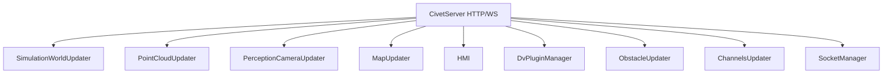

# Dreamview Plus

> 源码路径：`modules/dreamview_plus/`

## 概述

Dreamview Plus 是 Apollo 的增强版可视化与人机交互平台，基于 CivetServer（HTTP/WebSocket 服务器）构建。它提供仿真世界渲染、点云可视化、感知相机画面、地图服务、HMI 控制面板、插件管理等功能，是开发调试和场景回放的核心工具。相比旧版 Dreamview，Plus 版本增加了 SocketManager、UpdaterManager、DvPluginManager 等模块化管理能力。

## 架构



## 核心类

### Dreamview

```cpp
// backend/dreamview.h
class Dreamview {
 public:
  apollo::common::Status Init();
  apollo::common::Status Start();
  void Stop();
  void RegisterUpdaters();
 private:
  std::unique_ptr<CivetServer> server_;
  std::unique_ptr<SimulationWorldUpdater> sim_world_updater_;
  std::unique_ptr<PointCloudUpdater> point_cloud_updater_;
  std::unique_ptr<PerceptionCameraUpdater> perception_camera_updater_;
  std::unique_ptr<MapUpdater> map_updater_;
  std::unique_ptr<HMI> hmi_;
  std::unique_ptr<ObstacleUpdater> obstacle_updater_;
  std::unique_ptr<ChannelsUpdater> channels_info_updater_;
  std::unique_ptr<DvPluginManager> dv_plugin_manager_;
  std::unique_ptr<SocketManager> socket_manager_;
  std::unique_ptr<UpdaterManager> updater_manager_;
  std::unique_ptr<MapService> map_service_;
  std::unique_ptr<PluginManager> plugin_manager_;
};
```

**职责**：Dreamview Plus 主入口，初始化所有子服务和 WebSocket handler

## 子模块

| 子模块 | 职责 |
| --- | --- |
| `simulation_world` | 仿真世界状态聚合与推送 |
| `point_cloud` | LiDAR 点云实时可视化 |
| `perception_camera_updater` | 感知相机图像流 |
| `map` | 地图数据加载与更新 |
| `hmi` | 人机交互控制（启停模块、切换模式） |
| `obstacle_updater` | 障碍物数据推送 |
| `channels_updater` | Cyber channel 信息查询 |
| `dv_plugin` | Dreamview 插件管理 |
| `socket_manager` | WebSocket 连接管理 |
| `record_player` | 数据包回放 |

## 核心函数

### Dreamview::Init()

**职责**：初始化 HTTP 服务器、所有 WebSocket handler 和子模块
**关键步骤**：

1. 创建 CivetServer（配置端口、线程数）
2. 初始化 MapService（加载高精地图）
3. 创建各 WebSocketHandler 实例
4. 初始化 HMI、SimulationWorldUpdater、PointCloudUpdater 等
5. 注册插件回调

### Dreamview::Start()

**职责**：启动所有 Updater 的定时推送

### Dreamview::RegisterUpdaters()

**职责**：将所有 Updater 注册到 UpdaterManager 统一管理生命周期

## 配置

通过 `conf/` 目录下的配置文件和 GFlags 控制：

| 字段 | 说明 |
| --- | --- |
| 服务端口 | HTTP/WebSocket 监听端口 |
| 地图路径 | 高精地图数据目录 |
| 插件目录 | DvPlugin 加载路径 |

## 调用关系

- **上游**：订阅 Cyber 各模块 channel（定位、感知、规划、控制、底盘等）
- **下游**：通过 WebSocket 向前端浏览器推送实时数据
- **依赖**：CivetServer（HTTP 库）、MapService、SimControlManager
