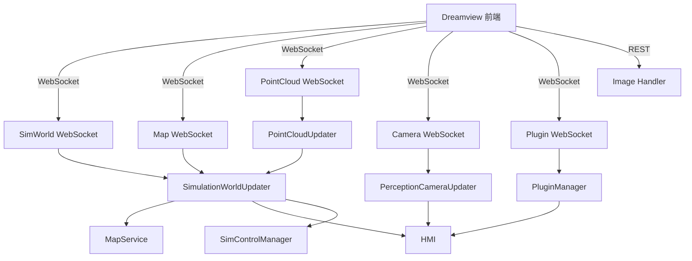

# Dreamview Backend 可视化后端

> 源码路径：`modules/dreamview/backend/`

## 概述

Dreamview Backend 是 Apollo 的可视化与人机交互后端服务，基于 CivetWeb HTTP 服务器提供 REST API 和 WebSocket 接口。前端通过 WebSocket 实时接收仿真世界状态、点云、相机画面等数据，通过 REST API 发送 HMI 控制指令。后端整合了仿真控制、地图服务、插件管理等子系统，是 Apollo 调试和监控的核心工具。

## 架构



## 核心类

### Dreamview

Dreamview 主类，负责初始化和协调所有子系统。

```cpp
class Dreamview {
 public:
  ~Dreamview();
  Status Init();
  Status Start();
  void Stop();

 private:
  std::unique_ptr<CivetServer> server_;
  std::unique_ptr<WebSocketHandler> websocket_;      // SimWorld
  std::unique_ptr<WebSocketHandler> map_ws_;         // Map
  std::unique_ptr<WebSocketHandler> point_cloud_ws_; // PointCloud
  std::unique_ptr<WebSocketHandler> camera_ws_;      // Camera
  std::unique_ptr<WebSocketHandler> plugin_ws_;      // Plugin
  std::unique_ptr<ImageHandler> image_;
  std::unique_ptr<MapService> map_service_;
  std::unique_ptr<HMI> hmi_;
  std::unique_ptr<SimulationWorldUpdater> sim_world_updater_;
  std::unique_ptr<PointCloudUpdater> point_cloud_updater_;
  std::unique_ptr<PerceptionCameraUpdater> perception_camera_updater_;
  std::unique_ptr<PluginManager> plugin_manager_;
};
```

**源码**：`modules/dreamview/backend/dreamview.h`、`modules/dreamview/backend/dreamview.cc`

## 核心函数

### Dreamview::Init()

```cpp
Status Dreamview::Init() {
  VehicleConfigHelper::Init();

  // 1. 可选：启动 profiling 模式定时退出
  if (FLAGS_dreamview_profiling_mode) {
    exit_timer_.reset(new cyber::Timer(duration, [this]() { Stop(); }));
  }

  // 2. 创建 CivetWeb HTTP 服务器
  server_.reset(new CivetServer({
    "document_root", FLAGS_static_file_dir,
    "listening_ports", FLAGS_server_ports,
    "websocket_timeout_ms", FLAGS_websocket_timeout_ms
  }));

  // 3. 创建 WebSocket 处理器
  websocket_.reset(new WebSocketHandler("SimWorld"));
  map_ws_.reset(new WebSocketHandler("Map"));
  point_cloud_ws_.reset(new WebSocketHandler("PointCloud"));
  camera_ws_.reset(new WebSocketHandler("Camera"));
  plugin_ws_.reset(new WebSocketHandler("Plugin"));

  // 4. 创建核心服务
  map_service_.reset(new MapService());
  hmi_.reset(new HMI(websocket_.get(), map_service_.get()));
  sim_world_updater_.reset(new SimulationWorldUpdater(...));
  point_cloud_updater_.reset(new PointCloudUpdater(...));
  perception_camera_updater_.reset(new PerceptionCameraUpdater(...));
  plugin_manager_.reset(new PluginManager(...));

  // 5. 注册路由
  server_->addWebSocketHandler("/websocket", *websocket_);
  server_->addWebSocketHandler("/map", *map_ws_);
  server_->addWebSocketHandler("/pointcloud", *point_cloud_ws_);
  server_->addWebSocketHandler("/camera", *camera_ws_);
  server_->addWebSocketHandler("/plugin", *plugin_ws_);
  server_->addHandler("/image", *image_);
}
```

### Dreamview::Start()

启动所有子系统，注册回调函数。

```cpp
Status Dreamview::Start() {
  sim_world_updater_->Start();
  point_cloud_updater_->Start(PointCloudCallback);
  hmi_->Start(HMICallbackSimControl);
  perception_camera_updater_->Start(PerceptionCameraCallback);
  plugin_manager_->Start(PluginCallbackHMI);
}
```

### Dreamview::HMICallbackSimControl()

HMI 回调处理器，支持以下操作：

| 操作 | 说明 |
|------|------|
| SimControlRestart | 重启仿真控制（指定 x, y 坐标） |
| MapServiceReloadMap | 重新加载地图 |
| LoadDynamicModels | 加载动力学模型列表 |
| ChangeDynamicModel | 切换动力学模型 |
| DeleteDynamicModel | 删除动力学模型 |
| AddDynamicModel | 添加动力学模型 |
| RestartDynamicModel | 重启动力学模型（重载地图+重启仿真） |

## 子模块

| 子目录 | 说明 |
|--------|------|
| `simulation_world/` | 仿真世界状态更新器，汇总各模块数据推送到前端 |
| `hmi/` | 人机交互管理，处理场景切换、模块状态等 |
| `point_cloud/` | 点云数据更新器 |
| `perception_camera_updater/` | 相机感知画面更新器 |
| `common/` | 通用工具：WebSocket 处理器、MapService、插件管理等 |

## WebSocket 路由

| 路径 | 处理器 | 数据类型 |
|------|--------|----------|
| `/websocket` | SimulationWorldUpdater | 仿真世界状态（JSON） |
| `/map` | SimulationWorldUpdater | 地图数据 |
| `/pointcloud` | PointCloudUpdater | 点云数据 |
| `/camera` | PerceptionCameraUpdater | 相机画面 |
| `/plugin` | PluginManager | 插件数据 |
| `/teleop` | TeleopService | 远程操控（可选） |

## REST 路由

| 路径 | 处理器 | 说明 |
|------|--------|------|
| `/image` | ImageHandler | 图片请求 |

## 配置

| gflags | 说明 |
|--------|------|
| `FLAGS_static_file_dir` | 前端静态文件目录 |
| `FLAGS_server_ports` | HTTP 服务端口 |
| `FLAGS_websocket_timeout_ms` | WebSocket 超时（毫秒） |
| `FLAGS_request_timeout_ms` | HTTP 请求超时（毫秒） |
| `FLAGS_ssl_certificate` | SSL 证书路径（可选） |
| `FLAGS_dreamview_profiling_mode` | 是否启用 profiling 模式 |
| `FLAGS_dreamview_profiling_duration` | profiling 模式持续时间（秒） |
| `FLAGS_routing_from_file` | 是否从文件加载路由 |

## 调用关系

- **上游**：各 Apollo 模块通过 CyberRT 通道发布数据
- **下游**：前端 Dreamview UI 通过 WebSocket/REST 获取数据和发送指令
- **依赖**：CivetWeb（HTTP 服务器）、MapService（地图查询）、SimControlManager（仿真控制）
