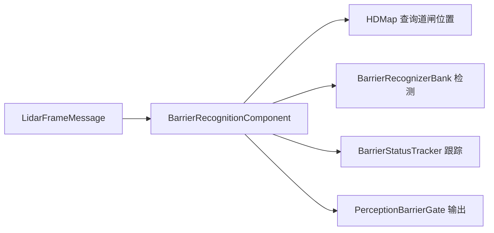

# Barrier Recognition

> 源码路径：`modules/perception/barrier_recognition/`

## 概述

Barrier Recognition 模块负责识别道路上的道闸（barrier gate）状态，包括道闸类型（杆式、栅栏式、伸缩式等）和开合状态。模块接收 LiDAR 帧数据，结合高精地图中的道闸位置信息，通过检测器识别道闸状态，并经过跟踪器平滑后输出结果。

## 架构



## 核心类

### BarrierRecognitionComponent

```cpp
// barrier_recognition_component.h
class BarrierRecognitionComponent final
    : public cyber::Component<LidarFrameMessage> {
 public:
  bool Init() override;
  bool Proc(const std::shared_ptr<LidarFrameMessage>& message) override;
 private:
  bool InternalProc(const std::shared_ptr<LidarFrameMessage>& message,
                    std::vector<BarrieGate>& gates);
  bool QueryPoseAndGates(const double ts, const Eigen::Affine3d& pose,
                         std::vector<apollo::hdmap::BarrierGate>* gates);
  void GetGatesPolygon(const apollo::hdmap::BarrierGate& barrier_gate,
                       std::vector<double>& world_polygon);
  bool MakeProtobufMsg(double msg_timestamp, int seq_num,
                       std::vector<BarrieGate> gates,
                       PerceptionBarrierGate* msg);
};
```

## 核心函数

### Init()

**职责**：初始化组件，加载配置、初始化检测器和跟踪器
**关键步骤**：

1. 加载 `BarrierRecognitionComponentConfig` 配置
2. 初始化 `BarrierRecognizerBank`（检测器组）
3. 初始化 `BarrierStatusTracker`（状态跟踪器）
4. 初始化 HDMap 实例
5. 创建输出 channel writer

### Proc()

```cpp
bool BarrierRecognitionComponent::Proc(
    const std::shared_ptr<LidarFrameMessage>& message) {
  std::vector<BarrieGate> gates;
  bool status = InternalProc(message, gates);
  if (status) {
    // 构建 protobuf 消息并发布
    MakeProtobufMsg(timestamp, seq_num_, gates, out_message.get());
    writer_->Write(out_message);
  }
  return status;
}
```

**职责**：处理每帧 LiDAR 数据，输出道闸识别结果

### InternalProc()

**职责**：核心处理流程
**关键步骤**：

1. 获取 LiDAR 帧的点云数据和时间戳
2. 通过 TF2 查询车辆位姿
3. 调用 `QueryPoseAndGates()` 从 HDMap 获取前方道闸位置
4. 对每个道闸提取多边形区域（`GetGatesPolygon()`）
5. 调用 `barrier_bank_.Recognize()` 识别道闸状态
6. 调用 `status_tracker_.Track()` 平滑跟踪结果

### QueryPoseAndGates()

**职责**：查询车辆前方一定距离内的道闸信息
**关键逻辑**：使用 `valid_hdmap_interval_`（1.5s）缓存 HDMap 查询结果，避免频繁查询

## 配置

| 字段 | 类型 | 说明 |
| --- | --- | --- |
| `frame_id` | string | TF2 父坐标系 |
| `child_frame_id` | string | TF2 子坐标系（LiDAR） |
| `output_channel_name` | string | 输出 channel 名称 |
| `recognizer_param` | RecognizerParam | 检测器配置路径 |
| `tracker_param` | TrackerParam | 跟踪器配置路径 |

## 道闸类型

| ID | 类型 |
| --- | --- |
| 0 | UNKNOWN |
| 1 | ROD（杆式） |
| 2 | FENCE（栅栏式） |
| 3 | ADVERTISING（广告式） |
| 4 | TELESCOPIC（伸缩式） |
| 5 | OTHER |

## 调用关系

- **上游**：LiDAR 感知流水线输出 `LidarFrameMessage`
- **依赖**：HDMap（道闸位置查询）、TF2（坐标变换）
- **下游**：输出 `PerceptionBarrierGate` 消息供 Planning 模块使用
