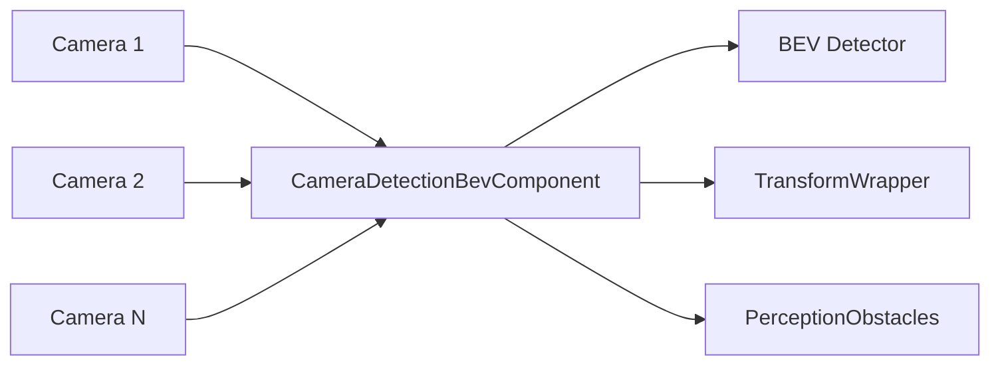

# Camera Detection BEV

> 源码路径：`modules/perception/camera_detection_bev/`

## 概述

Camera Detection BEV 组件基于鸟瞰图（Bird's Eye View）视角进行多相机融合 3D 目标检测。与单阶段检测不同，BEV 组件支持多路相机输入（默认 6 路），将多视角图像统一到 BEV 空间进行检测，输出 `PerceptionObstacles` 消息。

## 架构



## 核心类

### CameraFrame

```cpp
// camera_frame.h
struct CameraFrame {
  std::uint64_t frame_id;
  double timestamp;
  std::vector<std::shared_ptr<DataProvider>> data_provider;  // 多路相机
  std::vector<base::ObjectPtr> detected_objects;
};
```

### CameraDetectionBevComponent

```cpp
// camera_detection_bev_component.h
class CameraDetectionBevComponent final : public cyber::Component<> {
 public:
  bool Init() override;
 private:
  bool InitTransformWrapper(const CameraDetectionBEV& detection_param);
  bool InitCameraFrame(const CameraDetectionBEV& detection_param);
  bool InitListeners(const CameraDetectionBEV& detection_param);
  bool InitDetector(const CameraDetectionBEV& detection_param);
  bool OnReceiveImage(const std::shared_ptr<drivers::Image>& msg);
  void CameraToWorldCoor(const Eigen::Affine3d& camera2world,
                         std::vector<base::ObjectPtr>* objs);
  int MakeProtobufMsg(double msg_timestamp, int seq_num,
                      const std::vector<base::ObjectPtr>& objects,
                      PerceptionObstacles* obstacles);
};
```

**注意**：继承 `cyber::Component<>`（无模板参数），通过手动创建 Reader 订阅多路图像。

## 核心函数

### Init()

**职责**：初始化多路相机检测组件
**关键步骤**：

1. 加载 `CameraDetectionBEV` 配置
2. `InitDetector()`：获取相机内参，实例化 BEV 检测器插件
3. `InitCameraFrame()`：创建 6 路 DataProvider
4. `InitTransformWrapper()`：初始化坐标变换
5. `InitListeners()`：为每路相机创建 Reader，回调 `OnReceiveImage()`

### OnReceiveImage()

**职责**：接收图像并触发检测
**关键步骤**：

1. 将图像数据填充到对应 DataProvider（按 `frame_id` 取模分配）
2. 当收集到足够帧后调用 `detector_->Detect(frame_ptr_)`
3. 通过 TF 获取传感器到世界坐标系变换
4. `CameraToWorldCoor()` 转换检测结果到世界系
5. `MakeProtobufMsg()` 构建输出消息并发布

### CameraToWorldCoor()

**职责**：将检测到的 3D 目标从相机/LiDAR 坐标系转换到世界坐标系
**逻辑**：与单阶段检测相同，转换中心点位置和朝向角

## 配置

| 字段 | 类型 | 说明 |
| --- | --- | --- |
| `camera_name` | string | 主相机名称 |
| `gpu_id` | int | GPU 设备 ID |
| `enable_undistortion` | bool | 是否启用去畸变 |
| `plugin_param.name` | string | BEV 检测器插件名称 |
| `plugin_param.config_path` | string | 检测器配置路径 |
| `channel.input_camera_channel_name` | repeated string | 多路相机输入 channel |
| `channel.output_obstacles_channel_name` | string | 输出 channel |

## 调用关系

- **上游**：多路相机驱动发布 `drivers::Image`
- **依赖**：SensorManager（相机内参）、TransformWrapper（TF2）、DataProvider（图像预处理）
- **下游**：输出 `PerceptionObstacles` 供融合和 Planning 使用
