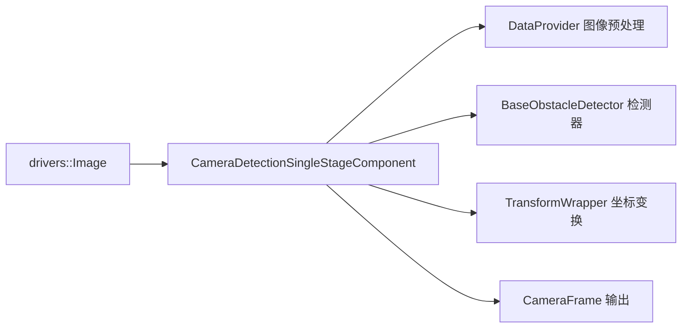

# Camera Detection Single Stage

> 源码路径：`modules/perception/camera_detection_single_stage/`

## 概述

单阶段相机检测组件负责从单目相机图像中直接检测 3D 障碍物。支持 SMOKE 和 CADDN 两种单阶段检测器，输入相机图像，输出包含 3D 位置、尺寸和朝向的障碍物列表。检测结果从相机坐标系转换到世界坐标系后发布给下游模块。

## 架构



## 核心类

### CameraDetectionSingleStageComponent

```cpp
// camera_detection_single_stage_component.h
class CameraDetectionSingleStageComponent final
    : public cyber::Component<apollo::drivers::Image> {
 public:
  bool Init() override;
  bool Proc(const std::shared_ptr<apollo::drivers::Image>& msg) override;
 private:
  bool InitObstacleDetector(const CameraDetectionSingleStage& detection_param);
  bool InitCameraFrame(const CameraDetectionSingleStage& detection_param);
  bool InitTransformWrapper(const CameraDetectionSingleStage& detection_param);
  void CameraToWorldCoor(const Eigen::Affine3d& camera2world,
                         std::vector<base::ObjectPtr>* objs);
  bool InternalProc(const std::shared_ptr<apollo::drivers::Image>& msg,
                    const std::shared_ptr<onboard::CameraFrame>& out_message);
};
```

## 核心函数

### Init()

**职责**：初始化检测器、数据提供器和坐标变换
**关键步骤**：

1. 加载 `CameraDetectionSingleStage` 配置
2. `InitObstacleDetector()`：从 SensorManager 获取相机内参，通过插件名实例化检测器（SMOKE/CADDN）
3. `InitCameraFrame()`：初始化 DataProvider（图像预处理）
4. `InitTransformWrapper()`：初始化 TF2 坐标变换
5. 创建输出 channel writer

### InternalProc()

```cpp
bool CameraDetectionSingleStageComponent::InternalProc(
    const std::shared_ptr<apollo::drivers::Image>& msg,
    const std::shared_ptr<onboard::CameraFrame>& out_message) {
  // 填充图像数据
  out_message->data_provider->FillImageData(
      image_height_, image_width_,
      reinterpret_cast<const uint8_t*>(msg->data().data()), msg->encoding());
  out_message->camera_k_matrix = camera_k_matrix_;
  out_message->timestamp = msg->measurement_time() + timestamp_offset_;

  // 获取相机到世界坐标系变换
  Eigen::Affine3d camera2world;
  trans_wrapper_->GetSensor2worldTrans(msg_timestamp, &camera2world);
  out_message->camera2world_pose = camera2world;

  // 执行检测
  detector_->Detect(out_message.get());

  // 坐标转换到世界系
  CameraToWorldCoor(camera2world, &out_message->detected_objects);
  return true;
}
```

**职责**：单帧图像的完整处理流程
**输入**：相机图像消息
**输出**：填充了检测结果的 CameraFrame

### CameraToWorldCoor()

```cpp
void CameraDetectionSingleStageComponent::CameraToWorldCoor(
    const Eigen::Affine3d& camera2world, std::vector<base::ObjectPtr>* objs) {
  for (auto& obj : *objs) {
    // 3D 中心点从相机系转到世界系
    obj->center = camera2world * obj->camera_supplement.local_center.cast<double>();
    // 计算世界系下的朝向角
    float rotation_y = std::atan2(x, z) + obj->camera_supplement.alpha;
    Eigen::Vector3d direction = camera2world.linear() * local_theta;
    obj->theta = std::atan2(obj->direction(1), obj->direction(0));
  }
}
```

**职责**：将检测结果从相机坐标系转换到世界坐标系
**关键逻辑**：利用 camera2world 变换矩阵转换中心点位置和朝向角

## 支持的检测器

| 检测器 | 说明 |
| --- | --- |
| SMOKE | 基于关键点的单阶段 3D 目标检测 |
| CADDN | 基于深度分布的相机 3D 检测（Category-Aware Depth Distribution Network） |

## 配置

| 字段 | 类型 | 说明 |
| --- | --- | --- |
| `camera_name` | string | 相机名称（用于获取内参和 TF） |
| `gpu_id` | int | GPU 设备 ID |
| `enable_undistortion` | bool | 是否启用去畸变 |
| `plugin_param.name` | string | 检测器插件名称 |
| `plugin_param.config_path` | string | 检测器配置路径 |
| `plugin_param.config_file` | string | 检测器配置文件 |
| `channel.output_obstacles_channel_name` | string | 输出 channel |

## 调用关系

- **上游**：相机驱动发布 `drivers::Image` 消息
- **依赖**：SensorManager（相机内参）、TransformWrapper（TF2 坐标变换）、DataProvider（图像预处理）
- **下游**：输出 `onboard::CameraFrame` 供融合模块使用
