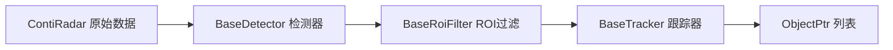

# Radar Detection

> 源码路径：`modules/perception/radar_detection/`

## 概述

Radar Detection 模块负责处理毫米波雷达（Continental Radar）原始数据，完成障碍物检测、ROI 过滤和目标跟踪三个阶段。输入雷达驱动发布的 `ContiRadar` 消息，输出经过跟踪的障碍物列表。采用三级流水线架构，每级通过插件注册器实现可替换。

## 架构



## 核心类

### RadarObstaclePerception

```cpp
// app/radar_obstacle_perception.h
class RadarObstaclePerception : public BaseRadarObstaclePerception {
 public:
  bool Init(const PerceptionInitOptions& options) override;
  bool Perceive(const drivers::ContiRadar& corrected_obstacles,
                const RadarPerceptionOptions& options,
                std::vector<base::ObjectPtr>* objects) override;
  std::string Name() const override;
 private:
  std::shared_ptr<BaseDetector> detector_;
  std::shared_ptr<BaseRoiFilter> roi_filter_;
  std::shared_ptr<BaseTracker> tracker_;
};
```

## 核心函数

### Init()

**职责**：初始化三级流水线插件
**关键步骤**：

1. 加载 `RadarObstaclePerceptionConfig` 配置
2. 通过注册器实例化 `BaseDetector`（雷达目标检测）
3. 通过注册器实例化 `BaseRoiFilter`（ROI 过滤）
4. 通过注册器实例化 `BaseTracker`（目标跟踪）

### Perceive()

```cpp
bool RadarObstaclePerception::Perceive(
    const drivers::ContiRadar& corrected_obstacles,
    const RadarPerceptionOptions& options,
    std::vector<base::ObjectPtr>* objects) {
  // Step 1: 检测 - 将雷达原始点转为 Object
  detector_->Detect(corrected_obstacles, options.detector_options,
                    detect_frame_ptr);

  // Step 2: ROI 过滤 - 去除 HDMap ROI 外的目标
  roi_filter_->RoiFilter(options.roi_filter_options, detect_frame_ptr);

  // Step 3: 跟踪 - 多帧关联和状态估计
  tracker_->Track(*detect_frame_ptr, options.track_options,
                  tracker_frame_ptr);

  *objects = tracker_frame_ptr->objects;
  return true;
}
```

**职责**：完整的雷达感知流水线
**输入**：`ContiRadar` 原始雷达数据 + 感知选项（传感器名、ROI 等）
**输出**：跟踪后的障碍物列表

## 配置

| 字段 | 类型 | 说明 |
| --- | --- | --- |
| `detector_param.name` | string | 检测器插件名称 |
| `detector_param.config_path` | string | 检测器配置路径 |
| `roi_filter_param.name` | string | ROI 过滤器插件名称 |
| `roi_filter_param.config_path` | string | ROI 过滤器配置路径 |
| `tracker_param.name` | string | 跟踪器插件名称 |
| `tracker_param.config_path` | string | 跟踪器配置路径 |

## 调用关系

- **上游**：雷达驱动发布 `drivers::ContiRadar`
- **调用者**：感知融合组件通过 `BaseRadarObstaclePerception` 接口调用
- **下游**：输出 `ObjectPtr` 列表供多传感器融合使用
