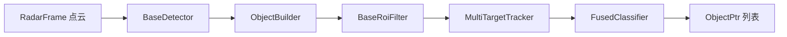

# Radar4D Detection

> 源码路径：`modules/perception/radar4d_detection/`

## 概述

Radar4D Detection 模块处理 4D 毫米波雷达（具备高度维度信息）的点云数据，完成障碍物检测、构建、ROI 过滤和多目标跟踪。与传统 2D 雷达检测不同，4D 雷达输入为点云帧（`RadarFrame`），处理流程更接近 LiDAR 检测，包含 ObjectBuilder 构建 3D 包围盒和多目标跟踪器（MRF Engine）。

## 架构



## 核心类

### RadarObstaclePerception

```cpp
// app/radar_obstacle_perception.h
class RadarObstaclePerception : public BaseRadarObstaclePerception {
 public:
  bool Init(const PerceptionInitOptions& options) override;
  bool Perceive(RadarFrame* frame,
                const RadarPerceptionOptions& options,
                std::vector<base::ObjectPtr>* objects) override;
  std::string Name() const override;
 private:
  std::shared_ptr<BaseDetector> detector_;
  ObjectBuilder builder_;
  std::shared_ptr<BaseRoiFilter> roi_filter_;
  BaseMultiTargetTracker* multi_target_tracker_;
  BaseClassifier* fusion_classifier_;
  bool enable_roi_filter_ = false;
};
```

## 核心函数

### Init()

**职责**：初始化五级流水线插件
**关键步骤**：

1. 加载 `RadarObstaclePerceptionConfig` 配置
2. 实例化 `BaseDetector`（点云检测/分割）
3. 初始化 `ObjectBuilder`（从分割结果构建 3D 包围盒）
4. 实例化 `BaseRoiFilter`（HDMap ROI 过滤，可选）
5. 实例化 `BaseMultiTargetTracker`（MRF 多目标跟踪）
6. 实例化 `BaseClassifier`（融合分类，当前注释未启用）

### Perceive()

```cpp
bool RadarObstaclePerception::Perceive(
    RadarFrame* frame, const RadarPerceptionOptions& options,
    std::vector<base::ObjectPtr>* objects) {
  // Step 1: 点云检测/分割
  detector_->Detect(frame, options.detector_options);

  // Step 2: 构建 3D 包围盒
  builder_.Build(options.detector_options, frame);

  // Step 3: ROI 过滤（可选）
  if (enable_roi_filter_) {
    roi_filter_->RoiFilter(options.roi_filter_options, frame);
  }

  // Step 4: 多目标跟踪
  multi_target_tracker_->Track(tracker_options, frame);

  *objects = frame->tracked_objects;
  return true;
}
```

**职责**：完整的 4D 雷达感知流水线
**输入**：`RadarFrame`（含预处理后的 4D 雷达点云）
**输出**：跟踪后的障碍物列表

## 与传统雷达检测的区别

| 特性 | radar_detection | radar4d_detection |
| --- | --- | --- |
| 输入 | ContiRadar（目标级） | RadarFrame（点云级） |
| ObjectBuilder | 无 | 有（从点云构建3D框） |
| 跟踪器 | BaseTracker | BaseMultiTargetTracker (MRF) |
| 分类器 | 无 | FusedClassifier（预留） |
| 高度信息 | 无 | 有 |

## 配置

| 字段 | 类型 | 说明 |
| --- | --- | --- |
| `detector_param.name` | string | 检测器插件名称 |
| `enable_roi_filter` | bool | 是否启用 ROI 过滤 |
| `roi_filter_param.name` | string | ROI 过滤器插件名称 |
| `multi_target_tracker_param.name` | string | 多目标跟踪器名称 |
| `fusion_classifier_param.name` | string | 融合分类器名称 |

## 调用关系

- **上游**：4D 雷达驱动发布点云数据
- **调用者**：感知融合组件通过 `BaseRadarObstaclePerception` 接口调用
- **下游**：输出 `ObjectPtr` 列表供多传感器融合使用
