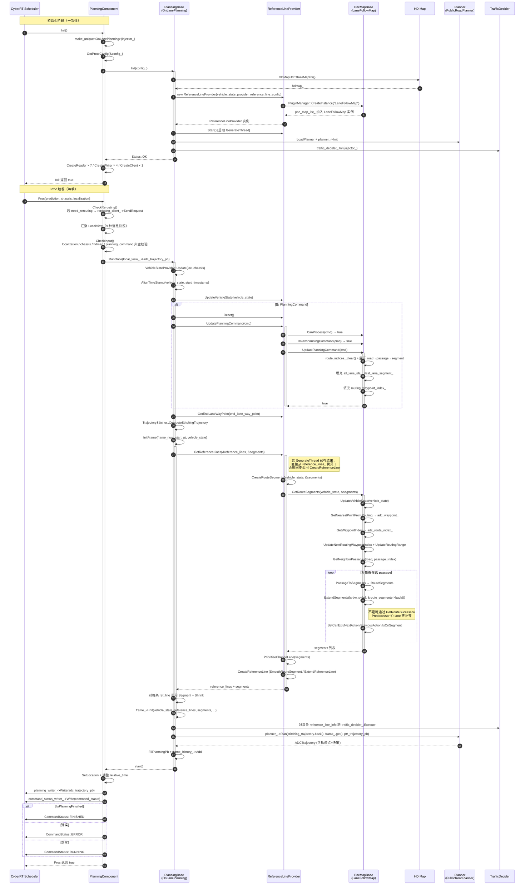

# planning_component 与 pnc_map 函数级源码剖析

本文档对 Apollo Planning 模块中两个最核心的子模块——`planning_component`（CyberRT 入口组件 + 顶层调度骨架）与 `pnc_map`（路由到参考线之间的关键中间层）——进行函数级、逐行级的剖析。所有源码引用均指向 `modules/planning/planning_component/` 与 `modules/planning/pnc_map/lane_follow_map/` 下的真实文件；`PncMapBase` 基类位于 `modules/map/pnc_map/` 目录，本文一并覆盖。

本文档面向的读者是需要对 Planning 的启动、触发、线程模型、数据流与 Routing→ReferenceLine 转换过程有精确认知的开发者与架构师。

::: tip 阅读约定
- 所有代码引用格式为 `modules/...:行号`，引用基于 apollo-edu 仓库 `main` 分支当前代码快照。
- 为避免歧义，凡未在源码中出现的函数/字段均不会出现在本文中。
- 本文与 [Planning 模块总览](./index.md) 与 [Decision 模块](./decision.md) 构成完整的 Planning 技术栈文档。
:::

## 1. 模块总览

### 1.1 两个模块在 Planning 栈中的位置

```
                 ┌────────────────────────────────────────────────────────┐
                 │                    cyber::Component                     │
                 │  ┌─────────────────────────────────────────────────┐   │
                 │  │          PlanningComponent                       │   │
                 │  │  Init()                                          │   │
                 │  │  Proc(prediction, chassis, localization)         │   │
                 │  └─────────────────┬───────────────────────────────┘   │
                 └────────────────────┼───────────────────────────────────┘
                                      │ LocalView
                                      ▼
                              ┌───────────────┐
                              │ PlanningBase  │
                              └───────┬───────┘
                                      │
                    ┌─────────────────┼─────────────────┐
                    ▼                                   ▼
             ┌──────────────┐                   ┌──────────────┐
             │ OnLanePlanning│                   │  NaviPlanning │
             └───────┬──────┘                   └──────────────┘
                     │ reference_line_provider_
                     ▼
             ┌──────────────────────┐
             │ ReferenceLineProvider│
             └──────────┬───────────┘
                        │ current_pnc_map_
                        ▼
                  ┌──────────────┐
                  │  PncMapBase  │  (抽象基类，位于 modules/map/pnc_map)
                  └──────┬───────┘
                         │ 派生
                         ▼
                  ┌──────────────┐
                  │ LaneFollowMap│  (位于 modules/planning/pnc_map/lane_follow_map)
                  └──────────────┘
```

- `planning_component` 承担 CyberRT 适配、输入汇聚（`LocalView`）、DAG/launch/conf 解析、结果发布、Rerouting 请求转发等 **框架层** 工作。
- `pnc_map` 承担从 `PlanningCommand`（内含 `routing::RoutingResponse`）到 `hdmap::RouteSegments` 的 **数据转换** 工作，是 ReferenceLineProvider 的上游。

### 1.2 源文件清单

**planning_component/**（共 8 个源文件）：

| 文件 | 行数 | 职责 |
|---|---|---|
| `planning_component.h` | 110 | 声明 `PlanningComponent`，继承 `cyber::Component<PredictionObstacles, Chassis, LocalizationEstimate>` |
| `planning_component.cc` | 360 | `Init` / `Proc` / `CheckRerouting` / `CheckInput` / `SetLocation` 实现 |
| `planning_base.h` | 113 | 声明 `PlanningBase` 抽象基类 |
| `planning_base.cc` | 159 | 构造/析构、`Init`、`IsPlanningFinished`、`FillPlanningPb`、`LoadPlanner`、`GenerateWidthOfLane` |
| `on_lane_planning.h` | 110 | 声明 `OnLanePlanning`，封装车道级规划主流程 |
| `on_lane_planning.cc` | 1284 | `RunOnce` / `Plan` / `InitFrame` / `AlignTimeStamp` / 调试导出 |
| `navi_planning.h` | 127 | 声明 `NaviPlanning`，针对相对地图（导航）模式 |
| `navi_planning.cc` | 609 | 导航模式下的 `RunOnce` / `Plan` / `ProcessPadMsg` 等 |

**pnc_map/**（只保留 `lane_follow_map` 实现插件）：

| 文件 | 行数 | 职责 |
|---|---|---|
| `pnc_map_base.h` *（路径：`modules/map/pnc_map/pnc_map_base.h`）* | 114 | `PncMapBase` 抽象接口 |
| `pnc_map_base.cc` | 72 | `UpdatePlanningCommand`、`LookForwardDistance`、`IsNewPlanningCommand` |
| `lane_follow_map.h` | 236 | `LaneFollowMap` 继承 `PncMapBase`，成员变量与私有辅助函数 |
| `lane_follow_map.cc` | 904 | `GetRouteSegments` / `UpdateVehicleState` / `GetNearestPointFromRouting` / `ExtendSegments` 等 |
| `plugins.xml` | 3 | CyberRT 插件注册 |

## 2. PlanningComponent：CyberRT 入口

### 2.1 类声明与模板参数

`PlanningComponent` 在 `planning_component.h:44-46` 被声明为：

```cpp
class PlanningComponent final
    : public cyber::Component<prediction::PredictionObstacles, canbus::Chassis,
                              localization::LocalizationEstimate> {
```

- 继承自 `cyber::Component` 的三参数模板版本：意味着 CyberRT 会在同时满足 **三个订阅 channel 都有消息** 时触发一次 `Proc`。这三个 channel 默认分别是 `/apollo/prediction`、`/apollo/canbus/chassis`、`/apollo/localization/pose`（参见 `dag/planning.dag`）。
- `final` 关键字禁止再派生。
- Component 尾部 `CYBER_REGISTER_COMPONENT(PlanningComponent)`（`planning_component.h:107`）完成 CyberRT 的类注册。

### 2.2 数据成员（`planning_component.h:66-105`）

成员可划分为四大组：

**（a）Reader / Writer / Client**：

| 成员 | 类型 | 作用 |
|---|---|---|
| `traffic_light_reader_` | `Reader<TrafficLightDetection>` | 订阅交通灯感知结果 |
| `pad_msg_reader_` | `Reader<PadMessage>` | 订阅驾驶交互面板指令 |
| `relative_map_reader_` | `Reader<MapMsg>` | 仅导航模式订阅相对地图 |
| `story_telling_reader_` | `Reader<Stories>` | 订阅 StoryTelling 场景标注 |
| `planning_command_reader_` | `Reader<PlanningCommand>` | 订阅规划命令（内含 lane_follow/valet_parking 等路由） |
| `edge_info_reader_` | `Reader<PerceptionEdgeInfo>` | 订阅路沿感知 |
| `control_interactive_reader_` | `Reader<ControlInteractiveMsg>` | 订阅控制反馈 |
| `planning_writer_` | `Writer<ADCTrajectory>` | 发布最终规划轨迹 |
| `rerouting_client_` | `Client<LaneFollowCommand, CommandStatus>` | 向 external_command 发起重新路由请求 |
| `planning_learning_data_writer_` | `Writer<PlanningLearningData>` | RL 模式下发布学习数据帧 |
| `command_status_writer_` | `Writer<CommandStatus>` | 发布指令执行状态（RUNNING/FINISHED/ERROR） |

**（b）缓存消息的互斥 + 快照**：`mutex_` 保护 `traffic_light_`、`pad_msg_`、`relative_map_`、`stories_`、`planning_command_`、`edge_info_`、`control_interactive_msg_` 的回调写入与主线程读取。

**（c）聚合视图**：`LocalView local_view_` 汇聚当前帧所有输入，是 `PlanningBase::RunOnce` 的唯一入参。

**（d）规划骨架**：`std::unique_ptr<PlanningBase> planning_base_`、`DependencyInjector injector_`、`PlanningConfig config_`、`MessageProcess message_process_`。

::: tip `PlanningComponent` 为什么不订阅 routing 原始响应？
Apollo 近版本已经把路由层改为 **external_command 驱动**，PlanningComponent 只订阅 `PlanningCommand` 这一更高抽象的命令（参见 `planning_component_topic: planning_command_topic` 配置）。
路由结果 `RoutingResponse` 被打包在 `PlanningCommand.lane_follow_command` 字段中。
:::

### 2.3 `PlanningComponent::Init()` 全流程

**位置**：`modules/planning/planning_component/planning_component.cc:45-139`。

```cpp
bool PlanningComponent::Init() {
  injector_ = std::make_shared<DependencyInjector>();
  if (FLAGS_use_navigation_mode) {
    planning_base_ = std::make_unique<NaviPlanning>(injector_);
  } else {
    planning_base_ = std::make_unique<OnLanePlanning>(injector_);
  }
  ...
}
```

逐步拆解：

**步骤 1：创建 DependencyInjector**（`planning_component.cc:46`）

`DependencyInjector` 是 Planning 内部使用的全局上下文容器，保存以下关键单例：`frame_history`（帧历史）、`history`（决策历史）、`planning_context`（规划状态机上下文）、`vehicle_state`（车辆状态）、`ego_info`（自车几何与运动学信息）、`learning_based_data`（学习模式数据）。Planning 内部所有类通过 `injector_->xxx()` 读写这些对象。

**步骤 2：按 flag 选择规划骨架**（`planning_component.cc:48-52`）

`FLAGS_use_navigation_mode`（`planning_gflags` 中定义）决定使用哪一个 `PlanningBase` 派生类：
- `false`（默认）→ `OnLanePlanning`：基于 HD Map + Routing 的结构化道路规划。
- `true` → `NaviPlanning`：基于相对地图（由感知或 V2X 生成）的导航式规划。

**步骤 3：加载 PlanningConfig**（`planning_component.cc:54-56`）

```cpp
ACHECK(ComponentBase::GetProtoConfig(&config_))
    << "failed to load planning config file "
    << ComponentBase::ConfigFilePath();
```

`ComponentBase::GetProtoConfig` 是 CyberRT 提供的配置加载工具，读取 DAG 文件中 `config_file_path` 指向的 `planning_config.pb.txt`。若失败则 `ACHECK` 直接触发 FATAL。

**步骤 4：（可选）初始化 MessageProcess**（`planning_component.cc:58-64`）

仅在 `FLAGS_planning_offline_learning` 为真或 `config_.learning_mode() != NO_LEARNING` 时执行。`MessageProcess` 是离线学习数据管线，将实时感知/定位/路由消息转储成学习样本。

**步骤 5：初始化规划骨架**（`planning_component.cc:66`）

```cpp
planning_base_->Init(config_);
```

此处会进入 `OnLanePlanning::Init` 或 `NaviPlanning::Init`，详见后文 §3 与 §4。

**步骤 6：创建所有 Reader**（`planning_component.cc:68-126`）

按固定顺序创建 7 个 Reader：

1. `planning_command_reader_`（`planning_component.cc:68-75`）：订阅 `planning_command_topic`，回调中使用 `std::lock_guard<std::mutex> lock(mutex_)` 加锁后 `CopyFrom`，以保证与主循环的线程安全。
2. `traffic_light_reader_`（77-83）、`pad_msg_reader_`（85-91）、`story_telling_reader_`（93-99）、`edge_info_reader_`（101-107）、`control_interactive_reader_`（109-116）：同样的加锁-拷贝模式。
3. `relative_map_reader_`：仅当 `FLAGS_use_navigation_mode == true` 时创建（`planning_component.cc:118-126`）。

::: tip 注意
Reader 的回调在 CyberRT 的调度线程池中执行，而 `Proc` 在 Component 自己的触发线程中执行；`mutex_` 保护的是 **主循环与回调之间** 的竞争。
:::

**步骤 7：创建所有 Writer/Client**（`planning_component.cc:127-137`）

- `planning_writer_`：`ADCTrajectory` 主输出通道，topic 来自配置（`/apollo/planning`）。
- `rerouting_client_`：注意这是 `Client` 而非 `Writer`，因为 rerouting 是一次 RPC（需等待 `CommandStatus` 响应）。Topic 为 `routing_request_topic`（`/apollo/external_command/lane_follow`）。
- `planning_learning_data_writer_`：学习数据帧。
- `command_status_writer_`：向 external_command 反馈规划执行状态，topic 来自 `FLAGS_planning_command_status`。

`Init` 返回 `true` 表示 Component 已准备好接收消息触发。

### 2.4 `PlanningComponent::Proc()`：每帧主入口

**位置**：`planning_component.cc:141-284`。

Proc 是 CyberRT 三元 Component 的触发回调，签名为：

```cpp
bool Proc(const std::shared_ptr<PredictionObstacles>& prediction_obstacles,
          const std::shared_ptr<Chassis>& chassis,
          const std::shared_ptr<LocalizationEstimate>& localization_estimate);
```

#### 2.4.1 触发逻辑（三路 channel 对齐）

CyberRT 的 `cyber::Component<T1, T2, T3>` 实现了 **"最新三元组对齐触发"**：
- Component 维护每个 channel 的最近一条消息（由 `readers` 列表的 `qos_profile.depth` 控制窗口）。
- 当任一 channel 到达新消息时，尝试与其他 channel 的 **最近** 消息配对；若三者都非空，立即调用 `Proc`。
- 由于 `prediction`（100Hz 在 Apollo 中一般降为 10Hz）、`chassis`（100Hz）、`localization`（100Hz）频率差异大，实际上 Proc 的触发频率由 **三者中频率最低的** 决定——在 Apollo 8.0+ 中通常是 `prediction`，故 Planning 主循环 ≈10Hz。

配置中的 `qos_profile.depth: 15` 与 `pending_queue_size: 50`（`dag/planning.dag:17-18`、`23-24`）给 `chassis` 和 `localization` 留出更大缓冲，避免短暂阻塞导致消息丢失。

::: warning 注意
PlanningCommand、交通灯等 **不在** Component 模板参数中，不参与触发，只在 Reader 回调中异步缓存。
这意味着，即使 `planning_command` 迟迟未到，只要三元组就绪，`Proc` 依然会被触发——此时 `CheckInput` 会判出 `planning_command not ready`，跳过规划。
:::

#### 2.4.2 Proc 内部流程（逐步）

**第 1 步：前置保护**（`planning_component.cc:147`）

```cpp
ACHECK(prediction_obstacles != nullptr);
```

空指针直接 FATAL。

**第 2 步：处理 Rerouting**（`planning_component.cc:150`）

```cpp
CheckRerouting();
```

见 §2.5。

**第 3 步：构建 LocalView**（`planning_component.cc:153-206`）

依次将输入装入 `local_view_`：

```cpp
local_view_.prediction_obstacles = prediction_obstacles;
local_view_.chassis = chassis;
local_view_.localization_estimate = localization_estimate;
```

对于 **带 header** 的缓存消息（`planning_command`、`pad_msg`、`perception_road_edge`、`control_interactive_msg`），采用 header 比对避免重复拷贝：

```cpp
if (!local_view_.planning_command ||
    !common::util::IsProtoEqual(local_view_.planning_command->header(),
                                planning_command_.header())) {
  local_view_.planning_command =
      std::make_shared<PlanningCommand>(planning_command_);
}
```

注意：`traffic_light` 与 `relative_map`、`stories` 每帧都 **无条件重建**（`planning_component.cc:167-170`、`185-187`）——因为它们频率高、比对成本 > 拷贝成本。

**第 3.5 步：处理 PadMessage 的 CLEAR_PLANNING**（`planning_component.cc:171-183`）

若 `pad_msg_.action() == PadMessage::CLEAR_PLANNING`，会 **清空当前 planning_command**：

```cpp
if (pad_msg_.action() == PadMessage::CLEAR_PLANNING) {
  local_view_.planning_command = nullptr;
  planning_command_.Clear();
}
```

这是用户主动取消规划的入口（例如 Dreamview 上按 "Stop Planning"）。

**第 4 步：输入合法性检查**（`planning_component.cc:208-211`）

```cpp
if (!CheckInput()) {
  AINFO << "Input check failed";
  return false;
}
```

`CheckInput` 详见 §2.6。

**第 5 步：学习模式数据注入**（`planning_component.cc:213-241`）

仅当 `config_.learning_mode() != NO_LEARNING` 时，调用 `message_process_.OnXxx` 把当前帧消息注入离线数据管道；若是 `RL_TEST` 模式，直接 publish `PlanningLearningData` 并提前返回。

**第 6 步：调用规划骨架**（`planning_component.cc:243-246`）

```cpp
ADCTrajectory adc_trajectory_pb;
planning_base_->RunOnce(local_view_, &adc_trajectory_pb);
auto start_time = adc_trajectory_pb.header().timestamp_sec();
common::util::FillHeader(node_->Name(), &adc_trajectory_pb);
```

这里的 `RunOnce` 是 **纯虚函数**，实际进入 `OnLanePlanning::RunOnce`（详见 §4）或 `NaviPlanning::RunOnce`（详见 §5）。
注意 `FillHeader` 会覆盖 header 的 timestamp、sequence_num、module_name——因此接下来要重新计算 **相对时间偏移**。

**第 7 步：填充车道边界（SetLocation）**（`planning_component.cc:248`）

见 §2.7。

**第 8 步：修正轨迹点相对时间**（`planning_component.cc:250-253`）

由于 header timestamp 被覆盖，每个 `trajectory_point` 的 `relative_time` 需要补偿差值 `dt`：

```cpp
const double dt = start_time - adc_trajectory_pb.header().timestamp_sec();
for (auto& p : *adc_trajectory_pb.mutable_trajectory_point()) {
  p.set_relative_time(p.relative_time() + dt);
}
```

**第 9 步：发布 ADCTrajectory**（`planning_component.cc:254`）

```cpp
planning_writer_->Write(adc_trajectory_pb);
```

**第 10 步：构造并发布 CommandStatus**（`planning_component.cc:258-277`）

```cpp
external_command::CommandStatus command_status;
common::util::FillHeader(node_->Name(), &command_status);
if (nullptr != local_view_.planning_command) {
  command_status.set_command_id(local_view_.planning_command->command_id());
}
```

状态机：
- `header().status().error_code() != OK` → `ERROR`（同时附带 error message）
- `planning_base_->IsPlanningFinished(trajectory_type)` → `FINISHED`
- 其它 → `RUNNING`

这套状态反馈由 external_command 模块消费，用于驱动上层 **指令排队/切换** 逻辑。

**第 11 步：归档到 History**（`planning_component.cc:280-281`）

```cpp
auto* history = injector_->history();
history->Add(adc_trajectory_pb);
```

`History` 保存最近若干帧的 `ADCTrajectory`，供决策层复用（例如 "本帧是否继续执行上一帧的 stop_sign" 判定）。

### 2.5 `PlanningComponent::CheckRerouting()`

**位置**：`planning_component.cc:286-300`。

```cpp
void PlanningComponent::CheckRerouting() {
  auto* rerouting = injector_->planning_context()
                        ->mutable_planning_status()
                        ->mutable_rerouting();
  if (!rerouting->need_rerouting()) {
    return;
  }
  common::util::FillHeader(node_->Name(),
                           rerouting->mutable_lane_follow_command());
  auto lane_follow_command_ptr =
      std::make_shared<LaneFollowCommand>(rerouting->lane_follow_command());
  rerouting_client_->SendRequest(lane_follow_command_ptr);
  rerouting->set_need_rerouting(false);
}
```

逻辑：
1. 从 `planning_status` 中读取 rerouting 标志（该标志由 planning 内部的 re-planning / 偏离 routing 检测器设置）。
2. 若需要重新路由，填充 header 后通过 `rerouting_client_` **同步**（实际是 CyberRT Client 的异步 SendRequest）发起一次 `LaneFollowCommand`。
3. **重要副作用**：立即将 `need_rerouting` 复位为 `false`，避免每帧重复发请求。

::: warning 再路由 (Rerouting) 的时机
`rerouting->need_rerouting()` 会被置为 true 的场景常见于：
- 车辆偏离当前 routing 的所有可行 passage；
- 前方不可通行（障碍物长时间阻塞）且需要绕行。
真正的置位代码位于 planning 内部的 scenario 层而非本文件。
:::

### 2.6 `PlanningComponent::CheckInput()`

**位置**：`planning_component.cc:302-338`。

```cpp
bool PlanningComponent::CheckInput() {
  ADCTrajectory trajectory_pb;
  SetLocation(&trajectory_pb);
  auto* not_ready = trajectory_pb.mutable_decision()
                        ->mutable_main_decision()
                        ->mutable_not_ready();
  ...
}
```

检查三条件：
1. `localization_estimate == nullptr` → `localization not ready`
2. `chassis == nullptr` → `chassis not ready`
3. `HDMapUtil::BaseMapPtr() == nullptr` → `map not ready`

导航模式下额外检查 `relative_map`；非导航模式检查 `planning_command` 是否存在且带 header。

若任一失败，**仍然发布一条 "stop 轨迹"**：通过 `planning_writer_->Write(trajectory_pb)` 把 `not_ready` 原因写回，供下游 control 模块进入容错逻辑。这是 Planning 的"永不静默"设计原则。

### 2.7 `PlanningComponent::SetLocation()`

**位置**：`planning_component.cc:340-357`。

```cpp
void PlanningComponent::SetLocation(ADCTrajectory* const ptr_trajectory_pb) {
  auto p = ptr_trajectory_pb->mutable_location_pose();
  p->mutable_vehice_location()->set_x(
      local_view_.localization_estimate->pose().position().x());
  p->mutable_vehice_location()->set_y(
      local_view_.localization_estimate->pose().position().y());
  const Vec2d& adc_position = { ... };
  Vec2d left_point, right_point;
  if (planning_base_->GenerateWidthOfLane(adc_position, left_point,
                                          right_point)) {
    p->mutable_left_lane_boundary_point()->set_x(left_point.x());
    ...
  }
}
```

- 把当前定位 (x, y) 写入 `location_pose.vehice_location`。
- 调用 `PlanningBase::GenerateWidthOfLane`（详见 §3.6）获取当前所在车道的左右边界点，写入 `left_lane_boundary_point` / `right_lane_boundary_point`。
- 该信息主要用于 Dreamview 可视化 "自车-车道" 相对位置。

## 3. PlanningBase：抽象基类

### 3.1 设计职责

`PlanningBase` 封装 `OnLanePlanning` 与 `NaviPlanning` 共同需要的成员与流程骨架。定义在 `planning_base.h:58-110`，它本身是抽象类（`Name()`、`RunOnce()`、`Plan()` 纯虚）。

### 3.2 关键成员（`planning_base.h:92-109`）

| 成员 | 类型 | 作用 |
|---|---|---|
| `local_view_` | `LocalView` | 当前帧输入视图（`RunOnce` 进入时拷贝自 PlanningComponent） |
| `hdmap_` | `const hdmap::HDMap*` | 地图指针（OnLanePlanning 在 Init 时赋 BaseMapPtr；NaviPlanning 每帧从 relative_map 取） |
| `start_time_` | `double` | Planner 初始化时间戳 |
| `seq_num_` | `size_t` | 规划帧序号 |
| `config_` | `PlanningConfig` | 配置拷贝 |
| `traffic_decider_` | `TrafficDecider` | 交通规则执行器 |
| `frame_` | `std::unique_ptr<Frame>` | 当前帧的完整规划上下文（参考线、障碍物、决策……） |
| `planner_` | `std::shared_ptr<Planner>` | 通过 PluginManager 动态加载的具体规划器 |
| `last_publishable_trajectory_` | `std::unique_ptr<PublishableTrajectory>` | 上一帧发布的轨迹，用于本帧 stitching |
| `injector_` | `std::shared_ptr<DependencyInjector>` | 全局上下文 |

### 3.3 `PlanningBase::Init()`

**位置**：`planning_base.cc:44-48`。

```cpp
Status PlanningBase::Init(const PlanningConfig& config) {
  injector_->planning_context()->Init();
  config_ = config;
  return Status::OK();
}
```

非常薄——仅初始化 `planning_context` 并拷贝配置。真正的 planner 加载、ReferenceLineProvider 启动在派生类 `OnLanePlanning::Init` / `NaviPlanning::Init` 中完成。

### 3.4 `PlanningBase::IsPlanningFinished()`

**位置**：`planning_base.cc:50-96`。

判断当前规划是否 **抵达终点**。根据当前轨迹类型分两种情况：

**情况 A：`OPEN_SPACE` 轨迹**（`planning_base.cc:53-61`）

```cpp
if (current_trajectory_type == ADCTrajectory::OPEN_SPACE) {
  if (frame->open_space_info().openspace_planning_finish()) {
    return true;
  } else {
    return false;
  }
}
```

直接查询 `open_space_info.openspace_planning_finish` 标志，由停车规划器（valet_parking、park_and_go 场景）显式置位。

**情况 B：常规车道规划**（`planning_base.cc:62-94`）

流程：
1. 取 `frame_history().Latest()`，若为空或 `reference_line_info` 为空 → 已完成（没东西可规划）。
2. 取首条 reference_line_info 的参考线 → 取末尾 ReferencePoint → 取其 `lane_waypoints` → 取最后一个 waypoint（这就是 ReferenceLine 终点）。
3. 检查 `frame->local_view().end_lane_way_point`（此字段在 OnLanePlanning 的 RunOnce 中由 `reference_line_provider_->GetEndLaneWayPoint()` 填充）。
4. 最终返回 `planning_status().destination().has_passed_destination()`（由 destination scenario 判定并置位）。

### 3.5 `PlanningBase::FillPlanningPb()`

**位置**：`planning_base.cc:98-111`。

```cpp
void PlanningBase::FillPlanningPb(const double timestamp,
                                  ADCTrajectory* const trajectory_pb) {
  trajectory_pb->mutable_header()->set_timestamp_sec(timestamp);
  if (local_view_.prediction_obstacles->has_header()) {
    trajectory_pb->mutable_header()->set_lidar_timestamp(
        local_view_.prediction_obstacles->header().lidar_timestamp());
    trajectory_pb->mutable_header()->set_camera_timestamp(...);
    trajectory_pb->mutable_header()->set_radar_timestamp(...);
  }
  trajectory_pb->mutable_routing_header()->CopyFrom(
      local_view_.planning_command->header());
}
```

做两件事：
1. 将 prediction 的 lidar/camera/radar 时间戳 **透传** 到 ADCTrajectory header，实现端到端延迟追踪。
2. 把 `planning_command.header` 拷贝到 `routing_header`，供下游 control/HMI 识别本轨迹服务于哪个路由指令。

#### 3.3.3 `LoadPlanner`：通过 CyberRT Plugin 动态加载 Planner

**位置**：`planning_base.cc:113-123`。

```cpp
void PlanningBase::LoadPlanner() {
  std::string planner_name = "apollo::planning::PublicRoadPlanner";
  if ("" != config_.planner()) {
    planner_name = config_.planner();
    planner_name = ConfigUtil::GetFullPlanningClassName(planner_name);
  }
  planner_ =
      cyber::plugin_manager::PluginManager::Instance()->CreateInstance<Planner>(
          planner_name);
}
```

关键点：
- 默认使用 `PublicRoadPlanner`（场景化+任务化规划），如果 `planning_config` 的 `planner` 字段非空，则使用配置指定的 planner（如 `NaviPlanner`、`LatticePlanner`）。
- `ConfigUtil::GetFullPlanningClassName` 负责补全命名空间前缀 `apollo::planning::`。
- Planner 插件通过 `CYBER_PLUGIN_MANAGER_REGISTER_PLUGIN` 宏注册到 CyberRT 插件系统。

#### 3.3.4 `IsPlanningFinished`：判断是否抵达目的地

**位置**：`planning_base.cc:50-96`。

对 `ADCTrajectory::OPEN_SPACE` 类型（开放空间/泊车），直接看 `frame->open_space_info().openspace_planning_finish()`。

对普通车道跟随类型：
1. 取最新 Frame 的第一条 reference_line_info。
2. 检查 `reference_points` 非空、`lane_waypoints` 非空、`frame->local_view().end_lane_way_point` 非空。
3. 最终判据：`injector_->planning_context()->planning_status().destination().has_passed_destination()`。

这个字段由 `DestinationDecider` 或类似组件在检测到主车越过终点后置位，是 Planning 对外汇报 FINISHED 的权威信号。

#### 3.3.5 `GenerateWidthOfLane`：为 Dreamview 导出车道宽度

**位置**：`planning_base.cc:125-156`。

被 `PlanningComponent::SetLocation` 调用，用于给 `location_pose.left_lane_boundary_point` 与 `right_lane_boundary_point` 赋值。流程：
1. 取最新帧的第一条 reference_line_info。
2. 将当前 XY 位置投影到该参考线得到 SL 坐标 `current_sl`。
3. 调用 `reference_line.GetLaneWidth(s, &left_width, &right_width)` 查询该 s 下的车道半宽。
4. 构造 SL 左右边界点，再通过 `reference_line.SLToXY` 反投影回 XY。

## 4. OnLanePlanning：结构化道路规划主骨架

### 4.1 类声明（`on_lane_planning.h:39-107`）

```cpp
class OnLanePlanning : public PlanningBase {
 public:
  explicit OnLanePlanning(const std::shared_ptr<DependencyInjector>& injector)
      : PlanningBase(injector) {}
  std::string Name() const override;
  common::Status Init(const PlanningConfig& config) override;
  void RunOnce(const LocalView& local_view,
               ADCTrajectory* const ptr_trajectory_pb) override;
  common::Status Plan(...) override;
 private:
  common::Status InitFrame(...);
  common::VehicleState AlignTimeStamp(...);
  void GenerateStopTrajectory(ADCTrajectory* ptr_trajectory_pb);
  // + 一系列 Export* 方法用于调试图表
};
```

关键私有成员：
- `PlanningCommand last_command_`：缓存上一帧的 PlanningCommand，用于检测路由是否变化。
- `std::unique_ptr<ReferenceLineProvider> reference_line_provider_`：参考线提供者，OnLanePlanning 独占一个实例。
- `Smoother planning_smoother_`：轨迹平滑器，用于多帧结果的一致性平滑。

### 4.2 `OnLanePlanning::Init`

**位置**：`on_lane_planning.cc:109-159`。

```cpp
Status OnLanePlanning::Init(const PlanningConfig& config) {
  if (!CheckPlanningConfig(config)) { return ERROR; }
  PlanningBase::Init(config);                  // 基类初始化
  injector_->history()->Clear();
  injector_->planning_context()->mutable_planning_status()->Clear();

  hdmap_ = HDMapUtil::BaseMapPtr();            // 载入 HD Map
  ACHECK(hdmap_) << "Failed to load map";

  const ReferenceLineConfig* reference_line_config = nullptr;
  if (config_.has_reference_line_config()) {
    reference_line_config = &config_.reference_line_config();
  }
  reference_line_provider_ = std::make_unique<ReferenceLineProvider>(
      injector_->vehicle_state(), reference_line_config);
  reference_line_provider_->Start();           // 启动参考线后台线程

  LoadPlanner();
  if (!planner_) { return ERROR; }

  // learning 模式下额外加载 birdview renderer
  traffic_decider_.Init(injector_);
  start_time_ = Clock::NowInSeconds();
  return planner_->Init(injector_, FLAGS_planner_config_path);
}
```

关键行为：

1. **HD Map 加载**：`HDMapUtil::BaseMapPtr()` 读取全局地图，失败则 `ACHECK` 终止。
2. **ReferenceLineProvider 启动**：`Start()` 会 `cyber::Async` 一个后台任务循环，以 50 ms 周期独立生成参考线，与 Proc 主线程解耦。
3. **Planner 插件载入**：`LoadPlanner` + `planner_->Init`，Planner 才是真正执行任务编排/轨迹生成的主体。
4. **TrafficDecider 初始化**：`traffic_decider_` 加载 `traffic_rule_config.pb.txt` 中启用的交通规则插件。

### 4.3 `OnLanePlanning::RunOnce`：核心主循环

**位置**：`on_lane_planning.cc:244-464`（约 220 行）。这是每帧规划的"心脏"。拆为 8 个阶段：

#### 阶段 1：写入 local_view + 时间戳（`on_lane_planning.cc:244-260`）

```cpp
local_view_ = local_view;
const double start_timestamp = Clock::NowInSeconds();
const double start_system_timestamp = ...;   // 用于 perf 测量
```

- `start_timestamp` 来自 CyberRT 的 Clock（可被 sim time 覆盖），用作本帧的"规划基准时间"。
- `start_system_timestamp` 来自 `std::chrono::system_clock`，仅用于壁钟耗时统计。

#### 阶段 2：更新 VehicleState（`on_lane_planning.cc:262-297`）

```cpp
Status status = injector_->vehicle_state()->Update(
    *local_view_.localization_estimate, *local_view_.chassis);
VehicleState vehicle_state = injector_->vehicle_state()->vehicle_state();
```

- `VehicleStateProvider::Update` 从 localization + chassis 融合出当前位姿、速度、加速度、角速度。
- `DCHECK_GE(start_timestamp, vehicle_state_timestamp)` 校验时间单调性。
- 若 `vehicle_state` 时间戳落后 `start_timestamp` 的差值小于 `FLAGS_message_latency_threshold`，调用 `AlignTimeStamp(vehicle_state, start_timestamp)`：基于 `EstimateFuturePosition` 的位置外推。
- 若校验失败：填充 `not_ready` 原因 + `GenerateStopTrajectory`（原地停车轨迹）+ 提前 return。

#### 阶段 3：参考线状态同步（`on_lane_planning.cc:299-313`）

```cpp
reference_line_provider_->UpdateVehicleState(vehicle_state);
if (local_view_.planning_command->is_motion_command() &&
    util::IsDifferentRouting(last_command_, *local_view_.planning_command)) {
  last_command_ = *local_view_.planning_command;
  reference_line_provider_->Reset();
  injector_->history()->Clear();
  injector_->planning_context()->mutable_planning_status()->Clear();
  reference_line_provider_->UpdatePlanningCommand(*(local_view_.planning_command));
  planner_->Reset(frame_.get());
}
reference_line_provider_->GetEndLaneWayPoint(local_view_.end_lane_way_point);
```

这是路由切换的关键逻辑：

- `UpdateVehicleState`：把最新位姿下发给 ReferenceLineProvider（它内部持锁保存，后台线程用来做投影）。
- `IsDifferentRouting`：对比 header + routing request 的 waypoint，判断是否是新路由。
- 若是新路由：**先 Reset ReferenceLineProvider**（清空缓存的 reference_lines_ 与 history），**再 Clear History / PlanningStatus**，**再 UpdatePlanningCommand**（此处会进入 `PncMapBase::UpdatePlanningCommand` 将 RoutingResponse 打散为 route_indices_），**最后 Reset Planner**（场景状态机复位）。
- `GetEndLaneWayPoint` 取出路由的终点航点写入 LocalView，供 IsPlanningFinished 使用。

#### 阶段 4：轨迹拼接（`on_lane_planning.cc:315-329`）

```cpp
const double planning_cycle_time = 1.0 / FLAGS_planning_loop_rate;
std::string replan_reason;
std::vector<TrajectoryPoint> stitching_trajectory =
    TrajectoryStitcher::ComputeStitchingTrajectory(
        *(local_view_.chassis), vehicle_state, start_timestamp,
        planning_cycle_time, FLAGS_trajectory_stitching_preserved_length,
        true, last_publishable_trajectory_.get(), &replan_reason,
        *local_view_.control_interactive_msg);

injector_->ego_info()->Update(stitching_trajectory.back(), vehicle_state);
const uint32_t frame_num = static_cast<uint32_t>(seq_num_++);
```

`TrajectoryStitcher::ComputeStitchingTrajectory` 是"帧间轨迹拼接"的核心：
- 若上一帧有可发布轨迹 `last_publishable_trajectory_`，则截取其中未来一段（保留 `trajectory_stitching_preserved_length` 秒）作为当前帧的起点部分，保证控制连续性。
- 若上一帧无可用轨迹或发生 replan（如路由切换、控制偏离过大），返回仅含当前车辆位置的单点 vector，`replan_reason` 被置为非空。

#### 阶段 5：初始化 Frame（`on_lane_planning.cc:330-341`）

```cpp
AINFO << "Planning start frame sequence id = [" << frame_num << "]";
status = InitFrame(frame_num, stitching_trajectory.back(), vehicle_state);
if (status.ok()) {
  injector_->ego_info()->CalculateFrontObstacleClearDistance(frame_->obstacles());
}
```

`InitFrame` 的完整实现见 §4.5。失败时 `status` 不为 OK，进入错误分支。

#### 阶段 6：错误分支处理（`on_lane_planning.cc:343-370`）

`status.ok() == false` 时：
- 若 `FLAGS_publish_estop` 为真：构造一条 `EStop` 轨迹（`is_estop=true` + reason）发给 control。
- 否则：填 `not_ready.reason` + `GenerateStopTrajectory`（原地停止）。
- 无论如何都要 `FillPlanningPb` + `frame_history_->Add(frame)` 再 return。

#### 阶段 7：交通规则 + 规划（`on_lane_planning.cc:372-382`）

```cpp
for (auto& ref_line_info : *frame_->mutable_reference_line_info()) {
  auto traffic_status = traffic_decider_.Execute(frame_.get(), &ref_line_info);
  if (!traffic_status.ok() || !ref_line_info.IsDrivable()) {
    ref_line_info.SetDrivable(false);
    AWARN << "Reference line " << ref_line_info.Lanes().Id() << " traffic decider failed";
  }
}

status = Plan(start_timestamp, stitching_trajectory, ptr_trajectory_pb);
```

- `TrafficDecider::Execute` 会为每一条 reference_line 跑一遍所有启用的交通规则插件（停止线、红绿灯、禁行区等），产生限速、禁止通行标记等。
- 不可行的 ref_line 标记 `IsDrivable=false`，但不会被立刻删除——Planner 在 Plan 阶段会选择 Cost 最低且 IsDrivable 的一条。
- 最后调用 `OnLanePlanning::Plan`，它会转发到 `planner_->Plan`（进入具体的 Planner 实现，如 PublicRoadPlanner 的场景+任务框架）。

#### 阶段 8：结果整理与发布准备（`on_lane_planning.cc:384-464`）

- 调试输出：PrintCurves 打印 trajxy、obstacle polygon、ego box。
- 耗时统计：`latency_stats->set_total_time_ms`。
- Replan 标记：`set_is_replan(stitching_trajectory.size() == 1)`。
- 轨迹类型分支：若 `frame_->open_space_info().is_on_open_space_trajectory()` 为真走开放空间分支，否则走 on-lane 分支并添加 `ReferenceLineProvider` 任务耗时到 `task_stats`。
- 若 `FLAGS_enable_planning_smoother`：跨帧轨迹平滑。
- 最后 `injector_->frame_history()->Add(frame_num, std::move(frame_))`，Frame 交由 History 管理（后续帧可读到上一帧的决策）。

### 4.4 `OnLanePlanning::AlignTimeStamp`

未直接在抽取行中看到实现（其声明在 `on_lane_planning.h:74-75`），该方法将 `VehicleState` 以 `curr_timestamp - vehicle_state.timestamp()` 为外推时长，调用 `injector_->vehicle_state()->EstimateFuturePosition` 获得预测的 XY 位置，生成对齐到当前时间戳的 `VehicleState` 副本。其目的：消除定位/底盘消息与规划触发时间之间的毫秒级延迟，让后续拼接/Frame 初始化基于"此刻"的位姿而非"几十毫秒前"的位姿。

### 4.5 `OnLanePlanning::InitFrame`

**位置**：`on_lane_planning.cc:161-219`。

```cpp
Status OnLanePlanning::InitFrame(const uint32_t sequence_num,
                                 const TrajectoryPoint& planning_start_point,
                                 const VehicleState& vehicle_state) {
  frame_.reset(new Frame(sequence_num, local_view_, planning_start_point,
                         vehicle_state, reference_line_provider_.get()));
  ...
  std::list<ReferenceLine> reference_lines;
  std::list<hdmap::RouteSegments> segments;
  reference_line_provider_->GetReferenceLines(&reference_lines, &segments);
  DCHECK_EQ(reference_lines.size(), segments.size());

  auto forward_limit = planning::PncMapBase::LookForwardDistance(
      vehicle_state.linear_velocity());

  for (auto& ref_line : reference_lines) {
    ref_line.SetEgoPosition(Vec2d(vehicle_state.x(), vehicle_state.y()));
    if (!ref_line.Segment(Vec2d(...), FLAGS_look_backward_distance, forward_limit)) {
      return Status(ErrorCode::PLANNING_ERROR, "Fail to shrink reference line.");
    }
  }
  for (auto& seg : segments) {
    if (!seg.Shrink(Vec2d(...), FLAGS_look_backward_distance, forward_limit)) {
      return Status(ErrorCode::PLANNING_ERROR, "Fail to shrink routing segments.");
    }
  }

  auto status = frame_->Init(
      injector_->vehicle_state(), reference_lines, segments,
      reference_line_provider_->FutureRouteWaypoints(), injector_->ego_info());
  return status.ok() ? Status::OK() : status;
}
```

核心流程：
1. 实例化 `Frame`（构造函数只存储指针和基本信息，不做重计算）。
2. 从 ReferenceLineProvider 拉取当前可用的 reference_lines 与 route_segments。
3. 按当前速度计算 forward 查看距离（`PncMapBase::LookForwardDistance`，公式见 §6.4）。
4. 用 `ref_line.Segment(ego, look_backward, forward)` **裁剪** 参考线：只保留 ego 前后一定范围。
5. 同样对 `segments.Shrink` 裁剪 RouteSegments 使其 s 范围与参考线一致。
6. 最后 `frame_->Init` 填入参考线/segments/未来 waypoints，并在内部完成障碍物插入、预测轨迹对齐等（详见 Frame 的独立文档）。

### 4.6 `OnLanePlanning::Plan`

**位置**：`on_lane_planning.cc:538+`。

主流程简化为：
1. 将拼接轨迹的末尾点写入 debug（若开启）。
2. **调用 `planner_->Plan(stitching_trajectory.back(), frame_.get(), ptr_trajectory_pb)`**——这才是真正的轨迹生成入口，进入具体 Planner 的 Task 链。
3. 若 Frame 开启了开放空间轨迹（`open_space_info().is_on_open_space_trajectory()`）：将 openspace_planning 产生的 trajectory 填入 ptr_trajectory_pb，设置 gear、trajectory_type=OPEN_SPACE、engage_advice。

### 4.7 `OnLanePlanning::GenerateStopTrajectory`

**位置**：`on_lane_planning.cc:222-242`。

为兜底场景（定位失效、Frame 初始化失败）生成一条"原地停车"轨迹：
```cpp
TrajectoryPoint tp;
tp.mutable_path_point()->set_x(vehicle_state.x());
tp.mutable_path_point()->set_y(vehicle_state.y());
tp.mutable_path_point()->set_theta(vehicle_state.heading());
tp.set_v(0.0);
tp.set_a(0.0);
for (double t = 0.0; t < FLAGS_fallback_total_time; t += FLAGS_fallback_time_unit) {
  tp.set_relative_time(t);
  ptr_trajectory_pb->add_trajectory_point()->CopyFrom(tp);
}
```

在 `fallback_total_time` 秒内每隔 `fallback_time_unit` 生成一个原地点（v=0, a=0）。

## 5. NaviPlanning：导航/相对地图模式

当 `FLAGS_use_navigation_mode == true` 时 `PlanningComponent` 会实例化 `NaviPlanning`。这是为 **无高精地图**、仅依赖相对地图（由感知生成）的场景设计的变体，常见于量产导航场景。

### 5.1 类声明（`navi_planning.h:42-124`）

与 `OnLanePlanning` 几乎同构，但额外包含：
- `VehicleConfig last_vehicle_config_`：记录上一帧 XY + heading，用于跨帧轨迹坐标系变换。
- `std::string target_lane_id_`：由 PadMessage 指定的目标车道。
- `std::unique_ptr<ReferenceLineProvider> reference_line_provider_`：每帧重建（而非启动后台线程）。

私有方法：`ProcessPadMsg`、`GetCurrentLaneId`、`GetLeftNeighborLanesInfo`、`GetRightNeighborLanesInfo`、`ComputeVehicleConfigFromLocalization`。

### 5.2 `NaviPlanning::Init`

**位置**：`navi_planning.cc:61-85`。

与 OnLanePlanning 不同：**不加载 HD Map，不实例化 ReferenceLineProvider**（留给 RunOnce 每帧重建）。只做：
1. 基类 `PlanningBase::Init`。
2. Clear history / planning_status。
3. `LoadPlanner` + `traffic_decider_.Init`。
4. `return planner_->Init(injector_, FLAGS_planner_config_path)`。

### 5.3 `NaviPlanning::RunOnce`

**位置**：`navi_planning.cc:113-310`。

与 OnLanePlanning::RunOnce 的关键差异：

#### 差异 1：每帧重建 ReferenceLineProvider（`navi_planning.cc:118-128`）

```cpp
hdmap_ = HDMapUtil::BaseMapPtr(*local_view.relative_map);
const ReferenceLineConfig* reference_line_config = nullptr;
if (config_.has_reference_line_config()) {
  reference_line_config = &config_.reference_line_config();
}
reference_line_provider_ = std::make_unique<ReferenceLineProvider>(
    injector_->vehicle_state(), reference_line_config, local_view_.relative_map);
```

- `HDMapUtil::BaseMapPtr(*relative_map)`：从相对地图现场构建 HDMap（每帧不同）。
- ReferenceLineProvider 用三参数构造，传入 `relative_map`。
- 因为每帧重建，无后台线程，`GetReferenceLines` 会内部调用 `GetReferenceLinesFromRelativeMap`（见 §6.5）。

#### 差异 2：位置增量变换（`navi_planning.cc:140-158`）

```cpp
auto vehicle_config = ComputeVehicleConfigFromLocalization(*local_view_.localization_estimate);
if (last_vehicle_config_.is_valid_ && vehicle_config.is_valid_) {
  auto x_diff_map = vehicle_config.x_ - last_vehicle_config_.x_;
  auto y_diff_map = vehicle_config.y_ - last_vehicle_config_.y_;
  auto cos_map_veh = std::cos(last_vehicle_config_.theta_);
  auto sin_map_veh = std::sin(last_vehicle_config_.theta_);
  auto x_diff_veh = cos_map_veh * x_diff_map + sin_map_veh * y_diff_map;
  auto y_diff_veh = -sin_map_veh * x_diff_map + cos_map_veh * y_diff_map;
  auto theta_diff = vehicle_config.theta_ - last_vehicle_config_.theta_;
  TrajectoryStitcher::TransformLastPublishedTrajectory(
      x_diff_veh, y_diff_veh, theta_diff, last_publishable_trajectory_.get());
}
last_vehicle_config_ = vehicle_config;
```

导航模式下 RelativeMap 的坐标系以主车为原点、主车 heading 为 x 轴（FLU），因此**每帧都要把上一帧的可发布轨迹变换到新的车体坐标系**，否则 stitching 会错乱。这段代码实现了 (Δx, Δy) 的 map → vehicle 变换，再调用 `TrajectoryStitcher::TransformLastPublishedTrajectory`。

#### 差异 3：PadMsg 驱动的换道（`navi_planning.cc:256-259` + `312-380`）

```cpp
if (FLAGS_enable_planning_pad_msg) {
  const auto& pad_msg_driving_action = frame_->GetPadMsgDrivingAction();
  ProcessPadMsg(pad_msg_driving_action);
}
```

`ProcessPadMsg` 根据 PadMessage 的 `DrivingAction` 执行：
- `FOLLOW`：`target_lane_id_ = GetCurrentLaneId()`。
- `CHANGE_LEFT`：`GetLeftNeighborLanesInfo` → 取最近的左邻车道 → 设为 `target_lane_id_`。
- `CHANGE_RIGHT`：镜像处理。
- `PULL_OVER` / `STOP`：占位（// to do）。

最后通过 `frame_->UpdateReferenceLinePriority(lane_id_to_priority)` 把目标车道优先级设为 0、其他设为 10，使 Planner 选择目标车道的参考线作为主规划线。

### 5.4 `NaviPlanning::GetCurrentLaneId` / `GetLeftNeighborLanesInfo` / `GetRightNeighborLanesInfo`

- `GetCurrentLaneId`（`navi_planning.cc:382-395`）：遍历 frame 的 reference_line_info，取 `ref_line.IsOnLane(adc_position)` 为真的那条。
- `GetLeftNeighborLanesInfo`（`navi_planning.cc:397-422`）：对不是自车所在的 ref_line，取其参考点，若 FLU y > 0 则视为左侧邻车道，按 y 降序排列（最近的在前）。
- `GetRightNeighborLanesInfo`（`navi_planning.cc:424-449`）：镜像实现，筛选 y < 0 且按 y 降序排列。

### 5.5 `NaviPlanning::ComputeVehicleConfigFromLocalization`

**位置**：`navi_planning.cc:578-600`。

将 Localization 消息的 position + orientation/heading 转换为内部 `VehicleConfig{x, y, theta, is_valid}`：
- 若定位无 position → 返回 `is_valid_=false`。
- 若消息自带 heading 用之，否则从四元数 `QuaternionToHeading` 计算。

### 5.6 `NaviPlanning::Plan` 与 `InitFrame`

实现比 OnLanePlanning 简单很多（`navi_planning.cc:87-111` 和 `468+`）。核心差异在于：
- `InitFrame` 不做 reference_line 裁剪（相对地图本身就是有限长度）。
- `Plan` 直接调用 `planner_->Plan`，无 openspace 分支。

## 6. PncMap：Routing → RouteSegments 的转换核心

`pnc_map` 是 Planning 与 Routing/HD Map 之间的关键中间层。它的输入是 `planning::PlanningCommand`（包裹着 `routing::RoutingResponse`），输出是 `hdmap::RouteSegments` 列表，供 ReferenceLineProvider 生成参考线。

### 6.1 目录结构

- **基类 `PncMapBase`**：位于 `modules/map/pnc_map/`（属于 map 模块，因为它对 routing 和 hdmap 的耦合更强）。
- **插件实现 `LaneFollowMap`**：位于 `modules/planning/pnc_map/lane_follow_map/`。通过 `plugins.xml` 注册到 CyberRT 的 PluginManager。

```xml
<!-- modules/planning/pnc_map/lane_follow_map/plugins.xml -->
<class type="apollo::planning::LaneFollowMap" base_class="apollo::planning::PncMapBase"></class>
```

### 6.2 `PncMapBase`：抽象接口

**位置**：`modules/map/pnc_map/pnc_map_base.h:47-111`。

```cpp
class PncMapBase {
 public:
  virtual ~PncMapBase() = default;
  virtual bool CanProcess(const planning::PlanningCommand &command) const = 0;
  virtual bool UpdatePlanningCommand(const planning::PlanningCommand &command);
  static double LookForwardDistance(const double velocity);
  virtual bool GetRouteSegments(
      const common::VehicleState &vehicle_state,
      std::list<apollo::hdmap::RouteSegments> *const route_segments) = 0;
  bool IsNewPlanningCommand(const planning::PlanningCommand &command) const;
  static bool IsNewPlanningCommand(const planning::PlanningCommand &prev_command,
                                   const planning::PlanningCommand &new_command);
  virtual bool ExtendSegments(...) const = 0;
  virtual std::vector<routing::LaneWaypoint> FutureRouteWaypoints() const = 0;
  virtual void GetEndLaneWayPoint(
      std::shared_ptr<routing::LaneWaypoint> &end_point) const = 0;
  virtual hdmap::LaneInfoConstPtr GetLaneById(const hdmap::Id &id) const = 0;
  virtual bool GetNearestPointFromRouting(
      const common::VehicleState &state,
      apollo::hdmap::LaneWaypoint *waypoint) const = 0;
  virtual double GetDistanceToDestination() const = 0;
  virtual apollo::hdmap::LaneWaypoint GetAdcWaypoint() const = 0;
 protected:
  planning::PlanningCommand last_command_;
  apollo::hdmap::LaneWaypoint adc_waypoint_;
 private:
  virtual bool IsValid(const planning::PlanningCommand &command) const = 0;
};
```

纯虚函数 / 静态函数 / 受保护成员的语义：

| 函数 | 语义 |
|---|---|
| `CanProcess` | 检查 PlanningCommand 的类型（如是否为 `lane_follow_command`）是否能被该 map 处理。是插件分发的依据。 |
| `UpdatePlanningCommand` | 基类默认实现在 `pnc_map_base.cc:39-47`：`IsValid` 校验后缓存 `last_command_`。派生类可重写以做更多初始化。 |
| `LookForwardDistance` | 静态：根据速度决定前瞻距离（公式见 §6.4）。 |
| `GetRouteSegments` | **核心输出**：给定当前车辆状态，返回 `std::list<RouteSegments>`（通常包含自车所在 passage + 相邻可切换 passage）。 |
| `IsNewPlanningCommand` | 比较两次 PlanningCommand 是否等价；用于判断是否需要 Reset。 |
| `ExtendSegments` | 对一条 RouteSegments 做前/后延伸（以 s 范围扩展），穿越 lane successor/predecessor。 |
| `FutureRouteWaypoints` | 返回尚未经过的 routing waypoint 列表。 |
| `GetEndLaneWayPoint` | 取路由终点（waypoint 列表的最后一个）。 |
| `GetLaneById` | 封装 `hdmap_->GetLaneById`，用于根据 id 查 LaneInfo。 |
| `GetNearestPointFromRouting` | 在 routing 限定的 lane 子集中找离车辆最近的投影点。 |
| `GetDistanceToDestination` | 沿 routing 计算自车到终点的 s 距离。 |
| `GetAdcWaypoint` | 返回 `adc_waypoint_`（当前自车在 routing 上的投影）。 |
| `IsValid` | 私有纯虚，用于 `UpdatePlanningCommand` 前的校验。 |

受保护成员：
- `last_command_`：最新一次成功 Update 的 PlanningCommand 快照。
- `adc_waypoint_`：自车在 routing 中的当前 LaneWaypoint（由 `GetNearestPointFromRouting` 填充）。

### 6.3 `PncMapBase::UpdatePlanningCommand`（基类默认实现）

**位置**：`pnc_map_base.cc:39-47`。

```cpp
bool PncMapBase::UpdatePlanningCommand(const planning::PlanningCommand &command) {
  if (!IsValid(command)) {
    AERROR << "Input command is not valid!" << command.DebugString();
    return false;
  }
  last_command_ = command;
  return true;
}
```

### 6.4 `PncMapBase::LookForwardDistance`：前瞻距离公式

**位置**：`pnc_map_base.cc:49-55`。

```cpp
double PncMapBase::LookForwardDistance(const double velocity) {
  auto forward_distance = velocity * FLAGS_look_forward_time_sec;
  return forward_distance > FLAGS_look_forward_short_distance
             ? FLAGS_look_forward_long_distance
             : FLAGS_look_forward_short_distance;
}
```

逻辑：以 `velocity * look_forward_time_sec` 为参考，若超过 `look_forward_short_distance` 则返回 `look_forward_long_distance`（250 m），否则返回 `look_forward_short_distance`（180 m）。

DEFINE 见 `pnc_map_base.cc:28-37`：
- `look_backward_distance = 50`
- `look_forward_short_distance = 180`
- `look_forward_long_distance = 250`

### 6.5 `PncMapBase::IsNewPlanningCommand`

**位置**：`pnc_map_base.cc:57-69`。

```cpp
bool PncMapBase::IsNewPlanningCommand(
    const planning::PlanningCommand &prev_command,
    const planning::PlanningCommand &new_command) {
  if (!new_command.is_motion_command()) {
    return false;
  }
  return !common::util::IsProtoEqual(prev_command, new_command);
}
```

只有 motion_command（即产生轨迹的命令）才会触发"新命令"判定。`IsProtoEqual` 是深比较。

## 6b. LaneFollowMap：`PncMapBase` 的唯一内建实现

### 6b.1 构造 + CanProcess

**位置**：`lane_follow_map.cc:53-57`。

```cpp
LaneFollowMap::LaneFollowMap() : hdmap_(hdmap::HDMapUtil::BaseMapPtr()) {}

bool LaneFollowMap::CanProcess(const planning::PlanningCommand &command) const {
  return command.has_lane_follow_command();
}
```

- 构造时缓存 `hdmap_` 指针。
- `CanProcess`：仅能处理包含 `lane_follow_command` 的指令（泊车、VIP 场景等由其他 PncMap 插件处理，但此版本代码只包含 LaneFollowMap）。

### 6b.2 `UpdatePlanningCommand`：核心的 RoutingResponse 打散

**位置**：`lane_follow_map.cc:232-298`。

这是 LaneFollowMap 最重要的写入接口。逻辑拆解：

**1) 预检查**：
```cpp
if (!CanProcess(command)) return false;
if (!PncMapBase::UpdatePlanningCommand(command)) return false;
```

**2) 清空缓存**：
```cpp
range_lane_ids_.clear();
route_indices_.clear();
all_lane_ids_.clear();
route_segments_lane_ids_.clear();
```

**3) 展开 routing 结构**（`lane_follow_map.cc:246-269`）：
```cpp
for (road_index : routing.road_size()) {
  for (passage_index : road_segment.passage_size()) {
    for (lane_index : passage.segment_size()) {
      all_lane_ids_.insert(passage.segment(lane_index).id());
      route_indices_.emplace_back();
      route_indices_.back().segment = ToLaneSegment(passage.segment(lane_index));
      route_indices_.back().index = {road_index, passage_index, lane_index};
      // 最后一个 road 的 can_exit passage 的最后一个 segment = dest_lane_segment_
      if (road_index == routing.road_size() - 1 &&
          lane_index == passage.segment_size() - 1 && passage.can_exit()) {
        dest_lane_segment_ = passage.segment(lane_index);
      }
    }
  }
}
```

RoutingResponse 的嵌套结构 `road → passage → segment` 被拍平为 `route_indices_`（一维数组，每项记录 LaneSegment + 三元索引 `{road_index, passage_index, lane_index}`），这是后续所有查找的基础。

**4) 处理路由请求的 waypoints**（`lane_follow_map.cc:277-295`）：
```cpp
routing_waypoint_index_.clear();
for (size_t j = 0; j < route_indices_.size(); ++j) {
  while (i < request_waypoints.size() &&
         hdmap::RouteSegments::WithinLaneSegment(route_indices_[j].segment,
                                                 request_waypoints.Get(i))) {
    routing_waypoint_index_.emplace_back(
        hdmap::LaneWaypoint(route_indices_[j].segment.lane,
                            request_waypoints.Get(i).s()),
        j);
    ++i;
  }
}
```

对每个 routing 请求 waypoint，找到它位于哪个 route_index，记录 `{waypoint, index}` 对。这样自车推进到某个 route_index 时，可以直接查 `next_routing_waypoint_index_` 判断是否经过用户指定的中间途经点。

**5) 重置自车状态**：
```cpp
adc_waypoint_ = hdmap::LaneWaypoint();
stop_for_destination_ = false;
```

这表示下一次 `UpdateVehicleState` 会重新把自车投影到路由并建立 `adc_route_index_`。

### 6b.3 `LaneFollowMap::UpdateVehicleState`

**位置**：`lane_follow_map.cc:184-230`。

```cpp
bool LaneFollowMap::UpdateVehicleState(const VehicleState &vehicle_state) {
  if (!IsValid(last_command_)) { ... return false; }

  if (!adc_state_.has_x() ||
      (common::util::DistanceXY(adc_state_, vehicle_state) >
       FLAGS_replan_lateral_distance_threshold +
           FLAGS_replan_longitudinal_distance_threshold)) {
    // 位置被跳变（如定位重置），重置索引但不强制 replan
    next_routing_waypoint_index_ = 0;
    adc_route_index_ = -1;
    stop_for_destination_ = false;
  }

  adc_state_ = vehicle_state;
  if (!GetNearestPointFromRouting(vehicle_state, &adc_waypoint_)) {
    return false;
  }
  int route_index = GetWaypointIndex(adc_waypoint_);
  if (route_index < 0 || route_index >= static_cast<int>(route_indices_.size())) {
    return false;
  }

  UpdateNextRoutingWaypointIndex(route_index);
  adc_route_index_ = route_index;
  UpdateRoutingRange(adc_route_index_);

  if (next_routing_waypoint_index_ == routing_waypoint_index_.size() - 1) {
    stop_for_destination_ = true;
  }
  return true;
}
```

核心逻辑：

1. **前置校验**：当前路由是否合法（`IsValid(last_command_)`）。
2. **位置跳变检测**：用 `DistanceXY` 对比当前状态与上一帧状态，若超过阈值则认为定位跳变，重置索引。
3. **自车投影**：`GetNearestPointFromRouting`（见 §6.6）把 (x, y) 投影到 routing 中所有候选 lane 上。
4. **索引定位**：`GetWaypointIndex` 在 `route_indices_` 数组中定位自车所在的 {road_index, passage_index, lane_index}。
5. **推进 next_routing_waypoint_index_**：调用 `UpdateNextRoutingWaypointIndex(route_index)`（见下文）。
6. **更新路由范围**：`UpdateRoutingRange(adc_route_index_)`：从当前位置向前扩展直到遇到重复 lane_id，建立 `range_lane_ids_` 集合。这是 `GetNearestPointFromRouting` 判断"某条 lane 是否在当前有效范围内"的依据。
7. **终点检测**：若 next_routing_waypoint_index_ 已指到最后一个 waypoint，`stop_for_destination_ = true`。

#### 6b.3.1 `UpdateNextRoutingWaypointIndex`（`lane_follow_map.cc:73-113`）

```cpp
void LaneFollowMap::UpdateNextRoutingWaypointIndex(int cur_index) {
  // 处理边界
  if (cur_index < 0) { next_routing_waypoint_index_ = 0; return; }
  if (cur_index >= static_cast<int>(route_indices_.size())) {
    next_routing_waypoint_index_ = routing_waypoint_index_.size() - 1;
    return;
  }
  // 往回搜索（车辆倒退）
  while (next_routing_waypoint_index_ != 0 &&
         routing_waypoint_index_[next_routing_waypoint_index_].index > cur_index) {
    --next_routing_waypoint_index_;
  }
  // 同 index 时按 s 比较
  while (next_routing_waypoint_index_ != 0 &&
         routing_waypoint_index_[next_routing_waypoint_index_].index == cur_index &&
         adc_waypoint_.s < routing_waypoint_index_[next_routing_waypoint_index_].waypoint.s) {
    --next_routing_waypoint_index_;
  }
  // 往前搜索（正常行驶）
  while (next_routing_waypoint_index_ < routing_waypoint_index_.size() &&
         routing_waypoint_index_[next_routing_waypoint_index_].index < cur_index) {
    ++next_routing_waypoint_index_;
  }
  while (next_routing_waypoint_index_ < routing_waypoint_index_.size() &&
         cur_index == routing_waypoint_index_[next_routing_waypoint_index_].index &&
         adc_waypoint_.s >= routing_waypoint_index_[next_routing_waypoint_index_].waypoint.s) {
    ++next_routing_waypoint_index_;
  }
  if (next_routing_waypoint_index_ >= routing_waypoint_index_.size()) {
    next_routing_waypoint_index_ = routing_waypoint_index_.size() - 1;
  }
}
```

这是一个双向游标算法：允许车辆前进或后退时都能正确更新"下一个需要经过的 routing waypoint"。

#### 6b.3.2 `UpdateRoutingRange`（`lane_follow_map.cc:169-182`）

```cpp
void LaneFollowMap::UpdateRoutingRange(int adc_index) {
  range_lane_ids_.clear();
  range_start_ = std::max(0, adc_index - 1);
  range_end_ = range_start_;
  while (range_end_ < static_cast<int>(route_indices_.size())) {
    const auto &lane_id = route_indices_[range_end_].segment.lane->id().id();
    if (range_lane_ids_.count(lane_id) != 0) { break; }   // 遇到循环 lane
    range_lane_ids_.insert(lane_id);
    ++range_end_;
  }
}
```

从自车位置向前扩展，一旦遇到已经出现过的 lane_id 就停止（这保证环路 routing 只被扩展一圈）。`range_lane_ids_` 供 `GetNearestPointFromRouting` 做 lane 过滤。

### 6b.4 `LaneFollowMap::GetNearestPointFromRouting`

**位置**：`lane_follow_map.cc:507-589`。

把当前车辆位置投影到 routing 中的某条 lane 上，得到 `adc_waypoint_`。

```cpp
bool LaneFollowMap::GetNearestPointFromRouting(
    const VehicleState &state, hdmap::LaneWaypoint *waypoint) const {
  waypoint->lane = nullptr;
  std::vector<hdmap::LaneInfoConstPtr> valid_lanes;
  for (auto lane_id : all_lane_ids_) {
    auto lane = hdmap_->GetLaneById(hdmap::MakeMapId(lane_id));
    if (lane) valid_lanes.emplace_back(lane);
  }

  std::vector<hdmap::LaneWaypoint> valid_way_points;
  for (const auto &lane : valid_lanes) {
    if (range_lane_ids_.count(lane->id().id()) == 0) continue;        // 不在当前有效范围
    if (route_segments_lane_ids_.size() > 0 &&
        route_segments_lane_ids_.count(lane->id().id()) == 0) continue; // 上帧 segments 过滤
    double s, l;
    if (!lane->GetProjection({point.x(), point.y()}, &s, &l)) continue;
    if (s > lane->total_length() + kEpsilon || s + kEpsilon < 0.0) continue;
    // Heading 差大于 135° 则拒绝（避免把车投到反向 lane）
    if (std::fabs(common::math::AngleDiff(lane->Heading(s), state.heading()))
        > M_PI_2 * 1.5) continue;
    valid_way_points.emplace_back();
    valid_way_points.back().lane = lane;
    valid_way_points.back().s = s;
    valid_way_points.back().l = l;
  }
  if (valid_way_points.empty()) return false;

  // 在候选中选 |l| 最小的
  int closest_index = -1;
  double distance = std::numeric_limits<double>::max();
  for (size_t i = 0; i < valid_way_points.size(); i++) {
    double lane_heading = valid_way_points[i].lane->Heading(valid_way_points[i].s);
    if (std::abs(common::math::AngleDiff(lane_heading, state.heading())) > M_PI_2 * 1.5) continue;
    if (std::fabs(valid_way_points[i].l) < distance) {
      distance = std::fabs(valid_way_points[i].l);
      closest_index = i;
    }
  }
  if (closest_index == -1) return false;
  *waypoint = valid_way_points[closest_index];
  return true;
}
```

核心策略：
- **第一级过滤**：`range_lane_ids_`（自车当前前向范围）；
- **第二级过滤**：`route_segments_lane_ids_`（上一帧生成的 RouteSegments 所覆盖的 lane_id）——这给出一个"连续性偏好"，避免车辆在并行 lane 之间抖动；
- **几何过滤**：s 必须在 lane 长度内、航向差必须小于 135°；
- **择优**：横向距离 `|l|` 最小的一条 lane 作为 `adc_waypoint_`。

这保证了即便路由上有多条并排 passage，自车也能稳定投影到正确的那一条。

### 6b.5 `LaneFollowMap::GetRouteSegments`

**位置**：`lane_follow_map.cc:421-505`。分为 public 和 private 两个重载：

#### public 版本（默认前瞻距离）

```cpp
bool LaneFollowMap::GetRouteSegments(
    const VehicleState &vehicle_state,
    std::list<hdmap::RouteSegments> *const route_segments) {
  double look_forward_distance = LookForwardDistance(vehicle_state.linear_velocity());
  double look_backward_distance = FLAGS_look_backward_distance;
  return GetRouteSegments(vehicle_state, look_backward_distance,
                          look_forward_distance, route_segments);
}
```

`LookForwardDistance` 在 `pnc_map_base.cc:49-55`：

```cpp
double PncMapBase::LookForwardDistance(const double velocity) {
  auto forward_distance = velocity * FLAGS_look_forward_time_sec;
  return forward_distance > FLAGS_look_forward_short_distance
             ? FLAGS_look_forward_long_distance
             : FLAGS_look_forward_short_distance;
}
```

即速度×时间若小于"短距离阈值"（默认 180 m），就返回短距离；否则返回长距离（默认 250 m）。这避免了高速下参考线过短。

#### private 版本（核心实现，`lane_follow_map.cc:431-505`）

```cpp
bool LaneFollowMap::GetRouteSegments(
    const VehicleState &vehicle_state, const double backward_length,
    const double forward_length,
    std::list<hdmap::RouteSegments> *const route_segments) {
  if (!UpdateVehicleState(vehicle_state)) return false;
  // 自车必须有效投影
  if (!adc_waypoint_.lane || adc_route_index_ < 0 ||
      adc_route_index_ >= static_cast<int>(route_indices_.size())) {
    return false;
  }
  const auto &route_index = route_indices_[adc_route_index_].index;
  const int road_index = route_index[0];
  const int passage_index = route_index[1];
  const auto &road = last_command_.lane_follow_command().road(road_index);

  // 找到所有可驾驶邻接 passage（包括自车所在的一条）
  auto drive_passages = GetNeighborPassages(road, passage_index);
  for (const int index : drive_passages) {
    const auto &passage = road.passage(index);
    hdmap::RouteSegments segments;
    if (!PassageToSegments(passage, &segments)) continue;

    // 计算"最近参考点"——自车 passage 用自身，其它 passage 用自车 ENU
    const PointENU nearest_point =
        index == passage_index
            ? adc_waypoint_.lane->GetSmoothPoint(adc_waypoint_.s)
            : PointFactory::ToPointENU(adc_state_);
    common::SLPoint sl;
    hdmap::LaneWaypoint segment_waypoint;
    if (!segments.GetProjection(nearest_point, &sl, &segment_waypoint)) continue;

    // 邻接 passage 必须允许从当前 waypoint 驶入
    if (index != passage_index) {
      if (!segments.CanDriveFrom(adc_waypoint_)) continue;
    }

    route_segments->emplace_back();
    const auto last_waypoint = segments.LastWaypoint();
    if (!ExtendSegments(segments, sl.s() - backward_length,
                        sl.s() + forward_length, &route_segments->back())) {
      return false;
    }
    // 设置 RouteSegments 的属性
    if (route_segments->back().IsWaypointOnSegment(last_waypoint)) {
      route_segments->back().SetRouteEndWaypoint(last_waypoint);
    }
    route_segments->back().SetCanExit(passage.can_exit());
    route_segments->back().SetNextAction(passage.change_lane_type());
    route_segments->back().SetId(absl::StrCat(road_index, "_", index));
    route_segments->back().SetStopForDestination(stop_for_destination_);
    if (index == passage_index) {
      route_segments->back().SetIsOnSegment(true);
      route_segments->back().SetPreviousAction(routing::FORWARD);
    } else if (sl.l() > 0) {
      route_segments->back().SetPreviousAction(routing::RIGHT);
    } else {
      route_segments->back().SetPreviousAction(routing::LEFT);
    }
  }
  UpdateRouteSegmentsLaneIds(route_segments);
  return !route_segments->empty();
}
```

主要产出：`std::list<RouteSegments>`，每个 RouteSegments 对应一条"可能的参考线候选"，包含以下属性：

| 属性 | 赋值来源 | 含义 |
|---|---|---|
| `can_exit` | `passage.can_exit()` | 此 passage 能否作为变道/出口终点 |
| `next_action` | `passage.change_lane_type()` | 下一步是 FORWARD/LEFT/RIGHT |
| `is_on_segment` | `index == passage_index` | 自车当前是否在此 passage 上 |
| `previous_action` | FORWARD / LEFT / RIGHT | 自车若要到这条 passage，当前需要做什么变道动作 |
| `stop_for_destination` | `stop_for_destination_` | 是否是最后一个 routing waypoint |
| `route_end_waypoint` | 若 last_waypoint 在 segment 内 | 该 segment 的路由终点 |
| `id` | `{road_index}_{passage_index}` | 唯一 ID |

### 6b.6 `LaneFollowMap::ExtendSegments`

**位置**：`lane_follow_map.cc:642-772`。

作用：把"某个 passage 展开成的 RouteSegments"沿着 `[start_s, end_s]` 范围裁剪/延伸，允许在范围超出当前 passage 时沿 successor/predecessor 链继续补齐。

简化逻辑：

```cpp
bool LaneFollowMap::ExtendSegments(const RouteSegments &segments,
                                   double start_s, double end_s,
                                   RouteSegments *truncated_segments) const {
  if (segments.empty() || start_s >= end_s) return false;
  truncated_segments->SetProperties(segments);

  // 1) 向后延伸（start_s < 0 时，通过 GetRoutePredecessor 补 lane）
  if (start_s < 0) { ... }

  // 2) 主体：按 s 截取
  double router_s = 0;
  for (const auto &lane_segment : segments) {
    ...
    if (adjusted_start_s < adjusted_end_s) {
      truncated_segments->emplace_back(lane_segment.lane,
                                       adjusted_start_s, adjusted_end_s);
      unique_lanes.insert(...);
    }
    ...
  }

  // 3) 向前延伸（end_s 超出 segment 总长时，通过 GetRouteSuccessor 补 lane）
  while (router_s < end_s - kRouteEpsilon) {
    last_lane = GetRouteSuccessor(last_lane);
    if (last_lane == nullptr || unique_lanes.find(...) != ...) break;
    // 如果 last_lane 是终点 lane，延伸 end_s 到 reference_line_endpoint_extend_length
    if (last_lane_can_exit) {
      end_s = std::max(router_s + 1.0, ...);
    }
    const double length = std::min(end_s - router_s, last_lane->total_length());
    truncated_segments->emplace_back(last_lane, 0, length);
    unique_lanes.insert(last_lane->id().id());
    router_s += length;
  }
  return true;
}
```

`GetRouteSuccessor`（`lane_follow_map.cc:591-604`）从当前 lane 的 `successor_id` 中优先选择 `range_lane_ids_` 中的一个作为后继。`GetRoutePredecessor`（`lane_follow_map.cc:606-626`）类似，但从 `predecessor_id` 中查找，并偏好已经在 `route_indices_` 中出现过的 lane。

### 6b.7 `LaneFollowMap::GetNeighborPassages`

**位置**：`lane_follow_map.cc:365-420`。

从 `start_passage` 出发找到所有 **可变道进入** 的邻接 passage：

```cpp
std::vector<int> LaneFollowMap::GetNeighborPassages(
    const routing::RoadSegment &road, int start_passage) const {
  std::vector<int> result;
  const auto &source_passage = road.passage(start_passage);
  result.emplace_back(start_passage);
  if (source_passage.change_lane_type() == routing::FORWARD) return result;
  if (source_passage.can_exit()) return result;                       // 无需变道

  // 检查是否还未经过下一个 routing waypoint
  hdmap::RouteSegments source_segments;
  if (!PassageToSegments(source_passage, &source_segments)) return result;
  if (next_routing_waypoint_index_ < routing_waypoint_index_.size() &&
      source_segments.IsWaypointOnSegment(
          routing_waypoint_index_[next_routing_waypoint_index_].waypoint)) {
    return result;     // 必须先经过下一个 waypoint 才能变道
  }

  // 收集左侧/右侧 neighbor_forward_lane_id
  std::unordered_set<std::string> neighbor_lanes;
  if (source_passage.change_lane_type() == routing::LEFT) {
    for (const auto &segment : source_segments) {
      for (const auto &left_id : segment.lane->lane().left_neighbor_forward_lane_id()) {
        neighbor_lanes.insert(left_id.id());
      }
    }
  } else if (source_passage.change_lane_type() == routing::RIGHT) { ... }

  // 遍历 road 中所有其它 passage，若其中有 segment 的 lane_id 在 neighbor_lanes 则收录
  for (int i = 0; i < road.passage_size(); ++i) {
    if (i == start_passage) continue;
    const auto &target_passage = road.passage(i);
    for (const auto &segment : target_passage.segment()) {
      if (neighbor_lanes.count(segment.id())) {
        result.emplace_back(i);
        break;
      }
    }
  }
  return result;
}
```

关键点：
- 若 passage 的 `change_lane_type == FORWARD` 或 `can_exit == true`，无需变道。
- 若自车未经过下一个 routing waypoint，**禁止变道**（保证用户指定途经点被覆盖）。
- 否则根据 LEFT/RIGHT 类型在 HD Map 中查 `left_neighbor_forward_lane_id` / `right_neighbor_forward_lane_id`。
- 邻接 passage 的判定基于"该 passage 的某个 segment 的 lane_id 在 neighbor_lanes 中"，这样一条 road 内可能同时给出多条候选参考线（主 + 左右邻接）。

### 6b.8 其它关键方法

| 方法 | 位置 | 说明 |
|---|---|---|
| `PassageToSegments` | `lane_follow_map.cc:349-363` | 把 `routing::Passage` 转为 `hdmap::RouteSegments`（每 segment 绑定 lane 指针与 s 范围）|
| `FutureRouteWaypoints` | `lane_follow_map.cc:115-120` | 从 `routing_request().waypoint()` 的 `next_routing_waypoint_index_` 开始向后返回所有未经过的 waypoint |
| `GetEndLaneWayPoint` | `lane_follow_map.cc:122-137` | 取路由请求最后一个 waypoint |
| `GetDistanceToDestination` | `lane_follow_map.cc:825-901` | 从当前位置到终点 passage 的累计 s 距离 |
| `GetLaneById` | `lane_follow_map.cc:139-144` | 封装 `hdmap_->GetLaneById` |
| `GetAdcWaypoint` | `lane_follow_map.cc:821-823` | 直接返回 `adc_waypoint_` |
| `UpdateRouteSegmentsLaneIds` | `lane_follow_map.cc:808-819` | 将本次产出的 route_segments 所覆盖 lane_id 保存到 `route_segments_lane_ids_`，供下一次 GetNearestPointFromRouting 过滤 |

## 7. ReferenceLineProvider：PncMap 的上游消费者

位置：`modules/planning/planning_base/reference_line/reference_line_provider.h/cc`。完整文档请参阅 [参考线提供者](./index.md)，此处只梳理它与 PncMap 的接口。

### 7.1 实例持有 PncMap

`reference_line_provider.h:181-184`：

```cpp
std::vector<std::shared_ptr<planning::PncMapBase>> pnc_map_list_;
std::shared_ptr<planning::PncMapBase> current_pnc_map_;
```

- `pnc_map_list_` 在构造函数中被填充：若 `ReferenceLineConfig::pnc_map_class` 为空，默认加载 `apollo::planning::LaneFollowMap`；否则按配置加载一组 PncMap。
- `current_pnc_map_` 在 `UpdatePlanningCommand` 时根据 `CanProcess(command)` 动态选择：例如 `lane_follow_command` 会命中 `LaneFollowMap`（返回 `command.has_lane_follow_command()`）。

加载代码（`reference_line_provider.cc:87-104`）：

```cpp
pnc_map_list_.clear();
if (nullptr == reference_line_config || reference_line_config->pnc_map_class().empty()) {
  const auto &pnc_map = PluginManager::Instance()
      ->CreateInstance<planning::PncMapBase>("apollo::planning::LaneFollowMap");
  pnc_map_list_.emplace_back(pnc_map);
} else {
  for (const auto &map_name : reference_line_config->pnc_map_class()) {
    const auto &pnc_map = PluginManager::Instance()
        ->CreateInstance<planning::PncMapBase>(map_name);
    pnc_map_list_.emplace_back(pnc_map);
  }
}
```

### 7.2 `UpdatePlanningCommand` 的转发

`reference_line_provider.cc:109-142`：

```cpp
bool ReferenceLineProvider::UpdatePlanningCommand(
    const planning::PlanningCommand &command) {
  std::lock_guard<std::mutex> routing_lock(routing_mutex_);
  for (const auto &pnc_map : pnc_map_list_) {
    if (pnc_map->CanProcess(command)) {
      current_pnc_map_ = pnc_map;
      break;
    }
  }
  if (nullptr == current_pnc_map_) return false;

  std::lock_guard<std::mutex> lock(pnc_map_mutex_);
  if (current_pnc_map_->IsNewPlanningCommand(command)) {
    is_new_command_ = true;
    if (!current_pnc_map_->UpdatePlanningCommand(command)) return false;
  }
  planning_command_ = command;
  has_planning_command_ = true;
  return true;
}
```

- `pnc_map_mutex_` 保护 PncMap 内部的 `route_indices_` 等状态（`GenerateThread` 在另一个线程并发调用 `GetRouteSegments`）。
- `is_new_command_` 标志：后续 `CreateReferenceLine` 会用它决定走"完整生成"还是"沿用 + 拼接"。

### 7.3 GenerateThread：后台生成参考线

`reference_line_provider.cc:267-288`：

```cpp
void ReferenceLineProvider::GenerateThread() {
  while (!is_stop_) {
    static constexpr int32_t kSleepTime = 50;  // ms
    cyber::SleepFor(std::chrono::milliseconds(kSleepTime));
    if (!has_planning_command_) continue;
    std::list<ReferenceLine> reference_lines;
    std::list<hdmap::RouteSegments> segments;
    if (!CreateReferenceLine(&reference_lines, &segments)) {
      is_reference_line_updated_ = false;
      continue;
    }
    UpdateReferenceLine(reference_lines, segments);
    last_calculation_time_ = Clock::NowInSeconds() - start_time;
    is_reference_line_updated_ = true;
  }
}
```

以 50 ms 周期运行，每次调用 `CreateReferenceLine` → `CreateRouteSegments` → `current_pnc_map_->GetRouteSegments` → Shrink/Smooth，最后 `UpdateReferenceLine` 把结果塞入 `reference_lines_` 与 `route_segments_`。`OnLanePlanning::InitFrame` 的 `GetReferenceLines` 只是把这些结果复制出去，不阻塞主线程。

### 7.4 `CreateRouteSegments` 的职责

`reference_line_provider.cc:611-628`：

```cpp
bool ReferenceLineProvider::CreateRouteSegments(
    const common::VehicleState &vehicle_state,
    std::list<hdmap::RouteSegments> *segments) {
  {
    std::lock_guard<std::mutex> lock(pnc_map_mutex_);
    if (!current_pnc_map_->GetRouteSegments(vehicle_state, segments)) {
      return false;
    }
  }
  if (FLAGS_prioritize_change_lane) {
    PrioritizeChangeLane(segments);
  }
  return !segments->empty();
}
```

这是 PncMap 与 ReferenceLineProvider 的唯一调用点。结果再经过 `PrioritizeChangeLane`（把非当前车道的 segment 挪到列表最前，优先触发变道）进入参考线平滑阶段。

## 8. 完整调用链时序图

下图覆盖从 CyberRT 触发 `PlanningComponent::Proc` 到最终写出 ADCTrajectory 的完整调用路径，重点展示 planning_component、OnLanePlanning、ReferenceLineProvider、PncMapBase(LaneFollowMap) 四者之间的交互。



图中展示了关键的时序事实：
1. **Init 阶段** ReferenceLineProvider 和 LaneFollowMap 实例只创建一次，GenerateThread 也在此启动。
2. **每次 Proc** 的第一步是 `CheckRerouting`：若上一帧的 `planning_status.rerouting.need_rerouting == true`，PlanningComponent 会主动发起一次 LaneFollowCommand RPC（这是"自动重路由"的触发点）。
3. **路由变化** 仅在 `IsDifferentRouting` 为真时才会触发 PncMap 的状态重建，大部分帧是轻量的 `UpdateVehicleState`。
4. **参考线生成**：当 GenerateThread 已在后台生成好参考线，主线程 `GetReferenceLines` 仅做一次拷贝；若未生成完则同步执行，`LastTimeDelay()` 值会反映到 `latency_stats`。
5. **PncMap 的并发保护**：`pnc_map_mutex_` 在 `UpdatePlanningCommand` 和 `GetRouteSegments` 中分别加锁，保证 RunOnce 主线程与 GenerateThread 不会同时改写 `route_indices_`。

## 9. 参考文件索引

### 9.1 planning_component

- `modules/planning/planning_component/planning_component.h`（110 行）
- `modules/planning/planning_component/planning_component.cc`（360 行）
- `modules/planning/planning_component/planning_base.h`（113 行）
- `modules/planning/planning_component/planning_base.cc`（159 行）
- `modules/planning/planning_component/on_lane_planning.h`（110 行）
- `modules/planning/planning_component/on_lane_planning.cc`（1284 行）
- `modules/planning/planning_component/navi_planning.h`（127 行）
- `modules/planning/planning_component/navi_planning.cc`（609 行）
- `modules/planning/planning_component/dag/planning.dag`
- `modules/planning/planning_component/dag/planning_navi.dag`
- `modules/planning/planning_component/launch/planning.launch`
- `modules/planning/planning_component/conf/planning_config.pb.txt`
- `modules/planning/planning_component/conf/planning.conf`

### 9.2 pnc_map

- `modules/map/pnc_map/pnc_map_base.h`（114 行）
- `modules/map/pnc_map/pnc_map_base.cc`（72 行）
- `modules/map/pnc_map/route_segments.h`
- `modules/planning/pnc_map/lane_follow_map/lane_follow_map.h`（236 行）
- `modules/planning/pnc_map/lane_follow_map/lane_follow_map.cc`（904 行）
- `modules/planning/pnc_map/lane_follow_map/plugins.xml`

### 9.3 上下游关联

- `modules/planning/planning_base/reference_line/reference_line_provider.h/cc`
- `modules/planning/planning_base/common/local_view.h`
- `modules/planning/planning_base/common/frame.h/cc`
- `modules/planning/planning_base/common/dependency_injector.h`
- `modules/planning/planning_base/gflags/planning_gflags.h/cc`
- `modules/planning/planning_interface_base/planner_base/planner.h`

::: tip 进一步阅读
- [Planning 模块总览](./index.md)
- [Decision 模块](./decision.md)
- 各 Planner 插件（PublicRoadPlanner、LatticePlanner、NaviPlanner、OpenSpacePlanner）的内部任务链
- Scenario/Stage 的状态机（位于 `planning_base/scenario_base/`）
:::
