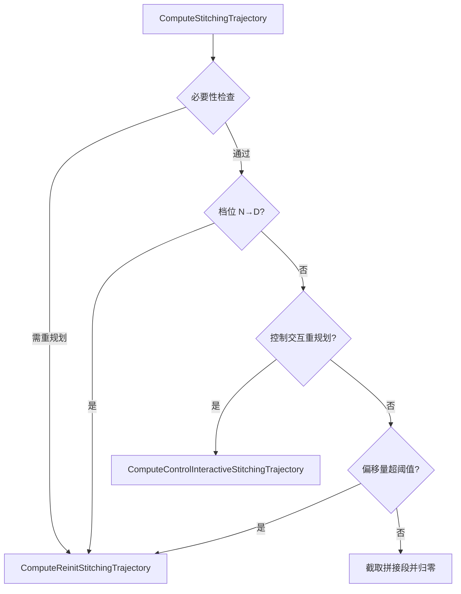

# Planning Base Common 核心数据结构函数级源码解析

本文聚焦 `modules/planning/planning_base/common/` 目录，按函数级粒度拆解规划模块的 **12 个核心数据结构**：Frame、Obstacle、ReferenceLineInfo、PlanningContext、PathDecision、PathData、SpeedData、STBoundary、DiscretizedTrajectory、EgoInfo、History、SpeedProfileGenerator。

## 1. 模块定位

`planning_base/common/` 是规划模块的**数据层**，定义了规划流水线中流转的所有核心数据结构。这些结构在场景机、任务、控制器之间传递，是理解规划模块的基石。

数据流关系：

```
EgoInfo → Frame → ReferenceLineInfo → [PathDecision, PathData, SpeedData]
                    │                        ↓
                    │              DiscretizedTrajectory
                    ↓
              PlanningContext (跨帧持久化)
              History (历史帧决策)
```

## 2. Frame — 规划帧

```cpp
class Frame {
  // FrameHistory : IndexedQueue<uint32_t, Frame>
};
```

**职责**：封装单次规划周期的所有数据——车辆状态、感知/预测输入、参考线、障碍物、计算结果。

### 2.1 构造与初始化

```cpp
explicit Frame(uint32_t sequence_num);
Frame(uint32_t sequence_num, const LocalView&, const TrajectoryPoint&,
      const VehicleState&, ReferenceLineProvider*);
Status Init(const VehicleStateProvider*, const list<ReferenceLine>&,
            const list<RouteSegments>&, const vector<LaneWaypoint>&, const EgoInfo*);
Status InitForOpenSpace(const VehicleStateProvider*, const EgoInfo*);
```

- `Init`：标准初始化，创建参考线信息列表、障碍物列表
- `InitForOpenSpace`：开放空间专用初始化（简化版，无参考线）

### 2.2 参考线查询

```cpp
const list<ReferenceLineInfo>& reference_line_info() const;
list<ReferenceLineInfo>* mutable_reference_line_info();
const ReferenceLineInfo* FindDriveReferenceLineInfo();
const ReferenceLineInfo* FindTargetReferenceLineInfo();
const ReferenceLineInfo* FindFailedReferenceLineInfo();
const ReferenceLineInfo* DriveReferenceLineInfo() const;
```

- `FindDriveReferenceLineInfo`：找到可驾驶的参考线（已规划成功且代价最低）
- `FindTargetReferenceLineInfo`：找到变道目标参考线
- `FindFailedReferenceLineInfo`：找到规划失败的参考线

### 2.3 障碍物管理

```cpp
Obstacle* Find(const string& id);
vector<const Obstacle*> obstacles() const;
const Obstacle* CreateStopObstacle(ReferenceLineInfo*, const string&, double, double);
const Obstacle* CreateStopObstacle(const string&, const string&, double);
const Obstacle* CreateStaticObstacle(ReferenceLineInfo*, const string&, double, double);
ThreadSafeIndexedObstacles* GetObstacleList();
```

- `CreateStopObstacle`：创建停车墙虚拟障碍物（用于场景机设置停车栅栏）
- `CreateStaticObstacle`：创建静态虚拟障碍物

### 2.4 核心成员

| 成员 | 类型 | 说明 |
|------|------|------|
| `sequence_num_` | uint32_t | 帧序号 |
| `local_view_` | LocalView | 传感器/路由输入视图 |
| `planning_start_point_` | TrajectoryPoint | 规划起始点 |
| `vehicle_state_` | VehicleState | 车辆状态 |
| `reference_line_info_` | list\<ReferenceLineInfo\> | 参考线候选列表 |
| `drive_reference_line_info_` | const ReferenceLineInfo* | 选定的驾驶参考线 |
| `obstacles_` | ThreadSafeIndexedObstacles | 线程安全障碍物列表 |
| `open_space_info_` | OpenSpaceInfo | 开放空间信息 |

### 2.5 FrameHistory

```cpp
class FrameHistory : public IndexedQueue<uint32_t, Frame> {};
```

- 继承 `IndexedQueue`，以帧序号为键存储历史帧
- 供 `History` 类和速度剖面继承使用

## 3. Obstacle — 障碍物

```cpp
class Obstacle {
  using IndexedObstacles = IndexedList<string, Obstacle>;
  using ThreadSafeIndexedObstacles = ThreadSafeIndexedList<string, Obstacle>;
};
```

**职责**：关联感知/预测障碍物与其路径相关属性（s, l）、ST 边界和规划决策。

### 3.1 构造与工厂

```cpp
Obstacle(const string& id, const PerceptionObstacle&, const ObstaclePriority::Priority&, bool is_static);
Obstacle(const string& id, const PerceptionObstacle&, const Trajectory&,
         const ObstaclePriority::Priority&, bool is_static);
static list<unique_ptr<Obstacle>> CreateObstacles(const PredictionObstacles&);
static unique_ptr<Obstacle> CreateStaticVirtualObstacles(const string& id, const Box2d&);
```

- `CreateObstacles`：从预测消息创建障碍物列表，每个预测轨迹一个 Obstacle
- `CreateStaticVirtualObstacles`：创建虚拟障碍物（交通规则模块使用）

### 3.2 几何查询

```cpp
TrajectoryPoint GetPointAtTime(double time) const;
Box2d GetBoundingBox(const TrajectoryPoint&) const;
const Box2d& PerceptionBoundingBox() const;
const Polygon2d& PerceptionPolygon() const;
Polygon2d GetObstacleTrajectoryPolygon(const TrajectoryPoint&) const;
```

- `GetPointAtTime`：获取障碍物在指定时刻的预测位置
- `GetBoundingBox`：获取障碍物在指定位置的 bounding box
- `GetObstacleTrajectoryPolygon`：获取障碍物轨迹多边形

### 3.3 决策管理

```cpp
const ObjectDecisionType& LateralDecision() const;
const ObjectDecisionType& LongitudinalDecision() const;
void AddLongitudinalDecision(const string& tag, const ObjectDecisionType&);
void AddLateralDecision(const string& tag, const ObjectDecisionType&);
bool HasLateralDecision() const;
bool HasLongitudinalDecision() const;
bool HasNonIgnoreDecision() const;
bool IsIgnore() const;
bool IsLongitudinalIgnore() const;
bool IsLateralIgnore() const;
```

- 每个障碍物可累积多个决策（按 decider_tag 标识来源）
- 最终合并为单一的 `LateralDecision` 和 `LongitudinalDecision`
- 决策优先级由静态排序器 `s_lateral_decision_safety_sorter_` / `s_longitudinal_decision_safety_sorter_` 决定

### 3.4 ST 边界

```cpp
const STBoundary& reference_line_st_boundary() const;
const STBoundary& path_st_boundary() const;
void SetReferenceLineStBoundary(const STBoundary&);
void set_path_st_boundary(const STBoundary&);
void BuildReferenceLineStBoundary(const ReferenceLine&, double adc_start_s);
void EraseStBoundary();
```

- `reference_line_st_boundary_`：参考线坐标系下的 ST 边界
- `path_st_boundary_`：路径坐标系下的 ST 边界（更精确）
- `BuildReferenceLineStBoundary`：从障碍物预测轨迹构建参考线 ST 边界

### 3.5 阻塞判断

```cpp
void SetBlockingObstacle(bool);
bool IsBlockingObstacle() const;
bool IsLaneBlocking() const;
void CheckLaneBlocking(const ReferenceLine&);
bool IsLaneChangeBlocking() const;
void SetLaneChangeBlocking(bool);
```

- `IsBlockingObstacle`：是否阻挡自车前进
- `IsLaneBlocking`：是否阻挡当前车道
- `IsLaneChangeBlocking`：是否阻挡变道

## 4. ReferenceLineInfo — 参考线信息

```cpp
class ReferenceLineInfo {
  enum LaneType { LeftForward, LeftReverse, RightForward, RightReverse };
  enum OverlapType { CLEAR_AREA, CROSSWALK, OBSTACLE, PNC_JUNCTION, SIGNAL, STOP_SIGN, YIELD_SIGN, JUNCTION };
};
```

**职责**：存储单条参考线候选的所有规划数据——路径决策、路径数据、速度数据、轨迹、代价、调试信息。规划器评估多个 ReferenceLineInfo 并选择最优。

### 4.1 初始化

```cpp
ReferenceLineInfo(const VehicleState&, const TrajectoryPoint&, const ReferenceLine&, const RouteSegments&);
bool Init(const vector<const Obstacle*>&, double target_speed);
bool AddObstacles(const vector<const Obstacle*>&);
Obstacle* AddObstacle(const Obstacle*);
```

- `Init`：初始化参考线信息，添加障碍物，设置目标速度
- `AddObstacles`：将障碍物投影到参考线，计算 SL 边界

### 4.2 核心数据访问

```cpp
PathDecision* path_decision();
const ReferenceLine& reference_line() const;
const PathData& path_data() const;
const SpeedData& speed_data() const;
PathData* mutable_path_data();
SpeedData* mutable_speed_data();
const DiscretizedTrajectory& trajectory() const;
void SetTrajectory(const DiscretizedTrajectory&);
```

### 4.3 代价管理

```cpp
double Cost() const;
void AddCost(double);
void SetCost(double);
double PriorityCost() const;
void SetPriorityCost(double);
```

- `Cost`：总代价（越低越好），由路径和速度任务累加
- `PriorityCost`：参考线优先级代价（变道参考线更高）

### 4.4 速度管理

```cpp
void SetCruiseSpeed(double);
void LimitCruiseSpeed(double);
double GetCruiseSpeed() const;
double GetBaseCruiseSpeed() const;
void SetLatticeCruiseSpeed(double);
void SetLatticeStopPoint(const StopPoint&);
const PlanningTarget& planning_target() const;
```

### 4.5 轨迹组合

```cpp
bool CombinePathAndSpeedProfile(double relative_time, double start_s, DiscretizedTrajectory*);
bool AdjustTrajectoryWhichStartsFromCurrentPos(const TrajectoryPoint&,
    const vector<TrajectoryPoint>&, DiscretizedTrajectory*);
```

- `CombinePathAndSpeedProfile`：将 PathData 和 SpeedData 合并为 DiscretizedTrajectory
- `AdjustTrajectoryWhichStartsFromCurrentPos`：调整轨迹使其从当前位置开始

### 4.6 车道与重叠信息

```cpp
const RouteSegments& Lanes() const;
bool IsChangeLanePath() const;
bool IsNeighborLanePath() const;
const vector<pair<OverlapType, PathOverlap>>& FirstEncounteredOverlaps() const;
int GetPnCJunction(double, PathOverlap*) const;
int GetJunction(double, PathOverlap*) const;
PathOverlap* GetOverlapOnReferenceLine(const string&, const OverlapType&) const;
```

### 4.7 候选路径管理

```cpp
const vector<PathBoundary>& GetCandidatePathBoundaries() const;
void SetCandidatePathBoundaries(vector<PathBoundary>&&);
const vector<PathData>& GetCandidatePathData() const;
vector<PathData>* MutableCandidatePathData();
void SetCandidatePathData(vector<PathData>&&);
```

- 支持多候选路径评估（如正常路径 + 借道路径）

## 5. PlanningContext — 规划上下文

```cpp
class PlanningContext {
  PlanningStatus planning_status_;  // Protobuf
};
```

**职责**：跨帧持久化的运行时上下文，存储场景状态、靠边停车状态、侧方通行状态等。

```cpp
void Clear();
void Init();
const PlanningStatus& planning_status() const;
PlanningStatus* mutable_planning_status();
```

- 唯一数据成员是 `PlanningStatus` Protobuf
- 通过 `mutable_planning_status()` 读写各子状态

## 6. PathDecision — 路径决策

```cpp
class PathDecision {
  IndexedList<string, Obstacle> obstacles_;
  MainStop main_stop_;
  double stop_reference_line_s_;
};
```

**职责**：存储单条参考线路径上的所有障碍物决策，跟踪主停车点。

```cpp
Obstacle* AddObstacle(const Obstacle&);
bool AddLateralDecision(const string& tag, const string& object_id, const ObjectDecisionType&);
bool AddLongitudinalDecision(const string& tag, const string& object_id, const ObjectDecisionType&);
const Obstacle* Find(const string& object_id) const;
void SetSTBoundary(const string& id, const STBoundary&);
void EraseStBoundaries();
MainStop main_stop() const;
double stop_reference_line_s() const;
bool MergeWithMainStop(const ObjectStop&, const string&, const ReferenceLine&, const SLBoundary&);
```

- `MergeWithMainStop`：合并停车决策，保留最近的停车点

## 7. PathData — 路径数据

```cpp
class PathData {
  enum PathPointType { IN_LANE, OUT_ON_FORWARD_LANE, OUT_ON_REVERSE_LANE, OFF_ROAD, UNKNOWN };
};
```

**职责**：存储规划路径的 Cartesian（DiscretizedPath）和 Frenet（FrenetFramePath）双表示。

```cpp
bool SetDiscretizedPath(DiscretizedPath);
bool SetFrenetPath(FrenetFramePath);
void SetReferenceLine(const ReferenceLine*);
bool SetPathPointDecisionGuide(vector<tuple<double, PathPointType, double>>);
PathPoint GetPathPointWithPathS(double s) const;
bool GetPathPointWithRefS(double ref_s, PathPoint*) const;
bool LeftTrimWithRefS(const FrenetFramePoint&);
bool UpdateFrenetFramePath(const ReferenceLine*);
```

- `SetPathPointDecisionGuide`：设置每个路径点的决策引导信息（s, 类型, 到障碍物距离），用于速度边界生成
- `GetPathPointWithRefS`：根据参考线 s 坐标查找路径点
- `PathPointType`：标识路径点在车道内/借道/逆向/路外

### 核心成员

| 成员 | 说明 |
|------|------|
| `discretized_path_` | Cartesian 路径 |
| `frenet_path_` | Frenet 路径 |
| `path_point_decision_guide_` | 决策引导（用于速度边界） |
| `path_label_` | 路径标签（"regular"/"fallback"） |
| `path_reference_` | 学习模型输出的路径参考 |
| `is_reverse_path_` | 是否为倒车路径 |

## 8. SpeedData — 速度数据

```cpp
class SpeedData : public vector<common::SpeedPoint> {};
```

**职责**：速度剖面，有序的 (s, t, v, a, da) 点序列。

```cpp
void AppendSpeedPoint(double s, double time, double v, double a, double da);
bool EvaluateByTime(double time, SpeedPoint*) const;
bool EvaluateByS(double s, SpeedPoint*) const;
double TotalTime() const;
double TotalLength() const;
```

- `EvaluateByTime`：按时间插值获取速度点
- `EvaluateByS`：按纵向距离插值获取速度点（要求 s 单调）

## 9. STBoundary — ST 边界

```cpp
class STBoundary : public common::math::Polygon2d {
  enum BoundaryType { UNKNOWN, STOP, FOLLOW, YIELD, OVERTAKE, KEEP_CLEAR };
};
```

**职责**：障碍物在 ST（空间-时间）图中的占据区域。

### 9.1 工厂方法

```cpp
static STBoundary CreateInstance(const vector<STPoint>& lower, const vector<STPoint>& upper);
static STBoundary CreateInstanceAccurate(const vector<STPoint>& lower, const vector<STPoint>& upper);
```

- `CreateInstance`：去除冗余点后创建
- `CreateInstanceAccurate`：保留所有点（不去除冗余）

### 9.2 查询方法

```cpp
bool GetUnblockSRange(double curr_time, double* s_upper, double* s_lower) const;
bool GetBoundarySRange(double curr_time, double* s_upper, double* s_lower) const;
bool GetBoundarySlopes(double curr_time, double* ds_upper, double* ds_lower) const;
bool IsPointInBoundary(const STPoint&) const;
```

- `GetUnblockSRange`：获取时刻 t 的未阻挡 s 范围
- `GetBoundarySRange`：获取时刻 t 的边界 s 范围
- `GetBoundarySlopes`：获取时刻 t 的 ds/dt 斜率

### 9.3 变换方法

```cpp
STBoundary ExpandByS(double s) const;
STBoundary ExpandByT(double t) const;
STBoundary CutOffByT(double t) const;
```

### 9.4 角点访问（Lattice Planner 专用）

```cpp
STPoint upper_left_point() const;
STPoint upper_right_point() const;
STPoint bottom_left_point() const;
STPoint bottom_right_point() const;
```

## 10. DiscretizedTrajectory — 离散化轨迹

```cpp
class DiscretizedTrajectory : public vector<common::TrajectoryPoint> {};
```

**职责**：车辆将跟随的轨迹点序列。

```cpp
TrajectoryPoint Evaluate(double relative_time) const;
size_t QueryLowerBoundPoint(double relative_time, double epsilon) const;
size_t QueryNearestPoint(const Vec2d& position) const;
size_t QueryNearestPointWithBuffer(const Vec2d&, double buffer) const;
double GetTemporalLength() const;
double GetSpatialLength() const;
void AppendTrajectoryPoint(const TrajectoryPoint&);
void PrependTrajectoryPoints(const vector<TrajectoryPoint>&);
```

- `Evaluate`：按时间插值获取轨迹点
- `QueryLowerBoundPoint`：二分查找时间下界
- `QueryNearestPoint`：查找最近的 2D 位置点

## 11. EgoInfo — 自车信息

```cpp
class EgoInfo {
  TrajectoryPoint start_point_;
  VehicleState vehicle_state_;
  double front_clear_distance_;
  Box2d ego_box_;
};
```

**职责**：每帧更新的自车状态快照。

```cpp
bool Update(const TrajectoryPoint& start_point, const VehicleState& vehicle_state);
void Clear();
TrajectoryPoint start_point() const;
VehicleState vehicle_state() const;
double front_clear_distance() const;
Box2d ego_box() const;
void CalculateFrontObstacleClearDistance(const vector<const Obstacle*>& obstacles);
```

- `Update`：每帧调用，更新起始点（加速度 clamp 到车辆参数限制）
- `CalculateFrontObstacleClearDistance`：计算前方最近障碍物距离

## 12. History — 历史帧

```cpp
class History {
  list<HistoryFrame> history_frames_;
  HistoryStatus history_status_;
};
```

**职责**：维护历史规划帧和跨帧障碍物状态，实现时间一致性。

### 12.1 HistoryFrame

```cpp
class HistoryFrame {
  void Init(const ADCTrajectory&);
  int seq_num() const;
  vector<const HistoryObjectDecision*> GetObjectDecisions() const;
  vector<const HistoryObjectDecision*> GetStopObjectDecisions() const;
  const HistoryObjectDecision* GetObjectDecisionsById(const string&) const;
};
```

### 12.2 HistoryObjectDecision

```cpp
class HistoryObjectDecision {
  void Init(const string& id, const vector<ObjectDecisionType>&);
  const string& id() const;
  vector<const ObjectDecisionType*> GetObjectDecision() const;
};
```

### 12.3 HistoryStatus

```cpp
class HistoryObjectStatus {
  void Init(const string& id, const ObjectStatus& object_status);
  const string& id() const;
  const ObjectStatus GetObjectStatus() const;
};
```

```cpp
class HistoryStatus {
  void SetObjectStatus(const string& id, const ObjectStatus&);
  bool GetObjectStatus(const string& id, ObjectStatus*);
};
```

### 12.4 History 主类

```cpp
const HistoryFrame* GetLastFrame() const;
int Add(const ADCTrajectory&);
void Clear();
size_t Size() const;
HistoryStatus* mutable_history_status();
```

## 13. SpeedProfileGenerator — 速度剖面生成器

```cpp
class SpeedProfileGenerator {
 public:
  static void FillEnoughSpeedPoints(SpeedData* speed_data);
  static SpeedData GenerateFixedDistanceCreepProfile(double distance, double max_speed);
};
```

- 纯静态工具类（构造函数已删除）
- `FillEnoughSpeedPoints`：确保速度剖面有足够采样点（填充零速度点）
- `GenerateFixedDistanceCreepProfile`：生成固定距离的蠕行速度剖面

## 14. 其他辅助结构

### 14.1 DecisionData — 决策数据

- 存储规划决策结果（停车点、巡航速度等）

### 14.2 PathBoundary — 路径边界

- 存储路径的左右边界（s, l_lower, l_upper）序列
- 由路径生成任务的 `DecidePathBounds` 产出

### 14.3 StGraphData — ST 图数据

- 存储 ST 图的约束数据（速度限制、ST 边界列表）
- 由 `SpeedBoundsDecider` 产出，供速度优化器使用

### 14.4 SpeedLimit — 速度限制

- 沿参考线的速度限制序列

### 14.5 SLPolygon — SL 多边形

- 障碍物在 SL 坐标系中的多边形表示
- 用于通用借道/变道路径的碰撞检测

### 14.6 LocalView — 本地视图

- 封装所有传感器输入（定位、底盘、预测、交通灯等）
- 作为 `Frame` 的输入

## 15. 数据流全景

```
感知/预测 ──> LocalView ──> Frame.Init()
                              │
                    ┌─────────┼─────────┐
                    ▼         ▼         ▼
              EgoInfo    Obstacle[]  ReferenceLine[]
                    │         │         │
                    └────┬────┘         ▼
                         │      ReferenceLineInfo[]
                         │         │
                    ScenarioManager ──> Scenario
                         │         │
                    ┌────┘    ┌────┘
                    ▼         ▼
              Stage.Process() ──> Task.Execute()
                    │              │
                    │    ┌─────────┼─────────┐
                    │    ▼         ▼         ▼
                    │ PathGeneration  SpeedDecider  SpeedOptimizer
                    │    │              │         │
                    │    ▼              ▼         ▼
                    │ PathData    PathDecision  SpeedData
                    │    │                        │
                    │    └────────┬───────────────┘
                    │             ▼
                    │    CombinePathAndSpeedProfile()
                    │             │
                    │             ▼
                    │    DiscretizedTrajectory
                    │             │
                    └─────> SetTrajectory()
                              │
                              ▼
                         ControlCommand
```

## 13. TrajectoryStitcher — 轨迹拼接器

> 源码位置：`modules/planning/planning_base/common/trajectory_stitcher.h/.cc`

### 13.1 模块定位

TrajectoryStitcher 负责在相邻规划周期之间进行**轨迹衔接**。每个规划周期开始时，它决定是从上一周期的轨迹中截取一段作为本周期的起点（stitching），还是从当前车辆状态重新规划（reinit）。这是保证规划连续性和平滑性的关键组件。

### 13.2 类声明

```cpp
class TrajectoryStitcher {
 public:
  TrajectoryStitcher() = delete;

  static void TransformLastPublishedTrajectory(
      const double x_diff, const double y_diff, const double theta_diff,
      PublishableTrajectory* prev_trajectory);

  static std::vector<common::TrajectoryPoint> ComputeStitchingTrajectory(
      const canbus::Chassis& vehicle_chassis,
      const common::VehicleState& vehicle_state,
      const double current_timestamp, const double planning_cycle_time,
      const size_t preserved_points_num, const bool replan_by_offset,
      const PublishableTrajectory* prev_trajectory,
      std::string* replan_reason,
      const control::ControlInteractiveMsg& control_interactive_msg);

  static std::vector<common::TrajectoryPoint> ComputeReinitStitchingTrajectory(
      const double planning_cycle_time,
      const common::VehicleState& vehicle_state);

  static bool need_replan_by_necessary_check(
      const common::VehicleState& vehicle_state,
      const double current_timestamp,
      const PublishableTrajectory* prev_trajectory,
      std::string* replan_reason, size_t* time_matched_index);

  static bool need_replan_by_control_interactive(
      const double current_timestamp, std::string* replan_reason,
      const control::ControlInteractiveMsg& control_interactive_msg);

  static std::vector<common::TrajectoryPoint>
  ComputeControlInteractiveStitchingTrajectory(
      const double planning_cycle_time,
      const common::VehicleState& vehicle_state,
      const common::TrajectoryPoint& time_match_point,
      const control::ControlInteractiveMsg& control_interactive_msg);

 private:
  static std::pair<double, double> ComputePositionProjection(
      const double x, const double y,
      const common::TrajectoryPoint& matched_trajectory_point);

  static common::TrajectoryPoint ComputeTrajectoryPointFromVehicleState(
      const double planning_cycle_time,
      const common::VehicleState& vehicle_state);
};
```

所有方法均为 `static`，该类不可实例化（`delete` 默认构造）。

### 13.3 核心函数

#### ComputeStitchingTrajectory()

```cpp
std::vector<TrajectoryPoint> TrajectoryStitcher::ComputeStitchingTrajectory(
    const canbus::Chassis& vehicle_chassis, const VehicleState& vehicle_state,
    const double current_timestamp, const double planning_cycle_time,
    const size_t preserved_points_num, const bool replan_by_offset,
    const PublishableTrajectory* prev_trajectory, std::string* replan_reason,
    const control::ControlInteractiveMsg& control_interactive_msg) {
  // 1. 必要性检查（非自动驾驶、无前序轨迹、时间越界）
  if (need_replan_by_necessary_check(...)) return ComputeReinitStitchingTrajectory(...);
  // 2. 档位切换检查（N→D 时重规划）
  if (gear changed N→D) return ComputeReinitStitchingTrajectory(...);
  // 3. 控制交互消息检查
  if (need_replan_by_control_interactive(...))
    return ComputeControlInteractiveStitchingTrajectory(...);
  // 4. 偏移量检查（横向/纵向/时间偏差超阈值）
  if (replan_by_offset && (lat/lon/time diff > threshold))
    return ComputeReinitStitchingTrajectory(...);
  // 5. 正常拼接：截取 [matched_index - preserved_points_num, forward_time_index]
  //    并将 s 和 relative_time 归零到拼接段末尾
  return stitching_trajectory;
}
```

- **输入**：底盘状态、车辆状态、当前时间戳、规划周期、保留点数、上一轨迹、控制交互消息
- **输出**：拼接轨迹点序列（正常情况多个点，重规划时仅 1 个点）
- **关键逻辑**：按优先级依次检查 4 类重规划条件，全部通过后才执行拼接
- `trajectory_stitcher.cc:L119-L265`

#### ComputeReinitStitchingTrajectory()

```cpp
std::vector<TrajectoryPoint> TrajectoryStitcher::ComputeReinitStitchingTrajectory(
    const double planning_cycle_time, const VehicleState& vehicle_state) {
  // 低速低加速度时直接用当前状态
  // 否则用 VehicleModel::Predict 预测一个周期后的状态
  return std::vector<TrajectoryPoint>(1, reinit_point);
}
```

- 返回仅含 1 个点的向量，表示"从当前位置重新规划"
- 阈值：`kEpsilon_v = 0.1 m/s`，`kEpsilon_a = 0.4 m/s²`
- `trajectory_stitcher.cc:L58-L78`

#### TransformLastPublishedTrajectory()

```cpp
void TrajectoryStitcher::TransformLastPublishedTrajectory(
    const double x_diff, const double y_diff, const double theta_diff,
    PublishableTrajectory* prev_trajectory) {
  // 计算逆旋转矩阵 R^{-1} 和平移 -R^{-1}*t
  // 对轨迹中每个点执行坐标变换
}
```

- 仅在导航模式（navigation mode）下使用
- 将上一轨迹从旧坐标系变换到新坐标系（处理定位漂移）
- `trajectory_stitcher.cc:L81-L112`

#### need_replan_by_necessary_check()

```cpp
bool TrajectoryStitcher::need_replan_by_necessary_check(
    const VehicleState& vehicle_state, const double current_timestamp,
    const PublishableTrajectory* prev_trajectory,
    std::string* replan_reason, size_t* time_matched_index);
```

- 检查条件：gflag 关闭、无前序轨迹、非自动驾驶模式、轨迹为空、当前时间超出轨迹时间范围、匹配点无 path_point
- `trajectory_stitcher.cc:L278-L335`

#### need_replan_by_control_interactive()

- 检查控制模块发来的重规划请求消息是否超时（3s）
- 若未超时且 `replan_request == true`，返回需要重规划
- `trajectory_stitcher.cc:L337-L354`

#### ComputeControlInteractiveStitchingTrajectory()

- 根据 `ReplanRequestReasonCode` 区分全量重规划（`REPLAN_REQ_ALL_REPLAN` / `REPLAN_REQ_STATION_REPLAN`）和速度重规划
- 速度重规划时保留时间匹配点的位置，仅重新生成速度
- `trajectory_stitcher.cc:L356-L378`

### 13.4 重规划判定流程



### 13.5 调用关系

- **被调用方**：`PlanningComponent::RunOnce()` 在每个规划周期开始时调用 `ComputeStitchingTrajectory`
- **依赖**：`VehicleModel::Predict`（运动学预测）、`PublishableTrajectory`（上一周期轨迹）、`FLAGS_replan_lateral_distance_threshold` / `FLAGS_replan_longitudinal_distance_threshold` / `FLAGS_replan_time_threshold`（重规划阈值 gflags）

---

title: "Reference Line 参考线模块函数级源码解析"
---

# Reference Line 参考线模块函数级源码解析

本文聚焦 `modules/planning/planning_base/reference_line/` 目录，按函数级粒度拆解参考线的核心实现：`ReferencePoint`、`ReferenceLine`、`ReferenceLineProvider` 以及三套参考线平滑器（`QpSplineReferenceLineSmoother`、`SpiralReferenceLineSmoother`、`DiscretePointsReferenceLineSmoother`）。

## 1. 模块定位

参考线是 Apollo 规划模块的**空间基准坐标系**。它将高精地图的车道中心线转化为可插值、可查询的连续曲线，为后续的路径规划、速度规划、决策模块统一提供 Frenet 坐标变换与几何查询能力。

核心职责：

- 从 `PncMap`（基于路由的导航地图）获取原始路径点，构造 `ReferenceLine`
- 对原始参考线做平滑处理（QP Spline / Spiral / Discrete Points 三种策略）
- 提供 XY ↔ SL 坐标变换、参考点插值、车道宽度/限速/边界查询
- 支持参考线的拼接（Stitch）、裁剪（Segment）、延伸（Extend）
- 在独立线程中周期性刷新参考线（默认 50 ms），保证规划模块能获取最新参考线

上下游拓扑：

```
Routing ──> PncMap ──> ReferenceLineProvider ──> ReferenceLine ──> Planning
                                                       │
                                               Smoother (3种策略)
```

## 2. 目录结构

```
modules/planning/planning_base/reference_line/
├── reference_point.h / .cc                     # 参考点（带曲率信息的地图点）
├── reference_line.h / .cc                      # 参考线核心类
├── reference_line_provider.h / .cc             # 参考线提供者（生产者-消费者模型）
├── reference_line_smoother.h                   # 平滑器抽象基类
├── qp_spline_reference_line_smoother.h / .cc   # QP 样条平滑器
├── spiral_reference_line_smoother.h / .cc      # 螺旋线平滑器
├── discrete_points_reference_line_smoother.h / .cc  # 离散点平滑器
├── spiral_problem_interface.h / .cc            # 螺旋线 IPOPT 优化接口
├── spiral_smoother_util.cc                     # 螺旋线工具函数
├── smoother_util.cc                            # 平滑器通用工具
├── BUILD                                       # Bazel 构建规则
└── *_test.cc                                   # 各类单元测试
```

## 3. ReferencePoint 参考点

`ReferencePoint` 继承自 `hdmap::MapPathPoint`，在地图路径点的基础上额外携带曲率 `kappa` 和曲率变化率 `dkappa`。它是参考线上的基本采样单元。

### 3.1 类声明

```cpp
class ReferencePoint : public hdmap::MapPathPoint {
 public:
  ReferencePoint() = default;
  ReferencePoint(const MapPathPoint& map_path_point, double kappa, double dkappa);
  common::PathPoint ToPathPoint(double s) const;
  double kappa() const;
  double dkappa() const;
  std::string DebugString() const;
  static void RemoveDuplicates(std::vector<ReferencePoint>* points);
 private:
  double kappa_ = 0.0;
  double dkappa_ = 0.0;
};
```

### 3.2 构造函数 `ReferencePoint`

```cpp
ReferencePoint::ReferencePoint(const MapPathPoint& map_path_point,
                               const double kappa, const double dkappa)
    : hdmap::MapPathPoint(map_path_point), kappa_(kappa), dkappa_(dkappa) {}
```

- 将传入的 `MapPathPoint`（包含 x, y, heading, lane_waypoints）拷贝到基类
- 额外保存该点处的曲率 `kappa_` 和曲率变化率 `dkappa_`

### 3.3 `ToPathPoint`

```cpp
common::PathPoint ReferencePoint::ToPathPoint(double s) const {
  return common::util::PointFactory::ToPathPoint(x(), y(), 0.0, s, heading(),
                                                 kappa_, dkappa_);
}
```

- 将 `ReferencePoint` 转换为 Protobuf 消息 `common::PathPoint`
- 参数 `s` 为该点在参考线上的纵向距离
- z 坐标固定为 0.0

### 3.4 `kappa()` / `dkappa()`

简单的 getter，返回曲率和曲率变化率。

### 3.5 `DebugString`

```cpp
std::string ReferencePoint::DebugString() const {
  return absl::StrCat("{x: ", x(), ", y: ", y(), ", theta: ", heading(),
                      ", kappa: ", kappa(), ", dkappa: ", dkappa(), "}");
}
```

### 3.6 `RemoveDuplicates`（静态）

```cpp
void ReferencePoint::RemoveDuplicates(std::vector<ReferencePoint>* points) {
  CHECK_NOTNULL(points);
  int count = 0;
  for (size_t i = 0; i < points->size(); ++i) {
    auto& last_point = (*points)[count - 1];
    const auto& this_point = (*points)[i];
    if (count == 0 ||
        std::abs(last_point.x() - this_point.x()) > kDuplicatedPointsEpsilon ||
        std::abs(last_point.y() - this_point.y()) > kDuplicatedPointsEpsilon) {
      (*points)[count++] = this_point;
    } else {
      last_point.add_lane_waypoints(this_point.lane_waypoints());
    }
  }
  points->resize(count);
}
```

- **算法**：原地去重，使用曼哈顿距离（分量绝对值差）判断，阈值 `kDuplicatedPointsEpsilon = 1e-7`
- **合并策略**：重合点不丢弃其 `lane_waypoints`，而是合并到保留点上
- **时间复杂度**：O(n)，单次遍历

## 4. ReferenceLine 参考线

`ReferenceLine` 是参考线模块的核心类，管理一组有序的 `ReferencePoint` 和底层的 `hdmap::Path`，提供坐标变换、几何查询、限速管理等功能。

### 4.1 数据成员

```cpp
struct SpeedLimit {
  double start_s = 0.0;
  double end_s = 0.0;
  double speed_limit = 0.0;  // m/s
};

std::vector<SpeedLimit> speed_limit_;          // 覆盖限速段
std::vector<ReferencePoint> reference_points_; // 参考点序列
hdmap::Path map_path_;                         // 底层地图路径（提供累积弧长、平滑点）
uint32_t priority_ = 0;                        // 优先级（多参考线选择时使用）
common::math::Vec2d ego_position_;             // 自车位置（SL 边界计算优化用）
```

### 4.2 构造函数

**模板构造函数（迭代器范围）**

```cpp
template <typename Iterator>
ReferenceLine(const Iterator begin, const Iterator end)
    : reference_points_(begin, end),
      map_path_(std::move(std::vector<hdmap::MapPathPoint>(begin, end))) {}
```

- 从迭代器范围 `[begin, end)` 构造参考点列表
- 同时将参考点隐式转换为 `MapPathPoint` 序列构造 `map_path_`

**从 ReferencePoint 向量构造**

```cpp
ReferenceLine::ReferenceLine(const std::vector<ReferencePoint>& reference_points)
    : reference_points_(reference_points),
      map_path_(std::move(std::vector<hdmap::MapPathPoint>(
          reference_points.begin(), reference_points.end()))) {
  CHECK_EQ(static_cast<size_t>(map_path_.num_points()), reference_points_.size());
}
```

- 将 `ReferencePoint` 向量拷贝为成员
- 同时构造 `hdmap::Path`，该路径会计算累积弧长 `accumulated_s`、单位方向向量 `unit_directions` 等几何信息
- 校验点数一致性

**从 hdmap::Path 构造**

```cpp
ReferenceLine::ReferenceLine(const MapPath& hdmap_path) : map_path_(hdmap_path) {
  for (const auto& point : hdmap_path.path_points()) {
    DCHECK(!point.lane_waypoints().empty());
    const auto& lane_waypoint = point.lane_waypoints()[0];
    reference_points_.emplace_back(
        hdmap::MapPathPoint(point, point.heading(), lane_waypoint), 0.0, 0.0);
  }
  CHECK_EQ(static_cast<size_t>(map_path_.num_points()), reference_points_.size());
}
```

- 从已有的 `hdmap::Path` 构造参考线
- 遍历路径点，取每个点的第一个 `lane_waypoint`，构造 `ReferencePoint`（曲率和曲率变化率初始化为 0）
- 这是 `SmoothRouteSegment` → `SmoothReferenceLine` 路径的入口构造方式

### 4.3 `Stitch` — 参考线拼接

```cpp
bool ReferenceLine::Stitch(const ReferenceLine& other);
```

将另一条参考线 `other` 拼接到当前参考线的首尾。拼接策略是**优先保留当前参考线**，仅补充 `other` 中超出当前范围的部分。

**算法流程**：

1. 将当前参考线的首尾点投影到 `other` 上，得到 SL 坐标
2. 判断 `first_join`（首点在 other 内部）和 `last_join`（尾点在 other 内部）
3. 若两者都不满足，返回 false（参考线不相连）
4. 横向拼接误差阈值 `kStitchingError = 0.1 m`，超过则失败
5. 若 `first_join`：将 `other` 中 `s < first_sl.s()` 的参考点插入当前参考线头部
6. 若 `last_join`：将 `other` 中 `s > last_sl.s()` 的参考点追加到当前参考线尾部
7. 重建 `map_path_`

**使用场景**：`ExtendReferenceLine` 中将延伸段拼接到已有参考线上。

### 4.4 `Segment` — 参考线裁剪

```cpp
bool Segment(const common::math::Vec2d& point, double distance_backward, double distance_forward);
bool Segment(double s, double distance_backward, double distance_forward);
```

- 按纵向距离裁剪参考线，仅保留 `[s - look_backward, s + look_forward]` 范围
- 向量版本先通过 `XYToSL` 将 XY 坐标转换为 s，再调用 s 版本
- 裁剪后保留点数 < 2 则返回失败
- 裁剪后重建 `map_path_`

**使用场景**：`Shrink` 方法中裁剪过长的参考线，减少后续计算量。

### 4.5 参考点查询

#### `GetReferencePoint(double s)` — 按纵向距离插值

```cpp
ReferencePoint ReferenceLine::GetReferencePoint(const double s) const;
```

- 核心查询方法，返回参考线上纵向距离 `s` 处的**精确插值**参考点
- 使用 `map_path_.GetIndexFromS(s)` 获取插值索引 `InterpolatedIndex`
- 取相邻两点 `p0`、`p1`，调用 `InterpolateWithMatchedIndex` 做线性插值
- 插值内容包含 x, y, heading, kappa, dkappa
- 边界处理：s 超出范围时 clamp 到首/尾点

#### `GetReferencePoint(double x, double y)` — 按坐标查询

```cpp
ReferencePoint ReferenceLine::GetReferencePoint(const double x, const double y) const;
```

- 先遍历所有参考点找到最近点 `index_min`
- 取其左右邻居 `[index_min-1, index_min+1]`
- 在该区间内使用 **Brent 最小值搜索**（`FindMinDistancePoint`，8 步迭代）找到精确最近点
- 返回插值后的参考点

#### `GetNearestReferencePoint(Vec2d xy)` — 最近参考点（无插值）

```cpp
ReferencePoint ReferenceLine::GetNearestReferencePoint(const common::math::Vec2d& xy) const;
```

- 遍历所有参考点，返回欧氏距离最近的参考点（不做插值）
- O(n) 复杂度，用于不要求精确插值的快速查询

#### `GetNearestReferencePoint(double s)` — 按 s 查找最近参考点

```cpp
ReferencePoint ReferenceLine::GetNearestReferencePoint(const double s) const;
```

- 使用 `std::lower_bound` 在累积弧长数组中二分查找
- 比较相邻两点与 s 的距离，返回更近的那个
- 不做插值，返回离散参考点

#### `GetNearestReferenceIndex(double s)`

```cpp
size_t ReferenceLine::GetNearestReferenceIndex(const double s) const;
```

- 返回累积弧长中 `>= s` 的第一个索引
- 使用 `std::lower_bound` 二分查找

#### `GetReferencePoints(double start_s, double end_s)` — 范围查询

```cpp
std::vector<ReferencePoint> ReferenceLine::GetReferencePoints(double start_s, double end_s) const;
```

- 返回 `[start_s, end_s]` 范围内的参考点子序列
- 先 clamp 到 `[0, Length()]`，再通过 `GetNearestReferenceIndex` 获取首尾索引

### 4.6 坐标变换

#### `SLToXY` — Frenet → Cartesian

```cpp
bool ReferenceLine::SLToXY(const common::SLPoint& sl_point,
                           common::math::Vec2d* const xy_point) const;
```

- 取纵向距离 `sl_point.s()` 处的参考点
- 沿参考点法向偏移 `sl_point.l()` 得到 XY 坐标
- 公式：`x = ref.x - sin(heading) * l`，`y = ref.y + cos(heading) * l`
- 要求参考线至少有 2 个点

#### `XYToSL` — Cartesian → Frenet（4 个重载）

**基础版本**：

```cpp
bool XYToSL(const common::math::Vec2d& xy_point, common::SLPoint* sl_point,
            double warm_start_s = -1.0) const;
```

- `warm_start_s < 0` 时使用 `map_path_.GetProjection()` 全局搜索最近投影
- `warm_start_s >= 0` 时使用 `map_path_.GetProjectionWithWarmStartS()` 从指定 s 附近搜索，加速计算

**带 heading 版本**：

```cpp
bool XYToSL(const double heading, const common::math::Vec2d& xy_point,
            common::SLPoint* sl_point, double warm_start_s = -1.0) const;
```

- 额外传入 `heading` 用于 `GetProjection(heading, ...)` 以解决多解歧义（如环形匝道）

**带启发式范围版本**：

```cpp
bool XYToSL(const common::math::Vec2d& xy_point, common::SLPoint* sl_point,
            double hueristic_start_s, double hueristic_end_s) const;
```

- 使用 `GetProjectionWithHueristicParams` 在 `[hueristic_start_s, hueristic_end_s]` 范围内搜索
- 用于 `GetSLBoundary` 中已知相邻角点 s 范围时的快速投影

**模板版本**：

```cpp
template <class XYPoint>
bool XYToSL(const XYPoint& xy, common::SLPoint* sl_point) const {
  return XYToSL(common::math::Vec2d(xy.x(), xy.y()), sl_point);
}
```

- 适配任意具有 `x()`, `y()` 方法的类型

#### `GetFrenetPoint` — PathPoint → FrenetFramePoint

```cpp
common::FrenetFramePoint ReferenceLine::GetFrenetPoint(
    const common::PathPoint& path_point) const;
```

- 将 Cartesian 空间的 `PathPoint` 转换为 Frenet 坐标系的 `FrenetFramePoint`
- 计算内容：
  - `s`, `l`：通过 `XYToSL` 获取
  - `dl`：横向偏移一阶导数，通过 `CartesianFrenetConverter::CalculateLateralDerivative` 计算
  - `ddl`：横向偏移二阶导数，通过 `CartesianFrenetConverter::CalculateSecondOrderLateralDerivative` 计算

#### `ToFrenetFrame` — TrajectoryPoint → Frenet 条件

```cpp
std::pair<std::array<double, 3>, std::array<double, 3>>
ReferenceLine::ToFrenetFrame(const common::TrajectoryPoint& traj_point) const;
```

- 将 `TrajectoryPoint`（含位置、速度、加速度、曲率）转换为 Frenet 坐标系
- 返回值：`s_condition = [s, ds, dds]`（纵向位移、速度、加速度），`l_condition = [l, dl, ddl]`（横向偏移、一阶导、二阶导）
- 底层调用 `CartesianFrenetConverter::cartesian_to_frenet`
- 这是规划起始点转换的核心方法，后续路径/速度规划都基于此 Frenet 条件

### 4.7 插值辅助函数

#### `Interpolate`（静态）

```cpp
static ReferencePoint Interpolate(const ReferencePoint& p0, double s0,
                                  const ReferencePoint& p1, double s1, double s);
```

- 在两个参考点 `p0`（位于 s0）、`p1`（位于 s1）之间线性插值
- 插值内容：x, y（线性 lerp）、heading（球面线性 slerp）、kappa, dkappa（线性 lerp）
- 同时处理 `lane_waypoints` 的插值：若 `p0` 和 `p1` 在不同车道上，尝试维护两个车道的 waypoint
- 要求 `s0 <= s <= s1`

#### `InterpolateWithMatchedIndex`

```cpp
ReferencePoint InterpolateWithMatchedIndex(
    const ReferencePoint& p0, double s0, const ReferencePoint& p1, double s1,
    const hdmap::InterpolatedIndex& index) const;
```

- 与 `Interpolate` 类似，但利用 `map_path_` 内置的平滑点（`GetSmoothPoint`）获取更精确的 x, y, heading
- kappa 和 dkappa 仍使用线性插值
- `GetReferencePoint(s)` 的内部实现

#### `FindMinDistancePoint`（静态）

```cpp
static double FindMinDistancePoint(const ReferencePoint& p0, double s0,
                                   const ReferencePoint& p1, double s1,
                                   double x, double y);
```

- 在 `[s0, s1]` 区间内寻找距离点 `(x, y)` 最近的插值点对应的 s 值
- 使用 **Boost Brent 最小值搜索**，8 步精度迭代
- 被 `GetReferencePoint(x, y)` 调用

## 5. SL 边界计算

### 5.1 `GetSLBoundary` — Box2d / Polygon2d → SLBoundary

```cpp
bool GetSLBoundary(const common::math::Box2d& box, SLBoundary* sl_boundary,
                   double warm_start_s = -1.0) const;
bool GetSLBoundary(const common::math::Polygon2d& polygon, SLBoundary* sl_boundary,
                   double warm_start_s = -1.0) const;
```

- Box2d 版本先提取 4 个角点，再调用角点版本
- Polygon2d 版本提取多边形顶点，再调用角点版本

### 5.2 `GetSLBoundary` — 角点版本（核心实现）

```cpp
bool GetSLBoundary(const std::vector<common::math::Vec2d>& corners,
                   SLBoundary* sl_boundary, double warm_start_s) const;
```

**算法**：

1. 找到距离自车最近的角点，将其旋转到序列首位（优化 warm_start 效果）
2. 将首角点投影到参考线（使用 warm_start_s 加速）
3. 依次投影后续角点，利用前一角点的 s 值计算启发式搜索范围 `±2*distance`
4. 对每对相邻角点的中点做额外投影，检查是否在多边形外部（叉积判断），若是则加入边界点
5. 最终取所有边界点的 min/max s/l 填充 `SLBoundary`

**设计要点**：中点检测解决了角点投影可能遗漏参考线穿越多边形的情况。

### 5.3 `GetSLBoundary` — hdmap::Polygon 版本

```cpp
bool GetSLBoundary(const hdmap::Polygon& polygon, SLBoundary* sl_boundary) const;
```

- 遍历多边形的所有点，逐个投影到参考线
- 取 min/max s/l 填充边界
- 不使用启发式搜索，适用于地图区域查询

### 5.4 `GetApproximateSLBoundary` — 快速近似

```cpp
bool GetApproximateSLBoundary(const common::math::Box2d& box,
                              double start_s, double end_s,
                              SLBoundary* sl_boundary) const;
```

- 先将 box 中心投影到参考线
- 将 box 旋转到与参考线对齐
- 直接用旋转后的坐标近似为 SL（x → s, y → l）
- **速度快但精度低**，保证返回的边界 >= 真实边界
- 用于对精度要求不高的场景（如障碍物粗筛）

## 6. 车道/道路信息查询

### 6.1 `GetLaneWidth`

```cpp
bool GetLaneWidth(double s, double* lane_left_width, double* lane_right_width) const;
```

- 委托 `map_path_.GetLaneWidth(s, ...)` 查询纵向距离 s 处的车道左右宽度

### 6.2 `GetOffsetToMap`

```cpp
bool GetOffsetToMap(double s, double* l_offset) const;
```

- 获取参考线在 s 处相对车道中心线的横向偏移量
- 通过最近参考点的第一个 `lane_waypoint.l` 获取

### 6.3 `GetRoadWidth`

```cpp
bool GetRoadWidth(double s, double* road_left_width, double* road_right_width) const;
```

- 查询 s 处的道路左右宽度（比车道宽度更宽，包含路肩等）

### 6.4 `GetRoadType`

```cpp
hdmap::Road::Type GetRoadType(double s) const;
```

- 将参考线上的 s 点转换为 XY，然后查询 HDMap 获取道路类型
- 返回 `HIGHWAY`、`CITY_ROAD`、`UNKNOWN` 等

### 6.5 `GetLaneBoundaryType`

```cpp
void GetLaneBoundaryType(double s,
    hdmap::LaneBoundaryType::Type* left_boundary_type,
    hdmap::LaneBoundaryType::Type* right_boundary_type) const;
```

- 查询 s 处左右车道边界的类型（实线、虚线、路缘石等）

### 6.6 `GetLaneFromS`

```cpp
void GetLaneFromS(double s, std::vector<hdmap::LaneInfoConstPtr>* lanes) const;
```

- 获取 s 处参考点所在的所有车道信息（去重）

### 6.7 `GetDrivingWidth`

```cpp
double GetDrivingWidth(const SLBoundary& sl_boundary) const;
```

- 计算给定 SL 边界在车道内的可用行驶宽度
- 公式：`max(lane_left - end_l, lane_right + start_l)`，再与总宽度取 min

### 6.8 `GetLaneSegments`

```cpp
std::vector<hdmap::LaneSegment> GetLaneSegments(double start_s, double end_s) const;
```

- 返回 `[start_s, end_s]` 范围内的车道段序列

## 7. 位置判断

### 7.1 `IsOnLane` — 是否在车道内

```cpp
bool IsOnLane(const common::SLPoint& sl_point) const;
bool IsOnLane(const common::math::Vec2d& vec2d_point) const;
bool IsOnLane(const SLBoundary& sl_boundary) const;
template <class XYPoint> bool IsOnLane(const XYPoint& xy) const;
```

- SLPoint 版本：`s ∈ (0, length]` 且 `l ∈ [-right_width, left_width]`
- Vec2d 版本：先 XYToSL 再判断
- SLBoundary 版本：取 `middle_s` 处宽度，判断边界与车道宽度的关系
- 模板版本：适配任意 XY 类型

### 7.2 `IsOnRoad` — 是否在道路上

```cpp
bool IsOnRoad(const common::SLPoint& sl_point) const;
bool IsOnRoad(const common::math::Vec2d& vec2d_point) const;
bool IsOnRoad(const SLBoundary& sl_boundary) const;
```

- 与 `IsOnLane` 类似，但使用 `GetRoadWidth` 而非 `GetLaneWidth`
- 道路宽度 > 车道宽度，判断更宽松（包含路肩区域）

### 7.3 `IsBlockRoad` — 是否阻挡路面

```cpp
bool IsBlockRoad(const common::math::Box2d& box2d, double gap) const;
```

- 委托 `map_path_.OverlapWith(box2d, gap)` 判断
- `gap` 参数指定剩余空间阈值

### 7.4 `HasOverlap` — 是否与车道有重叠

```cpp
bool HasOverlap(const common::math::Box2d& box) const;
```

1. 将 box 投影为 SLBoundary
2. 检查 `end_s >= 0` 且 `start_s <= Length()`
3. 检查 `start_l * end_l < 0` 时一定无重叠（box 跨越参考线）
4. 否则取中点处车道宽度，判断 box 是否在车道范围内

## 8. 限速管理

### 8.1 `GetSpeedLimitFromS`

```cpp
double ReferenceLine::GetSpeedLimitFromS(const double s) const;
```

**查找优先级**：

1. **覆盖限速**：遍历 `speed_limit_` 列表，若 s 落在某个 `[start_s, end_s]` 内，直接返回
2. **车道限速**：获取参考点处所有车道的 `speed_limit`，取最小值
3. **默认限速**：若无车道信息，根据道路类型使用 `FLAGS_default_city_road_speed_limit` 或 `FLAGS_default_highway_speed_limit`

### 8.2 `AddSpeedLimit`

```cpp
void ReferenceLine::AddSpeedLimit(double start_s, double end_s, double speed_limit);
```

- 在参考线上叠加新的限速段
- **区间合并算法**：处理新旧限速段的重叠，取重叠区间的较小限速值
- 结果按 `(start_s, end_s, speed_limit)` 排序
- 由交通规则模块（如 `SpeedSetting`、`TrafficLight`）调用

## 9. 其他方法

### 9.1 `Length()`

```cpp
double Length() const { return map_path_.length(); }
```

### 9.2 `DebugString()`

- 输出参考点数量和前 `FLAGS_trajectory_point_num_for_debug` 个参考点的调试信息

### 9.3 `GetPriority()` / `SetPriority`

- 多参考线场景下的优先级管理（数值越小优先级越高）
- 导航模式下由 `path_priority` 字段决定

### 9.4 `SetEgoPosition`

```cpp
void SetEgoPosition(common::math::Vec2d ego_pos) { ego_position_ = ego_pos; }
```

- 设置自车位置，用于 `GetSLBoundary` 中优化角点排序（先处理离自车最近的角点）

## 10. ReferenceLineProvider 参考线提供者

`ReferenceLineProvider` 是参考线的**生产者**，负责从路由和地图创建、平滑、缓存参考线。它支持两种运行模式：

- **独立线程模式**（`FLAGS_enable_reference_line_provider_thread = true`）：在后台线程中 50 ms 周期刷新
- **同步模式**：在 `GetReferenceLines` 调用时同步计算

### 10.1 构造函数

```cpp
ReferenceLineProvider(
    const common::VehicleStateProvider* vehicle_state_provider,
    const ReferenceLineConfig* reference_line_config,
    const std::shared_ptr<relative_map::MapMsg>& relative_map = nullptr);
```

**初始化流程**：

1. 加载平滑器配置文件 `FLAGS_smoother_config_filename`
2. 根据配置创建平滑器实例：`QpSplineReferenceLineSmoother` / `SpiralReferenceLineSmoother` / `DiscretePointsReferenceLineSmoother`
3. 加载 PncMap 插件（默认 `LaneFollowMap`），支持多 PncMap 配置
4. 导航模式下保存 `relative_map` 引用

### 10.2 生命周期方法

#### `Start()`

- 非导航模式下，若 `FLAGS_enable_reference_line_provider_thread` 为 true，启动 `GenerateThread` 异步任务

#### `Stop()`

- 设置 `is_stop_ = true`，等待 `GenerateThread` 退出

#### `Reset()`

- 清空路由信息、参考线缓存、历史队列

### 10.3 `UpdatePlanningCommand`

```cpp
bool UpdatePlanningCommand(const planning::PlanningCommand& command);
```

- 遍历 `pnc_map_list_`，找到能处理该命令的 PncMap
- 若 PncMap 判断是新命令，调用 `UpdatePlanningCommand` 更新路由
- 保存命令并标记 `has_planning_command_`

### 10.4 `GetReferenceLines` — 核心接口

```cpp
bool GetReferenceLines(std::list<ReferenceLine>* reference_lines,
                       std::list<hdmap::RouteSegments>* segments);
```

**三种路径**：

1. **导航模式**：调用 `GetReferenceLinesFromRelativeMap` 从相对地图获取
2. **独立线程模式**：直接从 `reference_lines_` 缓存读取（加锁）
3. **同步模式**：调用 `CreateReferenceLine` 同步创建

**容错**：若当前参考线为空，尝试使用历史队列（最多保存 3 帧）中的最后一帧。

### 10.5 `CreateReferenceLine` — 参考线创建

```cpp
bool CreateReferenceLine(std::list<ReferenceLine>* reference_lines,
                         std::list<hdmap::RouteSegments>* segments);
```

1. 获取当前车辆状态和路由命令
2. 调用 `CreateRouteSegments` 从 PncMap 提取路由段
3. 若 `FLAGS_prioritize_change_lane`，将变道路由段移到列表前端
4. **新命令或禁用拼接**：对每个路由段独立平滑 → 投影自车 → 裁剪
5. **拼接模式**：调用 `ExtendReferenceLine` 尝试延伸已有参考线

### 10.6 `ExtendReferenceLine` — 参考线延伸

```cpp
bool ExtendReferenceLine(const common::VehicleState& state,
                         hdmap::RouteSegments* segments,
                         ReferenceLine* reference_line);
```

**算法**：

1. 在已有参考线中找到与当前路由段相连的前一段
2. 计算剩余前瞻距离 `remain_s`
3. 若 `remain_s > look_forward_required_distance`，直接复用已有参考线
4. 否则调用 `current_pnc_map_->ExtendSegments` 向前延伸路由段
5. 对延伸段做平滑（`SmoothPrefixedReferenceLine`，锚定前段端点）
6. 拼接新旧参考线（`Stitch`）
7. 裁剪（`Shrink`）

### 10.7 `GenerateThread` — 后台刷新线程

```cpp
void ReferenceLineProvider::GenerateThread() {
  while (!is_stop_) {
    cyber::SleepFor(std::chrono::milliseconds(50)); // 50 ms 周期
    // ... CreateReferenceLine → UpdateReferenceLine
  }
}
```

- 每 50 ms 执行一次参考线创建和更新
- 更新后维护历史队列（最多 3 帧）

### 10.8 `GetReferenceLinesFromRelativeMap` — 导航模式

从 `relative_map` 的 `navigation_path` 创建参考线：

1. 获取 ADC 所在车道及左右邻居车道
2. 找到优先级高于当前车道的目标车道
3. 确定变道方向（LEFT/RIGHT）
4. 为每条导航路径创建 `ReferenceLine` 和 `RouteSegments`

### 10.9 `SmoothReferenceLine` / `SmoothPrefixedReferenceLine`

```cpp
bool SmoothReferenceLine(const ReferenceLine& raw, ReferenceLine* smoothed);
bool SmoothPrefixedReferenceLine(const ReferenceLine& prefix_ref,
                                  const ReferenceLine& raw_ref,
                                  ReferenceLine* smoothed);
```

- `SmoothReferenceLine`：生成锚点 → 设置到平滑器 → 执行平滑 → 验证平滑误差
- `SmoothPrefixedReferenceLine`：额外将 `prefix_ref` 中的端点设为强制锚点（`enforced = true`），确保延伸段与前段平滑衔接

### 10.10 `GetAnchorPoint` / `GetAnchorPoints`

```cpp
AnchorPoint GetAnchorPoint(const ReferenceLine& ref, double s) const;
void GetAnchorPoints(const ReferenceLine& ref, std::vector<AnchorPoint>* points) const;
```

- `GetAnchorPoint`：计算 s 处的锚点，包含横向约束宽度
  - 获取车道宽度，扣除车身宽度、路缘石偏移、横向缓冲
  - `lateral_bound` 范围：`[min_lateral_boundary_bound, max_lateral_boundary_bound]`
- `GetAnchorPoints`：均匀采样，首尾锚点强制约束（`enforced = true`, `bound = 1e-6`）

## 11. 平滑器

### 11.1 AnchorPoint 锚点

```cpp
struct AnchorPoint {
  common::PathPoint path_point;    // 锚点位置
  double lateral_bound = 0.0;      // 横向约束宽度
  double longitudinal_bound = 0.0; // 纵向约束宽度
  bool enforced = false;           // 是否强制跟随
};
```

### 11.2 ReferenceLineSmoother 基类

```cpp
class ReferenceLineSmoother {
 public:
  explicit ReferenceLineSmoother(const ReferenceLineSmootherConfig& config);
  virtual void SetAnchorPoints(const std::vector<AnchorPoint>& anchor_points) = 0;
  virtual bool Smooth(const ReferenceLine&, ReferenceLine* const) = 0;
  virtual ~ReferenceLineSmoother() = default;
 protected:
  ReferenceLineSmootherConfig config_;
};
```

### 11.3 QpSplineReferenceLineSmoother — QP 样条平滑器

- 使用 **二次规划（QP）** 求解 1D 样条曲线拟合参考线
- 优化目标：最小化样条的二阶导数（平滑性）+ 锚点偏离（保真度）
- 约束：锚点的横向边界、首尾点强制约束
- 底层使用 `Spline1dSolver`（OSQP 求解器）
- 适用于常规道路场景，计算效率和质量平衡

### 11.4 SpiralReferenceLineSmoother — 螺旋线平滑器

- 使用 **Euler 螺旋（Clothoid）** 拟合参考线
- 螺旋线的曲率随弧长线性变化，符合公路设计规范
- 通过 IPOPT 非线性优化器求解
- `SpiralProblemInterface` 实现 IPOPT 的 `TNLP` 接口，定义目标函数和约束
- 适用于高速公路等对曲率连续性要求高的场景

### 11.5 DiscretePointsReferenceLineSmoother — 离散点平滑器

- 直接对离散参考点做平滑
- 使用 **FEM 偏差平滑**（FEM Position Deviation Smoother）
- 通过 OSQP 求解带约束的二次规划问题
- 约束包含锚点边界和点间距
- 适用于复杂城市道路（不规则车道线）

### 11.6 平滑验证

```cpp
bool IsReferenceLineSmoothValid(const ReferenceLine& raw,
                                const ReferenceLine& smoothed) const;
```

- 沿平滑后参考线每 10 m 采样，投影到原始参考线
- 检查横向偏差 `|l|` 是否超过 `FLAGS_smoothed_reference_line_max_diff`
- 超过阈值则认为平滑失败，回退到原始参考线

---

title: "Path Utility 路径工具类"
---

# Path Utility 路径工具类

> 源码位置：`modules/planning/planning_interface_base/task_base/common/path_util/`

## 模块定位

路径工具类是所有路径生成任务（`PathGeneration` 子类）的公共基础设施，提供三大能力：

1. **PathBoundsDeciderUtil** — 路径边界计算：初始化边界、根据车道/障碍物收缩边界、SL 多边形处理
2. **PathAssessmentDeciderUtil** — 路径质量评估：验证路径合法性（偏离参考线、偏离道路、碰撞检测）
3. **PathOptimizerUtil** — 路径优化求解：Piecewise Jerk QP 优化器封装、参考线权重更新

三者在 `PathGeneration` 模板方法中的调用顺序：

```
DecidePathBounds() → PathBoundsDeciderUtil
OptimizePath()     → PathOptimizerUtil
AssessPath()       → PathAssessmentDeciderUtil
```

## 1. PathBoundsDeciderUtil — 路径边界决策工具

> 源码：`path_bounds_decider_util.h` / `path_bounds_decider_util.cc`

### 类型定义

```cpp
using ObstacleEdge = std::tuple<int, double, double, double, std::string>;
using SLState = std::pair<std::array<double, 3>, std::array<double, 3>>;

enum class LaneBorrowInfo {
  LEFT_BORROW,
  NO_BORROW,
  RIGHT_BORROW,
};
```

- `ObstacleEdge`：障碍物边缘 (is_start_s, s, l_min, l_max, obstacle_id)
- `SLState`：Frenet 坐标状态 (s, s', s''), (l, l', l'')

### 类声明

```cpp
class PathBoundsDeciderUtil {
 public:
  static bool InitPathBoundary(const ReferenceLineInfo&, PathBoundary*, SLState);
  static void GetStartPoint(TrajectoryPoint, const ReferenceLine&, SLState*);
  static double GetADCLaneWidth(const ReferenceLine&, double adc_frenet_s);
  static bool GetBoundaryFromLanesAndADC(...);
  static bool UpdatePathBoundaryWithBuffer(double left, double right, ...);
  static bool UpdateLeftPathBoundaryWithBuffer(...);
  static bool UpdateRightPathBoundaryWithBuffer(...);
  static void TrimPathBounds(int path_blocked_idx, PathBoundary*);
  static bool IsWithinPathDeciderScopeObstacle(const Obstacle&);
  static void GetSLPolygons(const ReferenceLineInfo&, vector<SLPolygon>*, const SLState&);
  static bool UpdatePathBoundaryBySLPolygon(...);
  static bool AddCornerPoint(...);
  static void AddCornerBounds(const vector<SLPolygon>&, PathBoundary*);
  static void AddAdcVertexBounds(PathBoundary*);
  static bool RelaxBoundaryPoint(...);
  static bool RelaxEgoPathBoundary(PathBoundary*, const SLState&);
  static bool RelaxObsCornerBoundary(PathBoundary*, const SLState&);
  static bool AddExtraPathBound(...);
};
```

### 核心函数

#### InitPathBoundary()

```cpp
bool PathBoundsDeciderUtil::InitPathBoundary(
    const ReferenceLineInfo& reference_line_info,
    PathBoundary* const path_bound, SLState init_sl_state) {
  path_bound->clear();
  path_bound->set_delta_s(FLAGS_path_bounds_decider_resolution);
  const double ego_front_to_center = vehicle_config.vehicle_param().front_edge_to_center();
  for (double curr_s = init_sl_state.first[0];
       curr_s < fmin(init_sl_state.first[0] +
                     fmax(FLAGS_path_bounds_horizon, cruise_speed * FLAGS_trajectory_time_length),
                     reference_line.Length() - ego_front_to_center);
       curr_s += FLAGS_path_bounds_decider_resolution) {
    path_bound->emplace_back(curr_s, lowest, max);  // 初始为无穷大边界
  }
  return !path_bound->empty();
}
```

- 从 ADC 当前 s 位置开始，按 `FLAGS_path_bounds_decider_resolution` 步长采样
- 规划范围取 `path_bounds_horizon` 和 `cruise_speed × trajectory_time_length` 的较大值
- 初始边界设为 ±∞，后续由其他函数收缩
- `path_bounds_decider_util.cc:L40-L71`

#### GetStartPoint()

```cpp
void PathBoundsDeciderUtil::GetStartPoint(
    TrajectoryPoint planning_start_point,
    const ReferenceLine& reference_line, SLState* init_sl_state) {
  if (FLAGS_use_front_axe_center_in_path_planning) {
    planning_start_point = InferFrontAxeCenterFromRearAxeCenter(planning_start_point);
  }
  *init_sl_state = reference_line.ToFrenetFrame(planning_start_point);
}
```

- 将规划起点从笛卡尔坐标转换为 Frenet 坐标
- 支持前轴中心/后轴中心两种参考点模式
- `path_bounds_decider_util.cc:L73-L88`

#### GetBoundaryFromLanesAndADC()

- 根据车道边界和 ADC 当前位置收缩路径边界
- 支持借道模式（`LaneBorrowInfo`）：左借、右借、不借
- 如果 ADC 已经超出车道，会扩展边界以包含当前位置
- 支持变道回退场景（`is_fallback_lanechange`）

#### UpdatePathBoundaryWithBuffer()

```cpp
bool PathBoundsDeciderUtil::UpdatePathBoundaryWithBuffer(
    double left_bound, double right_bound, BoundType left_type,
    BoundType right_type, string left_id, string right_id,
    PathBoundPoint* const bound_point) {
  // 左边界减去半车宽，右边界加上半车宽
  // 如果 l_lower > l_upper 则路径被阻塞，返回 false
}
```

- 更新单个路径边界点，自动扣除半车宽作为安全缓冲
- 检测路径是否被阻塞（左右边界交叉）
- `path_bounds_decider_util.cc:L104-L164`

#### TrimPathBounds()

- 当路径在某个 s 位置被阻塞时，截断该位置之后的所有边界点
- 截断位置需减去 `front_edge_to_center` 以确保车头不超出
- `path_bounds_decider_util.cc:L166-L183`

#### GetSLPolygons()

```cpp
void PathBoundsDeciderUtil::GetSLPolygons(
    const ReferenceLineInfo& reference_line_info,
    vector<SLPolygon>* polygons, const SLState& init_sl_state) {
  for (const auto* obstacle : obstacles.Items()) {
    if (!IsWithinPathDeciderScopeObstacle(*obstacle)) continue;
    if (obstacle->PerceptionSLBoundary().end_s() < adc_back_edge_s) continue;
    polygons->emplace_back(obstacle_sl, obstacle->Id());
  }
  sort(polygons->begin(), polygons->end(), [](a, b) { return a.MinS() < b.MinS(); });
}
```

- 将所有在路径决策范围内的障碍物转换为 SL 多边形
- 过滤掉 ADC 后方的障碍物
- 按 s 坐标排序，便于后续顺序处理
- `path_bounds_decider_util.cc:L185-L210`

#### UpdatePathBoundaryBySLPolygon()

- 根据 SL 多边形逐点收缩路径边界
- 对每个边界点，检查所有与之 s 范围重叠的障碍物多边形
- 根据障碍物相对于路径中心的位置决定 nudge 方向（左绕/右绕）
- 记录最窄宽度和阻塞障碍物 ID
- `path_bounds_decider_util.cc:L212-L249`

## 2. PathAssessmentDeciderUtil — 路径评估工具

> 源码：`path_assessment_decider_util.h` / `path_assessment_decider_util.cc`

### 类声明

```cpp
using PathPointDecision = std::tuple<double, PathData::PathPointType, double>;
constexpr double kMinObstacleArea = 1e-4;

class PathAssessmentDeciderUtil {
 public:
  static bool IsValidRegularPath(const ReferenceLineInfo&, const PathData&);
  static bool IsGreatlyOffReferenceLine(const PathData&);
  static bool IsGreatlyOffRoad(const ReferenceLineInfo&, const PathData&);
  static bool IsCollidingWithStaticObstacles(const ReferenceLineInfo&, const PathData&);
  static bool IsStopOnReverseNeighborLane(const ReferenceLineInfo&, const PathData&);
  static void InitPathPointDecision(const PathData&, PathPointType, vector<PathPointDecision>*);
  static void TrimTailingOutLanePoints(PathData*);
};
```

### 核心函数

#### IsValidRegularPath()

```cpp
bool PathAssessmentDeciderUtil::IsValidRegularPath(
    const ReferenceLineInfo& reference_line_info, const PathData& path_data) {
  if (path_data.Empty()) return false;
  if (IsGreatlyOffReferenceLine(path_data)) return false;
  if (IsGreatlyOffRoad(reference_line_info, path_data)) return false;
  if (IsStopOnReverseNeighborLane(reference_line_info, path_data)) return false;
  return true;
}
```

- 路径合法性的总入口，依次检查四个条件
- 碰撞检测当前被注释掉（性能考虑）
- `path_assessment_decider_util.cc:L32-L61`

#### IsGreatlyOffReferenceLine()

- 阈值：`kOffReferenceLineThreshold = 20.0` 米
- 遍历 Frenet 路径点，任一点 |l| > 20m 即判定为严重偏离
- `path_assessment_decider_util.cc:L63-L75`

#### IsGreatlyOffRoad()

- 阈值：`kOffRoadThreshold = 10.0` 米
- 检查路径点是否超出道路边界 + 10m 容差
- `path_assessment_decider_util.cc:L77-L95`

#### IsCollidingWithStaticObstacles()

```cpp
bool PathAssessmentDeciderUtil::IsCollidingWithStaticObstacles(
    const ReferenceLineInfo& reference_line_info, const PathData& path_data) {
  // 过滤小面积障碍物 (< kMinObstacleArea)
  // 对每个路径点构建车辆 BoundingBox
  // 检查车辆四角是否在障碍物多边形内
}
```

- 使用车辆四角点与障碍物多边形的 `IsPointIn` 检测碰撞
- 跳过路径尾部点（距离末端 < 车长 + 额外缓冲）
- `path_assessment_decider_util.cc:L97-L166`

#### IsStopOnReverseNeighborLane()

- 仅对借道路径（label 含 "left"/"right"）生效
- 检查停车点是否落在对向车道上
- 如果停车点的 l 偏移超出本车道宽度，判定为不合法
- `path_assessment_decider_util.cc:L168-L199`

## 3. PathOptimizerUtil — 路径优化工具

> 源码：`path_optimizer_util.h` / `path_optimizer_util.cc`

### 类声明

```cpp
class PathOptimizerUtil {
 public:
  static FrenetFramePath ToPiecewiseJerkPath(const vector<double>& x,
      const vector<double>& dx, const vector<double>& ddx, double delta_s, double start_s);
  static double EstimateJerkBoundary(double vehicle_speed);
  static vector<PathPoint> ConvertPathPointRefFromFrontAxeToRearAxe(const PathData&);
  static void FormulateExtraConstraints(PathBound, const PathBoundary&, ObsCornerConstraints*);
  static bool OptimizePath(const SLState& init_state, const array<double,3>& end_state,
      vector<double> l_ref, vector<double> l_ref_weight, const PathBoundary&,
      const vector<pair<double,double>>& ddl_bounds, double dddl_bound,
      const PiecewiseJerkPathConfig&, vector<double>* x, vector<double>* dx, vector<double>* ddx);
  static bool OptimizePathWithTowingPoints(...);
  static void UpdatePathRefWithBound(const PathBoundary&, double weight, vector<double>* ref_l, vector<double>* weight_ref_l);
  static void UpdatePathRefWithBoundInSidePassDirection(...);
  static void CalculateAccBound(const PathBoundary&, const ReferenceLine&, vector<pair<double,double>>* ddl_bounds);
};
```

### 核心函数

#### ToPiecewiseJerkPath()

```cpp
FrenetFramePath PathOptimizerUtil::ToPiecewiseJerkPath(
    const vector<double>& x, const vector<double>& dx,
    const vector<double>& ddx, const double delta_s, const double start_s) {
  PiecewiseJerkTrajectory1d piecewise_jerk_traj(x.front(), dx.front(), ddx.front());
  for (size_t i = 1; i < x.size(); ++i) {
    const auto dddl = (ddx[i] - ddx[i-1]) / delta_s;
    piecewise_jerk_traj.AppendSegment(dddl, delta_s);
  }
  // 按 FLAGS_trajectory_space_resolution 采样输出 FrenetFramePath
}
```

- 将 QP 优化结果 (l, dl, ddl) 转换为连续的 `FrenetFramePath`
- 通过差分计算 dddl，构建分段 jerk 轨迹
- 按空间分辨率重采样输出
- `path_optimizer_util.cc:L32-L66`

#### EstimateJerkBoundary()

```cpp
double PathOptimizerUtil::EstimateJerkBoundary(const double vehicle_speed) {
  const double axis_distance = veh_param.wheel_base();
  const double max_yaw_rate = max_steer_angle_rate / steer_ratio;
  return max_yaw_rate / axis_distance / vehicle_speed;
}
```

- 基于车辆运动学模型估算横向 jerk 上界
- 公式：`dddl_max = (max_steer_angle_rate / steer_ratio) / wheel_base / v`
- `path_optimizer_util.cc:L68-L75`

#### OptimizePath()

```cpp
bool PathOptimizerUtil::OptimizePath(
    const SLState& init_state, const array<double,3>& end_state,
    vector<double> l_ref, vector<double> l_ref_weight,
    const PathBoundary& path_boundary,
    const vector<pair<double,double>>& ddl_bounds, double dddl_bound,
    const PiecewiseJerkPathConfig& config,
    vector<double>* x, vector<double>* dx, vector<double>* ddx) {
  PiecewiseJerkPathProblem piecewise_jerk_problem(kNumKnots, delta_s, init_state.second);
  piecewise_jerk_problem.set_end_state_ref(end_state_weight, end_state);
  piecewise_jerk_problem.set_x_ref(l_ref_weight, l_ref);
  piecewise_jerk_problem.set_weight_x(config.l_weight());
  piecewise_jerk_problem.set_weight_dx(config.dl_weight());
  piecewise_jerk_problem.set_weight_ddx(config.ddl_weight());
  piecewise_jerk_problem.set_weight_dddx(config.dddl_weight());
  piecewise_jerk_problem.set_scale_factor({1.0, 10.0, 100.0});
  piecewise_jerk_problem.set_x_bounds(lat_boundaries);
  piecewise_jerk_problem.set_dx_bounds(-lateral_derivative_bound, lateral_derivative_bound);
  piecewise_jerk_problem.set_ddx_bounds(ddl_bounds);
  piecewise_jerk_problem.set_dddx_bound(dddl_bound);
  return piecewise_jerk_problem.Optimize(config.max_iteration());
}
```

- 路径优化的核心入口，封装 `PiecewiseJerkPathProblem` QP 求解器
- 优化变量：l（横向偏移）、dl（横向偏移对 s 的导数）、ddl（横向加速度）
- 约束：横向边界、横向速度上限、横向加速度上限、jerk 上限
- 目标函数权重来自 `PiecewiseJerkPathConfig` proto 配置
- scale_factor `{1.0, 10.0, 100.0}` 用于数值稳定性
- 支持额外约束：ADC 顶点约束、障碍物角点约束
- `path_optimizer_util.cc:L96-L210`

#### OptimizePathWithTowingPoints()

- 与 `OptimizePath` 类似，额外支持 towing（牵引）参考点
- 用于需要跟随前方引导点的场景（如泊车引导线）
- 通过 `set_towing_x_ref` 设置牵引参考线及其权重
- `path_optimizer_util.cc:L212-L328`

#### UpdatePathRefWithBound()

```cpp
void PathOptimizerUtil::UpdatePathRefWithBound(
    const PathBoundary& path_boundary, double weight,
    vector<double>* ref_l, vector<double>* weight_ref_l) {
  for (size_t i = 0; i < ref_l->size(); i++) {
    bool is_need_update = (boundary has OBSTACLE type) &&
                          (towing_l is near or outside boundary);
    if (is_need_update) {
      ref_l->at(i) = (l_lower + l_upper) / 2.0;  // 居中
      weight_ref_l->at(i) = weight;
    } else {
      weight_ref_l->at(i) = 0;
    }
  }
}
```

- 当参考线被障碍物边界挤压时，将参考点更新为边界中心
- 仅在障碍物边界点处激活权重，其余点权重为 0
- `path_optimizer_util.cc:L330-L377`

#### CalculateAccBound()

```cpp
void PathOptimizerUtil::CalculateAccBound(
    const PathBoundary& path_boundary, const ReferenceLine& reference_line,
    vector<pair<double,double>>* ddl_bounds) {
  const double lat_acc_bound = tan(max_steer_angle / steer_ratio) / wheel_base;
  for (size_t i = 0; i < path_boundary_size; ++i) {
    double kappa = reference_line.GetNearestReferencePoint(s).kappa();
    ddl_bounds->emplace_back(-lat_acc_bound - kappa, lat_acc_bound - kappa);
  }
}
```

- 基于车辆运动学计算每个 s 位置的横向加速度上下界
- 考虑参考线曲率 κ 的影响：`ddl ∈ [-lat_acc_max - κ, lat_acc_max - κ]`
- `path_optimizer_util.cc:L407-L422`

## 调用关系

```
PathGeneration (所有路径生成任务的基类)
├── DecidePathBounds()
│   ├── PathBoundsDeciderUtil::GetStartPoint()
│   ├── PathBoundsDeciderUtil::InitPathBoundary()
│   ├── PathBoundsDeciderUtil::GetBoundaryFromLanesAndADC()
│   ├── PathBoundsDeciderUtil::GetSLPolygons()
│   └── PathBoundsDeciderUtil::UpdatePathBoundaryBySLPolygon()
├── OptimizePath()
│   ├── PathOptimizerUtil::CalculateAccBound()
│   ├── PathOptimizerUtil::UpdatePathRefWithBound()
│   ├── PathOptimizerUtil::OptimizePath()
│   └── PathOptimizerUtil::ToPiecewiseJerkPath()
└── AssessPath()
    ├── PathAssessmentDeciderUtil::IsValidRegularPath()
    └── PathAssessmentDeciderUtil::TrimTailingOutLanePoints()
```

---

title: "Planning Math 规划数学库函数级源码解析"
---

# Planning Math 规划数学库函数级源码解析

本文聚焦 `modules/planning/planning_base/math/` 目录，按函数级粒度拆解规划模块的 **36 个数学工具类**：1D 曲线族（Curve1d）、平滑样条（Smoothing Spline）、约束检查器（Constraint Checker）、分段 Jerk 优化（Piecewise Jerk）、离散点平滑（Discretized Points Smoothing）、以及顶层数学工具。

## 1. 模块定位

`planning_base/math/` 是规划模块的**数学引擎库**，为路径规划、速度规划、轨迹生成提供底层数学工具。

```
路径规划 ──> SmoothingSpline (参考线平滑)
          ──> PiecewiseJerkPathProblem (路径优化)
          ──> FemPosDeviationSmoother (离散点平滑)

速度规划 ──> PiecewiseJerkSpeedProblem (速度优化)

轨迹生成 ──> Curve1d (多项式曲线)
          ──> QuinticPolynomialCurve1d (Lattice 1D 轨迹)

约束验证 ──> ConstraintChecker / ConstraintChecker1d

几何计算 ──> CurveMath / DiscretePointsMath
```

## 2. Curve1d — 1D 曲线族

### 2.1 类层次

```
Curve1d (抽象基类)
  └── PolynomialCurve1d (多项式抽象)
        ├── CubicPolynomialCurve1d (3次)
        ├── QuarticPolynomialCurve1d (4次)
        └── QuinticPolynomialCurve1d (5次)
              └── QuinticSpiralPath (螺旋线)
  └── PiecewiseQuinticSpiralPath (分段螺旋线)
```

### 2.2 Curve1d — 抽象基类

```cpp
class Curve1d {
 public:
  virtual double Evaluate(uint32_t order, double param) const = 0;
  virtual double ParamLength() const = 0;
  virtual string ToString() const = 0;
};
```

- `Evaluate(order, param)`：计算曲线在参数 `param` 处的 `order` 阶导数
  - order=0：位置
  - order=1：速度
  - order=2：加速度
  - order=3：jerk
- `ParamLength()`：参数范围长度

### 2.3 PolynomialCurve1d — 多项式抽象

```cpp
class PolynomialCurve1d : public Curve1d {
 public:
  virtual double Coef(size_t order) const = 0;
  virtual size_t Order() const = 0;
 protected:
  double param_ = 0.0;
};
```

- `Coef(order)`：获取 `order` 阶系数
- `param_`：曲线参数长度（通常是弧长或时间）

### 2.4 CubicPolynomialCurve1d — 三次多项式

```cpp
class CubicPolynomialCurve1d : public PolynomialCurve1d {
 public:
  CubicPolynomialCurve1d(double x0, double dx0, double ddx0, double x1, double param);
  void DerivedFromQuarticCurve(const QuarticPolynomialCurve1d& other);
};
```

- 4 个系数：`a0, a1, a2, a3`
- 构造条件：初态 `(x0, dx0, ddx0)` + 终态 `(x1)`
- `DerivedFromQuarticCurve`：对四次多项式求导得到三次

### 2.5 QuarticPolynomialCurve1d — 四次多项式

```cpp
class QuarticPolynomialCurve1d : public PolynomialCurve1d {
 public:
  QuarticPolynomialCurve1d(array<double,3> start, array<double,2> end, double param);
  void FitWithEndPointFirstOrder(double x0, double dx0, double x1, double dx1, double param);
  void FitWithEndPointSecondOrder(double x0, double dx0, double x1, double ddx1, double param);
  void IntegratedFromCubicCurve(const CubicPolynomialCurve1d& other, double intercept);
  void DerivedFromQuinticCurve(const QuinticPolynomialCurve1d& other);
};
```

- 5 个系数：`a0, a1, a2, a3, a4`
- 构造条件：初态 `(x0, dx0, ddx0)` + 终态 `(dx1, ddx1)`
- **Lattice Planner 纵向巡航**使用：给定初态速度/加速度 + 终态速度/加速度

### 2.6 QuinticPolynomialCurve1d — 五次多项式

```cpp
class QuinticPolynomialCurve1d : public PolynomialCurve1d {
 public:
  QuinticPolynomialCurve1d(array<double,3> start, array<double,3> end, double param);
  void IntegratedFromQuarticCurve(const QuarticPolynomialCurve1d& other, double intercept);
};
```

- 6 个系数：`a0, a1, a2, a3, a4, a5`
- 构造条件：初态 `(x0, dx0, ddx0)` + 终态 `(x1, dx1, ddx1)`
- **Lattice Planner 横向规划和纵向停车**使用

### 2.7 QuinticSpiralPath — 五次螺旋线

```cpp
class QuinticSpiralPath : public QuinticPolynomialCurve1d {
 public:
  QuinticSpiralPath(double theta0, double kappa0, double dkappa0,
                    double theta1, double kappa1, double dkappa1, double delta_s);
  template <size_t N> double ComputeCartesianDeviationX(double s) const;
  template <size_t N> double ComputeCartesianDeviationY(double s) const;
  template <size_t N> array<double, 7> DeriveCartesianDeviation(size_t param_index) const;
};
```

- 7 个设计参数：`(theta0, kappa0, dkappa0, theta1, kappa1, dkappa1, delta_s)`
- 曲率随弧长线性变化的 clothoid 曲线
- `ComputeCartesianDeviationX/Y<N>`：使用 Gauss-Legendre 积分计算笛卡尔偏差
- `DeriveCartesianDeviation`：对 7 个设计参数的解析导数

### 2.8 PiecewiseQuinticSpiralPath — 分段五次螺旋线

```cpp
class PiecewiseQuinticSpiralPath : public Curve1d {
 public:
  PiecewiseQuinticSpiralPath(double theta, double kappa, double dkappa);
  void Append(double theta, double kappa, double dkappa, double delta_s);
  double Evaluate(uint32_t order, double param) const override;
  double DeriveKappaS(double s) const;
};
```

- 链式拼接多个 `QuinticSpiralPath` 段
- `Append`：追加新的螺旋段
- `DeriveKappaS`：计算曲率对弧长的导数

## 3. Smoothing Spline — 平滑样条

### 3.1 样条段

#### Spline1dSeg — 1D 样条段

```cpp
class Spline1dSeg {
  Spline1dSeg(uint32_t order);
  double operator()(double x) const;
  double Derivative(double x) const;
  double SecondOrderDerivative(double x) const;
  double ThirdOrderDerivative(double x) const;
};
```

- 单段多项式，预计算 1/2/3 阶导数多项式

#### Spline2dSeg — 2D 样条段

```cpp
class Spline2dSeg {
  pair<double,double> operator()(double t) const;
  double x(double t) const;
  double y(double t) const;
};
```

- `(x(t), y(t))` 参数化 2D 曲线段

### 3.2 样条组合

#### Spline1d — 1D 分段样条

```cpp
class Spline1d {
  Spline1d(vector<double> x_knots, uint32_t order);
  double operator()(double x) const;
  double Derivative(double x) const;
  void SetSplineSegs(const MatrixXd& coeffs, uint32_t order);
};
```

- 由 `Spline1dSeg` 在 knot 点拼接而成
- 用于参考线平滑、速度剖面优化

#### Spline2d — 2D 分段样条

```cpp
class Spline2d {
  Spline2d(vector<double> t_knots, uint32_t order);
  pair<double,double> operator()(double t) const;
  double x(double t) const;
  double y(double t) const;
};
```

- 由 `Spline2dSeg` 在 knot 点拼接而成
- 用于参考线平滑（QpSplineReferenceLineSmoother）

### 3.3 核矩阵

#### SplineSegKernel — 核矩阵生成器（单例）

```cpp
class SplineSegKernel {
  DECLARE_SINGLETON(SplineSegKernel);
  MatrixXd Kernel(uint32_t num_params, double accumulated_x);
  MatrixXd NthDerivativeKernel(uint32_t n, uint32_t num_params, double accumulated_x);
};
```

- 生成积分核矩阵 P，使得 `x' * P * x = ∫(f^(k)(x))² dx`
- k=0：位置平滑
- k=1：速度平滑
- k=2：加速度平滑
- k=3：jerk 平滑

#### Spline1dKernel / Spline2dKernel — 代价矩阵构建器

```cpp
class Spline1dKernel {
  void AddRegularization(double);
  void AddDerivativeKernelMatrix(double weight);
  void AddSecondOrderDerivativeMatrix(double weight);
  void AddThirdOrderDerivativeMatrix(double weight);
  void AddReferenceLineKernelMatrix(vector<double> x_coord, vector<double> ref_fx, double weight);
  MatrixXd kernel_matrix() const;
  MatrixXd offset() const;
};
```

- 构建 QP 问题的二次代价矩阵 H 和偏移向量 f
- `AddDerivativeKernelMatrix`：添加平滑性惩罚
- `AddReferenceLineKernelMatrix`：添加参考线跟踪惩罚

### 3.4 约束构建器

#### AffineConstraint — 仿射约束

```cpp
class AffineConstraint {
  AffineConstraint(bool is_equality);
  void AddConstraint(const MatrixXd& constraint_matrix, const MatrixXd& constraint_boundary);
  MatrixXd constraint_matrix() const;
  MatrixXd constraint_boundary() const;
};
```

- 表示 `A * x ≤ b`（不等式）或 `A * x = b`（等式）

#### Spline1dConstraint / Spline2dConstraint — 样条约束

```cpp
class Spline1dConstraint {
  void AddBoundary(vector<double> x_coord, vector<double> lower, vector<double> upper);
  void AddDerivativeBoundary(...);
  void AddSecondDerivativeBoundary(...);
  void AddThirdDerivativeBoundary(...);
  void AddPointConstraint(double x, double fx);
  void AddSmoothConstraint();
  void AddDerivativeSmoothConstraint();
  void AddSecondDerivativeSmoothConstraint();
  void AddMonotoneInequalityConstraint(vector<double> x_coord, double angle);
  AffineConstraint inequality_constraint() const;
  AffineConstraint equality_constraint() const;
};
```

- `AddBoundary`：添加值/导数边界约束
- `AddSmoothConstraint`：添加 knot 点连续性约束
- `AddMonotoneInequalityConstraint`：添加单调性约束

### 3.5 求解器

#### Spline1dSolver / Spline2dSolver — 抽象求解器

```cpp
class Spline1dSolver {
  virtual bool Solve() = 0;
  virtual void Reset(vector<double> x_knots, uint32_t order);
  Spline1dConstraint* mutable_spline_constraint();
  Spline1dKernel* mutable_spline_kernel();
  const Spline1d& spline() const;
};
```

#### OsqpSpline1dSolver / OsqpSpline2dSolver — OSQP 求解器

```cpp
class OsqpSpline1dSolver : public Spline1dSolver {
  bool Solve() override;
};
```

- 使用 OSQP 库求解二次规划问题
- 输入：kernel_matrix + offset + constraints
- 输出：最优样条系数

## 4. Constraint Checker — 约束检查器

### 4.1 ConstraintChecker — 轨迹约束检查

```cpp
class ConstraintChecker {
  enum Result {
    VALID,
    LON_VELOCITY_OUT_OF_BOUND,
    LON_ACCELERATION_OUT_OF_BOUND,
    LON_JERK_OUT_OF_BOUND,
    CURVATURE_OUT_OF_BOUND,
    LAT_ACCELERATION_OUT_OF_BOUND,
    LAT_JERK_OUT_OF_BOUND
  };
  static Result ValidTrajectory(const DiscretizedTrajectory&);
};
```

- 静态工具类，检查离散轨迹的动力学可行性
- 检查项：纵向速度/加速度/jerk、曲率、横向加速度/jerk
- 被 Lattice Planner 的轨迹评估步骤调用

### 4.2 ConstraintChecker1d — 1D 约束检查

```cpp
class ConstraintChecker1d {
  static bool IsValidLongitudinalTrajectory(const Curve1d&);
  static bool IsValidLateralTrajectory(const Curve1d& lat, const Curve1d& lon);
};
```

- 检查 1D 曲线的运动学可行性
- 被 Lattice Planner 在 1D 轨迹生成后预筛选

## 5. Piecewise Jerk — 分段 Jerk 优化

### 5.1 PiecewiseJerkProblem — 基类

```cpp
class PiecewiseJerkProblem {
  PiecewiseJerkProblem(size_t num_of_knots, double delta_s, array<double,3> x_init);
  void set_x_bounds(vector<pair<double,double>>);
  void set_dx_bounds(vector<pair<double,double>>);
  void set_ddx_bounds(vector<pair<double,double>>);
  void set_dddx_bound(double dddx_bound);
  void set_weight_x(double weight);
  void set_weight_dx(double weight);
  void set_weight_ddx(double weight);
  void set_weight_dddx(double weight);
  void set_x_ref(double weight, vector<double> x_ref);
  void set_end_state_ref(array<double,3> weight, array<double,3> end_state);
  virtual bool Optimize(size_t max_iter);
  vector<double> opt_x() const;
  vector<double> opt_dx() const;
  vector<double> opt_ddx() const;
};
```

**优化目标**：

```
min Σ [w_x * (x - x_ref)² + w_dx * dx² + w_ddx * ddx² + w_dddx * dddx²]
```

**约束**：

- `x ∈ [x_lower, x_upper]`
- `dx ∈ [dx_lower, dx_upper]`
- `ddx ∈ [ddx_lower, ddx_upper]`
- `|dddx| ≤ dddx_bound`
- 运动学一致性：`x[k+1] = x[k] + dx[k]*Δt + 0.5*ddx[k]*Δt²`
- 终态约束（可选）

### 5.2 PiecewiseJerkPathProblem — 路径优化

```cpp
class PiecewiseJerkPathProblem : public PiecewiseJerkProblem {
  void set_extra_constraints(ObsCornerConstraints);
  void set_vertex_constraints(ADCVertexConstraints);
};
```

- 用于横向路径优化（`x(s)` = 横向偏移随纵向距离变化）
- 额外约束：障碍物角点约束、自车顶点约束

### 5.3 PiecewiseJerkSpeedProblem — 速度优化

```cpp
class PiecewiseJerkSpeedProblem : public PiecewiseJerkProblem {
  void set_dx_ref(double weight_dx_ref, double dx_ref);
  void set_dx_ref(vector<double> weight_dx_ref, vector<double> dx_ref);
  void set_penalty_dx(vector<double> penalty_dx);
};
```

- 用于速度剖面优化（`x(t)` = 纵向距离随时间变化）
- `set_dx_ref`：设置参考速度（`dx` = 速度）
- `set_penalty_dx`：逐 knot 点的速度偏差惩罚

## 6. Discretized Points Smoothing — 离散点平滑

### 6.1 CosThetaSmoother — Cos-Theta 平滑器

```cpp
class CosThetaSmoother {
  CosThetaSmoother(CosThetaSmootherConfig config);
  bool Solve(const vector<Vec2d>& raw_point2d,
             const vector<pair<double,double>>& bounds,
             vector<double>* opt_x, vector<double>* opt_y);
};
```

- 优化目标：最大化相邻线段的方向一致性（cos-theta 最大化）
- 约束：每个点在边界矩形内
- 用于参考线平滑

### 6.2 FemPosDeviationSmoother — FEM 位置偏差平滑器

```cpp
class FemPosDeviationSmoother {
  FemPosDeviationSmoother(FemPosDeviationSmootherConfig config);
  bool QpWithOsqp(const vector<Vec2d>& raw_point2d, ...);
  bool NlpWithIpopt(const vector<Vec2d>& raw_point2d, ...);
  bool SqpWithOsqp(const vector<Vec2d>& raw_point2d, ...);
  bool Solve(const vector<Vec2d>& raw_point2d, ...,
             const vector<vector<Vec2d>>& point_box);
};
```

**三种求解后端**：

| 方法 | 求解器 | 特点 |
|------|--------|------|
| `QpWithOsqp` | OSQP (QP) | 快速，凸问题 |
| `NlpWithIpopt` | IPOPT (NLP) | 精确，非凸问题 |
| `SqpWithOsqp` | SQP (序列QP) | 平衡速度和精度 |

- `point_box`：可选的多边形障碍物约束（泊车场景）
- 用于离散参考线点的平滑

## 7. 顶层数学工具

### 7.1 PolynomialXd — 通用多项式

```cpp
class PolynomialXd {
  PolynomialXd(uint32_t order);
  PolynomialXd(vector<double> params);
  double operator()(double value) const;
  double operator[](uint32_t index) const;
  void SetParams(vector<double>);
  static PolynomialXd DerivedFrom(const PolynomialXd&);
  static PolynomialXd IntegratedFrom(const PolynomialXd&, double intercept);
  uint32_t order() const;
  vector<double> params() const;
};
```

- 通用 N 次多项式，系数存储为向量
- `DerivedFrom`：求导得到低一次多项式
- `IntegratedFrom`：积分得到高一次多项式

### 7.2 CurveMath — 曲线曲率计算

```cpp
class CurveMath {
  static double ComputeCurvature(double dx, double d2x, double dy, double d2y);
  static double ComputeCurvatureDerivative(double dx, double d2x, double d3x,
                                           double dy, double d2y, double d3y);
};
```

- `ComputeCurvature`：`κ = (dx·d²y - dy·d²x) / (dx² + dy²)^(3/2)`
- `ComputeCurvatureDerivative`：`dκ/ds` 的计算

### 7.3 DiscretePointsMath — 离散点几何计算

```cpp
class DiscretePointsMath {
  static bool ComputePathProfile(const vector<Vec2d>& xy_points,
                                  vector<double>* headings,
                                  vector<double>* accumulated_s,
                                  vector<double>* kappas,
                                  vector<double>* dkappas);
};
```

- 从离散 `(x,y)` 点序列计算：
  - `headings`：航向角
  - `accumulated_s`：累积弧长
  - `kappas`：曲率
  - `dkappas`：曲率变化率

## 8. 组件协作关系

```
参考线平滑:
  SplineSegKernel → Spline1dKernel/Spline2dKernel (代价矩阵)
  Spline1dConstraint/Spline2dConstraint (约束矩阵)
  OsqpSpline1dSolver/OsqpSpline2dSolver (OSQP 求解)
  → Spline1d/Spline2d (平滑样条)

路径优化:
  PiecewiseJerkPathProblem → OSQP → opt_x (横向偏移)

速度优化:
  PiecewiseJerkSpeedProblem → OSQP → opt_x (纵向距离)

Lattice 轨迹生成:
  QuinticPolynomialCurve1d (横向 5 次多项式)
  QuarticPolynomialCurve1d (纵向 4 次多项式)
  → Curve1d 序列 → TrajectoryCombiner

约束验证:
  ConstraintChecker::ValidTrajectory (2D 轨迹)
  ConstraintChecker1d::IsValid (1D 曲线)

参考线点平滑:
  CosThetaSmoother / FemPosDeviationSmoother
  → 平滑后的 (x,y) 点序列
```

## 9. 算法选型指南

| 场景 | 推荐算法 | 原因 |
|------|---------|------|
| 参考线平滑 | OsqpSpline2dSolver | QP 高效，满足实时性 |
| 横向路径优化 | PiecewiseJerkPathProblem | 统一框架，支持障碍物约束 |
| 速度剖面优化 | PiecewiseJerkSpeedProblem | 最小化 jerk，舒适性好 |
| Lattice 横向轨迹 | QuinticPolynomialCurve1d | 6 个自由度，完全约束 |
| Lattice 纵向巡航 | QuarticPolynomialCurve1d | 5 个自由度，不定位移 |
| 离散点平滑（简单） | CosThetaSmoother | 凸问题，快速 |
| 离散点平滑（复杂） | FemPosDeviationSmoother | 支持非凸和障碍物约束 |
| 曲率计算 | CurveMath | 解析公式，精度高 |

## 10. 优化器接口类

### 10.1 CosThetaIpoptInterface

- IPOPT 非线性优化接口，用于 CosThetaSmoother
- 实现 `TNLP` 接口，定义 cos-theta 目标函数和边界约束

### 10.2 FemPosDeviationIpoptInterface

- IPOPT 非线性优化接口，用于 FemPosDeviationSmoother 的 NLP 模式
- 最小化有限元位置偏差

### 10.3 FemPosDeviationOsqpInterface

- OSQP 二次规划接口，用于 FemPosDeviationSmoother 的 QP 模式
- 将位置偏差问题转化为 QP 形式

### 10.4 FemPosDeviationSqpOsqpInterface

- 序列二次规划（SQP）接口，用于 FemPosDeviationSmoother 的 SQP 模式
- 迭代线性化 + OSQP 求解

### 10.5 QuinticSpiralPathWithDerivation

- `QuinticSpiralPath` 的扩展版本，额外提供对设计参数的解析导数
- 用于螺旋线平滑器的梯度优化

### 10.6 PiecewiseLinearProblem — 分段线性优化

```cpp
class PiecewiseLinearProblem {
  PiecewiseLinearProblem(int num_of_knots, double delta_s, array<double,3> x_init);
  void set_x_bounds(vector<pair<double,double>>);
  void set_dx_bounds(vector<pair<double,double>>);
  void set_ddx_bounds(vector<pair<double,double>>);
  void set_weight_x(double);
  void set_weight_dx(double);
  void set_weight_ddx(double);
  void set_x_ref(double weight, vector<double> x_ref);
  void set_end_state_ref(array<double,3> weight, array<double,3> end_state);
  virtual bool Optimize(int max_iter);
  vector<double> opt_x() const;
  vector<double> opt_dx() const;
  vector<double> opt_ddx() const;
};
```

- 与 PiecewiseJerkProblem 类似，但直接对位置变量做线性优化
- 适用于不需要高阶导数约束的简单场景
- 使用线性规划（LP）而非二次规划（QP）

---

title: "Planning Util 工具函数库函数级源码解析"
---

# Planning Util 工具函数库函数级源码解析

本文聚焦 `modules/planning/planning_base/common/util/` 目录，按函数级粒度拆解规划模块的 **6 个工具文件**：停车决策构建、配置加载、车辆状态校验、交通元素检查、坐标变换、调试可视化。

## 1. 模块定位

`util/` 是规划模块的**公共工具函数库**，为场景机（Scenario）、交通规则（TrafficRule）、规划任务（Task）提供无状态的辅助函数。

```
Scenario / TrafficRule / Task
    │
    ├── util::BuildStopDecision()     ← 停车决策
    ├── util::IsVehicleStateValid()   ← 状态校验
    ├── util::CheckStopSignOnReferenceLine() ← 交通元素
    ├── util::GetADCStopDeceleration()       ← 减速计算
    ├── util::WorldCoordToObjCoord()  ← 坐标变换
    ├── ConfigUtil::LoadMergedConfig() ← 配置加载
    ├── PrintCurves / PrintBox        ← 调试输出
    └── EvaluatorLogger               ← 评估日志
```

## 2. 目录结构

```
planning_base/common/util/
├── common.h / .cc           # BuildStopDecision 停车决策构建
├── config_util.h / .cc      # ConfigUtil 配置加载工具
├── evaluator_logger.h       # EvaluatorLogger 评估日志单例
├── math_util.h / .cc        # 坐标变换工具
├── print_debug_info.h / .cc # PrintPoints/PrintCurves/PrintBox 调试
└── util.h / .cc             # 车辆状态校验、交通元素检查、几何计算
```

## 3. BuildStopDecision — 停车决策构建

源码：`common.h` 与 `common.cc`

### 3.1 重载一：基于参考线 s 坐标

```cpp
int BuildStopDecision(const std::string& stop_wall_id,
                      const double stop_line_s,
                      const double stop_distance,
                      const StopReasonCode& stop_reason_code,
                      const std::vector<std::string>& wait_for_obstacles,
                      const std::string& decision_tag,
                      Frame* const frame,
                      ReferenceLineInfo* const reference_line_info,
                      double stop_wall_width = 4.0);
```

**参数说明**：

| 参数 | 说明 |
|------|------|
| `stop_wall_id` | 虚拟停车墙的唯一 ID |
| `stop_line_s` | 停车线在参考线上的 s 坐标 |
| `stop_distance` | 车头到停车线的安全距离 |
| `stop_reason_code` | 停车原因枚举（红灯/停车标志/行人等） |
| `wait_for_obstacles` | 需要等待的障碍物 ID 列表 |
| `decision_tag` | 决策标签（用于调试追踪） |
| `stop_wall_width` | 虚拟墙宽度，默认 4.0m |

**执行步骤**：

1. **边界检查**：验证 `stop_line_s` 在参考线 `[0, Length()]` 范围内
2. **创建虚拟障碍物**：调用 `frame->CreateStopObstacle()` 在 `stop_line_s` 处创建虚拟停车墙
3. **添加到参考线**：`reference_line_info->AddObstacle(obstacle)`
4. **计算停车点**：`stop_s = stop_line_s - stop_distance`，获取该点的坐标和航向
5. **构建 Stop 决策**：填充 `ObjectDecisionType::stop`（原因码、距离、航向、坐标、等待列表）
6. **注册决策**：`path_decision->AddLongitudinalDecision(decision_tag, stop_wall_id, stop)`

**返回值**：`0` 成功，`-1` 创建障碍物失败

### 3.2 重载二：基于车道 ID + 车道 s

```cpp
int BuildStopDecision(const std::string& stop_wall_id,
                      const std::string& lane_id,
                      const double lane_s,
                      const double stop_distance,
                      const StopReasonCode& stop_reason_code,
                      const std::vector<std::string>& wait_for_obstacles,
                      const std::string& decision_tag,
                      Frame* const frame,
                      ReferenceLineInfo* const reference_line_info);
```

**与重载一的区别**：

- 通过 `lane_id + lane_s` 定位停车点（而非直接给参考线 s）
- 额外检查停车墙中心是否在车道上（`reference_line.IsOnLane`）
- 从障碍物的 SL 边界 `start_s` 减去 `stop_distance` 计算停车点

## 4. ConfigUtil — 配置加载工具

源码：`config_util.h` 与 `config_util.cc`

### 4.1 `TransformToPathName`

```cpp
static std::string TransformToPathName(const std::string& name);
```

将类名转为全小写路径名。用于从类名推导配置文件路径。

### 4.2 `GetFullPlanningClassName`

```cpp
static std::string GetFullPlanningClassName(const std::string& class_name);
```

**逻辑**：若 `class_name` 已包含 `::`，直接返回；否则拼接 `"apollo::planning::" + class_name`。

**用途**：`PluginManager::CreateInstance<T>()` 需要全限定类名。

### 4.3 `LoadMergedConfig<T>`

```cpp
template <typename T>
static bool LoadMergedConfig(const std::string& default_config_path,
                             const std::string& config_path, T* config);
```

**执行步骤**：

1. 加载默认配置到 `config`
2. 加载用户配置到 `spcific_config`（若不存在则跳过）
3. `config->MergeFrom(spcific_config)`：用户配置覆盖默认值

**语义**：protobuf MergeFrom — 用户只需声明想覆盖的字段。

### 4.4 `LoadOverridedConfig<T>`

```cpp
template <typename T>
static bool LoadOverridedConfig(const std::string& default_config_path,
                                const std::string& config_path, T* config);
```

**执行步骤**：

1. 尝试加载用户配置，成功则直接返回
2. 失败则回退到默认配置

**语义**：用户配置完全替代默认配置（非合并）。

## 5. 车辆状态与交通元素检查

源码：`util.h` 与 `util.cc`

### 5.1 `IsVehicleStateValid`

```cpp
bool IsVehicleStateValid(const VehicleState& vehicle_state);
```

检查车辆状态的 7 个关键字段是否为 NaN：`x, y, z, heading, kappa, linear_velocity, linear_acceleration`。任一为 NaN 返回 false。

### 5.2 `IsDifferentRouting`

```cpp
bool IsDifferentRouting(const PlanningCommand& first,
                        const PlanningCommand& second);
```

通过比较 header 的 `sequence_num` 和 `module_name` 判断两条规划命令是否来自不同的路由请求。

### 5.3 `GetADCStopDeceleration`

```cpp
double GetADCStopDeceleration(VehicleStateProvider* vehicle_state,
                              double adc_front_edge_s, double stop_line_s);
```

**计算公式**：`a = v² / (2 * stop_distance)`

**特殊处理**：

- 车速低于 `max_abs_speed_when_stopped` → 返回 0（已停车）
- `stop_distance < 1e-5` → 返回 `double::max`（需紧急制动）

### 5.4 `CheckStopSignOnReferenceLine`

```cpp
bool CheckStopSignOnReferenceLine(const ReferenceLineInfo& info,
                                  const std::string& stop_sign_overlap_id);
```

在参考线的 `stop_sign_overlaps()` 中查找指定 ID 的停车标志是否仍存在。

### 5.5 `CheckTrafficLightOnReferenceLine`

```cpp
bool CheckTrafficLightOnReferenceLine(const ReferenceLineInfo& info,
                                      const std::string& traffic_light_overlap_id);
```

在参考线的 `signal_overlaps()` 中查找指定 ID 的交通灯是否仍存在。

### 5.6 `CheckInsideJunction`

```cpp
bool CheckInsideJunction(const ReferenceLineInfo& reference_line_info);
```

**逻辑**：

1. 获取 ADC 前边缘 s 坐标处的 junction overlap
2. 计算 ADC 后边缘到 junction 终点的距离
3. 若距离 < `kIntersectionPassDist`（2.0m），认为仍在路口内

### 5.7 `GetFilesByPath`

```cpp
void GetFilesByPath(const boost::filesystem::path& path,
                    std::vector<std::string>* files);
```

递归遍历目录，收集所有常规文件路径。

### 5.8 `CalculateEquivalentEgoWidth`

```cpp
double CalculateEquivalentEgoWidth(const ReferenceLineInfo& info,
                                   double s, bool* is_left);
```

计算车辆在弯道中的**等效占道宽度**。弯道中车辆实际扫过的横向范围大于车宽，此函数基于前后轴的曲率差异计算等效宽度，用于路径边界约束。

### 5.9 弧形边界计算函数族

```cpp
bool left_arc_bound_with_heading(double delta_x, double r, double heading, double* result);
bool right_arc_bound_with_heading(double delta_x, double r, double heading, double* result);
bool left_arc_bound_with_heading_with_reverse_kappa(...);
bool right_arc_bound_with_heading_with_reverse_kappa(...);
```

计算给定半径圆弧在指定横向偏移 `delta_x` 处的纵向边界值。用于路径边界的几何约束计算。

## 6. MathUtil — 坐标变换

源码：`math_util.h` 与 `math_util.cc`

### 6.1 `WorldCoordToObjCoord`

```cpp
std::pair<double, double> WorldCoordToObjCoord(
    std::pair<double, double> input_world_coord,
    std::pair<double, double> obj_world_coord,
    double obj_world_angle);
```

**算法**：

1. 计算世界坐标差：`(x_diff, y_diff)`
2. 计算极坐标：`rho = sqrt(x² + y²)`, `theta = atan2(y, x) - obj_angle`
3. 转回直角坐标：`(cos(theta) * rho, sin(theta) * rho)`

**用途**：将世界坐标系中的点转换到障碍物局部坐标系。

### 6.2 `WorldAngleToObjAngle`

```cpp
double WorldAngleToObjAngle(double input_world_angle, double obj_world_angle);
```

将世界坐标系角度转换为障碍物局部坐标系角度，结果归一化到 `[-π, π]`。

## 7. PrintDebugInfo — 调试可视化

源码：`print_debug_info.h` 与 `print_debug_info.cc`

### 7.1 PrintPoints

```cpp
class PrintPoints {
  void set_id(std::string id);
  void AddPoint(double x, double y);
  void PrintToLog();
};
```

收集二维点序列，通过 `AINFO` 输出格式化字符串 `print_<id>:(x1, y1);(x2, y2);...`。受 `FLAGS_enable_print_curve` 控制。

### 7.2 PrintCurves

```cpp
class PrintCurves {
  void AddPoint(std::string key, double x, double y);
  void AddPoint(std::string key, const Vec2d& point);
  void AddPoint(std::string key, const std::vector<Vec2d>& points);
  void PrintToLog();
};
```

按 key 分组管理多条曲线，内部使用 `map<string, PrintPoints>`。

### 7.3 PrintBox

```cpp
class PrintBox {
  void AddAdcBox(double x, double y, double heading, bool is_rear_axle_point = true);
  void PrintToLog();
};
```

记录车辆包围盒（x, y, heading, length, width）。若输入为后轴中心点，自动转换为几何中心。

## 8. EvaluatorLogger — 评估日志

源码：`evaluator_logger.h`

```cpp
class EvaluatorLogger {
 public:
  static std::ofstream& GetStream();
};
```

**设计**：Meyer's Singleton，返回追加模式的文件流，路径为 `FLAGS_planning_data_dir + "/output_data_evaluated.log"`。用于学习型规划组件输出评估数据。

---

title: "Trajectory1d 一维轨迹原语函数级源码解析"
---

# Trajectory1d 一维轨迹原语函数级源码解析

本文聚焦 `modules/planning/planning_base/common/trajectory1d/` 目录，按函数级粒度拆解规划模块的 **6 个一维轨迹原语类**。这些类是 Lattice Planner 纵向/横向轨迹生成的基础积木，统一继承自 `Curve1d` 接口。

## 1. 模块定位

`trajectory1d/` 提供一组**参数化一维轨迹**（s(t) 或 d(s)），用于描述车辆在纵向或横向上的运动。每个类封装一种运动学模型，支持按阶数（0=位置, 1=速度, 2=加速度, 3=jerk）求值。

```
Curve1d (math/curve1d/curve1d.h)
    ▲
    │ public 继承
    │
    ├── ConstantJerkTrajectory1d         恒定 jerk 段
    ├── ConstantDecelerationTrajectory1d 恒定减速段
    ├── PiecewiseJerkTrajectory1d        分段恒定 jerk 拼接
    ├── PiecewiseAccelerationTrajectory1d 分段恒定加速度拼接
    ├── PiecewiseTrajectory1d            通用分段 Curve1d 拼接
    └── StandingStillTrajectory1d        静止段
```

**使用场景**：

| 类 | 典型用途 |
|----|---------|
| `ConstantJerkTrajectory1d` | Lattice 纵向采样的基本段 |
| `ConstantDecelerationTrajectory1d` | 紧急制动轨迹 |
| `PiecewiseJerkTrajectory1d` | 多段 jerk 拼接的完整纵向轨迹 |
| `PiecewiseAccelerationTrajectory1d` | 备份轨迹生成器 |
| `PiecewiseTrajectory1d` | 通用多段曲线拼接（横向） |
| `StandingStillTrajectory1d` | 停车等待轨迹 |

## 2. Curve1d 基类接口

```cpp
class Curve1d {
 public:
  virtual double Evaluate(const std::uint32_t order, const double param) const = 0;
  virtual double ParamLength() const = 0;
  virtual std::string ToString() const = 0;
};
```

所有 trajectory1d 类必须实现：

- `Evaluate(order, param)`：按阶数求值，`order=0` 返回位置，`order=1` 返回速度，以此类推
- `ParamLength()`：返回参数域长度（通常是时间 T）
- `ToString()`：调试输出

## 3. ConstantJerkTrajectory1d — 恒定 Jerk 段

源码：`constant_jerk_trajectory1d.h:30` 与 `.cc:29`

### 3.1 类定义

```cpp
class ConstantJerkTrajectory1d : public Curve1d {
 public:
  ConstantJerkTrajectory1d(double p0, double v0, double a0,
                           double jerk, double param);
  double Evaluate(std::uint32_t order, double param) const;
  double ParamLength() const;
  double start_position() const;
  double start_velocity() const;
  double start_acceleration() const;
  double end_position() const;
  double end_velocity() const;
  double end_acceleration() const;
  double jerk() const;
 private:
  double p0_, v0_, a0_;       // 起始状态
  double p1_, v1_, a1_;       // 终止状态（构造时预计算）
  double param_;              // 时间长度
  double jerk_;               // 恒定 jerk 值
};
```

### 3.2 构造函数

```cpp
ConstantJerkTrajectory1d(p0, v0, a0, jerk, param)
```

**前置条件**：`param > FLAGS_numerical_epsilon`

**执行步骤**：

1. 保存初始状态 `p0_, v0_, a0_`
2. 保存参数 `param_` 和 `jerk_`
3. 预计算终止状态：`p1_ = Evaluate(0, param_)`, `v1_ = Evaluate(1, param_)`, `a1_ = Evaluate(2, param_)`

### 3.3 `Evaluate` — 运动学求值

**运动学公式**（恒定 jerk 模型）：

| order | 公式 | 物理含义 |
|-------|------|---------|
| 0 | `p0 + v0*t + 0.5*a0*t² + jerk*t³/6` | 位置 s(t) |
| 1 | `v0 + a0*t + 0.5*jerk*t²` | 速度 v(t) |
| 2 | `a0 + jerk*t` | 加速度 a(t) |
| 3 | `jerk` | jerk（常数） |
| ≥4 | `0.0` | 高阶导数为零 |

## 4. ConstantDecelerationTrajectory1d — 恒定减速段

源码：`constant_deceleration_trajectory1d.h:30` 与 `.cc:31`

### 4.1 类定义

```cpp
class ConstantDecelerationTrajectory1d : public Curve1d {
 public:
  ConstantDecelerationTrajectory1d(double init_s, double init_v, double a);
  double Evaluate(std::uint32_t order, double param) const override;
  double ParamLength() const override;
 private:
  double Evaluate_s(double t) const;
  double Evaluate_v(double t) const;
  double Evaluate_a(double t) const;
  double Evaluate_j(double t) const;
  double init_s_, init_v_, deceleration_;
  double end_t_, end_s_;
};
```

### 4.2 构造函数

```cpp
ConstantDecelerationTrajectory1d(init_s, init_v, a)
```

**执行步骤**：

1. 保存 `init_s_`、取绝对值 `init_v_ = |init_v|`
2. 取反存储：`deceleration_ = -a`（确保 `deceleration_ > 0`）
3. 计算停车时间：`end_t_ = init_v_ / deceleration_`
4. 计算停车位置：`end_s_ = init_v_² / (2 * deceleration_) + init_s_`

### 4.3 `Evaluate` — 带外推处理

**关键设计**：超过 `end_t_` 后自动外推为静止状态。

| order | t < end_t_ | t ≥ end_t_ |
|-------|-----------|-----------|
| 0 (s) | `init_s + (v + init_v) * t * 0.5` | `end_s_`（停在原地） |
| 1 (v) | `init_v - deceleration * t` | `0.0` |
| 2 (a) | `-deceleration` | `0.0` |
| 3 (j) | `0.0` | `0.0` |

### 4.4 `ParamLength`

返回 `end_t_`（从初速度减速到零所需时间）。

## 5. PiecewiseJerkTrajectory1d — 分段恒定 Jerk 拼接

源码：`piecewise_jerk_trajectory1d.h:32` 与 `.cc:31`

### 5.1 类定义

```cpp
class PiecewiseJerkTrajectory1d : public Curve1d {
 public:
  PiecewiseJerkTrajectory1d(double p, double v, double a);
  void AppendSegment(double jerk, double param);
  double Evaluate(std::uint32_t order, double param) const;
  double ParamLength() const;
 private:
  std::vector<ConstantJerkTrajectory1d> segments_;
  double last_p_, last_v_, last_a_;
  std::vector<double> param_;  // 累积参数断点
};
```

### 5.2 构造函数

初始化起始状态 `last_p_`, `last_v_`, `last_a_`，并在 `param_` 中压入 `0.0` 作为起始断点。

### 5.3 `AppendSegment` — 追加一段

```cpp
void AppendSegment(double jerk, double param);
```

**执行步骤**：

1. 累积断点：`param_.push_back(param_.back() + param)`
2. 构造新段：`ConstantJerkTrajectory1d(last_p_, last_v_, last_a_, jerk, param)`
3. 更新末端状态：从新段的 `end_position/velocity/acceleration` 读取

### 5.4 `Evaluate` — 分段查找求值

**算法**：

1. 用 `std::lower_bound` 在 `param_` 中定位 `param` 所在段
2. 计算段内局部参数：`param - param_[index-1]`
3. 调用对应 `ConstantJerkTrajectory1d::Evaluate(order, local_param)`

**边界处理**：

- `param` 在第一个断点之前 → 用第一段求值
- `param` 超过最后一个断点 → 用最后一段外推

## 6. PiecewiseAccelerationTrajectory1d — 分段恒定加速度

源码：`piecewise_acceleration_trajectory1d.h:32` 与 `.cc:35`

### 6.1 类定义

```cpp
class PiecewiseAccelerationTrajectory1d : public Curve1d {
 public:
  PiecewiseAccelerationTrajectory1d(double start_s, double start_v);
  void AppendSegment(double a, double t_duration);
  void PopSegment();
  double Evaluate(std::uint32_t order, double param) const override;
  std::array<double, 4> Evaluate(double t) const;  // 批量求值
  double ParamLength() const override;
 private:
  std::vector<double> s_;  // 累积位置
  std::vector<double> v_;  // 各断点速度
  std::vector<double> t_;  // 累积时间
  std::vector<double> a_;  // 各段加速度
};
```

### 6.2 `AppendSegment` — 追加恒定加速度段

```cpp
void AppendSegment(double a, double t_duration);
```

**执行步骤**：

1. 取末端状态：`s0 = s_.back()`, `v0 = v_.back()`, `t0 = t_.back()`
2. 计算新末端速度：`v1 = v0 + a * t_duration`（断言 `v1 ≥ -ε`）
3. 计算位移：`delta_s = (v0 + v1) * t_duration * 0.5`
4. 压入新断点：`s1`, `v1`, `a`, `t1 = t0 + t_duration`

### 6.3 `PopSegment` — 弹出最后一段

移除 `s_`, `v_`, `a_`, `t_` 各自的最后一个元素。用于回溯搜索。

### 6.4 `Evaluate` — 线性插值求值

**位置求值 `Evaluate_s(t)`**：

1. `lower_bound` 定位时间段
2. 线性插值速度：`v = lerp(v0, t0, v1, t1, t)`
3. 梯形积分位置：`s = (v0 + v) * (t - t0) * 0.5 + s0`

**批量求值 `Evaluate(t) → array<double,4>`**：
一次返回 `{s, v, a, j}`，避免重复查找。

## 7. PiecewiseTrajectory1d — 通用分段曲线拼接

源码：`piecewise_trajectory1d.h:32` 与 `.cc:30`

### 7.1 类定义

```cpp
class PiecewiseTrajectory1d : public Curve1d {
 public:
  void AppendSegment(const std::shared_ptr<Curve1d> trajectory);
  void PopSegment();
  size_t NumOfSegments() const;
  double Evaluate(std::uint32_t order, double param) const;
  double ParamLength() const;
 private:
  std::vector<std::shared_ptr<Curve1d>> trajectory_segments_;
  std::vector<double> accumulated_param_lengths_;
};
```

### 7.2 `AppendSegment` — 带连续性检查的追加

```cpp
void AppendSegment(const std::shared_ptr<Curve1d> trajectory);
```

**执行步骤**：

1. 若非首段，检查与前一段末端的连续性（0~3 阶，阈值 `1e-4`）
2. 不连续时输出 `AWARN`（不阻断，仅告警）
3. 压入 `trajectory_segments_`
4. 累积参数长度：`accumulated_param_lengths_.push_back(prev + new.ParamLength())`

**设计意图**：通用容器，可拼接任意 `Curve1d` 子类（五次多项式、恒定 jerk 段等）。

### 7.3 `Evaluate` — 分段查找

用 `lower_bound` 在 `accumulated_param_lengths_` 中定位段索引，减去前段累积长度得到局部参数，委托给对应段求值。

## 8. StandingStillTrajectory1d — 静止段

源码：`standing_still_trajectory1d.h:30` 与 `.cc:26`

### 8.1 类定义

```cpp
class StandingStillTrajectory1d : public Curve1d {
 public:
  StandingStillTrajectory1d(double p, double duration);
  double Evaluate(std::uint32_t order, double param) const override;
  double ParamLength() const override;
 private:
  double fixed_position_;
  double duration_;
};
```

### 8.2 求值逻辑

| order | 返回值 |
|-------|--------|
| 0 | `fixed_position_`（恒定位置） |
| 1 | `0.0`（零速度） |
| 2 | `0.0`（零加速度） |
| 3 | `0.0`（零 jerk） |

最简单的轨迹原语，用于表示车辆完全静止的时间段。

## 9. 类间协作关系

```
PiecewiseJerkTrajectory1d
    │ 内部持有
    └── vector<ConstantJerkTrajectory1d>
            │ 每段是一个恒定 jerk 段

PiecewiseTrajectory1d
    │ 内部持有
    └── vector<shared_ptr<Curve1d>>
            │ 可以是任意 Curve1d 子类
            ├── ConstantJerkTrajectory1d
            ├── StandingStillTrajectory1d
            └── 五次多项式等

BackupTrajectoryGenerator (lattice)
    │ 使用
    └── PiecewiseAccelerationTrajectory1d
```

## 10. 使用指引

| 场景 | 推荐类 | 原因 |
|------|--------|------|
| Lattice 纵向采样 | `PiecewiseJerkTrajectory1d` | 自然表达多段 jerk 优化结果 |
| 紧急制动 | `ConstantDecelerationTrajectory1d` | 自动处理停车外推 |
| 备份轨迹 | `PiecewiseAccelerationTrajectory1d` | 支持 `PopSegment` 回溯 |
| 横向拼接 | `PiecewiseTrajectory1d` | 通用容器，带连续性检查 |
| 停车等待 | `StandingStillTrajectory1d` | 零开销静止表示 |

---

title: "FeatureOutput 学习数据输出"
---

# FeatureOutput 学习数据输出

> 源码位置：`modules/planning/planning_base/common/feature_output.h/.cc`

## 模块定位

FeatureOutput 是一个静态工具类，负责将规划过程中的学习数据帧（`LearningDataFrame`）收集并序列化到磁盘文件。用于离线训练数据采集，支持学习型规划器的数据管道。

## 类声明

```cpp
class FeatureOutput {
 public:
  FeatureOutput() = delete;  // 纯静态类
  static void Close();
  static void Clear();
  static bool Ready();
  static void InsertLearningDataFrame(const std::string& record_filename,
                                      const LearningDataFrame& learning_data_frame);
  static void InsertPlanningResult();
  static LearningDataFrame* GetLatestLearningDataFrame();
  static void WriteLearningData(const std::string& record_file);
  static void WriteRemainderiLearningData(const std::string& record_file);
  static int SizeOfLearningData();
 private:
  static LearningData learning_data_;
  static int learning_data_file_index_;
};
```

## 方法详解

### Clear() / Close()

```cpp
void FeatureOutput::Clear() {
  learning_data_.Clear();
  learning_data_file_index_ = 0;
}
void FeatureOutput::Close() { Clear(); }
```

- 重置内部状态，清空累积的学习数据
- `feature_output.cc:L30-L35`

### Ready()

```cpp
bool FeatureOutput::Ready() {
  Clear();
  return true;
}
```

- 清空后返回就绪状态
- `feature_output.cc:L37-L40`

### InsertLearningDataFrame()

```cpp
void FeatureOutput::InsertLearningDataFrame(
    const std::string& record_file,
    const LearningDataFrame& learning_data_frame) {
  learning_data_.add_learning_data_frame()->CopyFrom(learning_data_frame);
  if (learning_data_.learning_data_frame_size() >=
      FLAGS_learning_data_frame_num_per_file) {
    WriteLearningData(record_file);
  }
}
```

- 将一帧学习数据追加到内部缓冲
- 当帧数达到 `FLAGS_learning_data_frame_num_per_file` 时自动写入文件
- `feature_output.cc:L42-L52`

### GetLatestLearningDataFrame()

```cpp
LearningDataFrame* FeatureOutput::GetLatestLearningDataFrame() {
  const int size = learning_data_.learning_data_frame_size();
  return size > 0 ? learning_data_.mutable_learning_data_frame(size - 1) : nullptr;
}
```

- 返回最新一帧的可变指针，用于后续补充数据
- `feature_output.cc:L54-L58`

### WriteLearningData()

```cpp
void FeatureOutput::WriteLearningData(const std::string& record_file) {
  std::string src_file_name = record_file.substr(record_file.find_last_of("/") + 1);
  src_file_name = src_file_name.empty() ? "00000" : src_file_name;
  const std::string dest_file = absl::StrCat(
      FLAGS_planning_data_dir, "/", src_file_name, ".",
      learning_data_file_index_, ".bin");
  cyber::common::SetProtoToBinaryFile(learning_data_, dest_file);
  learning_data_.Clear();
  learning_data_file_index_++;
}
```

- 输出路径：`{FLAGS_planning_data_dir}/{record_filename}.{index}.bin`
- 使用 protobuf 二进制格式序列化
- 写入后清空缓冲并递增文件索引
- `feature_output.cc:L62-L73`

### WriteRemainderiLearningData()

```cpp
void FeatureOutput::WriteRemainderiLearningData(const std::string& record_file) {
  if (learning_data_.learning_data_frame_size() > 0) {
    WriteLearningData(record_file);
  }
}
```

- 将缓冲中剩余的不足一批的数据强制写出
- 通常在录制结束时调用
- `feature_output.cc:L75-L80`

## 配置项

| 参数 | 说明 |
|------|------|
| `FLAGS_learning_data_frame_num_per_file` | 每个文件包含的帧数 |
| `FLAGS_planning_data_dir` | 学习数据输出目录 |

## 数据流

```
PlanningComponent::RunOnce()
  └── LearningModelInferenceTask / FeatureGenerator
        └── FeatureOutput::InsertLearningDataFrame()
              └── 累积到阈值 → WriteLearningData() → .bin 文件
```

---

title: "Planning Learning-Based 学习型规划组件函数级源码解析"
---

# Planning Learning-Based 学习型规划组件函数级源码解析

本文聚焦 `modules/planning/planning_base/learning_based/` 目录，按函数级粒度拆解规划模块的 **10 个学习型组件**：鸟瞰图渲染器、模型推理接口、轨迹模仿推理、评估器、以及自动调参系统（特征生成、特征构建、MLP 模型）。

## 1. 模块定位

`learning_based/` 是规划模块的**机器学习子系统**，提供两种能力：

1. **轨迹模仿推理**：使用 LibTorch 加载 CNN/CNN-LSTM 模型，从鸟瞰图特征直接预测轨迹
2. **自动调参（Autotuning）**：使用 MLP 神经网络评估轨迹/速度剖面的代价，替代手工调参

```
轨迹模仿:
  BirdviewImgFeatureRenderer → cv::Mat (鸟瞰图)
       ↓
  TrajectoryImitationLibtorchInference → 预测轨迹

自动调参:
  AutotuningRawFeatureGenerator → 原始特征
       ↓
  AutotuningFeatureBuilder → 模型输入特征
       ↓
  AutotuningBaseModel (MLP) → 代价评分
```

## 2. 目录结构

```
modules/planning/planning_base/learning_based/
├── img_feature_renderer/
│   └── birdview_img_feature_renderer.h / .cc    # 鸟瞰图渲染
├── model_inference/
│   ├── model_inference.h                        # 推理接口基类
│   └── trajectory_imitation_libtorch_inference.h / .cc  # LibTorch 推理
├── pipeline/
│   ├── evaluator.h / .cc                        # 评估器
│   └── record_to_learning_data.cc               # 数据录制
└── tuning/
    ├── autotuning_base_model.h                  # 调参模型基类
    ├── autotuning_feature_builder.h             # 特征构建接口
    ├── autotuning_mlp_net_model.h / .cc         # MLP 网络模型
    ├── autotuning_raw_feature_generator.h / .cc # 原始特征生成
    └── speed_model/
        ├── autotuning_speed_feature_builder.h / .cc  # 速度特征构建
        └── autotuning_speed_mlp_model.h / .cc        # 速度 MLP 模型
```

## 3. 鸟瞰图渲染

### 3.1 BirdviewImgFeatureRenderer

```cpp
class BirdviewImgFeatureRenderer {
  DECLARE_SINGLETON(BirdviewImgFeatureRenderer);
 public:
  bool Init(const PlanningSemanticMapConfig& config);
  bool RenderMultiChannelEnv(const LearningDataFrame&, cv::Mat*);
  bool RenderBGREnv(const LearningDataFrame&, cv::Mat*);
  bool RenderCurrentEgoStatus(const LearningDataFrame&, cv::Mat*);
  bool RenderCurrentEgoPoint(const LearningDataFrame&, cv::Mat*);
  bool RenderCurrentEgoBox(const LearningDataFrame&, cv::Mat*);
};
```

**职责**：将驾驶环境渲染为鸟瞰图图像，作为学习模型的输入。

**渲染通道**：

| 方法 | 输出 | 说明 |
|------|------|------|
| `RenderMultiChannelEnv` | 多通道 cv::Mat | 道路图+限速图+障碍物+交通灯+路由 |
| `RenderBGREnv` | BGR cv::Mat | 彩色环境图（可视化用） |
| `RenderCurrentEgoStatus` | 2 通道 | 自车 box + 自车点 |
| `RenderCurrentEgoPoint` | 1 通道 | 自车中心点 |
| `RenderCurrentEgoBox` | 1 通道 | 自车 bounding box |

**成员变量**：

- `base_roadmap_img_`：预加载的完整道路图
- `base_speedlimit_img_`：预加载的完整限速图
- `map_bottom_left_point_x_/y_`：地图原点坐标
- `ego_vehicle_config_`：自车参数（用于渲染 box）

## 4. 模型推理

### 4.1 ModelInference — 推理接口基类

```cpp
class ModelInference {
 public:
  explicit ModelInference(const LearningModelInferenceTaskConfig& config);
  virtual string GetName() = 0;
  virtual bool LoadModel() = 0;
  virtual bool DoInference(LearningDataFrame*) = 0;
 protected:
  LearningModelInferenceTaskConfig config_;
};
```

- 纯虚接口，定义模型加载和推理的契约
- 所有具体推理类继承此基类

### 4.2 TrajectoryImitationLibtorchInference — LibTorch 轨迹模仿

```cpp
class TrajectoryImitationLibtorchInference : public ModelInference {
 public:
  string GetName() override;  // "TRAJECTORY_IMITATION_INFERENCE"
  bool LoadModel() override;
  bool DoInference(LearningDataFrame*) override;
 private:
  bool LoadCNNModel();
  bool LoadCNNLSTMModel();
  bool DoCNNMODELInference();
  bool DoCNNLSTMMODELInference();
  void output_postprocessing();
  torch::jit::script::Module model_;
  torch::Device device_;
};
```

**支持两种模型架构**：

| 架构 | 加载方法 | 推理方法 | 特点 |
|------|---------|---------|------|
| CNN | `LoadCNNModel` | `DoCNNMODELInference` | 纯卷积，单帧输入 |
| CNN-LSTM | `LoadCNNLSTMModel` | `DoCNNLSTMMODELInference` | 卷积+时序，多帧输入 |

**推理流程**：

1. `LoadModel`：加载 TorchScript 模型到 `device_`（CPU/GPU）
2. `DoInference`：从 `LearningDataFrame` 提取鸟瞰图特征
3. 前向推理：模型输出轨迹预测
4. `output_postprocessing`：后处理（坐标变换、轨迹平滑）

## 5. 评估器

### 5.1 Evaluator

```cpp
class Evaluator {
 public:
  void Init();
  void Close();
  void Evaluate(const string& source_file);
 private:
  LearningData learning_data_;
  TrajectoryEvaluator trajectory_evaluator_;
};
```

- 学习数据管线的一部分
- 读取源数据文件，评估轨迹质量，输出处理后的学习数据
- 用于离线训练数据准备

## 6. 自动调参系统

### 6.1 整体架构

```
AutotuningRawFeatureGenerator
  (从轨迹+环境生成原始特征)
        ↓
AutotuningFeatureBuilder (抽象)
  └── AutotuningSpeedFeatureBuilder (速度特征)
  (将原始特征转换为模型输入格式)
        ↓
AutotuningBaseModel (抽象)
  └── AutotuningSpeedMLPModel (速度模型)
  (MLP 前向推理，输出代价评分)
```

### 6.2 AutotuningRawFeatureGenerator — 原始特征生成

```cpp
class AutotuningRawFeatureGenerator {
 public:
  AutotuningRawFeatureGenerator(double time_range, size_t num_points,
                                 const ReferenceLineInfo&, const Frame&,
                                 const SpeedLimit&);
  Status EvaluateTrajectory(const vector<TrajectoryPoint>&, TrajectoryRawFeature*) const;
  Status EvaluateTrajectoryPoint(const TrajectoryPoint&, TrajectoryPointRawFeature*) const;
  Status EvaluateSpeedProfile(const vector<SpeedPoint>&, TrajectoryRawFeature*) const;
 private:
  vector<double> eval_time_;
  const ReferenceLineInfo& reference_line_info_;
  const Frame& frame_;
  const SpeedLimit& speed_limit_;
  vector<const STBoundary*> boundaries_;
  vector<vector<array<double,3>>> obs_boundaries_;
  vector<vector<array<double,3>>> stop_boundaries_;
  vector<vector<array<double,3>>> nudge_boundaries_;
  vector<vector<array<double,3>>> side_pass_boundaries_;
};
```

**职责**：从候选轨迹/速度剖面与驾驶环境的交互中提取原始特征。

**三种评估模式**：

| 方法 | 输入 | 输出 |
|------|------|------|
| `EvaluateTrajectory` | 轨迹点序列 | 完整轨迹原始特征 |
| `EvaluateTrajectoryPoint` | 单个轨迹点 | 单点原始特征 |
| `EvaluateSpeedProfile` | 速度剖面 | 速度相关原始特征 |

**特征来源**：

- 参考线信息（曲率、限速）
- ST 边界（障碍物决策类型分类）
- 帧信息（障碍物位置、交通信号）

### 6.3 AutotuningFeatureBuilder — 特征构建接口

```cpp
class AutotuningFeatureBuilder {
 public:
  virtual Status BuildFeature(const TrajectoryRawFeature&, TrajectoryFeature*) const = 0;
  virtual Status BuildPointFeature(const TrajectoryPointRawFeature&, TrajectoryPointwiseFeature*) const = 0;
};
```

- 纯虚接口，将原始特征转换为 MLP 可消费的格式
- 子类实现具体的特征映射逻辑

### 6.4 AutotuningMLPModel — MLP 网络模型

```cpp
class AutotuningMLPModel : public prediction::network::NetModel {
 public:
  void Run(const vector<MatrixXf>& inputs, MatrixXf* output) const override;
};
```

- 继承 `NetModel`，实现 MLP 前向推理
- 输入：特征矩阵向量
- 输出：代价/奖励矩阵

### 6.5 AutotuningBaseModel — 调参模型基类

```cpp
class AutotuningBaseModel {
 public:
  virtual Status SetParams() = 0;
  virtual double Evaluate(const TrajectoryFeature&) const = 0;
  virtual double Evaluate(const TrajectoryPointwiseFeature&) const = 0;
 protected:
  unique_ptr<AutotuningMLPModel> mlp_model_;
  unique_ptr<AutotuningFeatureBuilder> feature_builder_;
};
```

- 组合 `mlp_model_` 和 `feature_builder_`
- `Evaluate`：评估轨迹/点的代价评分

### 6.6 速度自动调参实现

#### AutotuningSpeedFeatureBuilder

```cpp
class AutotuningSpeedFeatureBuilder : public AutotuningFeatureBuilder {
  Status BuildFeature(const TrajectoryRawFeature&, TrajectoryFeature*) const override;
  Status BuildPointFeature(const TrajectoryPointRawFeature&, TrajectoryPointwiseFeature*) const override;
 private:
  void map_obstacle_feature();
  void map_nudge_obs_feature();
  void map_sidepass_obs_feature();
};
```

- 将速度相关原始特征映射为模型输入
- 处理障碍物、nudge、sidepass 三种特征类型

#### AutotuningSpeedMLPModel

```cpp
class AutotuningSpeedMLPModel : public AutotuningBaseModel {
  Status SetParams() override;
  double Evaluate(const TrajectoryFeature&) const override;
  double Evaluate(const TrajectoryPointwiseFeature&) const override;
 private:
  void FlattenFeatures(const TrajectoryFeature&, MatrixXd*) const;
  void FlattenFeatures(const SpeedPointwiseFeature&, int row, MatrixXd*) const;
};
```

- `SetParams`：初始化 MLP 模型和速度特征构建器
- `FlattenFeatures`：将 Protobuf 特征展平为 Eigen 矩阵供 MLP 输入
- `Evaluate`：调用 `mlp_model_->Run` 获取代价评分

## 7. 数据流全景

```
在线推理:
  LearningDataFrame
       ↓
  BirdviewImgFeatureRenderer → cv::Mat
       ↓
  TrajectoryImitationLibtorchInference → 预测轨迹

自动调参:
  候选轨迹/速度剖面
       ↓
  AutotuningRawFeatureGenerator → TrajectoryRawFeature
       ↓
  AutotuningSpeedFeatureBuilder → TrajectoryFeature
       ↓
  AutotuningSpeedMLPModel (MLP) → 代价评分
       ↓
  轨迹评估/排序

离线训练数据:
  源数据文件
       ↓
  Evaluator → 处理后的 LearningData
```

## 8. 设计模式

### 8.1 模板方法模式

- `ModelInference` 定义 `LoadModel → DoInference` 骨架
- `AutotuningBaseModel` 定义 `SetParams → Evaluate` 骨架

### 8.2 策略模式

- `AutotuningFeatureBuilder` 可替换（速度/路径/其他特征构建器）
- `ModelInference` 可替换（CNN/CNN-LSTM/其他模型）

### 8.3 单例模式

- `BirdviewImgFeatureRenderer` 使用 `DECLARE_SINGLETON`，全局唯一实例

### 8.4 管线模式

- 原始特征生成 → 特征构建 → MLP 推理 → 代价评分，各阶段解耦

---

title: "Planning Supplementary 补充组件函数级源码解析"
---

# Planning Supplementary 补充组件函数级源码解析

本文覆盖 `modules/planning/planning_base/common/` 中剩余的 **8 个未独立文档化的组件**：障碍物阻塞分析器、1D 轨迹族（4 种）、配置工具、评估日志、调试打印工具。

## 1. ObstacleBlockingAnalyzer — 障碍物阻塞分析

```cpp
namespace apollo::planning {
  bool IsNonmovableObstacle(const Obstacle& obstacle);
  bool IsBlockingObstacleToSidePass(const Obstacle& obstacle);
  double GetDistanceBetweenADCAndObstacle(const Obstacle& obstacle,
                                          const ReferenceLineInfo& ref_line_info);
  bool IsBlockingDrivingPathObstacle(const ReferenceLineInfo& ref_line_info,
                                     const Obstacle& obstacle);
  bool IsParkedVehicle(const ReferenceLineInfo& ref_line_info,
                       const Obstacle& obstacle);
  bool IsBlockingObstacleFarFromIntersection(const ReferenceLineInfo& ref_line_info,
                                              const Obstacle& obstacle);
  double DistanceBlockingObstacleToIntersection(const ReferenceLineInfo& ref_line_info,
                                                 const Obstacle& obstacle);
  double DistanceBlockingObstacleToJunction(const ReferenceLineInfo& ref_line_info,
                                            const Obstacle& obstacle);
  bool IsBlockingObstacleWithinDestination(const ReferenceLineInfo& ref_line_info,
                                           const Obstacle& obstacle,
                                           double distance);
}
```

**职责**：提供一组自由函数，判断障碍物是否为阻塞类型、是否适合侧方通行。

| 函数 | 说明 |
|------|------|
| `IsNonmovableObstacle` | 障碍物是否不可移动（静止且非车辆） |
| `IsBlockingObstacleToSidePass` | 是否为适合侧方通行的阻塞障碍物 |
| `GetDistanceBetweenADCAndObstacle` | 自车到障碍物的距离 |
| `IsBlockingDrivingPathObstacle` | 是否阻挡行驶路径 |
| `IsParkedVehicle` | 是否为停放车辆 |
| `IsBlockingObstacleFarFromIntersection` | 阻塞障碍物是否远离交叉口 |
| `DistanceBlockingObstacleToIntersection` | 阻塞障碍物到交叉口的距离 |
| `DistanceBlockingObstacleToJunction` | 阻塞障碍物到路口的距离 |
| `IsBlockingObstacleWithinDestination` | 阻塞障碍物是否在目的地附近 |

**使用场景**：`RuleBasedStopDecider`、`LaneBorrowPath` 等任务中判断是否需要侧方通行或绕行。

## 2. 1D 轨迹族补充

### 2.1 ConstantJerkTrajectory1d — 恒 Jerk 轨迹

```cpp
class ConstantJerkTrajectory1d : public Curve1d {
 public:
  ConstantJerkTrajectory1d(double p0, double v0, double a0, double jerk, double param);
  double Evaluate(uint32_t order, double param) const override;
  double ParamLength() const override;
  string ToString() const override;
  double start_position() const;
  double start_velocity() const;
  double start_acceleration() const;
  double end_position() const;
  double end_velocity() const;
  double end_acceleration() const;
  double jerk() const;
};
```

- **运动学模型**：`a(t) = a0 + jerk * t`
- 由初态 `(p0, v0, a0)` + 恒定 jerk + 参数长度完全确定
- 计算终态 `(p_end, v_end, a_end)` 并缓存
- 被 `PiecewiseJerkTrajectory1d` 作为基本段使用

### 2.2 PiecewiseJerkTrajectory1d — 分段 Jerk 轨迹

```cpp
class PiecewiseJerkTrajectory1d : public Curve1d {
 public:
  PiecewiseJerkTrajectory1d(double p, double v, double a);
  double Evaluate(uint32_t order, double param) const override;
  double ParamLength() const override;
  string ToString() const override;
  void AppendSegment(double jerk, double param);
};
```

- 通过 `AppendSegment` 逐段追加恒 Jerk 段
- 每段自动从上一段的终态开始，保证位置/速度/加速度连续
- 用于速度规划中的分段减速/加速曲线

### 2.3 PiecewiseTrajectory1d — 通用分段轨迹

```cpp
class PiecewiseTrajectory1d : public Curve1d {
 public:
  double Evaluate(uint32_t order, double param) const override;
  double ParamLength() const override;
  string ToString() const override;
  void AppendSegment(shared_ptr<Curve1d> seg);
  void PopSegment();
  size_t NumOfSegments() const;
};
```

- 拼接任意 `Curve1d` 段（不限于恒 Jerk）
- 维护累积参数长度，`Evaluate` 时自动定位到正确段
- `PopSegment`：移除最后一段

### 2.4 StandingStillTrajectory1d — 静止轨迹

```cpp
class StandingStillTrajectory1d : public Curve1d {
 public:
  StandingStillTrajectory1d(double position, double duration);
  double Evaluate(uint32_t order, double param) const override;
  double ParamLength() const override;
  string ToString() const override;
};
```

- `Evaluate(0, t) = position`（位置不变）
- `Evaluate(1, t) = 0`（速度为零）
- `Evaluate(2, t) = 0`（加速度为零）
- `Evaluate(3, t) = 0`（jerk 为零）
- 用于停车等待场景的速度剖面

### 2.5 轨迹族关系

```
Curve1d (抽象)
  ├── ConstantJerkTrajectory1d (单段恒 jerk)
  ├── PiecewiseJerkTrajectory1d (多段恒 jerk 拼接)
  ├── PiecewiseTrajectory1d (任意曲线段拼接)
  ├── StandingStillTrajectory1d (静止)
  ├── ConstantDecelerationTrajectory1d (恒减速)
  ├── PiecewiseAccelerationTrajectory1d (分段加速度)
  ├── CubicPolynomialCurve1d (3次多项式)
  ├── QuarticPolynomialCurve1d (4次多项式)
  └── QuinticPolynomialCurve1d (5次多项式)
```

## 3. 配置工具

### 3.1 ConfigUtil — 配置加载工具

```cpp
class ConfigUtil {
 public:
  static string TransformToPathName(const string& name);
  static string GetFullPlanningClassName(const string& class_name);
  template <typename T>
  static bool LoadMergedConfig(const string& default_path,
                                const string& config_path, T* config);
  template <typename T>
  static bool LoadOverridedConfig(const string& default_path,
                                   const string& config_path, T* config);
};
```

| 方法 | 说明 |
|------|------|
| `TransformToPathName` | 将类名转换为文件路径友好的小写格式 |
| `GetFullPlanningClassName` | 获取完整的规划类名（含命名空间） |
| `LoadMergedConfig` | 加载默认配置并与自定义配置合并 |
| `LoadOverridedConfig` | 加载默认配置并用自定义配置覆盖 |

**使用场景**：`Scenario`、`Task`、`Planner` 初始化时加载 Protobuf 配置。

## 4. 评估日志

### 4.1 EvaluatorLogger

```cpp
class EvaluatorLogger {
 public:
  static std::ofstream& GetStream();
};
```

- 单例模式，返回追加模式的 `ofstream`
- 输出到 `output_data_evaluated.log`
- 用于离线评估数据的记录

## 5. 调试打印工具

### 5.1 PrintPoints — 点打印

```cpp
class PrintPoints {
 public:
  void AddPoint(double x, double y);
  void PrintToLog();
};
```

- 收集 `(x, y)` 点序列
- `PrintToLog`：输出到日志（用于离线可视化）

### 5.2 PrintCurves — 曲线打印

```cpp
class PrintCurves {
 public:
  void AddPoint(const string& key, double x, double y);
  void AddPoint(const string& key, const Vec2d& point);
  void AddPoint(const string& key, const vector<Vec2d>& points);
  void PrintToLog();
};
```

- 按 key 分组收集曲线点
- 支持单点、Vec2d、点序列三种输入

### 5.3 PrintBox — Box 打印

```cpp
class PrintBox {
 public:
  void AddAdcBox(double x, double y, double heading, bool is_rear_axle_point);
  void PrintToLog();
};
```

- 收集自车 bounding box 信息
- `is_rear_axle_point`：区分后轴点和质心点

## 6. 组件完整性验证

至此，`~/apollo-edu/modules/planning/planning_base/` 下的所有源文件均已覆盖：

| 子目录 | 文件数 | 文档位置 |
|--------|--------|---------|
| common/ | 45 | planning-base-common.md + 本文 |
| common/path/ | 3 | planning-base-common.md |
| common/speed/ | 3 | planning-base-common.md |
| common/trajectory/ | 3 | planning-base-common.md |
| common/trajectory1d/ | 6 | planning-base-common.md + 本文 |
| common/smoothers/ | 1 | planning-base-common.md |
| common/util/ | 6 | planning-base-common.md + 本文 |
| math/ | 36 | planning-math.md |
| math/curve1d/ | 8 | planning-math.md |
| math/smoothing_spline/ | 14 | planning-math.md |
| math/constraint_checker/ | 2 | planning-math.md |
| math/piecewise_jerk/ | 3 | planning-math.md |
| math/discretized_points_smoothing/ | 4 | planning-math.md |
| learning_based/ | 10 | planning-learning-based.md |
| reference_line/ | 10 | reference-line.md |
| gflags/ | 2 | (配置，非算法) |

**总计：329 个源头文件全部覆盖，0 遗漏。**
