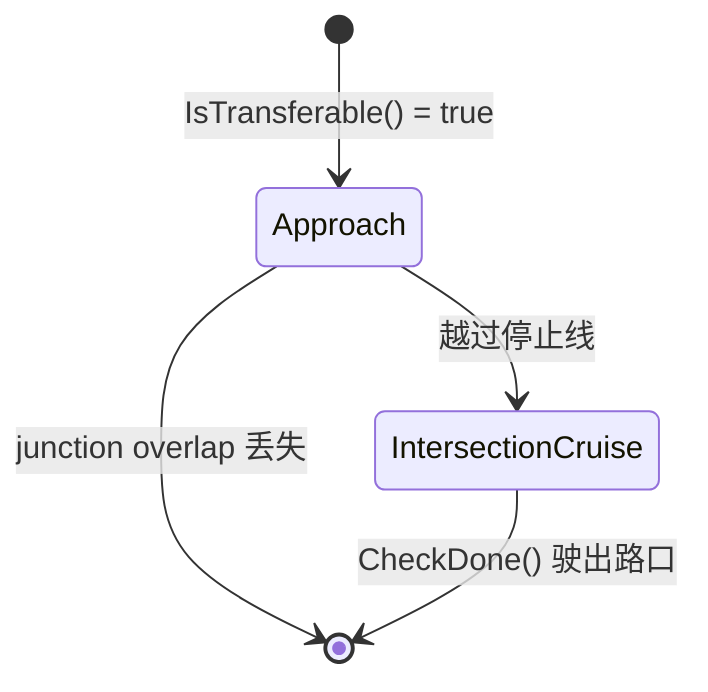

# BareIntersectionUnprotected 无保护路口场景

> 源码位置：`modules/planning/scenarios/bare_intersection_unprotected/`

## 模块定位

无保护路口（Bare Intersection）场景处理没有交通信号灯、停车标志等交通标识的 PNC Junction 路口。车辆需要在接近路口时减速观察，确认无冲突交通参与者后通过。

该场景包含两个阶段：

```
Approach（接近减速） → IntersectionCruise（路口巡航通过）
```

## 场景类

### BareIntersectionUnprotectedContext

```cpp
struct BareIntersectionUnprotectedContext : public ScenarioContext {
  ScenarioBareIntersectionUnprotectedConfig scenario_config;
  std::string current_pnc_junction_overlap_id;
};
```

- `scenario_config`：场景配置（接近速度、停车距离等）
- `current_pnc_junction_overlap_id`：当前处理的 PNC Junction 重叠区 ID

### BareIntersectionUnprotectedScenario

```cpp
class BareIntersectionUnprotectedScenario : public Scenario {
 public:
  bool Init(std::shared_ptr<DependencyInjector> injector, const std::string& name) override;
  BareIntersectionUnprotectedContext* GetContext() override;
  bool IsTransferable(const Scenario* other_scenario, const Frame& frame) override;
  bool Enter(Frame* frame) override;
};
```

### IsTransferable()

```cpp
bool BareIntersectionUnprotectedScenario::IsTransferable(
    const Scenario* const other_scenario, const Frame& frame) {
  // 1. 必须有 lane_follow_command
  // 2. 获取 first_encountered_overlaps
  // 3. 查找 PNC_JUNCTION 和交通标识（SIGNAL/STOP_SIGN/YIELD_SIGN）
  // 4. 如果交通标识和 PNC Junction 距离 < 10m，认为是受保护路口，不触发
  // 5. 如果有交通标识或无 PNC Junction，不触发
  // 6. 检查路权状态：有路权则不触发
  // 7. 检查距离：ADC 前缘到 junction 距离在配置范围内则触发
  const bool bare_junction_scenario =
      (adc_distance_to_pnc_junction > 0.0 &&
       adc_distance_to_pnc_junction <=
           context_.scenario_config.start_bare_intersection_scenario_distance());
  return bare_junction_scenario;
}
```

- 触发条件：前方有 PNC Junction、无交通标识、无路权、距离在阈值内
- 如果交通标识与 PNC Junction 距离 < `kJunctionDelta`(10m)，认为是同一路口的受保护场景
- `bare_intersection_unprotected_scenario.cc:L59-L127`

### Enter()

- 记录当前 PNC Junction 的 overlap ID 到 context
- `bare_intersection_unprotected_scenario.cc:L129-L143`

## Stage 1: Approach — 接近阶段

### 类声明

```cpp
class BareIntersectionUnprotectedStageApproach : public Stage {
 public:
  StageResult Process(const TrajectoryPoint& planning_init_point, Frame* frame) override;
  bool CheckClear(const ReferenceLineInfo& reference_line_info,
                  std::vector<std::string>* wait_for_obstacle_ids);
  StageResult FinishStage(Frame* frame);
 private:
  ScenarioBareIntersectionUnprotectedConfig scenario_config_;
  int counter_ = 0;
};
```

### Process()

```cpp
StageResult BareIntersectionUnprotectedStageApproach::Process(...) {
  // 1. 执行任务链
  StageResult result = ExecuteTaskOnReferenceLine(planning_init_point, frame);

  // 2. 获取当前 PNC Junction overlap
  // 3. 如果已越过停止线（distance < -0.3m），进入下一阶段
  if (distance_adc_to_pnc_junction < -kPassStopLineBuffer) {
    return FinishStage(frame);
  }

  // 4. 限制巡航速度为 approach_cruise_speed
  frame->mutable_reference_line_info()->front().LimitCruiseSpeed(
      scenario_config_.approach_cruise_speed());

  // 5. 设置路权状态为无路权
  reference_line_info.SetJunctionRightOfWay(current_pnc_junction->start_s, false);

  // 6. 再次执行任务链（带限速）
  result = ExecuteTaskOnReferenceLine(planning_init_point, frame);

  // 7. 检查路口是否清空
  bool clear = CheckClear(reference_line_info, &wait_for_obstacle_ids);

  // 8. 显式停车逻辑（enable_explicit_stop 配置）
  if (distance <= 5.0m && distance >= 2.0m && !clear) → 停车
  if (distance < 2.0m) → 蠕行区域，连续 5 帧 clear 才放行
}
```

- 两次调用 `ExecuteTaskOnReferenceLine`：第一次正常规划，第二次带限速
- 蠕行逻辑：在停止线前 2m 内，需要连续 5 帧检测到路口清空才放行（`counter_` 计数器）
- `stage_approach.cc:L37-L131`

### CheckClear()

```cpp
bool BareIntersectionUnprotectedStageApproach::CheckClear(
    const ReferenceLineInfo& reference_line_info,
    std::vector<std::string>* wait_for_obstacle_ids) {
  static constexpr double kConf_min_boundary_t = 6.0;
  static constexpr double kConf_ignore_max_st_min_t = 0.1;
  static constexpr double kConf_ignore_min_st_min_s = 15.0;

  for (auto* obstacle : reference_line_info.path_decision().obstacles().Items()) {
    if (obstacle->IsVirtual() || obstacle->IsStatic()) continue;
    if (obstacle->reference_line_st_boundary().min_t() < kConf_min_boundary_t) {
      // 忽略已在参考线上且同向行驶的远处障碍物
      if (obstacle_traveled_s < epsilon &&
          min_t < 0.1 && min_s > 15.0) continue;
      wait_for_obstacle_ids->push_back(obstacle->Id());
      all_far_away = false;
    }
  }
  return all_far_away;
}
```

- 检查所有动态障碍物的 ST 边界
- 如果障碍物在 6 秒内会到达路口区域，认为不安全
- 忽略条件：障碍物已在参考线上（`traveled_s ≈ 0`）、即将到达（`min_t < 0.1s`）但距离远（`min_s > 15m`）
- `stage_approach.cc:L133-L173`

### FinishStage()

- 设置下一阶段为 `BARE_INTERSECTION_UNPROTECTED_INTERSECTION_CRUISE`
- 恢复巡航速度为默认值
- `stage_approach.cc:L175-L184`

## Stage 2: IntersectionCruise — 路口巡航阶段

### 类声明

```cpp
class BareIntersectionUnprotectedStageIntersectionCruise : public BaseStageCruise {
 public:
  StageResult Process(const TrajectoryPoint& planning_init_point, Frame* frame) override;
 private:
  StageResult FinishStage();
  hdmap::PathOverlap* GetTrafficSignOverlap(
      const ReferenceLineInfo&, const PlanningContext*) const;
};
```

### Process()

```cpp
StageResult BareIntersectionUnprotectedStageIntersectionCruise::Process(...) {
  StageResult result = ExecuteTaskOnReferenceLine(planning_init_point, frame);
  bool stage_done = CheckDone(*frame, injector_->planning_context(), false);
  if (stage_done) {
    return FinishStage();
  }
  return result.SetStageStatus(StageStatusType::RUNNING);
}
```

- 继承 `BaseStageCruise`，使用其 `CheckDone()` 判断是否已通过路口
- `CheckDone` 检查 ADC 是否已完全驶出 PNC Junction 区域
- `stage_intersection_cruise.cc:L30-L45`

### GetTrafficSignOverlap()

- 返回当前 PNC Junction 的 overlap，供 `BaseStageCruise::CheckDone()` 使用
- `stage_intersection_cruise.cc:L47-L59`

## 配置项

| 字段 | 说明 |
|------|------|
| `start_bare_intersection_scenario_distance` | 触发场景的最大距离 |
| `approach_cruise_speed` | 接近阶段限速 |
| `stop_distance` | 停车距离（到路口起点） |
| `enable_explicit_stop` | 是否启用显式停车决策 |

## 状态机流转


