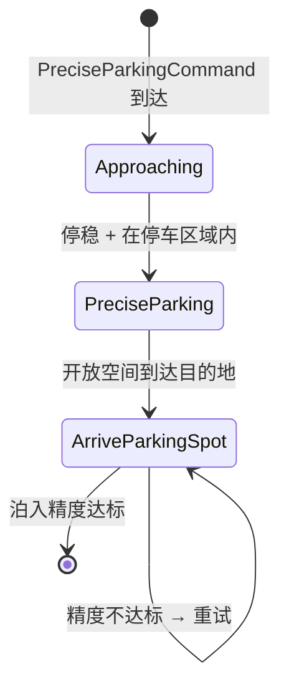
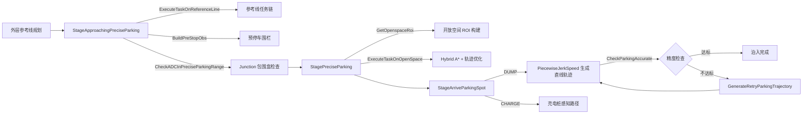

# 精确泊车场景

> 源码路径：`modules/planning/scenarios/precise_parking/`

## 概述

精确泊车场景处理车辆收到 `PreciseParkingCommand` 外部指令后，自主驶入指定停车位或充电坞的完整流程。与代客泊车（ValetParking）不同，精确泊车采用分段式轨迹规划：先沿参考线接近停车区域，再在停车区域边界内使用分段加加速度优化（Piecewise Jerk）生成精确直线轨迹完成泊入。

场景支持两种任务类型：

- **DUMP**（卸货泊车）：生成直线轨迹驶入停车位，到位后检查精度，不达标则反向驶出后重试
- **CHARGE**（充电泊车）：使用感知充电桩返回的相对路径点直接生成轨迹

## 核心类

### PreciseParkingScenario — 场景入口

```cpp
struct PreciseParkingContext : public ScenarioContext {
  ScenarioPreciseParkingConfig scenario_config;
  apollo::external_command::PreciseParkingCommand precise_parking_command;
};

class PreciseParkingScenario : public Scenario {
 public:
  bool Init(std::shared_ptr<DependencyInjector> injector, const std::string& name) override;
  PreciseParkingContext* GetContext() override;
  bool IsTransferable(const Scenario* const other_scenario, const Frame& frame) override;
};
```

- `PreciseParkingContext`：跨阶段共享上下文，持有场景配置和精确泊车指令
- `Init()`：调用 `Scenario::Init()` 并加载 `ScenarioPreciseParkingConfig` 配置
- `IsTransferable()`：检查 `planning_command` 中是否包含 `PreciseParkingCommand` 自定义指令，满足则解包到上下文并切换场景

### StageApproachingPreciseParking — 接近停车阶段

```cpp
class StageApproachingPreciseParking : public Stage {
 public:
  bool Init(const StagePipeline& config, const std::shared_ptr<DependencyInjector>& injector,
            const std::string& config_dir, void* context) override;
  StageResult Process(const common::TrajectoryPoint& planning_init_point, Frame* frame) override;
 private:
  void BuildPreStopObs(Frame* frame);
  bool CheckADCStop(const Frame& frame);
  bool CheckADCInPreciseParkingRange(const Frame& frame);
};
```

沿参考线行驶至停车区域附近，在停车位前方设置预停车围栏（Stop Wall），等待车辆停稳且在停车区域内后转入下一阶段。

### StagePreciseParking — 开放空间规划阶段

```cpp
class StagePreciseParking : public Stage {
 public:
  bool Init(const StagePipeline& config, const std::shared_ptr<DependencyInjector>& injector,
            const std::string& config_dir, void* context) override;
  StageResult Process(const common::TrajectoryPoint& planning_init_point, Frame* frame) override;
 private:
  bool GetOpenspaceRoi(Frame* frame);
  void SetOrigin(const std::vector<Vec2d>& points, const Vec2d& ego_pos, Frame* frame);
  void GetEndPose(Frame* frame);
  bool FuseLineSegments(std::vector<std::vector<common::math::Vec2d>>& line_segments_vec);
  bool FormulateBoundaryConstraints(const std::vector<std::vector<common::math::Vec2d>>& roi_parking_boundary, Frame* frame);
  bool LoadObstacleInVertices(const std::vector<std::vector<common::math::Vec2d>>& roi_parking_boundary, Frame* frame);
};
```

在停车区域边界（Junction 多边形）内构建开放空间 ROI，使用 Hybrid A* + 轨迹优化进行规划。到达目的地后清空轨迹数据并进入泊入阶段。

### StageArriveParkingSpot — 精确泊入阶段

```cpp
class StageArriveParkingSpot : public Stage {
 public:
  StageResult Process(const common::TrajectoryPoint& planning_init_point, Frame* frame) override;
 private:
  StageResult ExecuteDumpMission(Frame* frame);
  StageResult ExecuteChargeMission(Frame* frame);
  bool GenerateParkingTrajectory(Frame* frame);
  bool CheckParkingAccurate(Frame* frame);
  bool GenerateRetryParkingTrajectory(Frame* frame);
};
```

根据任务类型分别处理：

- **DUMP 任务**：使用 `PiecewiseJerkSpeedProblem` 生成沿停车位朝向的直线轨迹。到达后检查横向误差、纵向误差和航向角误差，不达标则生成反向驶出轨迹后重试
- **CHARGE 任务**：从 `perception_dock` 获取充电桩相对路径点，计算曲率后直接生成轨迹，并检测碰撞

## 核心函数

### PreciseParkingScenario::IsTransferable()

```cpp
bool PreciseParkingScenario::IsTransferable(const Scenario* const other_scenario, const Frame& frame) {
  const auto& planning_command = frame.local_view().planning_command;
  // 检查是否有自定义指令且类型为 PreciseParkingCommand
  if (!planning_command->has_custom_command()) return false;
  if (!planning_command->custom_command().Is<PreciseParkingCommand>()) return false;
  // 解包指令到上下文
  context_.precise_parking_command.Clear();
  planning_command->custom_command().UnpackTo(&context_.precise_parking_command);
  return true;
}
```

### StageApproachingPreciseParking::BuildPreStopObs()

在停车位前方设置预停车围栏。将停车位位姿转换为参考线 SL 坐标，以该 s 值作为停车决策点：

```cpp
void StageApproachingPreciseParking::BuildPreStopObs(Frame* frame) {
  common::SLPoint pre_stop_point;
  Vec2d target_pos(parking_spot_pose.x(), parking_spot_pose.y());
  frame->reference_line_info().front().reference_line().XYToSL(target_pos, &pre_stop_point);
  util::BuildStopDecision("precise_parking_pre_stop", pre_stop_point.s(), 0.0,
                          StopReasonCode::STOP_REASON_PRE_OPEN_SPACE_STOP, ...);
}
```

### StageApproachingPreciseParking::CheckADCInPreciseParkingRange()

检查自车和目标停车位是否都在同一 Junction 多边形内：

```cpp
bool CheckADCInPreciseParkingRange(const Frame& frame) {
  // 1. 查询停车位坐标附近的 HD Map Area（Junction）
  hdmap::HDMapUtil::BaseMapPtr()->GetAreas(point, 1e-1, &areas);
  // 2. 构建目标位姿对应的车辆包围盒
  Box2d target_box(center, target_heading, ego_length, ego_width);
  // 3. 检查 ADC 包围盒和目标包围盒均在 Junction 多边形内
  return areas.front()->polygon().Contains(ego_box) &&
         areas.front()->polygon().Contains(target_box);
}
```

### StageArriveParkingSpot::GenerateParkingTrajectory()

使用分段加加速度优化生成精确直线泊车轨迹：

```cpp
bool GenerateParkingTrajectory(Frame* frame) {
  // 1. 计算起点（停车位 + 沿朝向偏移 trajectory_length）
  // 2. 构建 PiecewiseJerkSpeedProblem 优化问题
  //    - x_ref: 目标路径长度
  //    - dx_bounds: [0, 0.5] m/s 限速
  //    - ddx_bounds: [-4, 4] m/s^2 加速度限制
  //    - dddx_bounds: [-2, 2] m/s^3 加加速度限制
  // 3. 求解后按 s 曲线插值生成轨迹点
  // 4. 根据 parking_inwards 决定前进/后退方向
}
```

### StageArriveParkingSpot::CheckParkingAccurate()

检查泊入精度，计算自车位姿与目标位姿之间的横向误差、纵向误差和航向角误差：

```cpp
bool CheckParkingAccurate(Frame* frame) {
  Vec2d vec(ego_x - end_pose[0], ego_y - end_pose[1]);
  Vec2d park_unit_vec = Vec2d::CreateUnitVec2d(end_pose[2]);
  double lat_error = park_unit_vec.CrossProd(vec);
  double lon_error = park_unit_vec.InnerProd(vec);
  double delta_theta = fabs(NormalizeAngle(ego_theta - end_pose[2]));
  // 三者均不超过阈值才认为精确到位
  return fabs(lat_error) <= max_lat_error &&
         fabs(lon_error) <= max_lon_error &&
         delta_theta <= max_heading_error;
}
```

### StageArriveParkingSpot::GenerateRetryParkingTrajectory()

泊入精度不达标时生成重试轨迹：先生成反向驶出轨迹，再拼接正向泊入轨迹，形成先退后进的完整运动：

```cpp
bool GenerateRetryParkingTrajectory(Frame* frame) {
  // 1. 调用 GenerateParkingTrajectory() 生成正向轨迹
  // 2. 反转轨迹点顺序，取反加速度和速度，生成反向驶出段
  // 3. 拼接：反向驶出段 + 正向泊入段
}
```

### StagePreciseParking::GetOpenspaceRoi()

构建开放空间兴趣区域：

```cpp
bool GetOpenspaceRoi(Frame* frame) {
  // 1. 查询停车位附近的 Junction 多边形
  // 2. 调整多边形点序为逆时针
  // 3. 设置坐标原点（优先复用上一帧的 origin_point/origin_heading）
  // 4. 计算目标位姿 end_pose
  // 5. 构建 ROI 边界线段并融合共线段（FuseLineSegments）
  // 6. 设置 xy 边界范围
  // 7. 调用 FormulateBoundaryConstraints() 生成凸约束
}
```

## 配置

场景配置通过 `ScenarioPreciseParkingConfig` protobuf 定义：

```protobuf
message ScenarioPreciseParkingConfig {
  optional double precise_trajectory_length = 1 [default = 3];       // 精确泊车轨迹长度 (m)
  optional bool enable_perception_obstacles = 2 [default = true];    // 是否加入感知障碍物约束
  optional bool expand_polygon_of_obstacle_by_distance = 3 [default = true];  // 障碍物多边形膨胀方式
  optional double perception_obstacle_buffer = 4 [default = 0.5];    // 障碍物膨胀余量 (m)
  optional double max_heading_error = 5 [default = 0.4];             // 最大航向角误差 (rad)
  optional double max_lat_error = 6 [default = 0.12];                // 最大横向误差 (m)
  optional double max_lon_error = 7 [default = 0.12];                // 最大纵向误差 (m)
}
```

| 字段 | 默认值 | 说明 |
|------|--------|------|
| `precise_trajectory_length` | 3 m | 精确泊车轨迹的直线段长度 |
| `enable_perception_obstacles` | true | 是否将感知障碍物纳入开放空间约束 |
| `expand_polygon_of_obstacle_by_distance` | true | true 按距离膨胀多边形，false 按 Box 扩展 |
| `perception_obstacle_buffer` | 0.5 m | 障碍物膨胀余量 |
| `max_heading_error` | 0.4 rad | 泊入精度检查的最大航向角误差 |
| `max_lat_error` | 0.12 m | 泊入精度检查的最大横向误差 |
| `max_lon_error` | 0.12 m | 泊入精度检查的最大纵向误差 |

## 调用关系





关键调用链：

- **接近阶段**：`Process()` -> `BuildPreStopObs()` -> `ExecuteTaskOnReferenceLine()` -> `CheckADCInPreciseParkingRange()` + `CheckADCStop()`
- **开放空间阶段**：`Process()` -> `GetOpenspaceRoi()` -> `SetOrigin()` / `GetEndPose()` / `FuseLineSegments()` / `FormulateBoundaryConstraints()` -> `ExecuteTaskOnOpenSpace()`
- **泊入阶段（DUMP）**：`Process()` -> `ExecuteDumpMission()` -> `GenerateParkingTrajectory()` -> `ExecuteTaskOnOpenSpace()` -> `CheckParkingAccurate()` -> `GenerateRetryParkingTrajectory()`（重试时）
- **泊入阶段（CHARGE）**：`Process()` -> `ExecuteChargeMission()` -> 从充电桩感知构建轨迹 -> `OpenSpaceFallbackUtil` 碰撞检测
