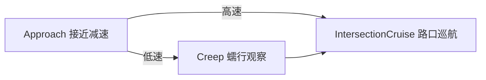

# Traffic Light Unprotected Left Turn

> 源码路径：`modules/planning/scenarios/traffic_light_unprotected_left_turn/`

## 概述

无保护左转场景处理车辆在信号灯路口进行无专用左转信号保护的左转操作。与有保护信号灯场景不同，本场景需要在绿灯亮起后额外进行蠕行观察，确认对向来车安全后才通过路口。场景包含三个阶段：接近减速（Approach）、蠕行观察（Creep）、路口巡航（IntersectionCruise）。

## 阶段流转



## 上下文

```cpp
// context.h
struct TrafficLightUnprotectedLeftTurnContext : public ScenarioContext {
  ScenarioTrafficLightUnprotectedLeftTurnConfig scenario_config;
  std::vector<std::string> current_traffic_light_overlap_ids;
  double creep_start_time;
};
```

| 字段 | 说明 |
| --- | --- |
| `current_traffic_light_overlap_ids` | 当前路口所有关联信号灯 overlap ID |
| `creep_start_time` | 蠕行开始时刻（秒） |

## 核心类

### TrafficLightUnprotectedLeftTurnScenario

```cpp
// traffic_light_unprotected_left_turn_scenario.h
class TrafficLightUnprotectedLeftTurnScenario : public Scenario {
 public:
  bool Init(std::shared_ptr<DependencyInjector> injector,
            const std::string& name) override;
  TrafficLightUnprotectedLeftTurnContext* GetContext() override;
  bool IsTransferable(const Scenario* const other_scenario,
                      const Frame& frame) override;
  bool Exit(Frame* frame) override;
  bool Enter(Frame* frame) override;
};
```

## 核心函数

### IsTransferable()

**职责**：判断是否切换到无保护左转场景
**关键逻辑**：

1. 排除 STOP_SIGN / YIELD_SIGN（优先级更高）
2. 找到 SIGNAL overlap，检查距离在 `(0, start_traffic_light_scenario_distance]`
3. 将 2m 内的信号灯归为同组，检查是否有非 GREEN/BLACK 信号
4. **额外条件**：参考线必须包含左转车道（`lane.turn() == LEFT`）

### StageApproach::Process()

```cpp
StageResult TrafficLightUnprotectedLeftTurnStageApproach::Process(...) {
  // 限制巡航速度为 approach_cruise_speed（减速接近）
  frame->mutable_reference_line_info()->front().LimitCruiseSpeed(
      scenario_config.approach_cruise_speed());

  StageResult result = ExecuteTaskOnReferenceLine(planning_init_point, frame);

  for (const auto& traffic_light_overlap_id :
       context->current_traffic_light_overlap_ids) {
    PathOverlap* current_traffic_light_overlap =
        reference_line_info.GetOverlapOnReferenceLine(...);
    reference_line_info.SetJunctionRightOfWay(..., false);

    if (distance_adc_to_stop_line < 0) return FinishStage(frame);
    if (signal_color != TrafficLight::GREEN ||
        distance_adc_to_stop_line >= scenario_config.max_valid_stop_distance()) {
      traffic_light_all_done = false;
      break;
    }
  }
  if (traffic_light_all_done) return FinishStage(frame);
  return result.SetStageStatus(StageStatusType::RUNNING);
}
```

**职责**：减速接近信号灯，等待绿灯
**关键步骤**：

1. 限制巡航速度为 `approach_cruise_speed`
2. 检查所有信号灯是否变绿且车辆已接近停车线
3. 已越过停车线或全部变绿时进入 FinishStage

### StageApproach::FinishStage()

```cpp
StageResult TrafficLightUnprotectedLeftTurnStageApproach::FinishStage(Frame* frame) {
  const double adc_speed = injector_->vehicle_state()->linear_velocity();
  if (adc_speed > scenario_config.max_adc_speed_before_creep()) {
    next_stage_ = "TRAFFIC_LIGHT_UNPROTECTED_LEFT_TURN_INTERSECTION_CRUISE";
  } else {
    context->creep_start_time = Clock::NowInSeconds();
    next_stage_ = "TRAFFIC_LIGHT_UNPROTECTED_LEFT_TURN_CREEP";
  }
  reference_line_info.LimitCruiseSpeed(FLAGS_default_cruise_speed);
  return StageResult(StageStatusType::FINISHED);
}
```

**职责**：根据当前车速决定是否需要蠕行
**关键逻辑**：速度 > `max_adc_speed_before_creep` 时跳过蠕行直接巡航，否则进入 Creep

### StageCreep::Process()

**职责**：蠕行通过路口，观察对向来车
**关键步骤**：

1. 运行 CreepDecider 生成蠕行轨迹
2. 设置路口无路权
3. 计算蠕行终点，检查 `CheckCreepDone()` 或超时
4. 完成后进入 IntersectionCruise

## 配置

| 字段 | 类型 | 说明 |
| --- | --- | --- |
| `start_traffic_light_scenario_distance` | double | 触发场景的最大距离（米） |
| `approach_cruise_speed` | double | 接近阶段限速（m/s） |
| `max_valid_stop_distance` | double | 判定已到达停车线的距离阈值（米） |
| `max_adc_speed_before_creep` | double | 决定是否蠕行的速度阈值（m/s） |
| `creep_timeout_sec` | double | 蠕行超时时间（秒） |
| `creep_stage_config` | CreepStageConfig | 蠕行阶段详细配置 |

## 调用关系

- **上游**：ScenarioManager 检测到非绿灯信号 + 左转车道触发本场景
- **依赖**：Perception（信号灯颜色）、HDMap（车道转向属性、信号灯 overlap）、VehicleState
- **下游**：各 Stage 通过 `ExecuteTaskOnReferenceLine()` 调用 task pipeline
