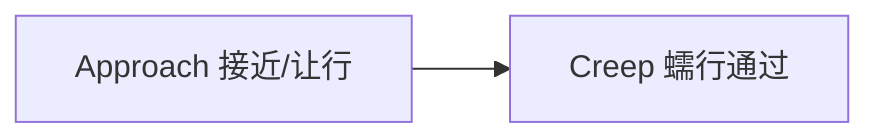

# Yield Sign

> 源码路径：`modules/planning/scenarios/yield_sign/`

## 概述

Yield Sign 场景处理车辆在让行标志处的通行逻辑。与停车标志不同，让行标志不要求完全停车，而是在接近时检测是否有需要让行的障碍物。如果路口无冲突车辆则直接通过，否则减速等待后蠕行通过。场景包含两个阶段：接近（Approach）和蠕行（Creep）。

## 阶段流转



## 上下文

```cpp
// yield_sign_scenario.h
struct YieldSignContext : public ScenarioContext {
  ScenarioYieldSignConfig scenario_config;
  std::vector<std::string> current_yield_sign_overlap_ids;
  double creep_start_time = 0.0;
};
```

| 字段 | 说明 |
| --- | --- |
| `current_yield_sign_overlap_ids` | 当前位置所有关联让行标志的 overlap ID |
| `creep_start_time` | 蠕行开始时刻（秒） |

## 核心类

### YieldSignScenario

```cpp
// yield_sign_scenario.h
class YieldSignScenario : public Scenario {
 public:
  bool Init(std::shared_ptr<DependencyInjector> injector,
            const std::string& name) override;
  YieldSignContext* GetContext() override;
  bool IsTransferable(const Scenario* const other_scenario,
                      const Frame& frame) override;
  bool Exit(Frame* frame) override;
  bool Enter(Frame* frame) override;
};
```

### YieldSignStageApproach

```cpp
// stage_approach.h
class YieldSignStageApproach : public Stage {
 public:
  StageResult Process(const common::TrajectoryPoint& planning_init_point,
                      Frame* frame) override;
 private:
  StageResult FinishStage();
};
```

### YieldSignStageCreep

```cpp
// stage_creep.h
class YieldSignStageCreep : public BaseStageCreep {
 public:
  bool Init(const StagePipeline& config,
            const std::shared_ptr<DependencyInjector>& injector,
            const std::string& config_dir, void* context) override;
  StageResult Process(const common::TrajectoryPoint& planning_init_point,
                      Frame* frame) override;
 private:
  const CreepStageConfig& GetCreepStageConfig() const override;
  bool GetOverlapStopInfo(Frame* frame, ReferenceLineInfo* reference_line_info,
                          double* overlap_end_s,
                          std::string* overlap_id) const override;
  StageResult FinishStage();
};
```

## 核心函数

### YieldSignScenario::IsTransferable()

```cpp
bool YieldSignScenario::IsTransferable(const Scenario* other_scenario,
                                       const Frame& frame) {
  // 排除 SIGNAL 和 STOP_SIGN（优先级更高）
  // 找到 YIELD_SIGN overlap
  // 检查距离在 (0, start_yield_sign_scenario_distance] 范围内
  const double adc_distance_to_yield_sign =
      yield_sign_overlap->start_s - adc_front_edge_s;
  return (adc_distance_to_yield_sign > 0.0 &&
          adc_distance_to_yield_sign <=
              context_.scenario_config.start_yield_sign_scenario_distance());
}
```

**职责**：判断是否切换到让行标志场景
**关键逻辑**：SIGNAL 和 STOP_SIGN 优先级高于 YIELD_SIGN，如果先遇到前者则不切换

### YieldSignScenario::Enter()

**职责**：进入场景时收集同一位置的所有让行标志
**关键步骤**：

1. 获取第一个遇到的 YIELD_SIGN overlap
2. 将距离在 2m 内的让行标志归为同组
3. 记录所有 overlap ID 到 context 和 PlanningContext

### StageApproach::Process()

```cpp
StageResult YieldSignStageApproach::Process(...) {
  StageResult result = ExecuteTaskOnReferenceLine(planning_init_point, frame);

  for (const auto& yield_sign_overlap_id :
       scenario_context->current_yield_sign_overlap_ids) {
    PathOverlap* current_yield_sign_overlap =
        reference_line_info.GetOverlapOnReferenceLine(
            yield_sign_overlap_id, ReferenceLineInfo::YIELD_SIGN);

    reference_line_info.SetJunctionRightOfWay(
        current_yield_sign_overlap->start_s, false);

    // 已越过停车线 → 直接完成
    if (adc_front_edge_s - current_yield_sign_overlap->start_s > 0.3)
      return FinishStage();

    // 接近停车线时检查障碍物
    if (distance_adc_to_stop_line < scenario_config_.max_valid_stop_distance()) {
      yield_sign_done = true;
      for (const auto* obstacle : path_decision.obstacles().Items()) {
        if (obstacle->IsVirtual()) continue;
        if (obstacle->reference_line_st_boundary().IsEmpty()) continue;
        if (obstacle->reference_line_st_boundary().min_t() > 6.0) continue;
        // 忽略已在参考线上同向行驶的障碍物
        yield_sign_done = false;
      }
    }
    if (yield_sign_done) return FinishStage();
  }
  return result.SetStageStatus(StageStatusType::RUNNING);
}
```

**职责**：接近让行标志，检测是否有需要让行的障碍物
**关键步骤**：

1. 设置路口无路权
2. 如果已越过停车线（>0.3m），直接进入 Creep
3. 接近停车线时遍历障碍物，判断是否有 ST 边界在 6s 内的冲突车辆
4. 无冲突则完成，有冲突则继续等待

### StageCreep::Process()

**职责**：蠕行通过让行标志区域
**关键步骤**：

1. 运行 CreepDecider 生成蠕行轨迹
2. 计算蠕行终点 `creep_stop_s`
3. 检查蠕行完成（`CheckCreepDone()`）或超时（`creep_timeout_sec`）
4. 完成后结束整个场景（`FinishScenario()`）

## 配置

| 字段 | 类型 | 说明 |
| --- | --- | --- |
| `start_yield_sign_scenario_distance` | double | 触发场景的最大距离（米） |
| `max_valid_stop_distance` | double | 判定车辆已接近停车线的距离阈值（米） |
| `creep_timeout_sec` | double | 蠕行超时时间（秒） |
| `creep_stage_config` | CreepStageConfig | 蠕行阶段详细配置 |

## 调用关系

- **上游**：ScenarioManager 通过 `IsTransferable()` 检测到让行标志触发本场景
- **依赖**：HDMap（让行标志 overlap）、Perception（障碍物 ST 边界）、PlanningContext
- **下游**：各 Stage 通过 `ExecuteTaskOnReferenceLine()` 调用 task pipeline
