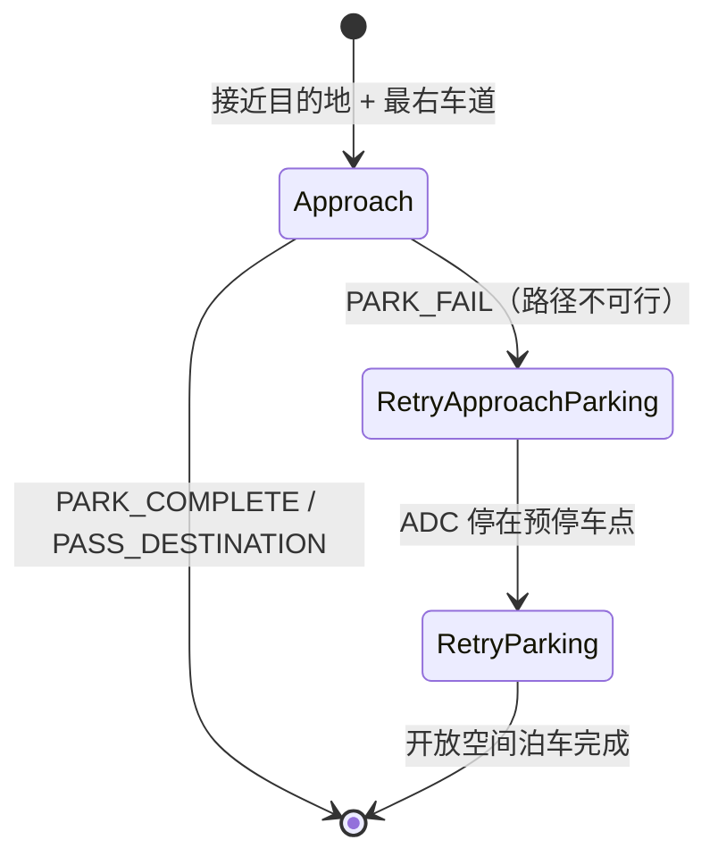

# PullOver 靠边停车场景

> 源码位置：`modules/planning/scenarios/pull_over/`

## 模块定位

靠边停车场景处理车辆到达路由终点时的正常靠边停车流程。当车辆接近目的地且满足靠边条件时触发，通过路径规划将车辆引导至路边停车位。如果常规路径无法精确停入，会切换到开放空间规划进行精确泊车。

该场景包含三个阶段：
```
Approach（接近停车点） → RetryApproachParking（重试接近） → RetryParking（开放空间泊车）
```

## 场景类

### PullOverContext

```cpp
struct PullOverContext : public ScenarioContext {
  ScenarioPullOverConfig scenario_config;
};
```

### PullOverScenario

### IsTransferable() — 触发条件

```cpp
bool PullOverScenario::IsTransferable(...) {
  // 1. 必须有 lane_follow_command
  // 2. FLAGS_enable_pull_over_at_destination 必须开启
  // 3. 路由终点必须在参考线上
  // 4. 只有单条参考线（不在变道中）
  // 5. 距离终点在 [min_distance_buffer, start_distance] 范围内
  // 6. 距离不能太近（< max_distance_stop_search）
  // 7. 终点附近 8m 内无路口/信号灯/停车标志
  // 8. 沿路径检查必须在最右行车道（右侧无 CITY_DRIVING 邻车道）
}
```

- 每隔 5m 检查一次车道类型，确保全程在最右行车道
- `pull_over_scenario.cc:L55-L163`

### Enter()

- 设置 `PullOverStatus::PULL_OVER` 类型
- 设置 `plan_pull_over_path = true`，通知路径任务生成靠边路径
- `pull_over_scenario.cc:L171-L178`

### Exit()

- 清除 PlanningContext 中的 pull_over 状态
- `pull_over_scenario.cc:L166-L169`

## 工具函数 (util.h/cc)

### PullOverState 枚举

```cpp
enum class PullOverState {
  UNKNOWN,
  APPROACHING,
  PASS_DESTINATION,
  PARK_COMPLETE,
  PARK_FAIL,
};
```

### CheckADCPullOver()

```cpp
PullOverState CheckADCPullOver(
    const VehicleStateProvider* vehicle_state_provider,
    const ReferenceLineInfo& reference_line_info,
    const ScenarioPullOverConfig& scenario_config,
    const PlanningContext* planning_context) {
  // 1. 检查 pull_over_status 是否有效
  // 2. 如果 ADC 前缘超过停车点 >= pass_destination_threshold → PASS_DESTINATION
  // 3. 如果车速 > 停车速度 → APPROACHING
  // 4. 如果距离停车点 > 3m → APPROACHING
  // 5. 检查 SL 坐标下的位置和角度误差
  return position_check ? PARK_COMPLETE : PARK_FAIL;
}
```

- `util.cc:L35-L89`

### CheckADCPullOverPathPoint()

- 检查规划路径末端点是否能到达停车位（仅检查 l 和 theta，不检查 s）
- 用于提前判断路径是否可行
- `util.cc:L94-L118`

### CheckPullOverPositionBySL()

```cpp
bool CheckPullOverPositionBySL(...) {
  const double s_diff = target_sl.s() - adc_position_sl.s();
  const double l_diff = fabs(target_sl.l() - adc_position_sl.l());
  const double theta_diff = fabs(NormalizeAngle(target_theta - adc_theta));
  bool ret = (l_diff <= max_l_error && theta_diff <= max_theta_error);
  if (check_s) {
    ret = (ret && s_diff >= 0 && s_diff <= max_s_error);
  }
  return ret;
}
```

- 在 Frenet 坐标下检查位置和角度误差
- `util.cc:L120-L151`

## Stage 1: Approach — 接近阶段

### Process()

```cpp
StageResult PullOverStageApproach::Process(...) {
  StageResult result = ExecuteTaskOnReferenceLine(planning_init_point, frame);

  // 检查 ADC 状态
  PullOverState state = CheckADCPullOver(...);
  if (state == PASS_DESTINATION || state == PARK_COMPLETE) {
    return FinishStage(true);   // 成功完成
  } else if (state == PARK_FAIL) {
    return FinishStage(false);  // 转入重试
  }

  // 提前检查路径可行性
  for (const auto& path_data : candidate_path_data) {
    if (path_data.path_label().find("pullover") == string::npos) break;
    // 检查路径末端点是否能到达停车位
    if (CheckADCPullOverPathPoint(...) == PARK_FAIL) {
      path_fail = true;
    }
  }

  // 路径不可行时：建立预停车围栏，等待切换到开放空间
  if (path_fail) {
    stop_line_s = pull_over_sl.s() - s_distance_to_stop_for_open_space_parking;
    BuildStopDecision("DEST_PULL_OVER_PREPARKING", stop_line_s, ...);
    // 如果已到达预停车点且角度对齐
    if (distance <= 1.0m && angle <= 0.2rad) {
      return FinishStage(false);  // 转入重试
    }
  }
}
```

- 正常情况：通过 PullOverPath 任务规划靠边路径，直接停入
- 失败情况：路径末端无法对齐停车位，建立预停车围栏后转入开放空间重试
- `stage_approach.cc:L40-L137`

### FinishStage()

- `success=true`：直接完成场景
- `success=false`：转入 `PULL_OVER_RETRY_APPROACH_PARKING`
- `stage_approach.cc:L139-L146`

## Stage 2: RetryApproachParking — 重试接近阶段

### Process()

```cpp
StageResult PullOverStageRetryApproachParking::Process(...) {
  StageResult result = ExecuteTaskOnReferenceLine(planning_init_point, frame);
  if (CheckADCStop(*frame)) {
    return FinishStage();
  }
  return result.SetStageStatus(StageStatusType::RUNNING);
}
```

- 继续在参考线上规划，引导车辆到达开放空间预停车点
- `stage_retry_approach_parking.cc:L39-L55`

### CheckADCStop()

```cpp
bool PullOverStageRetryApproachParking::CheckADCStop(const Frame& frame) {
  if (adc_speed > max_adc_stop_speed) return false;
  double distance = open_space_pre_stop_fence_s - adc_front_edge_s;
  return distance <= scenario_config.max_valid_stop_distance();
}
```

- 检查车辆是否已停在开放空间预停车围栏附近
- `stage_retry_approach_parking.cc:L57-L83`

### FinishStage()

- 转入 `PULL_OVER_RETRY_PARKING`
- `stage_retry_approach_parking.cc:L34-L37`

## Stage 3: RetryParking — 开放空间泊车阶段

### Process()

```cpp
StageResult PullOverStageRetryParking::Process(...) {
  frame->mutable_open_space_info()->set_is_on_open_space_trajectory(true);
  StageResult result = ExecuteTaskOnOpenSpace(frame);

  // 设置调试信息
  pull_over_debug->mutable_position()->CopyFrom(pull_over_status.position());

  if (CheckADCPullOverOpenSpace()) {
    return FinishStage();
  }
}
```

- 使用开放空间规划（Hybrid A* + 轨迹优化）进行精确泊车
- `stage_retry_parking.cc:L37-L72`

### CheckADCPullOverOpenSpace()

```cpp
bool PullOverStageRetryParking::CheckADCPullOverOpenSpace() {
  const double distance_diff = adc_position.DistanceTo(target_position);
  const double theta_diff = fabs(NormalizeAngle(target_theta - adc_heading));
  return (distance_diff <= max_distance_error && theta_diff <= max_theta_error);
}
```

- 在笛卡尔坐标下检查位置和角度误差（比 SL 坐标更精确）
- `stage_retry_parking.cc:L78-L104`

## 配置项

| 字段 | 说明 |
|------|------|
| `start_pull_over_scenario_distance` | 触发场景的最大距离 |
| `pull_over_min_distance_buffer` | 触发场景的最小距离 |
| `max_distance_stop_search` | 太近不触发的距离阈值 |
| `pass_destination_threshold` | 判定越过目的地的阈值 |
| `max_s_error_to_end_point` | 纵向最大误差 |
| `max_l_error_to_end_point` | 横向最大误差 |
| `max_theta_error_to_end_point` | 角度最大误差 |
| `max_distance_error_to_end_point` | 开放空间距离误差 |
| `s_distance_to_stop_for_open_space_parking` | 预停车点到停车位的距离 |
| `max_valid_stop_distance` | 有效停车距离 |

## 状态机流转


