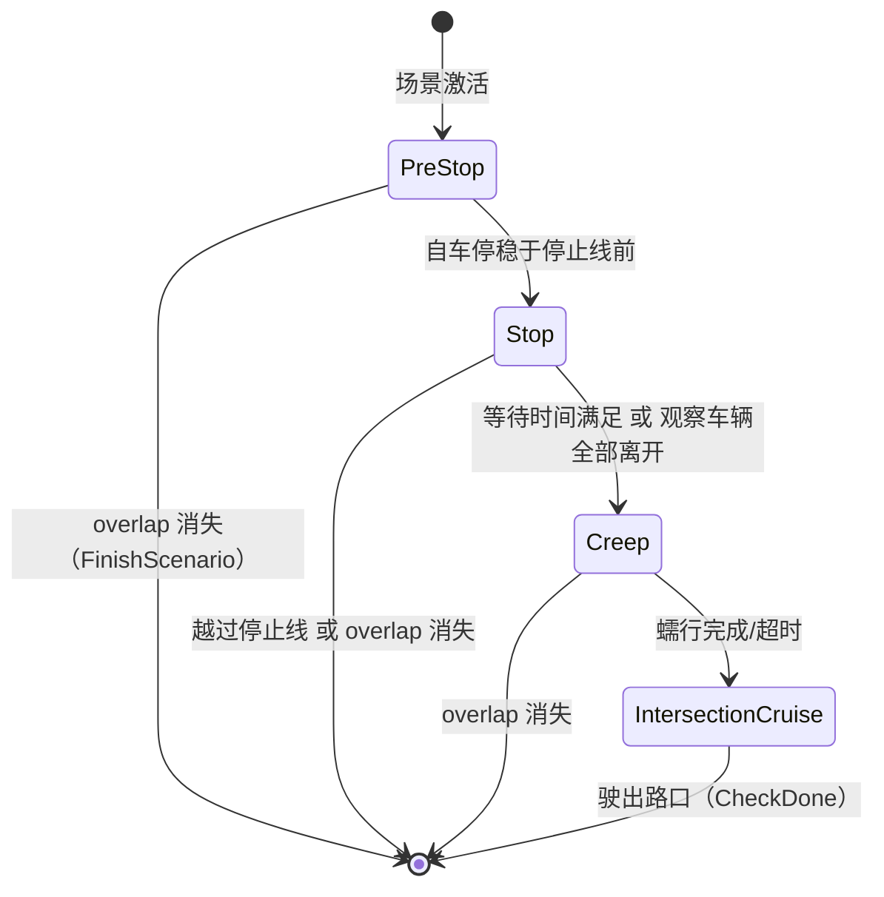

# StopSignUnprotected 场景阶段详解

> 源码位置：`modules/planning/scenarios/stop_sign_unprotected/`

## 模块定位

StopSignUnprotected（无保护停车标志）场景处理车辆通过无信号灯控制的停车标志路口的完整流程。该场景包含 4 个阶段（Stage），按顺序执行：

```
PreStop → Stop → Creep → IntersectionCruise → 场景结束
```

## 场景上下文

```cpp
struct StopSignUnprotectedContext : public ScenarioContext {
  ScenarioStopSignUnprotectedConfig scenario_config;
  std::string current_stop_sign_overlap_id;
  double stop_start_time = 0.0;
  double creep_start_time = 0.0;
  std::unordered_map<std::string, std::vector<std::string>> watch_vehicles;
  std::vector<std::pair<hdmap::LaneInfoConstPtr, hdmap::OverlapInfoConstPtr>>
      associated_lanes;
};
```

- `watch_vehicles`：按车道 ID 分组的需要观察的车辆列表（先到先行规则）
- `associated_lanes`：与当前停车标志关联的所有车道及其 overlap 信息
- `stop_start_time` / `creep_start_time`：阶段切换时记录的时间戳

---

## 1. StopSignUnprotectedStagePreStop — 预停车阶段

> `stage_pre_stop.h` / `stage_pre_stop.cc`

### 类声明

```cpp
class StopSignUnprotectedStagePreStop : public Stage {
 public:
  StageResult Process(const common::TrajectoryPoint& planning_init_point,
                      Frame* frame) override;
 private:
  int AddWatchVehicle(const Obstacle& obstacle,
                      StopSignLaneVehicles* watch_vehicles);
  bool CheckADCStop(const double adc_front_edge_s, const double stop_line_s);
  StageResult FinishStage();
};
```

### Process()

```cpp
StageResult StopSignUnprotectedStagePreStop::Process(
    const TrajectoryPoint& planning_init_point, Frame* frame) {
  StageResult result = ExecuteTaskOnReferenceLine(planning_init_point, frame);
  // 获取当前 stop_sign overlap
  PathOverlap* current_stop_sign_overlap = ...;
  if (!current_stop_sign_overlap) return FinishScenario();

  const double distance_adc_pass_stop_sign =
      adc_front_edge_s - current_stop_sign_overlap->start_s;
  if (distance_adc_pass_stop_sign <= kPassStopLineBuffer) {
    if (CheckADCStop(adc_front_edge_s, stop_line_s)) return FinishStage();
  } else {
    return FinishStage();  // 已越过停止线
  }

  // 收集需要观察的车辆
  for (const auto* obstacle : path_decision.obstacles().Items()) {
    AddWatchVehicle(*obstacle, &watch_vehicles);
  }
  return result.SetStageStatus(StageStatusType::RUNNING);
}
```

- 执行参考线上的任务流水线
- 检查是否已到达/越过停止线（`kPassStopLineBuffer = 0.3m`）
- 若已停稳或越线，进入下一阶段
- 否则持续收集关联车道上的观察车辆
- `stage_pre_stop.cc:L53-L124`

### AddWatchVehicle()

```cpp
int StopSignUnprotectedStagePreStop::AddWatchVehicle(
    const Obstacle& obstacle, StopSignLaneVehicles* watch_vehicles) {
  // 1. 类型过滤：只关注 UNKNOWN/UNKNOWN_MOVABLE/BICYCLE/VEHICLE
  // 2. 通过 HDMap 获取障碍物所在车道
  // 3. 检查该车道是否为 stop_sign 关联车道
  // 4. 检查障碍物是否在停止线附近（距离 < watch_vehicle_max_valid_stop_distance）
  // 5. 加入 watch_vehicles 列表
}
```

- 实现"先到先行"规则的车辆收集逻辑
- 使用 `HDMapUtil::BaseMap().GetNearestLaneWithHeading()` 定位障碍物车道
- `stage_pre_stop.cc:L129-L221`

### CheckADCStop()

- 检查自车速度 < `max_abs_speed_when_stopped`
- 检查自车前沿到停止线距离 < `max_valid_stop_distance`
- `stage_pre_stop.cc:L227-L254`

### FinishStage()

- 记录 `stop_start_time = Clock::NowInSeconds()`
- 设置 `next_stage_ = "STOP_SIGN_UNPROTECTED_STOP"`
- `stage_pre_stop.cc:L256-L262`

---

## 2. StopSignUnprotectedStageStop — 停车等待阶段

> `stage_stop.h` / `stage_stop.cc`

### 类声明

```cpp
class StopSignUnprotectedStageStop : public Stage {
 public:
  StageResult Process(const common::TrajectoryPoint& planning_init_point,
                      Frame* frame) override;
 private:
  int RemoveWatchVehicle(const PathDecision& path_decision,
                         StopSignLaneVehicles* watch_vehicles);
  StageResult FinishStage();
};
```

### Process()

```cpp
StageResult StopSignUnprotectedStageStop::Process(
    const TrajectoryPoint& planning_init_point, Frame* frame) {
  StageResult result = ExecuteTaskOnReferenceLine(planning_init_point, frame);

  // 设置路权状态为无路权
  reference_line_info.SetJunctionRightOfWay(stop_sign_start_s, false);

  // 检查是否已越过停止线
  if (distance_adc_pass_stop_sign > kPassStopLineBuffer) {
    return FinishStage();
  }

  // 检查停车等待时间是否满足
  const double wait_time = Clock::NowInSeconds() - context->stop_start_time;
  if (wait_time >= scenario_config.stop_duration_sec()) {
    return FinishStage();
  }

  // 移除已离开的观察车辆
  RemoveWatchVehicle(path_decision, &watch_vehicles);

  // 所有观察车辆已离开则完成
  if (watch_vehicles.empty()) return FinishStage();

  return result.SetStageStatus(StageStatusType::RUNNING);
}
```

- `kPassStopLineBuffer = 1.0m`（比 PreStop 阶段更宽松）
- 等待时间由 `stop_duration_sec` 配置控制
- 观察车辆全部离开也可提前结束等待
- `stage_stop.cc:L50-L120`

### RemoveWatchVehicle()

- 遍历 watch_vehicles 中的每辆车
- 若车辆已不在感知列表中，或距离停止线 > 10m，则移除
- `stage_stop.cc:L122-L225`

### FinishStage()

- 更新 `PlanningContext` 中的 `done_stop_sign_overlap_id`
- 清空 `wait_for_obstacle_id`
- 记录 `creep_start_time`
- 设置 `next_stage_ = "STOP_SIGN_UNPROTECTED_CREEP"`
- `stage_stop.cc:L227-L243`

---

## 3. StopSignUnprotectedStageCreep — 蠕行阶段

> `stage_creep.h` / `stage_creep.cc`

### 类声明

```cpp
class StopSignUnprotectedStageCreep : public BaseStageCreep {
 public:
  bool Init(const StagePipeline& config,
            const std::shared_ptr<DependencyInjector>& injector,
            const std::string& config_dir, void* context) override;
  StageResult Process(const common::TrajectoryPoint& planning_init_point,
                      Frame* frame) override;
 private:
  const CreepStageConfig& GetCreepStageConfig() const override;
  bool GetOverlapStopInfo(Frame* frame, ReferenceLineInfo* reference_line_info,
                          double* overlap_end_s,
                          std::string* overlap_id) const override;
  StageResult FinishStage();
};
```

继承自 `BaseStageCreep`（提供 `ProcessCreep`、`CheckCreepDone`、`GetCreepFinishS` 等通用蠕行逻辑）。

### Process()

```cpp
StageResult StopSignUnprotectedStageCreep::Process(
    const TrajectoryPoint& planning_init_point, Frame* frame) {
  // 若 pipeline 未启用，直接跳过
  if (!pipeline_config_.enabled()) return FinishStage();

  // 执行 CreepDecider
  for (auto& reference_line_info : *frame->mutable_reference_line_info()) {
    ProcessCreep(frame, &reference_line_info);
  }

  StageResult result = ExecuteTaskOnReferenceLine(planning_init_point, frame);

  // 设置路权为无路权
  reference_line_info.SetJunctionRightOfWay(stop_sign_start_s, false);

  // 计算蠕行终点并检查是否完成
  double creep_stop_s = GetCreepFinishS(stop_sign_end_s, *frame, reference_line_info);
  if (distance <= 0.0) {
    // 已到达蠕行终点，生成零距离蠕行速度剖面
    SpeedProfileGenerator::GenerateFixedDistanceCreepProfile(0.0, 0);
  }

  if (CheckCreepDone(*frame, reference_line_info, stop_sign_end_s,
                     wait_time, timeout_sec)) {
    return FinishStage();
  }
  return result.SetStageStatus(StageStatusType::RUNNING);
}
```

- 蠕行超时由 `creep_timeout_sec` 配置控制
- 蠕行完成条件由基类 `CheckCreepDone` 判定（距离+时间）
- `stage_creep.cc:L55-L125`

### GetCreepStageConfig()

- 从场景配置中获取蠕行阶段参数
- `stage_creep.cc:L127-L131`

### GetOverlapStopInfo()

- 从 `PlanningContext` 获取当前 stop_sign overlap ID
- 在参考线上查找对应 overlap 的 end_s
- `stage_creep.cc:L133-L153`

### FinishStage()

- 设置 `next_stage_ = "STOP_SIGN_UNPROTECTED_INTERSECTION_CRUISE"`
- `stage_creep.cc:L155-L158`

---

## 4. StopSignUnprotectedStageIntersectionCruise — 路口巡航阶段

> `stage_intersection_cruise.h` / `stage_intersection_cruise.cc`

### 类声明

```cpp
class StopSignUnprotectedStageIntersectionCruise : public BaseStageIntersectionCruise {
 public:
  StageResult Process(const common::TrajectoryPoint& planning_init_point,
                      Frame* frame) override;
 private:
  StageResult FinishStage();
  hdmap::PathOverlap* GetTrafficSignOverlap(
      const ReferenceLineInfo& reference_line_info,
      const PlanningContext* context) const override;
};
```

继承自 `BaseStageIntersectionCruise`（提供 `CheckDone` 通用路口巡航完成判定）。

### Process()

```cpp
StageResult StopSignUnprotectedStageIntersectionCruise::Process(
    const TrajectoryPoint& planning_init_point, Frame* frame) {
  StageResult result = ExecuteTaskOnReferenceLine(planning_init_point, frame);
  bool stage_done = CheckDone(*frame, injector_->planning_context(), false);
  if (stage_done) return FinishStage();
  return result.SetStageStatus(StageStatusType::RUNNING);
}
```

- 最简单的阶段：执行任务 + 检查是否驶出路口
- `stage_intersection_cruise.cc:L30-L45`

### GetTrafficSignOverlap()

- 从 `PlanningContext` 获取 stop_sign overlap ID
- 在参考线上查找对应 overlap 并返回
- `stage_intersection_cruise.cc:L51-L63`

### FinishStage()

- 调用 `FinishScenario()` 结束整个场景
- `stage_intersection_cruise.cc:L47-L49`

---

## 阶段转换流程



## 调用关系

- **上游**：`StopSignUnprotectedScenario` 创建并管理这 4 个 Stage
- **下游**：每个 Stage 通过 `ExecuteTaskOnReferenceLine` 调用 Task 流水线（PathDecider、SpeedDecider 等）
- **依赖**：`HDMapUtil`（地图查询）、`PlanningContext`（跨帧状态持久化）、`BaseStageCreep` / `BaseStageIntersectionCruise`（通用阶段基类）
