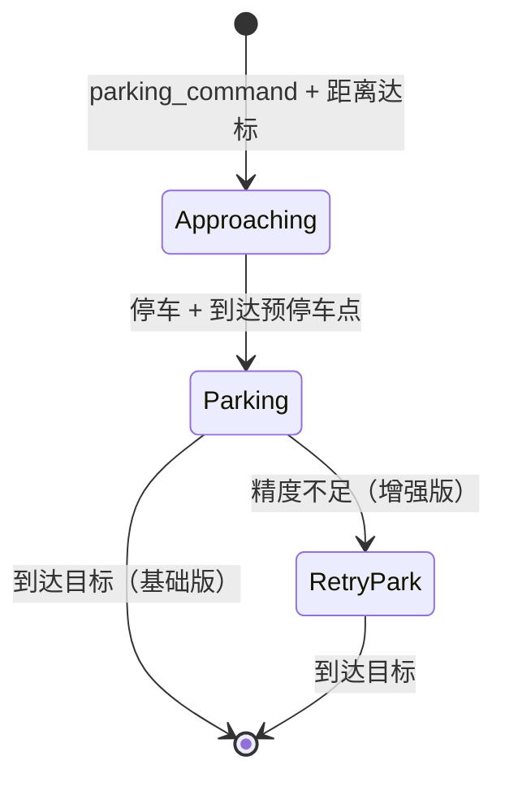

# ValetParking 代客泊车场景

> 源码位置：`modules/planning/scenarios/valet_parking/` 和 `modules/planning/scenarios/valet_parking_park/`

## 模块定位

代客泊车场景处理车辆收到 `parking_command` 后自动驶入指定停车位的完整流程。Apollo 中存在两个变体：

- **ValetParking**（基础版）：接近 → 开放空间泊车，无精度重试
- **ValetParkingPark**（增强版）：接近 → 开放空间泊车 → 精度检查 → 重试泊车

## 一、ValetParking — 基础代客泊车

### 场景上下文

```cpp
struct ValetParkingContext : public ScenarioContext {
  ScenarioValetParkingConfig scenario_config;
  std::string target_parking_spot_id;
  bool pre_stop_rightaway_flag = false;
  hdmap::MapPathPoint pre_stop_rightaway_point;
};
```

- `target_parking_spot_id`：目标停车位 ID
- `pre_stop_rightaway_flag/point`：预停车标志和位置，跨帧传递

### IsTransferable() — 触发条件

```cpp
bool ValetParkingScenario::IsTransferable(...) {
  // 1. 必须有 parking_command 且包含 parking_spot_id
  // 2. 在参考线路径上搜索目标停车位
  // 3. 检查车辆到停车位中心的距离 < parking_spot_range_to_start
}
```

- `SearchTargetParkingSpotOnPath()`：遍历路径上所有 parking_space_overlaps 匹配 ID
- `CheckDistanceToParkingSpot()`：计算停车位四角中心点到车辆的 s 距离
- `valet_parking_scenario.cc:L58-L150`

### 阶段流程

```
ApproachingParkingSpot → Parking
```

### Stage 1: ApproachingParkingSpot — 接近停车位

```cpp
StageResult StageApproachingParkingSpot::Process(...) {
  // 1. 设置目标停车位 ID 到 open_space_info
  // 2. 忽略终点障碍物（避免终点停车干扰泊车）
  dest_obstacle->AddLongitudinalDecision("ignore-dest-in-valet-parking", ignore);
  // 3. 执行参考线任务链
  result = ExecuteTaskOnReferenceLine(planning_init_point, frame);
  // 4. 更新预停车标志（跨帧传递）
  // 5. 检查是否已停车
  if (CheckADCStop(*frame)) {
    next_stage_ = "VALET_PARKING_PARKING";
  }
}
```

- 忽略终点障碍物：防止 destination 停车决策与泊车预停车围栏冲突
- `CheckADCStop()`：车速 ≤ 停车阈值 且 距预停车围栏 ≤ `max_valid_stop_distance`
- `stage_approaching_parking_spot.cc:L39-L116`

### Stage 2: Parking — 开放空间泊车

```cpp
StageResult StageParking::Process(...) {
  frame->mutable_open_space_info()->set_is_on_open_space_trajectory(true);
  StageResult result = ExecuteTaskOnOpenSpace(frame);
  return result.SetStageStatus(StageStatusType::RUNNING);
}
```

- 使用开放空间规划（Hybrid A* + 轨迹优化）执行泊车
- 该阶段持续运行，不主动结束（由外部场景切换退出）
- `stage_parking.cc:L26-L40`

## 二、ValetParkingPark — 增强代客泊车

### 阶段流程

```
ApproachingParkingSpotPark → ParkingPark → RetryPark（可选）
```

### Stage 1: ApproachingParkingSpotPark — 接近停车位

与基础版类似，增加了 `CheckADCInParkingRange()` 检查：

```cpp
StageResult StageApproachingParkingSpotPark::Process(...) {
  // ... 同基础版 ...
  if (CheckADCStop(*frame) && CheckADCInParkingRange(*frame)) {
    next_stage_ = "VALET_PARKING_PARKING_PARK";
  }
}
```

- `CheckADCInParkingRange()`：检查 ADC 前缘到预停车围栏距离 ≤ `max_valid_stop_distance`
- `GetTargetS()`：计算停车位中心在参考线上的 s 坐标
- `stage_approaching_parking_spot_park.cc:L43-L141`

### Stage 2: ParkingPark — 开放空间泊车（带精度检查）

```cpp
StageResult StageParkingPark::Process(...) {
  frame->mutable_open_space_info()->set_is_on_open_space_trajectory(true);
  StageResult result = ExecuteTaskOnOpenSpace(frame);

  if (frame->open_space_info().destination_reached()) {
    arrive_parking_spot_ = true;
    if (!CheckADCParkingCompleted(frame)) {
      return FinishStage(frame);  // 精度不够，转入重试
    } else {
      set_openspace_planning_finish(true);
      parking_mission_info_.status = DONE;
    }
  }
}
```

- `stage_parking_park.cc:L28-L64`

#### CheckADCParkingCompleted()

```cpp
bool StageParkingPark::CheckADCParkingCompleted(Frame* frame) {
  // 将 ADC 位置归一化到开放空间坐标系
  PathPointNormalizing(origin_heading, origin_point, &ego_x, &ego_y, &ego_theta);
  // 计算与目标位姿的误差
  double delta_theta = fabs(NormalizeAngle(ego_theta - end_pose[2]));
  Vec2d vec(ego_x - end_pose[0], ego_y - end_pose[1]);
  double lat_error = vec.Length() * cos(vec.Angle());
  double lon_error = vec.Length() * sin(vec.Angle());
  // 平行泊车且未启用重试 → 直接通过
  if (parking_type == PARALLEL_PARKING && !enable_parallel_retry_parking) return true;
  // 检查误差阈值
  return (fabs(lat_error) < max_lat_error &&
          fabs(lon_error) < max_lon_error &&
          fabs(delta_theta) < max_heading_error);
}
```

- `stage_parking_park.cc:L89-L118`

#### FinishStage()

- 清空所有开放空间轨迹数据（optimizer/path_planning/interpolated/partitioned）
- 转入 `VALET_PARKING_RETRY_PARK`
- `stage_parking_park.cc:L66-L87`

### Stage 3: RetryPark — 重试泊车

```cpp
StageResult StageParkingRetryPark::Process(...) {
  if (arrive_parking_spot_) {
    set_openspace_planning_finish(true);
    return FINISHED;
  }
  result = ExecuteTaskOnOpenSpace(frame);
  if (frame->open_space_info().destination_reached()) {
    set_openspace_planning_finish(true);
    CheckParkingAccuracy(frame);
    arrive_parking_spot_ = true;
  }
}
```

- 重新执行开放空间规划，从当前位置再次尝试泊入
- `CheckParkingAccuracy()`：仅记录日志，不做阻断
- `stage_parking_retry_park.cc:L26-L75`

## 配置项

| 字段 | 说明 |
|------|------|
| `parking_spot_range_to_start` | 触发场景的最大距离 |
| `max_valid_stop_distance` | 有效停车距离 |
| `max_lat_error` | 横向最大误差 |
| `max_lon_error` | 纵向最大误差 |
| `max_heading_error` | 角度最大误差 |
| `enable_parallel_retry_parking` | 平行泊车是否启用重试 |

## 状态机流转


