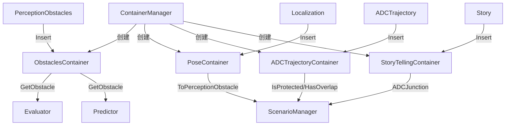

# Container 数据容器

> 源码路径：`modules/prediction/container/`

## 概述

Container 模块是预测（Prediction）子系统的数据管理层，负责缓存和管理上游输入数据。每种输入数据类型对应一个 Container 子类，由 `ContainerManager` 统一创建和管理。预测模块的其他组件（Evaluator、Predictor 等）通过 Container 获取所需的感知、定位和规划数据，避免重复处理原始消息。

## 架构



## 核心类

### Container（基类）

所有数据容器的抽象基类，定义统一的 `Insert` 接口。

```cpp
class Container {
 public:
  Container() = default;
  virtual ~Container() = default;
  virtual void Insert(const ::google::protobuf::Message& message) = 0;
};
```

**源码**：`modules/prediction/container/container.h`

### ContainerManager

容器管理器，根据适配器配置自动创建和注册对应类型的容器。

```cpp
class ContainerManager {
 public:
  void Init(const common::adapter::AdapterManagerConfig &config);

  template <typename T>
  T *GetContainer(const common::adapter::AdapterConfig::MessageType &type);

  std::unique_ptr<Container> CreateContainer(
      const common::adapter::AdapterConfig::MessageType &type);

 private:
  void RegisterContainer(const common::adapter::AdapterConfig::MessageType &type);
  void RegisterContainers();

  std::unordered_map<int, std::unique_ptr<Container>> containers_;
};
```

**源码**：`modules/prediction/container/container_manager.h`、`modules/prediction/container/container_manager.cc`

#### CreateContainer() 工厂方法

```cpp
std::unique_ptr<Container> ContainerManager::CreateContainer(
    const AdapterConfig::MessageType& type) {
  if (type == AdapterConfig::PERCEPTION_OBSTACLES) {
    return std::make_unique<ObstaclesContainer>();
  } else if (type == AdapterConfig::LOCALIZATION) {
    return std::make_unique<PoseContainer>();
  } else if (type == AdapterConfig::PLANNING_TRAJECTORY) {
    return std::make_unique<ADCTrajectoryContainer>();
  } else if (type == AdapterConfig::STORYTELLING) {
    return std::make_unique<StoryTellingContainer>();
  }
  return nullptr;
}
```

### ObstaclesContainer

障碍物数据容器，使用 LRU 缓存管理 `Obstacle` 对象，支持按帧分类障碍物 ID。

```cpp
class ObstaclesContainer : public Container {
 public:
  void Insert(const ::google::protobuf::Message& message) override;
  void InsertPerceptionObstacle(const perception::PerceptionObstacle& obstacle,
                                 double timestamp);
  void InsertFeatureProto(const Feature& feature);

  void BuildLaneGraph();
  void BuildJunctionFeature();

  Obstacle* GetObstacle(int id);
  void Clear();
  void CleanUp();
  size_t NumOfObstacles();

  const std::vector<int>& curr_frame_movable_obstacle_ids();
  const std::vector<int>& curr_frame_unmovable_obstacle_ids();
  const std::vector<int>& curr_frame_considered_obstacle_ids();

  SubmoduleOutput GetSubmoduleOutput(size_t history_size,
                                      const cyber::Time& frame_start_time);
  const Scenario& curr_scenario() const;
  ObstacleClusters* GetClustersPtr() const;
  JunctionAnalyzer* GetJunctionAnalyzer();

 private:
  common::util::LRUCache<int, std::unique_ptr<Obstacle>> ptr_obstacles_;
  std::vector<int> curr_frame_movable_obstacle_ids_;
  std::vector<int> curr_frame_unmovable_obstacle_ids_;
  std::vector<int> curr_frame_considered_obstacle_ids_;
  std::unique_ptr<ObstacleClusters> clusters_;
  JunctionAnalyzer junction_analyzer_;
};
```

**源码**：`modules/prediction/container/obstacles/obstacles_container.h`

**关键方法**：

| 方法 | 说明 |
|------|------|
| `Insert()` | 解析 `PerceptionObstacles` 消息，逐个调用 `InsertPerceptionObstacle` |
| `InsertPerceptionObstacle()` | 更新或创建 `Obstacle` 对象，按可移动性分类 ID |
| `BuildLaneGraph()` | 为当前帧障碍物构建车道图 |
| `BuildJunctionFeature()` | 为路口场景构建障碍物特征 |
| `GetObstacle()` | 按 ID 获取 `Obstacle` 指针（LRU 更新） |
| `GetSubmoduleOutput()` | 导出子模块输出供下游使用 |

### PoseContainer

自车定位容器，将 `LocalizationEstimate` 转换为 `PerceptionObstacle` 格式。

```cpp
class PoseContainer : public Container {
 public:
  void Insert(const ::google::protobuf::Message& message) override;
  const perception::PerceptionObstacle* ToPerceptionObstacle();
  double GetTimestamp();

 private:
  void Update(const localization::LocalizationEstimate& localization);
  std::unique_ptr<perception::PerceptionObstacle> obstacle_ptr_;
};
```

**源码**：`modules/prediction/container/pose/pose_container.h`

### ADCTrajectoryContainer

自车规划轨迹容器，缓存 `ADCTrajectory` 并提供路口、参考线相关查询。

```cpp
class ADCTrajectoryContainer : public Container {
 public:
  void Insert(const ::google::protobuf::Message& message) override;

  bool IsProtected() const;                            // 是否有通行权
  bool IsPointInJunction(const common::PathPoint& point) const;  // 点是否在路口
  bool HasOverlap(const LaneSequence& lane_sequence) const;      // 与轨迹是否有重叠
  void SetPosition(const common::math::Vec2d& position);

  std::shared_ptr<const hdmap::JunctionInfo> ADCJunction() const;
  double ADCDistanceToJunction() const;
  const planning::ADCTrajectory& adc_trajectory() const;

  bool IsLaneIdInReferenceLine(const std::string& lane_id) const;
  bool IsLaneIdInTargetReferenceLine(const std::string& lane_id) const;
  const std::vector<std::string>& GetADCLaneIDSequence() const;
  const std::vector<std::string>& GetADCTargetLaneIDSequence() const;

  void SetJunction(const std::string& junction_id, double distance);

 private:
  planning::ADCTrajectory adc_trajectory_;
  common::math::Polygon2d adc_junction_polygon_;
  std::unordered_set<std::string> adc_lane_ids_;
  std::vector<std::string> adc_lane_seq_;
  std::unordered_set<std::string> adc_target_lane_ids_;
  std::vector<std::string> adc_target_lane_seq_;
};
```

**源码**：`modules/prediction/container/adc_trajectory/adc_trajectory_container.h`

### StoryTellingContainer

故事叙述容器，缓存 `CloseToJunction` 等场景信息。

```cpp
class StoryTellingContainer : public Container {
 public:
  void Insert(const ::google::protobuf::Message& message) override;
  std::shared_ptr<const hdmap::JunctionInfo> ADCJunction() const;
  const std::string& ADCJunctionId() const;
  double ADCDistanceToJunction() const;

 private:
  apollo::storytelling::CloseToJunction close_to_junction_;
};
```

**源码**：`modules/prediction/container/storytelling/storytelling_container.h`

## 容器与消息类型映射

| 容器类 | 消息类型 | 数据来源 |
|--------|----------|----------|
| `ObstaclesContainer` | `PERCEPTION_OBSTACLES` | 感知模块 |
| `PoseContainer` | `LOCALIZATION` | 定位模块 |
| `ADCTrajectoryContainer` | `PLANNING_TRAJECTORY` | 规划模块 |
| `StoryTellingContainer` | `STORYTELLING` | StoryTelling 模块 |

## 调用关系

- **上游**：`PredictionComponent` 接收各通道消息，通过 `ContainerManager` 分发到对应 Container
- **下游**：Evaluator 调用 `ObstaclesContainer::GetObstacle()` 获取障碍物特征；ScenarioManager 调用 `ADCTrajectoryContainer` 和 `StoryTellingContainer` 判断场景
- **依赖**：`common::adapter::AdapterManagerConfig`（适配器配置）、`ObstacleClusters`（障碍物聚类）、`JunctionAnalyzer`（路口分析）
